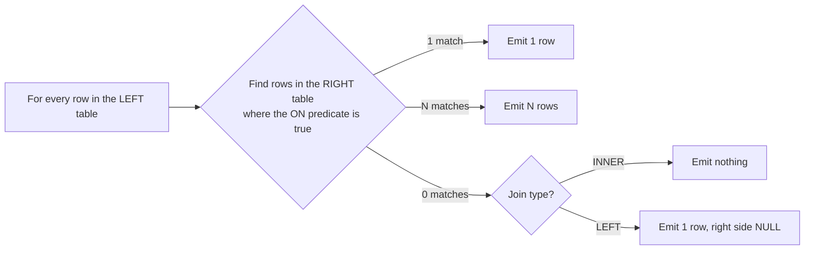

If you only truly learn one SQL topic this week, make it joins. In support work, almost every interesting question spans tables: "which customers had a failed payment but no retry?", "which orders reference a product that no longer exists?", "did this user actually have the role they claim they had?" All of those are join questions, and two of them are *anti-join* questions, which is the shape most people never practise.

## The mental model

Forget Venn diagrams for a moment. They are the standard teaching aid and they are subtly misleading, because they show set overlap while a join operates on **row pairs**. A join does this:



Everything else follows from that diagram. In particular, note the `N matches → emit N rows` branch: that is fan-out, and it is why your `SUM()` is sometimes triple what it should be.

## The four joins

Assume two tiny tables:

**Customers**

| CustomerId | Name |
|---|---|
| 1 | Ada |
| 2 | Grace |
| 3 | Katherine |

**Orders**

| OrderId | CustomerId | Total |
|---|---|---|
| 100 | 1 | 50.00 |
| 101 | 1 | 75.00 |
| 102 | 2 | 20.00 |
| 103 | *NULL* | 10.00 |

### INNER JOIN

```sql title="inner.sql"
SELECT c.Name, o.OrderId, o.Total
FROM   Customers AS c
INNER JOIN Orders AS o ON o.CustomerId = c.CustomerId;
```

Three rows: Ada×100, Ada×75, Grace×102. Katherine vanishes (no orders). Order 103 vanishes (no customer). **INNER JOIN discards non-matches on both sides** — which is exactly what you do *not* want when the question is "who has no orders?"

Note that Ada appears twice. The customer table had three rows; the result has three rows, but they are not the same three. This is the fan-out that catches people.

### LEFT OUTER JOIN

```sql title="left.sql"
SELECT c.Name, o.OrderId, o.Total
FROM   Customers AS c
LEFT JOIN Orders AS o ON o.CustomerId = c.CustomerId;
```

Four rows: Ada×100, Ada×101, Grace×102, **Katherine×NULL**. Every customer survives. Order 103 is still gone, because it is on the right.

The word `OUTER` is optional — `LEFT JOIN` and `LEFT OUTER JOIN` are identical. Most codebases omit it.

### RIGHT OUTER JOIN

Mirror image: every row from the right table survives.

```sql title="right.sql"
SELECT c.Name, o.OrderId
FROM   Customers AS c
RIGHT JOIN Orders AS o ON o.CustomerId = c.CustomerId;
```

Four rows, including **NULL×103** — the orphan order with no customer.

:::hint{type=tip}
In practice, most teams write `LEFT JOIN` almost exclusively and reorder the `FROM` clause instead of reaching for `RIGHT JOIN`. Reading a query where the direction flips halfway down is genuinely harder. Know `RIGHT JOIN` for the exam; prefer `LEFT JOIN` in code.
:::

### FULL OUTER JOIN

Everything from both sides, NULLs wherever there is no partner.

```sql title="full.sql"
SELECT c.Name, o.OrderId
FROM   Customers AS c
FULL OUTER JOIN Orders AS o ON o.CustomerId = c.CustomerId;
```

Five rows: the four from the LEFT JOIN, plus NULL×103.

`FULL OUTER JOIN` is rare in application code and common in **reconciliation** work — "compare what the billing system thinks with what the ledger thinks and show me every discrepancy in both directions." That is a support task.

### CROSS JOIN

No predicate at all. Every combination.

```sql title="cross.sql"
SELECT c.Name, o.OrderId
FROM   Customers AS c
CROSS JOIN Orders AS o;   -- 3 × 4 = 12 rows
```

Legitimately useful for generating calendars and test matrices. Accidentally produced when you forget the `ON` clause, at which point a 100,000-row table joined to a 100,000-row table tries to return ten billion rows and your session hangs.

```quiz
question: Customers has 3 rows, Orders has 4 rows (one with a NULL CustomerId). How many rows does the LEFT JOIN from Customers to Orders return?
options:
  - "3"
  - "4"
  - "5"
  - "12"
answer: 1
explanation: Ada matches twice, Grace once, and Katherine produces one row with NULLs — 2 + 1 + 1 = 4. The orphan order is on the right side and is dropped by a LEFT join.
```

## The bug that ruins support queries

This is the single most valuable thing in today's lesson. Consider:

```sql title="broken.sql"
-- INTENT: every customer, with their 2013 orders (or NULL if they had none)
SELECT   c.Name, o.OrderId, o.Total
FROM     Customers AS c
LEFT JOIN Orders AS o ON o.CustomerId = c.CustomerId
WHERE    o.OrderDate >= '2013-01-01';   -- <-- the bug
```

The `WHERE` clause is evaluated **after** the join. For Katherine, the join produced a row with `o.OrderDate = NULL`. `NULL >= '2013-01-01'` is *unknown*, not *true*, so the row is filtered out. Your `LEFT JOIN` has silently become an `INNER JOIN`.

The fix is to move the condition into the `ON` clause, where it participates in matching rather than filtering:

```sql title="fixed.sql"
SELECT   c.Name, o.OrderId, o.Total
FROM     Customers AS c
LEFT JOIN Orders AS o
       ON o.CustomerId = c.CustomerId
      AND o.OrderDate >= '2013-01-01';   -- part of the match, not a filter
```

:::hint{type=danger}
**Rule of thumb:** in an outer join, conditions on the *outer* (nullable) table belong in `ON`. Conditions on the *preserved* table belong in `WHERE`. The exception is the deliberate anti-join below, where `WHERE … IS NULL` is the whole point.
:::

This distinction shows up in interviews constantly, phrased as "what is the difference between putting a condition in `ON` versus `WHERE`?" The answer is: for inner joins, nothing; for outer joins, everything.

## Anti-joins: the "what is missing?" pattern

"Which customers have never ordered?" is not a `WHERE` question — the absence is not stored anywhere. You have to join and then look for the hole.

```sql title="anti-join.sql"
SELECT c.CustomerId, c.Name
FROM   Customers AS c
LEFT JOIN Orders AS o ON o.CustomerId = c.CustomerId
WHERE  o.OrderId IS NULL;   -- no partner was found
```

Two other spellings of the same idea:

```sql title="anti-join-alternatives.sql"
-- NOT EXISTS: usually the clearest, and the optimiser handles it well
SELECT c.CustomerId, c.Name
FROM   Customers AS c
WHERE  NOT EXISTS (SELECT 1 FROM Orders AS o WHERE o.CustomerId = c.CustomerId);

-- NOT IN: correct only if the subquery column can never be NULL
SELECT c.CustomerId, c.Name
FROM   Customers AS c
WHERE  c.CustomerId NOT IN (SELECT o.CustomerId FROM Orders AS o);
```

:::hint{type=danger}
`NOT IN` with a nullable column is a trap. If *any* row in the subquery returns `NULL`, `NOT IN` evaluates to unknown for every row and the query returns **zero results**. Our `Orders` table has exactly that — order 103 has a `NULL` CustomerId — so the `NOT IN` version above returns nothing at all. Prefer `NOT EXISTS`.
:::

That is a genuinely nasty bug because the query looks right, runs fast, and returns an empty set that you interpret as "there are no such customers."

## Fan-out and why your totals are wrong

```sql title="fanout.sql"
-- WRONG: OrderTotal is duplicated once per line item
SELECT   o.OrderId, SUM(o.Total) AS Revenue
FROM     Orders AS o
JOIN     OrderLines AS l ON l.OrderId = o.OrderId
GROUP BY o.OrderId;
```

If an order has four line items, `o.Total` is summed four times. The number is 4× too big, and nothing warns you.

Two fixes:

```sql title="fanout-fixed.sql"
-- Option A: aggregate the child first, then join
SELECT o.OrderId, o.Total, l.LineCount
FROM   Orders AS o
LEFT JOIN (
    SELECT OrderId, COUNT(*) AS LineCount
    FROM   OrderLines
    GROUP BY OrderId
) AS l ON l.OrderId = o.OrderId;

-- Option B: aggregate the correct column instead
SELECT   o.OrderId, SUM(l.LineTotal) AS Revenue
FROM     Orders AS o
JOIN     OrderLines AS l ON l.OrderId = o.OrderId
GROUP BY o.OrderId;
```

**Diagnostic habit:** before you trust an aggregate over a join, run the query without the aggregate and count the rows. If the count is higher than you expected, you have fan-out.

## Multi-table joins

Real support queries chain several tables. Keep them readable:

```sql title="multi-join.sql"
SELECT   soh.SalesOrderID,
         soh.OrderDate,
         p.FirstName + ' ' + p.LastName AS CustomerName,
         st.Name                        AS Territory,
         SUM(sod.LineTotal)             AS OrderTotal
FROM     Sales.SalesOrderHeader  AS soh
JOIN     Sales.SalesOrderDetail  AS sod ON sod.SalesOrderID = soh.SalesOrderID
JOIN     Sales.Customer          AS c   ON c.CustomerID     = soh.CustomerID
JOIN     Person.Person           AS p   ON p.BusinessEntityID = c.PersonID
LEFT JOIN Sales.SalesTerritory   AS st  ON st.TerritoryID   = soh.TerritoryID
WHERE    soh.OrderDate >= '2013-01-01'
  AND    soh.OrderDate <  '2014-01-01'
GROUP BY soh.SalesOrderID, soh.OrderDate, p.FirstName, p.LastName, st.Name
ORDER BY OrderTotal DESC;
```

Notice the `LEFT JOIN` to territory: an order might not have one, and we do not want to lose the order because of it. That deliberate mixing of inner and outer joins in one query is normal and correct.

:::hint{type=tip}
Build multi-table queries **incrementally**. Start with one table and `SELECT TOP (10) *`. Add one join, re-run, check the row count did what you expected. Add the next. When the count jumps unexpectedly you know exactly which join caused it. Writing all six joins and then debugging is how people lose an afternoon.
:::

## Self-joins

A table joined to itself — the standard way to model hierarchies.

```sql title="self-join.sql"
SELECT   e.BusinessEntityID AS EmployeeId,
         emp.JobTitle       AS EmployeeTitle,
         mgr.JobTitle       AS ManagerTitle
FROM     HumanResources.Employee AS emp
JOIN     HumanResources.Employee AS e   ON e.BusinessEntityID = emp.BusinessEntityID
LEFT JOIN HumanResources.Employee AS mgr ON mgr.BusinessEntityID = emp.OrganizationNode.GetAncestor(1).ToString();
```

The syntax details vary by schema; the concept is what matters. Two aliases on the same table, `LEFT JOIN` so the CEO (who has no manager) is not dropped.

## Exercise: 15 join problems

Work through these against AdventureWorks. Time yourself on the second pass — the goal is for the *syntax* to become automatic so your attention goes to the *question*.

:::checklist{title="Join drills"}
- [ ] 1. Every product with its subcategory name (products without a subcategory must still appear)
- [ ] 2. Every product **without** a subcategory
- [ ] 3. Sales orders with the salesperson's full name; include orders with no salesperson
- [ ] 4. Customers who have placed at least one order in 2013
- [ ] 5. Customers who placed an order in 2012 but **not** in 2013
- [ ] 6. Products that have never been ordered
- [ ] 7. The total line-item revenue per order, correctly (watch for fan-out)
- [ ] 8. Employees and their department names, using the department history table
- [ ] 9. Orders where the ship address is in a different country from the bill address
- [ ] 10. Each territory with its order count, including territories with zero orders
- [ ] 11. Product pairs that appear on the same order (a self-join on order detail)
- [ ] 12. Vendors with no purchase orders in the last two years
- [ ] 13. The five customers with the highest 2013 spend, with their territory name
- [ ] 14. Any order whose `TotalDue` disagrees with the sum of its line items
- [ ] 15. A FULL OUTER JOIN reconciliation between `Sales.Customer` and `Person.Person`
:::

:::details{summary="Worked answer for #5 — 2012 but not 2013"}
```sql
SELECT DISTINCT c.CustomerID
FROM   Sales.SalesOrderHeader AS c2012
JOIN   Sales.Customer AS c ON c.CustomerID = c2012.CustomerID
WHERE  c2012.OrderDate >= '2012-01-01' AND c2012.OrderDate < '2013-01-01'
  AND  NOT EXISTS (
         SELECT 1
         FROM   Sales.SalesOrderHeader AS c2013
         WHERE  c2013.CustomerID = c.CustomerID
           AND  c2013.OrderDate >= '2013-01-01'
           AND  c2013.OrderDate <  '2014-01-01'
       );
```

The shape — "matches condition A, and `NOT EXISTS` a row matching condition B" — is the workhorse for churn, lapsed-user and missing-retry questions. Learn it as a template.
:::

## Where this is going

Tomorrow we add aggregation on top of joins, and start writing the specific queries a support engineer runs during an incident: "find all failed transactions for customer X in the last 7 days."
