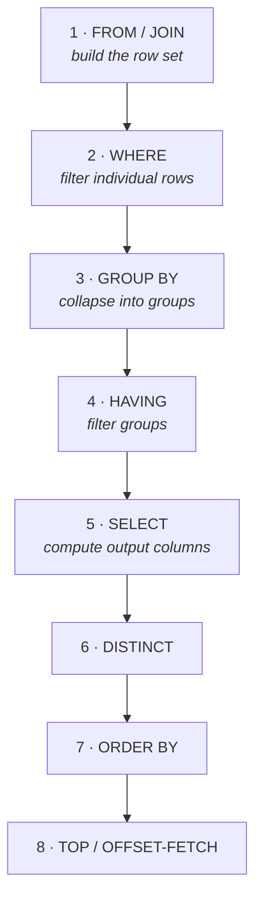

Yesterday's joins get you the right rows. Today gets you the right *number*. Aggregation is where support queries become answers: not "here are 40,000 transactions" but "here are the three customers responsible for 80% of yesterday's failures."

## Logical processing order

Before the syntax, internalise this. SQL is written in one order and evaluated in another:



Almost every confusing error message in T-SQL is explained by this diagram:

- *"Invalid column name 'Revenue'"* in a `WHERE` clause → you defined `Revenue` as an alias in `SELECT` (step 5), but `WHERE` runs at step 2. It does not exist yet.
- *"Column is invalid in the select list because it is not contained in either an aggregate function or the GROUP BY clause"* → step 3 collapsed the rows; a non-grouped column no longer has a single value.
- You *can* use a `SELECT` alias in `ORDER BY`, because `ORDER BY` is step 7, after `SELECT`.

## The aggregate functions

Today's examples run against `dbo.Transactions` — the table you seeded on Day 1. `SalesLT.SalesOrderHeader` has thirty-two rows sharing a single order date, which is fine for join shapes and hopeless for aggregation: every `GROUP BY` on a date returns one row.

```sql title="aggregates.sql"
SELECT COUNT(*)                   AS TotalRows,
       COUNT(FailureCode)         AS RowsWithFailureCode,   -- NULLs are NOT counted
       COUNT(DISTINCT CustomerId) AS UniqueCustomers,
       SUM(Amount)                AS TotalValue,
       AVG(Amount)                AS AverageTransaction,
       MIN(CreatedAtUtc)          AS Oldest,
       MAX(CreatedAtUtc)          AS Newest
FROM   dbo.Transactions;
```

:::hint{type=warning}
`COUNT(*)` counts rows. `COUNT(column)` counts **non-NULL values** in that column. The difference between those two numbers is exactly the count of NULLs, which makes it a one-line data-quality check:

```sql
SELECT COUNT(*) - COUNT(FailureCode) AS SuccessfulTransactions
FROM   dbo.Transactions;
```

Run it, then cross-check against `SUM(CASE WHEN Status = 'Succeeded' THEN 1 ELSE 0 END)`. If the two numbers disagree, you have found rows where the status and the failure code contradict each other — which, in a real system, is a genuine data-integrity finding and not a mistake in your query.
:::

`AVG` also ignores NULLs, which is usually what you want but occasionally is not. If a NULL means "zero" in your domain, `AVG(col)` and `AVG(ISNULL(col, 0))` give different answers, and only one of them is right.

`SUM` of an `INT` column can overflow. `SUM(CAST(Quantity AS BIGINT))` costs nothing and prevents an arithmetic overflow error at 3am.

## GROUP BY

```sql title="group-by.sql"
SELECT   CAST(t.CreatedAtUtc AS DATE) AS [Day],
         COUNT(*)                     AS TransactionCount,
         SUM(t.Amount)                AS Value
FROM     dbo.Transactions AS t
WHERE    t.CreatedAtUtc >= DATEADD(DAY, -30, SYSUTCDATETIME())
GROUP BY CAST(t.CreatedAtUtc AS DATE)
ORDER BY [Day];
```

Rule: **every column in `SELECT` must either be in `GROUP BY` or wrapped in an aggregate.** No exceptions in T-SQL (unlike MySQL, which historically allowed it and produced arbitrary values — another dialect difference worth knowing).

### WHERE vs HAVING

```sql title="where-vs-having.sql"
SELECT   c.CustomerID,
         c.CompanyName,
         COUNT(*)       AS TransactionCount,
         SUM(t.Amount)  AS Spend
FROM     dbo.Transactions AS t
JOIN     SalesLT.Customer AS c ON c.CustomerID = t.CustomerId
WHERE    t.CreatedAtUtc >= DATEADD(DAY, -30, SYSUTCDATETIME())  -- filters rows, before grouping
GROUP BY c.CustomerID, c.CompanyName
HAVING   COUNT(*) >= 50                                          -- filters groups, after grouping
     AND SUM(t.Amount) > 10000
ORDER BY Spend DESC;
```

The practical guidance: **if the condition could be checked by looking at a single row, it belongs in `WHERE`.** `WHERE` runs first, so it reduces the volume the grouping has to chew through — it is both more correct and faster.

```quiz
question: You want customers whose spend over the last 30 days exceeds £10,000. Where does the date filter go, and where does the spend filter go?
options:
  - Both in WHERE
  - Both in HAVING
  - OrderDate in WHERE, spend in HAVING
  - OrderDate in HAVING, spend in WHERE
answer: 2
explanation: The timestamp is a property of an individual row, so it filters before grouping in WHERE. Total spend is an aggregate that only exists after GROUP BY, so it must be filtered in HAVING.
```

## Subqueries

### Scalar subquery — returns one value

```sql title="scalar-subquery.sql"
SELECT   TOP (100)
         t.TransactionId,
         t.Amount,
         (SELECT AVG(Amount) FROM dbo.Transactions) AS OverallAverage
FROM     dbo.Transactions AS t
WHERE    t.Amount > (SELECT AVG(Amount) FROM dbo.Transactions)
ORDER BY t.Amount DESC;
```

### Correlated subquery — references the outer row

```sql title="correlated.sql"
-- Transactions that are the largest that customer has ever made
SELECT t.TransactionId, t.CustomerId, t.Amount
FROM   dbo.Transactions AS t
WHERE  t.Amount = (
         SELECT MAX(inner_t.Amount)
         FROM   dbo.Transactions AS inner_t
         WHERE  inner_t.CustomerId = t.CustomerId   -- the correlation
       );
```

Correlated subqueries are conceptually a loop. The optimiser usually rewrites them into something smarter, but if you see one running slowly over millions of rows, that is your first suspect. Run this one with the actual execution plan on — 200,000 rows is enough that you can watch it do real work, which is exactly why the lab table exists.

### CTEs — subqueries with names

```sql title="cte.sql"
WITH CustomerSpend AS (
    SELECT   CustomerId,
             COUNT(*)      AS TransactionCount,
             SUM(Amount)   AS Spend
    FROM     dbo.Transactions
    WHERE    CreatedAtUtc >= DATEADD(DAY, -30, SYSUTCDATETIME())
    GROUP BY CustomerId
),
Ranked AS (
    SELECT *,
           NTILE(4) OVER (ORDER BY Spend DESC) AS Quartile
    FROM   CustomerSpend
)
SELECT   Quartile,
         COUNT(*)      AS Customers,
         SUM(Spend)    AS TotalSpend
FROM     Ranked
GROUP BY Quartile
ORDER BY Quartile;
```

:::hint{type=tip}
Prefer CTEs over nested subqueries once you have more than one level. A query you can read top-to-bottom is a query you can debug at 3am. You can also `SELECT * FROM CustomerSpend` on its own to check an intermediate step — just comment out the rest.
:::

## Window functions: top N per group

"Show me the three most recent failed transactions **for each customer**" cannot be done with `GROUP BY` alone, because grouping collapses the rows you want to see. This is the canonical window-function problem.

```sql title="top-n-per-group.sql"
WITH Ranked AS (
    SELECT   t.CustomerId,
             t.TransactionId,
             t.CreatedAtUtc,
             t.FailureCode,
             t.Amount,
             ROW_NUMBER() OVER (
                 PARTITION BY t.CustomerId
                 ORDER BY     t.CreatedAtUtc DESC
             ) AS rn
    FROM     dbo.Transactions AS t
    WHERE    t.Status = 'Failed'
)
SELECT CustomerId, TransactionId, CreatedAtUtc, FailureCode, Amount
FROM   Ranked
WHERE  rn <= 3
ORDER BY CustomerId, rn;
```

`PARTITION BY` is "restart the numbering for each of these." `ORDER BY` inside `OVER` decides what "first" means.

Three ranking functions worth knowing the difference between, because it is a standard interview question:

| Function | Ties | Gaps after ties |
|---|---|---|
| `ROW_NUMBER()` | Broken arbitrarily — always 1, 2, 3 | n/a |
| `RANK()` | Share a rank — 1, 1, 3 | Yes |
| `DENSE_RANK()` | Share a rank — 1, 1, 2 | No |

Running totals use the same mechanism:

```sql title="running-total.sql"
WITH Daily AS (
    SELECT   CAST(CreatedAtUtc AS DATE) AS [Day],
             SUM(Amount)                AS DailyValue
    FROM     dbo.Transactions
    WHERE    CreatedAtUtc >= DATEADD(DAY, -30, SYSUTCDATETIME())
    GROUP BY CAST(CreatedAtUtc AS DATE)
)
SELECT   [Day],
         DailyValue,
         SUM(DailyValue) OVER (ORDER BY [Day]
                               ROWS BETWEEN UNBOUNDED PRECEDING AND CURRENT ROW) AS RunningTotal
FROM     Daily
ORDER BY [Day];
```

## The real skill: ticket → query

A support ticket says:

> *"Our oldest ordering customer says their payments have been failing since Tuesday. Can you check?"*

That is not a query. Turning it into one means making four decisions explicit:

:::steps

1. **Which entity?** Whatever identifier the ticket gives you — is it a `CustomerID`, an account number, or an external reference from another system? Confirm before you filter on it. Here we resolve it with a query rather than pasting a number we have not verified.

2. **What is a "failure"?** A status column? An error code? A missing downstream record? "Failed" is domain vocabulary, not a schema column. Find the actual representation.

3. **What time window?** "Since Tuesday" is ambiguous — which Tuesday, and in which timezone? Widen it: last 10 days, so you can see the *before* as well as the *after*.

4. **What does "normal" look like?** A count of failures is meaningless without the success count next to it. Three failures out of three is an outage; three out of three thousand is noise.

:::

Here is the query that actually answers it:

This one runs against your lab data as-is — the Day 1 seed script planted the incident deliberately.

```sql title="incident-triage.sql"
-- Resolve the identifier rather than trusting the one in the ticket.
DECLARE @CustomerId INT = (SELECT MIN(CustomerID) FROM SalesLT.SalesOrderHeader);
DECLARE @Since DATETIME2 = DATEADD(DAY, -10, SYSUTCDATETIME());

-- 1. Shape of the problem: failures vs successes per day
SELECT   CAST(t.CreatedAtUtc AS DATE)                                AS [Day],
         SUM(CASE WHEN t.Status = 'Failed'    THEN 1 ELSE 0 END)     AS Failed,
         SUM(CASE WHEN t.Status = 'Succeeded' THEN 1 ELSE 0 END)     AS Succeeded,
         COUNT(*)                                                    AS Total
FROM     dbo.Transactions AS t
WHERE    t.CustomerId   = @CustomerId
  AND    t.CreatedAtUtc >= @Since
GROUP BY CAST(t.CreatedAtUtc AS DATE)
ORDER BY [Day];

-- 2. What is the actual error? Group by reason, most common first.
SELECT   t.FailureCode,
         t.FailureReason,
         COUNT(*)             AS Occurrences,
         MIN(t.CreatedAtUtc)  AS FirstSeen,
         MAX(t.CreatedAtUtc)  AS LastSeen
FROM     dbo.Transactions AS t
WHERE    t.CustomerId   = @CustomerId
  AND    t.CreatedAtUtc >= @Since
  AND    t.Status       = 'Failed'
GROUP BY t.FailureCode, t.FailureReason
ORDER BY Occurrences DESC;

-- 3. Is it only this customer? If not, it is an incident, not a support ticket.
SELECT   COUNT(DISTINCT t.CustomerId) AS AffectedCustomers,
         COUNT(*)                     AS FailureCount
FROM     dbo.Transactions AS t
WHERE    t.CreatedAtUtc >= @Since
  AND    t.Status       = 'Failed'
  AND    t.FailureCode  = 'GATEWAY_TIMEOUT';
```

:::hint{type=tip}
Query 3 is the one that separates a support engineer from someone who can write SQL. **Always check the blast radius.** If one customer is affected, it is a configuration or data problem. If two hundred are, you should be escalating, not investigating.
:::

Run all three and read what the lab data tells you. Query 1 shows this customer's failure rate climbing sharply about four days ago. Query 2 attributes essentially all of it to `GATEWAY_TIMEOUT`. Query 3 is the one that changes the conclusion: `GATEWAY_TIMEOUT` also appears across hundreds of other customers at a low, flat background rate. So there is a real gateway fault *and* something specific to this customer on top of it — which is a more interesting and much more realistic answer than either query alone would have given you.

`SUM(CASE WHEN … THEN 1 ELSE 0 END)` is the conditional-aggregation idiom. It lets you produce several differently-filtered counts in a single pass over the data instead of running three queries. Learn it; you will type it weekly.

## Exercise

:::checklist{title="Day 3 drills"}
- [ ] Transactions per day for the last 30 days, with total value, sorted chronologically
- [ ] Customers with more than 50 transactions, showing count and total spend
- [ ] The single largest transaction per customer (window function)
- [ ] Average `ListPrice` per `SalesLT.ProductCategory`, categories with fewer than 5 products excluded
- [ ] Count of NULL `FailureCode` rows, computed with `COUNT(*) - COUNT(col)`
- [ ] A conditional-aggregation query producing per-day counts of each failure code in one pass
- [ ] Running total of daily transaction value across the last 30 days
- [ ] Rewrite one of your nested subqueries as a CTE and confirm the results match
- [ ] Run the three-query incident-triage set above and write a two-sentence conclusion, as if closing the ticket
:::

:::details{summary="Common mistake: HAVING without GROUP BY"}
`HAVING` without `GROUP BY` is legal — it treats the whole result as one group:

```sql
SELECT COUNT(*) FROM dbo.Transactions HAVING COUNT(*) > 1000;
```

This returns the count if it exceeds 1000, and no rows otherwise. Occasionally useful for assertions in scripts. Usually a sign someone meant `WHERE`.
:::

## Where this is going

Tomorrow: how the data is *stored* — keys, normalisation, indexes — and how to read an execution plan in SSMS so that "the query is slow" becomes a diagnosis instead of a complaint.
