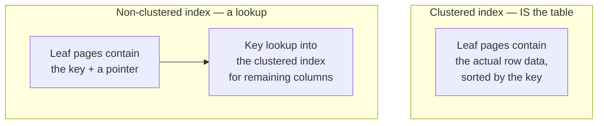

Up to now you have been a consumer of a schema someone else designed. Today you look underneath. Not because you will be designing production databases as a support engineer — you probably will not — but because **every performance complaint you receive is really a question about storage**, and you cannot answer it from the query text alone.

## Keys

### Primary keys

A primary key uniquely identifies a row. It is `NOT NULL` and unique, and in SQL Server it creates a **clustered index** by default — meaning the table's rows are physically stored in primary-key order.

```sql title="primary-key.sql"
CREATE TABLE dbo.Tickets (
    TicketId      INT IDENTITY(1,1) NOT NULL,
    CustomerId    INT               NOT NULL,
    Subject       NVARCHAR(200)     NOT NULL,
    Status        VARCHAR(20)       NOT NULL,
    CreatedAtUtc  DATETIME2(3)      NOT NULL CONSTRAINT DF_Tickets_Created DEFAULT SYSUTCDATETIME(),
    CONSTRAINT PK_Tickets PRIMARY KEY CLUSTERED (TicketId)
);
```

Two schools on key choice:

- **Surrogate key** — a meaningless `IDENTITY` integer or a GUID. Stable, narrow, never needs to change. This is the default choice and almost always right.
- **Natural key** — a real-world identifier like an ISBN or email address. Meaningful, but real-world identifiers change, and then you are updating every foreign key that references them.

:::hint{type=warning}
`UNIQUEIDENTIFIER` (GUID) primary keys with the default `NEWID()` are a classic performance trap. Because GUIDs are random, every insert lands in a random page of the clustered index, causing page splits and fragmentation. If you need GUIDs, use `NEWSEQUENTIALID()` or keep the GUID as a non-clustered unique column and cluster on an `IDENTITY` instead.
:::

### Foreign keys

```sql title="foreign-key.sql"
ALTER TABLE dbo.Tickets
ADD CONSTRAINT FK_Tickets_Customers
    FOREIGN KEY (CustomerId) REFERENCES dbo.Customers (CustomerId);
```

A foreign key means the engine will refuse to insert a ticket for a customer that does not exist, and refuse to delete a customer that still has tickets. That refusal — the error your application logs — is the constraint doing its job.

As a support engineer you will meet foreign keys mainly in three forms:

1. **`The DELETE statement conflicted with the REFERENCE constraint`** — someone is trying to delete a parent with children. The fix is almost never to drop the constraint.
2. **Orphaned rows** in a database where foreign keys were *not* enforced. Yesterday's anti-join is how you find them.
3. **Cascade behaviour** — `ON DELETE CASCADE` deletes children automatically. Convenient and occasionally catastrophic.

## Normalisation, briefly and practically

The formal definitions are worth knowing for interviews; the intuition is worth more.

:::steps

1. **First normal form (1NF)** — no repeating groups. One value per cell. If you have `Phone1, Phone2, Phone3` columns, or a comma-separated list in one column, you are not in 1NF.

2. **Second normal form (2NF)** — no partial dependencies. Every non-key column depends on the *whole* primary key, not part of a composite one.

3. **Third normal form (3NF)** — no transitive dependencies. A non-key column must not depend on another non-key column. Storing `CustomerId`, `CustomerName` and `CustomerCity` in an orders table breaks this: name and city depend on the customer, not the order.

:::

The one-line summary that carries you through an interview: **every fact lives in exactly one place.**

### And why you would deliberately break it

Denormalisation — storing redundant data on purpose — buys read speed at the cost of write complexity and consistency risk. Reporting tables, materialised aggregates and audit snapshots are all deliberately denormalised. The relevant support insight: **when the same fact is stored in two places, they will eventually disagree**, and reconciling them will be your ticket.

```quiz
question: An Orders table stores CustomerId, CustomerName and CustomerEmail. Which normal form does this violate, and what is the practical risk?
options:
  - 1NF — the row contains repeating groups
  - 2NF — the columns depend on part of a composite key
  - 3NF — name and email depend on CustomerId, not on the order
  - None — it is a valid denormalisation with no downside
answer: 2
explanation: CustomerName and CustomerEmail are transitively dependent on the non-key column CustomerId, which violates third normal form. Practically, when a customer changes their email, historical orders keep the old one — which may be intentional (a point-in-time record) or a bug, and you must find out which.
```

## Indexes

An index is a sorted copy of some columns, with pointers back to the rows. It makes reads faster and writes slower, and it consumes disk. That trade is the whole topic.

### Clustered vs non-clustered



- **Clustered**: one per table. Defines physical row order. Choosing it well matters more than any other index decision.
- **Non-clustered**: up to 999 per table (please do not). A separate structure that points back to the row.

That "points back to the row" step is the **key lookup**, and it is why an index can be present and still not be used: if the engine estimates it will need to do 200,000 key lookups, it will decide scanning the whole table is cheaper. It is usually right.

### Covering indexes

Add the extra columns to the index and the lookup disappears:

```sql title="covering-index.sql"
-- Query: SELECT Status, CreatedAtUtc FROM dbo.Tickets WHERE CustomerId = @id;
CREATE NONCLUSTERED INDEX IX_Tickets_CustomerId
    ON dbo.Tickets (CustomerId)
    INCLUDE (Status, CreatedAtUtc);
```

`INCLUDE` columns are stored at the leaf level but not part of the sort key — they make the index *cover* the query without widening the tree.

### SARGability

```sql title="sargable.sql"
-- NOT SARGable: the column is wrapped in a function, so the index is useless
WHERE CAST(t.CreatedAtUtc AS DATE) = '2025-06-01'

-- SARGable: the engine can seek to a range
WHERE t.CreatedAtUtc >= '2025-06-01'
  AND t.CreatedAtUtc <  '2025-06-02'

-- NOT SARGable
WHERE LEFT(t.FailureCode, 7) = 'GATEWAY'

-- SARGable
WHERE t.FailureCode LIKE 'GATEWAY%'
```

:::hint{type=danger}
The non-SARGable versions return **the same results**. They are not wrong, they are slow — and only on large tables, and only sometimes. This is the archetypal "it worked in dev" bug: 5,000 rows in your test database scans in 2 ms, 50 million rows in production scans for 90 seconds.
:::

Implicit conversion causes the same problem invisibly. If a column is `VARCHAR` and your parameter is `NVARCHAR` (which is what .NET sends by default), SQL Server converts the *column*, not the parameter, and your index seek becomes a scan. Look for a yellow warning triangle on the plan operator.

## Reading an execution plan

This is the part to spend real time on — and the reason Day 1 had you seed 200,000 synthetic rows. `SalesLT` is too small to teach it: with 295 products and 32 orders, every plan is a scan, every scan is instant, and the optimiser is right to ignore every index you build. Performance work needs a table where the wrong plan actually hurts.

In SSMS:

- <kbd>Ctrl</kbd>+<kbd>L</kbd> — **estimated** plan (does not run the query)
- <kbd>Ctrl</kbd>+<kbd>M</kbd> — include **actual** plan (runs it, shows real row counts)

Always prefer the actual plan when you can afford to run the query, because the gap between estimated and actual rows is the single most diagnostic number on the screen.

Read plans **right to left, top to bottom** — that is the direction data flows.

:::steps

1. **Find the fattest arrow.** Arrow thickness is row count. The widest arrow is where the volume is, and therefore where the time is.

2. **Look for `Scan` where you expected `Seek`.** `Clustered Index Scan` on a large table with a selective `WHERE` means no usable index, or a non-SARGable predicate.

3. **Compare estimated vs actual rows.** Hover any operator. If the engine estimated 12 rows and got 1.2 million, statistics are stale — `UPDATE STATISTICS` or a full `sp_updatestats`. Bad estimates cause bad plan choices, like a nested loop join where a hash join was needed.

4. **Check for spills.** A yellow warning on a Sort or Hash Match operator means it ran out of memory grant and spilled to `tempdb`. That is often the entire reason a query got slow.

5. **Read the green missing-index hint with suspicion.** SSMS will suggest an index. It is generated by a simple heuristic, it ignores every other query on the table, and blindly applying it is how databases end up with fifteen overlapping indexes. Treat it as a hypothesis.

:::

```sql title="plan-experiment.sql"
-- First give the engine an index it *could* use.
CREATE NONCLUSTERED INDEX IX_Transactions_CreatedAtUtc
    ON dbo.Transactions (CreatedAtUtc)
    INCLUDE (Status, Amount);
GO

SET STATISTICS IO, TIME ON;
GO

DECLARE @Day DATE = CAST(DATEADD(DAY, -3, SYSUTCDATETIME()) AS DATE);

-- Run this with the actual plan on (Ctrl+M), note the logical reads.
SELECT   t.TransactionId, t.CreatedAtUtc, t.Amount
FROM     dbo.Transactions AS t
WHERE    CAST(t.CreatedAtUtc AS DATE) = @Day;

-- Now the SARGable version. Compare the plan shape and the logical reads.
SELECT   t.TransactionId, t.CreatedAtUtc, t.Amount
FROM     dbo.Transactions AS t
WHERE    t.CreatedAtUtc >= @Day
  AND    t.CreatedAtUtc <  DATEADD(DAY, 1, @Day);
GO

SET STATISTICS IO, TIME OFF;
```

Same rows, both times. The first query scans the whole index; the second seeks straight to a range. Write down both logical-read numbers — that ratio is the entire argument for SARGability, and it is a far more persuasive thing to say in an interview than the definition.

`SET STATISTICS IO ON` prints **logical reads** — the number of 8 KB pages touched. It is a far better performance metric than elapsed time, because it is not affected by cache warmth or what else the server is doing. When you tune a query, logical reads is the number you should watch go down.

## Tool fluency against Azure SQL

Spend twenty minutes deliberately exploring. The job description names these tools; being visibly at home in them matters.

| Where | What it gives you |
|---|---|
| **Object Explorer** → database → Tables → columns/keys/indexes | Schema without writing a query |
| **Object Explorer Details** (<kbd>F7</kbd>) | Sortable grid of objects — find the biggest table fast |
| Right-click table → **Script Table as** → CREATE To | The exact DDL, including every constraint and index |
| Right-click database → **Reports** → Standard Reports | Disk usage, index usage, top queries — no scripting needed |
| **Query Designer** (<kbd>Ctrl</kbd>+<kbd>Shift</kbd>+<kbd>Q</kbd>) | Build a join visually; useful on an unfamiliar schema |
| **Templates Explorer** (<kbd>Ctrl</kbd>+<kbd>Alt</kbd>+<kbd>T</kbd>) | Parameterised DDL boilerplate |

:::hint{type=warning}
**Activity Monitor does not work against Azure SQL Database**, and neither do the Agent, Backup or Maintenance Plan nodes. You are a tenant on a managed service, not an administrator of a host. The replacements are better anyway, and they are what a cloud support engineer actually reaches for:

```sql title="whats-happening-now.sql"
-- What is executing right now, and what is it waiting on?
SELECT   r.session_id, r.status, r.wait_type, r.wait_time,
         r.cpu_time, r.total_elapsed_time, t.text
FROM     sys.dm_exec_requests AS r
CROSS APPLY sys.dm_exec_sql_text(r.sql_handle) AS t
WHERE    r.session_id <> @@SPID;

-- Am I hitting the service-tier ceiling? This is the Azure-specific one,
-- and it is the first query to run when a customer says "it went slow at 2pm".
SELECT   TOP (60) end_time,
         avg_cpu_percent, avg_data_io_percent,
         avg_log_write_percent, max_worker_percent
FROM     sys.dm_db_resource_stats
ORDER BY end_time DESC;
```

`sys.dm_db_resource_stats` samples every 15 seconds and keeps about an hour. Sustained values near 100% mean the database is **throttled** — the query is not slow, the tier is too small. Distinguishing those two is a large fraction of real Azure SQL support work.
:::

:::hint{type=tip}
Turn on **Query Store** insights in the portal (database → Query Performance Insight) and in SSMS (database → Query Store → Top Resource Consuming Queries). Query Store is on by default in Azure SQL, it survives restarts and failovers, and it answers "what changed?" — which Activity Monitor never could, because it only ever showed you *now*. We come back to it on Day 25.
:::

## Exercise

:::checklist{title="Day 4 checklist"}
- [ ] Create a `Tickets` table with a primary key, a foreign key, and a default constraint
- [ ] Deliberately violate the foreign key and read the exact error message the engine returns
- [ ] Take a denormalised flat table and split it into 3NF on paper, then in SQL
- [ ] Run the `CAST()` vs range-predicate experiment on `dbo.Transactions` and record logical reads for both
- [ ] Find a query on `dbo.Transactions` that produces a Clustered Index Scan; make it a Seek by adding an index
- [ ] Read one actual execution plan end to end and write a sentence about the widest arrow
- [ ] Use `sys.dm_exec_requests` and Query Store to identify the most expensive recent query on your database
- [ ] Check `sys.dm_db_resource_stats` while a large query runs, and watch the IO percentage move
- [ ] Script `SalesLT.SalesOrderDetail` as CREATE and read every constraint it generated
:::

:::details{summary="Where did my index go? A checklist"}
The index exists but the plan shows a scan. In order of likelihood:

1. **Non-SARGable predicate** — column wrapped in a function, or an implicit type conversion.
2. **Low selectivity** — the predicate matches 40% of the table. A scan genuinely is cheaper.
3. **Too many key lookups** — the index does not cover the query. Add `INCLUDE` columns.
4. **Stale statistics** — the engine's row estimate is wrong, so it costed the plan wrong.
5. **Leading column mismatch** — an index on `(A, B)` cannot seek on `B` alone. Column order in a composite index matters enormously.
:::

## Where this is going

You now have four days of SQL. Tomorrow the topic changes completely: Git, treated as a collaboration protocol rather than a backup tool.
