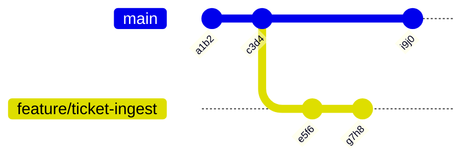

Most people learn just enough Git to survive: `add`, `commit`, `push`, and a mild dread of anything else. That is enough to contribute code and not enough to work on a team, and the gap shows up immediately in a code review conversation.

Today is about the model underneath, because once you understand what a commit *is*, the commands stop being incantations.

## The data model

A commit is a **snapshot of the entire tree**, plus:

- a pointer to its parent (or two parents, for a merge commit)
- author, committer, timestamps
- a message
- a SHA-1 hash of all of the above

That hash is why history is tamper-evident: change anything in a commit and its hash changes, which changes every descendant's hash.

A **branch** is a 41-byte file containing a commit hash. `HEAD` is a file containing the name of the branch you are on. That is genuinely the whole thing.



Two consequences that matter:

1. **Branching is free.** Create branches liberally. A branch per ticket is normal.
2. **Nothing is ever really lost** until garbage collection runs (default: 90 days for unreachable objects). `git reflog` can find almost anything.

## Branching strategies

| Strategy | Shape | Fits |
|---|---|---|
| **Trunk-based** | Everyone commits to `main`, behind feature flags. Very short-lived branches. | High-frequency deploys, mature CI |
| **GitHub Flow** | `main` is always deployable; branch per change; PR; merge; deploy. | Most teams, most of the time |
| **Git Flow** | `develop`, `release/*`, `hotfix/*`, `main`. | Versioned software with scheduled releases |

For a support-adjacent role, **GitHub Flow** is what you will meet, and trunk-based is what the more mature teams are moving towards. Git Flow is heavyweight and increasingly considered legacy — but plenty of enterprises still run it, so know the vocabulary.

Naming conventions worth adopting: `feature/ticket-123-add-retry`, `fix/null-customer-id`, `chore/bump-deps`. The prefix makes branch lists scannable and some CI systems key off it.

## Merge vs rebase

This is the single most likely "explain the difference" question in a technical screen. Here is an answer that demonstrates judgement rather than memorisation.

### Merge

```bash title="merge.sh"
git checkout main
git merge feature/ticket-ingest
```

Creates a **merge commit** with two parents. History is a truthful record of what happened, including the fact that work happened in parallel.

- **Pro**: non-destructive. Existing commits are untouched. Safe on shared branches.
- **Con**: history becomes a braid. `git log --graph` on a busy repo is a wall of criss-crossing lines.

### Rebase

```bash title="rebase.sh"
git checkout feature/ticket-ingest
git rebase main
```

Replays each of your commits on top of the current `main`. History becomes linear, as though you had started your work from the latest `main` all along.

- **Pro**: clean, linear, bisectable history. Each commit is a coherent step.
- **Con**: **it rewrites history.** Your commits get new hashes. Anyone who had pulled the old ones now has divergent history.

:::hint{type=danger}
**The golden rule of rebasing: never rebase a branch that other people have based work on.** Rebasing your own unpushed feature branch is routine and good practice. Rebasing `main`, or a shared branch someone else has pulled, forces everyone to recover manually and will make you unpopular quickly.
:::

### The pragmatic policy most teams settle on


Rebase locally to keep your branch current; squash-merge the PR so `main` gets one commit per logical change. You get a readable `main` history *and* nobody's shared history is rewritten.

```quiz
question: Your feature branch is three commits behind main and you have not pushed yet. What is the safest way to get current?
options:
  - git merge main into your branch, creating a merge commit
  - git rebase main, replaying your commits on top
  - git reset --hard origin/main
  - Force-push main to match your branch
answer: 1
explanation: Because the branch is unpushed and yours alone, rebasing is safe and produces cleaner history. A merge would also work but adds noise. Option 3 discards your work; option 4 rewrites shared history and is the classic disaster.
```

## Interactive rebase

The tool for cleaning up before review. Take the last four commits:

```bash title="interactive-rebase.sh"
git rebase -i HEAD~4
```

An editor opens with a to-do list:

```text
pick a1b2c3d Add ticket schema
pick d4e5f6a WIP
pick 7b8c9d0 fix typo
pick 1e2f3a4 Add validation

# p, pick   = use commit
# r, reword = use commit, but edit the message
# e, edit   = use commit, but stop to amend
# s, squash = meld into previous commit, keep both messages
# f, fixup  = meld into previous commit, discard this message
# d, drop   = remove commit
```

Rewrite it:

```text
pick a1b2c3d Add ticket schema
fixup d4e5f6a WIP
fixup 7b8c9d0 fix typo
reword 1e2f3a4 Add validation
```

Result: two clean commits instead of four, one of which was called "WIP".

:::hint{type=tip}
Commit messily while you work — small, frequent commits are a safety net. Then clean up with interactive rebase *before* you open the PR. This gets you both a real undo history while developing and a readable history for reviewers. Trying to write perfect commits as you go is a false economy.
:::

Related tools:

```bash title="fixup-workflow.sh"
# Amend the most recent commit (message and/or staged changes)
git commit --amend

# Mark a commit as a fixup for an earlier one, then autosquash
git commit --fixup=a1b2c3d
git rebase -i --autosquash HEAD~5
```

## Creating and resolving a conflict on purpose

Do this now. Manufacturing a conflict in a throwaway repo is the only way to stop fearing them.

:::steps

1. Create the repo and a base file.

   ```bash
   mkdir git-conflict-lab && cd git-conflict-lab
   git init
   printf 'timeout = 30\nretries = 3\n' > config.ini
   git add . && git commit -m "Add base config"
   ```

2. Branch and change line one.

   ```bash
   git checkout -b feature/raise-timeout
   printf 'timeout = 120\nretries = 3\n' > config.ini
   git commit -am "Raise timeout to 120s"
   ```

3. Go back to `main` and change the same line differently.

   ```bash
   git checkout main
   printf 'timeout = 60\nretries = 3\n' > config.ini
   git commit -am "Raise timeout to 60s"
   ```

4. Merge, and watch it fail.

   ```bash
   git merge feature/raise-timeout
   # CONFLICT (content): Merge conflict in config.ini
   ```

:::

`config.ini` now contains conflict markers:

```ini title="config.ini (conflicted)"
<<<<<<< HEAD
timeout = 60
=======
timeout = 120
>>>>>>> feature/raise-timeout
retries = 3
```

Read them precisely: between `<<<<<<<` and `=======` is **your current branch** (`HEAD`). Between `=======` and `>>>>>>>` is **the branch being merged in**.

Resolve by editing the file to what you actually want — including, sometimes, a third value that is neither side — then:

```bash title="resolve.sh"
git add config.ini
git commit          # message is pre-filled for a merge
git status          # confirm clean
```

Useful escape hatches:

```bash title="conflict-tools.sh"
git merge --abort          # nothing happened, back to before
git rebase --abort         # same, during a rebase
git checkout --ours  file  # take the current branch's version wholesale
git checkout --theirs file # take the incoming version wholesale
git diff --name-only --diff-filter=U   # list only conflicted files
```

:::hint{type=warning}
During a **rebase**, `--ours` and `--theirs` are reversed relative to a merge, because Git is replaying your commits onto the other branch — so "ours" is the branch you are rebasing *onto*. This trips up almost everyone at least once. When in doubt, open the file and read the markers rather than trusting the flag.
:::

## The reflog: your undo button

```bash title="reflog.sh"
git reflog
# a1b2c3d HEAD@{0}: rebase finished: returning to refs/heads/feature
# 9f8e7d6 HEAD@{1}: rebase: Add validation
# 3c4d5e6 HEAD@{2}: checkout: moving from main to feature
# 7a8b9c0 HEAD@{3}: commit: Add ticket schema

# Recover the state before that disastrous rebase
git reset --hard HEAD@{3}
```

The reflog records every position `HEAD` has held locally, including commits that are no longer reachable from any branch. A "lost" commit after a bad `reset --hard` or rebase is almost always sitting in the reflog.

:::hint{type=tip}
Learn this now, while nothing is at stake. The moment you need the reflog is the moment you are least able to calmly read documentation.
:::

## Configuration worth setting today

```bash title="git-config.sh"
git config --global user.name  "Your Name"
git config --global user.email "you@example.com"

# On Windows: keep LF in the repo, CRLF in the working tree
git config --global core.autocrlf true

# Refuse to merge unrelated histories accidentally; require an explicit choice on pull
git config --global pull.rebase false      # or 'true' if your team rebases
git config --global init.defaultBranch main

# Nicer log
git config --global alias.lg "log --graph --oneline --decorate --all"
```

`git lg` will become the command you type most often.

## Exercise

:::checklist{title="Day 5 checklist"}
- [ ] Set your global Git identity and the `lg` alias
- [ ] Create a repo, make five commits, and read `git lg` output
- [ ] Create a branch, commit on both branches, and merge with a merge commit
- [ ] Repeat with a rebase instead; compare `git lg` output side by side
- [ ] Use `git rebase -i` to squash three commits into one and reword the message
- [ ] Manufacture a merge conflict and resolve it by hand
- [ ] Manufacture a second conflict and resolve it with `git merge --abort` instead
- [ ] Do a `git reset --hard` you regret, then recover it with `git reflog`
- [ ] Write, in your own words, one paragraph explaining rebase vs merge to a colleague
:::

:::details{summary="A rebase-vs-merge answer that lands well in an interview"}
> "Merge preserves history exactly as it happened and is non-destructive, so it is safe on shared branches — the cost is a tangled graph. Rebase replays your commits onto a new base to give you linear history, which makes `git log` and `git bisect` far more useful — the cost is that it rewrites commits, so you must never do it to a branch other people have pulled.
>
> In practice I rebase my own feature branch onto main to stay current, then squash-merge the PR. That keeps main readable without rewriting anyone else's history."

The last paragraph is the one that matters. It shows you have a working policy, not just definitions.
:::

## Where this is going

Tomorrow is a heavier day: the full pull-request workflow, plus `bisect`, `stash` and `cherry-pick` — the three commands that turn up specifically when something is broken and you have to find out when and why.
