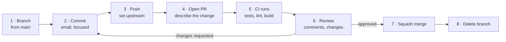

Today is a heavier day, and worth it. Yesterday was Git as a personal tool. Today is Git as a **team protocol** — plus the three commands that show up in incident work.

## The pull request lifecycle



### 1–3: branch, commit, push

```bash title="branch-and-push.sh"
git checkout main
git pull --ff-only                       # fail loudly rather than silently merging
git checkout -b feature/ticket-142-retry-logic

# ... work, committing in small logical steps ...

git push -u origin feature/ticket-142-retry-logic
```

`git pull --ff-only` is a habit worth building. Plain `git pull` will create a surprise merge commit if your local `main` has diverged. `--ff-only` refuses and tells you, which is what you want.

### 4: write a description a reviewer can act on

The single highest-leverage thing you can do for review speed. A template:

```markdown title=".github/pull_request_template.md"
## What
One or two sentences. What changed, in plain language.

## Why
Link the ticket. Explain the problem, not the solution — the diff shows the solution.

## How to verify
Concrete steps a reviewer can follow. Commands, URLs, expected output.

## Risk & rollback
What could break, who is affected, how to revert.

## Checklist
- [ ] Tests added or updated
- [ ] No secrets, keys or connection strings in the diff
- [ ] Logging added for anything a support engineer would need at 2am
```

:::hint{type=tip}
That last checklist item is a genuinely good habit to introduce on a support-adjacent team, and mentioning it in an interview signals that you think about operability. Code that fails silently is code somebody will page you about.
:::

### 5: CI

Automated checks run on the PR. We build these on Day 16; for now, know that a PR with a red check should not be reviewed yet, and that "the tests are flaky, merge anyway" is how teams lose trust in their own test suite.

### 6: review

As an author:

- Keep PRs small. A 200-line PR gets a real review; a 2,000-line PR gets "LGTM".
- Reply to every comment, even if only with "done".
- Push follow-up commits rather than force-pushing during review, so reviewers can see what changed. Squash at merge time.

As a reviewer:

- Distinguish **blocking** from **suggestion**. Prefix non-blocking notes with `nit:`.
- Ask questions rather than issue commands. "What happens if this is null?" beats "add a null check."
- Approve if it is better than what is there. Perfect is the enemy of shipped.

### 7–8: merge and clean up

| Strategy | Result on main | Use when |
|---|---|---|
| **Merge commit** | All commits + a merge commit | You want the full branch history preserved |
| **Squash and merge** | One commit | Default for most teams. Clean, revertible |
| **Rebase and merge** | All commits, linear, no merge commit | You curated the commits and each stands alone |

Squash-and-merge is the sane default: `main` gets one commit per change, which makes `git revert` and `git bisect` both trivially useful.

## Branch protection

On the repo settings, protect `main`:

- Require a pull request before merging
- Require at least one approval
- Require status checks to pass
- Require branches to be up to date before merging
- Dismiss stale approvals when new commits are pushed
- Do not allow force pushes or deletions

Add a `CODEOWNERS` file so the right people are auto-requested:

```text title=".github/CODEOWNERS"
# Default owners for everything
*                   @your-org/platform-team

# Database changes need a DBA
/migrations/        @your-org/dba
*.sql               @your-org/dba

# Pipeline changes need the ops team
/.github/workflows/ @your-org/ops
```

You will set this up yourself tomorrow.

## git bisect: finding the commit that broke it

This is the command that turns "it worked last month" into an exact answer, and it is the one most people have never used.

Binary search over history: if the bug appeared somewhere in the last 500 commits, bisect finds it in about nine steps.

```bash title="bisect.sh"
git bisect start
git bisect bad                    # current HEAD is broken
git bisect good v1.4.0            # this tag was fine

# Git checks out a commit halfway between. Test it.
# Then tell Git the result:
git bisect good     # ... or 'git bisect bad'

# Repeat ~9 times. Git then prints:
#   a1b2c3d4 is the first bad commit

git bisect reset                  # return to where you started
```

Automate it when you have a script that exits non-zero on failure:

```bash title="bisect-run.sh"
git bisect start HEAD v1.4.0
git bisect run ./scripts/reproduce-bug.sh
```

Git runs the script at each step and decides good/bad from the exit code. Walk away, come back to an answer.

:::hint{type=tip}
`git bisect run` is the strongest argument for squash-merging PRs. If every commit on `main` is a complete, working change, every bisect step is testable. If `main` is full of "WIP" commits that do not build, bisect keeps landing on broken commits and you have to `git bisect skip` your way through.
:::

```quiz
question: A regression appeared somewhere in the last 512 commits. Roughly how many commits will git bisect need you to test?
options:
  - About 512
  - About 256
  - About 9
  - About 2
answer: 2
explanation: Bisect is a binary search, so it needs roughly log₂(512) = 9 tests. That is the whole point — it converts a linear hunt into a logarithmic one.
```

## git stash: parking work

You are mid-change and a production issue arrives.

```bash title="stash.sh"
git stash push -m "half-done retry logic"

git checkout main
git checkout -b fix/urgent-null-customer
# ... fix, commit, push, PR ...

git checkout feature/ticket-142-retry-logic
git stash pop            # restore and remove from the stack
```

More of the interface than most people know:

```bash title="stash-more.sh"
git stash list                    # see the stack
git stash show -p stash@{1}       # view a stash as a diff
git stash apply stash@{1}         # restore but KEEP it on the stack
git stash push -u                 # include untracked files
git stash push -- path/to/file    # stash only specific paths
git stash branch fix/from-stash   # create a branch from a stash
git stash drop stash@{0}
git stash clear                   # delete them all — no undo
```

:::hint{type=warning}
Stashes are easy to forget and are not pushed anywhere. A stash sitting on a laptop for three weeks is lost work waiting to happen. For anything you might want tomorrow, prefer a **WIP commit on a branch** — you can always `git reset --soft HEAD~1` to un-commit it later. Use stash for minutes, not days.
:::

## git cherry-pick: moving one fix

You fixed a bug on `main` and it also needs to go onto the `release/2.4` branch.

```bash title="cherry-pick.sh"
git checkout release/2.4
git cherry-pick a1b2c3d

# A range (exclusive of the first, inclusive of the last)
git cherry-pick a1b2c3d..f4e5d6c

# Record where it came from — invaluable months later
git cherry-pick -x a1b2c3d
```

`-x` appends `(cherry picked from commit a1b2c3d)` to the message. Always use it when picking between long-lived branches.

:::hint{type=warning}
Cherry-picking creates a **new commit with a different hash** containing the same diff. If the branches are later merged, Git usually detects the duplicate — but not always, and you can end up with the change applied twice or a confusing conflict. Cherry-pick is a targeted tool for hotfixes and backports, not a substitute for merging.
:::

## Related recovery commands

```bash title="recovery.sh"
# Undo a commit that is already public — creates a NEW commit that inverts it
git revert a1b2c3d

# Who last touched this line, and in which commit?
git blame -L 40,60 src/handler.py

# Search history for when a string was introduced or removed
git log -S "GATEWAY_TIMEOUT" --oneline

# What changed in a file over time
git log -p --follow src/config.py
```

`git log -S` (the "pickaxe") is underrated for support work. "When did this error code first appear in the codebase?" is one command.

:::hint{type=danger}
`git revert` for anything already pushed. `git reset --hard` only for local, unpushed work. Reset rewrites history; revert adds to it. Using reset on a shared branch and force-pushing is the single most common way to destroy a colleague's afternoon.
:::

## Exercise: a full PR cycle

Use a throwaway GitHub repo — you will build a properly protected one tomorrow.

:::checklist{title="Day 6 checklist"}
- [ ] Create a repo with a README and a small script
- [ ] Branch, make three commits, push with `-u`
- [ ] Open a PR using a description template you wrote yourself
- [ ] Review your own PR line by line and leave at least two comments
- [ ] Push a commit that addresses one comment; verify the PR updates
- [ ] Squash-merge, then delete the branch
- [ ] Deliberately introduce a bug in commit 3 of 8; use `git bisect` to find it
- [ ] Write a shell script that exits 1 when the bug is present; run `git bisect run` with it
- [ ] Stash a change, switch branches, come back, and pop it
- [ ] Cherry-pick a commit onto a second branch using `-x`, and check the message
- [ ] Use `git log -S` to find when a specific string entered the repo
:::

:::details{summary="Building a bisect exercise for yourself"}
```bash
mkdir bisect-lab && cd bisect-lab && git init
echo 'def add(a, b): return a + b' > calc.py
git add . && git commit -m "Add calc"

# Six harmless commits
for i in $(seq 1 3); do
  echo "# note $i" >> calc.py
  git commit -am "Note $i"
done

# The bug
sed -i 's/return a + b/return a - b/' calc.py
git commit -am "Refactor add"

for i in $(seq 4 6); do
  echo "# note $i" >> calc.py
  git commit -am "Note $i"
done

# The test
cat > test.sh <<'EOF'
#!/usr/bin/env bash
python -c "
import calc, sys
sys.exit(0 if calc.add(2, 2) == 4 else 1)
"
EOF
chmod +x test.sh

git bisect start HEAD HEAD~7
git bisect run ./test.sh
```

Nine seconds of setup for the single most impressive Git trick you can demonstrate in an interview.
:::

## Where this is going

Tomorrow closes the chapter: timed T-SQL practice to make the syntax automatic, and building the repo you will use for the rest of the course — with branch protection and a PR template you will actually rely on.
