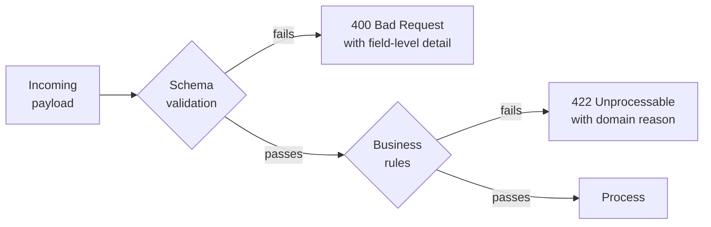

Here is a support ticket you will receive, in one form or another, dozens of times:

> *"Our integration stopped working. Nothing changed on our side. Your API is returning 400."*

Without a schema, answering that means reading code, guessing at the payload, and eventually asking the customer to send you an example — which takes two days of back-and-forth. With a schema, you validate their payload, get back *"`/customer/email` does not match format 'email'"*, and reply in four minutes.

That is why support teams care about JSON Schema more than most developers do. It converts a vague dispute about whose fault it is into a mechanical, checkable fact.

## What a schema actually validates

A schema checks **structure and shape**:

- Is this a JSON object?
- Are the required fields present?
- Is `amount` a number, and is it above zero?
- Is `status` one of the four values we accept?
- Does `email` look like an email address?

A schema does **not** check business rules:

- Does this customer exist?
- Is this account allowed to make refunds?
- Is this amount within the customer's daily limit?



Keeping those two layers distinct is a design decision with direct support consequences: a 400 means *the caller's payload is malformed and they must fix it*; a 422 means *the payload is well-formed but the request cannot be honoured*. When an API conflates them, every failure requires a human to work out which kind it was.

## A first schema

```json title="schemas/ticket.schema.json"
{
  "$schema": "https://json-schema.org/draft/2020-12/schema",
  "$id": "https://example.com/schemas/ticket.schema.json",
  "title": "SupportTicket",
  "description": "A support ticket submitted through the public intake API.",
  "type": "object",
  "required": ["ticketId", "customerId", "subject", "priority", "createdAt"],
  "additionalProperties": false,
  "properties": {
    "ticketId": {
      "type": "string",
      "pattern": "^TKT-[0-9]{6}$",
      "description": "Caller-assigned identifier, e.g. TKT-004217"
    },
    "customerId": {
      "type": "integer",
      "minimum": 1
    },
    "subject": {
      "type": "string",
      "minLength": 3,
      "maxLength": 200
    },
    "body": {
      "type": "string",
      "maxLength": 20000
    },
    "priority": {
      "enum": ["low", "normal", "high", "urgent"]
    },
    "createdAt": {
      "type": "string",
      "format": "date-time"
    },
    "tags": {
      "type": "array",
      "items": { "type": "string", "minLength": 1 },
      "maxItems": 20,
      "uniqueItems": true
    },
    "reporter": {
      "type": "object",
      "required": ["email"],
      "properties": {
        "name":  { "type": "string" },
        "email": { "type": "string", "format": "email" }
      },
      "additionalProperties": false
    },
    "attachments": {
      "type": "array",
      "items": {
        "type": "object",
        "required": ["filename", "sizeBytes"],
        "properties": {
          "filename":  { "type": "string" },
          "sizeBytes": { "type": "integer", "minimum": 0, "maximum": 10485760 },
          "contentType": { "type": "string" }
        }
      }
    }
  }
}
```

Points worth dwelling on:

- **`$id`** gives the schema a stable identity so other schemas can `$ref` it.
- **`additionalProperties: false`** rejects unknown fields. Strict, and a decision with consequences — see the versioning section below.
- **`enum`** is exhaustive and self-documenting. Far better than `"type": "string"` plus a comment.
- **`format`** is advisory in the specification; many validators do not enforce it unless you ask. In Python you must install the format extras.

:::hint{type=warning}
`"format": "email"` and `"format": "date-time"` are **not checked by default** by most validators, including Python's `jsonschema`. You need `pip install jsonschema[format]` and a format checker. Discovering this after shipping is a classic — the schema *looks* like it validates emails and quietly does not.
:::

## Validating in Python

```python title="validate.py"
import json
from pathlib import Path

from jsonschema import Draft202012Validator, FormatChecker

def load_validator(schema_path: Path) -> Draft202012Validator:
    schema = json.loads(schema_path.read_text(encoding="utf-8"))
    Draft202012Validator.check_schema(schema)          # catch schema bugs early
    return Draft202012Validator(schema, format_checker=FormatChecker())

def validate(validator: Draft202012Validator, payload: dict) -> list[str]:
    """Return a list of human-readable problems. Empty list means valid."""
    problems = []
    for error in sorted(validator.iter_errors(payload), key=lambda e: list(e.path)):
        location = "/" + "/".join(str(p) for p in error.absolute_path) or "(root)"
        problems.append(f"{location}: {error.message}")
    return problems
```

`iter_errors` rather than `validate` is the important choice: `validate()` raises on the **first** problem, so a payload with six errors takes six round trips to fix. `iter_errors` reports all of them at once, which is the difference between a good and a bad support experience.

### Passing and failing examples

```python title="test_ticket_schema.py"
import json
from pathlib import Path
import pytest
from validate import load_validator, validate

VALIDATOR = load_validator(Path("schemas/ticket.schema.json"))

VALID = {
    "ticketId": "TKT-004217",
    "customerId": 29825,
    "subject": "Payments failing with gateway timeout",
    "priority": "high",
    "createdAt": "2026-08-06T14:22:01Z",
    "tags": ["payments", "timeout"],
    "reporter": {"name": "Ada Lovelace", "email": "ada@example.com"},
}

def test_valid_payload_has_no_problems():
    assert validate(VALIDATOR, VALID) == []

@pytest.mark.parametrize(
    "mutation, expected_fragment",
    [
        ({"ticketId": "4217"},                 "does not match"),
        ({"customerId": "29825"},              "is not of type 'integer'"),
        ({"priority": "critical"},             "is not one of"),
        ({"createdAt": "yesterday"},           "is not a 'date-time'"),
        ({"subject": "ab"},                    "is too short"),
        ({"reporter": {"email": "not-email"}}, "is not a 'email'"),
        ({"unexpectedField": True},            "Additional properties"),
    ],
)
def test_invalid_payloads_are_rejected(mutation, expected_fragment):
    payload = {**VALID, **mutation}
    problems = validate(VALIDATOR, payload)
    assert problems, f"expected {mutation} to be rejected"
    assert any(expected_fragment in p for p in problems), problems

def test_missing_required_field_is_reported():
    payload = {k: v for k, v in VALID.items() if k != "customerId"}
    problems = validate(VALIDATOR, payload)
    assert any("customerId" in p for p in problems)
```

:::hint{type=tip}
That parametrised table is the pattern to copy. **One row per way the payload can be wrong** — it is compact, it reads as documentation, and each new bug you meet in production becomes one new row. This is contract testing in its simplest useful form.
:::

## Making errors actionable

Raw validator output is accurate and unfriendly:

```text
'critical' is not one of ['low', 'normal', 'high', 'urgent']
```

For an API response, wrap it:

```python title="error_response.py"
def to_api_error(problems: list[str]) -> dict:
    return {
        "error": "validation_failed",
        "message": f"{len(problems)} field(s) failed validation.",
        "details": [
            {"field": p.split(":", 1)[0], "problem": p.split(":", 1)[1].strip()}
            for p in problems
        ],
        "documentation": "https://docs.example.com/api/tickets#schema",
    }
```

```json title="400 response"
{
  "error": "validation_failed",
  "message": "2 field(s) failed validation.",
  "details": [
    { "field": "/priority",         "problem": "'critical' is not one of ['low', 'normal', 'high', 'urgent']" },
    { "field": "/reporter/email",   "problem": "'not-email' is not a 'email'" }
  ],
  "documentation": "https://docs.example.com/api/tickets#schema"
}
```

That response closes the ticket before it is opened. The customer can see exactly which field, exactly what was wrong, and where the rules are documented.

```quiz
question: A customer's payload has four separate problems. Why should the API report all four rather than the first?
options:
  - It is faster for the server to validate everything at once
  - It avoids four fix-and-resubmit round trips, each of which is a support interaction
  - The JSON Schema specification requires it
  - Reporting one error is a security risk
answer: 1
explanation: Stopping at the first error forces the caller into a slow guess-and-retry loop, and each cycle can become a support contact. iter_errors reports everything in one response.
```

## Versioning and `additionalProperties`

This is the design decision with the longest tail.

| | `additionalProperties: false` | `additionalProperties: true` (default) |
|---|---|---|
| Unknown fields | Rejected | Ignored |
| Adding a field | **Breaking** for strict consumers | Non-breaking |
| Typo protection | Excellent — `emial` is caught | None — silently ignored |
| Best for | Internal APIs, config files, message contracts | Public APIs you intend to evolve |

The usual compromise: **strict on the way in, permissive on the way out.** Your API validates inbound payloads strictly (so callers get told about typos), and your consumers tolerate unknown fields in responses (so you can add fields without a coordinated release). This is Postel's principle applied with a modern caveat — be strict enough that errors surface, tolerant enough that you can evolve.

For versioning, put the version in the `$id` and in the URL:

```text
https://example.com/schemas/v1/ticket.schema.json   →   POST /v1/tickets
https://example.com/schemas/v2/ticket.schema.json   →   POST /v2/tickets
```

Rules of thumb for what is safe:

- Adding an **optional** property: safe.
- Adding a **required** property: breaking.
- Removing a property: breaking for anyone who reads it.
- Widening an `enum`: safe for producers, breaking for consumers who switch on it exhaustively.
- Narrowing an `enum` or tightening a `pattern`: breaking.

## Reuse with `$defs` and `$ref`

```json title="schemas/common.schema.json"
{
  "$schema": "https://json-schema.org/draft/2020-12/schema",
  "$id": "https://example.com/schemas/common.schema.json",
  "$defs": {
    "customerId": { "type": "integer", "minimum": 1 },
    "timestamp":  { "type": "string", "format": "date-time" },
    "money": {
      "type": "object",
      "required": ["amount", "currency"],
      "properties": {
        "amount":   { "type": "integer", "description": "Minor units, e.g. pence" },
        "currency": { "type": "string", "pattern": "^[A-Z]{3}$" }
      },
      "additionalProperties": false
    }
  }
}
```

```json title="usage"
{
  "properties": {
    "customerId": { "$ref": "common.schema.json#/$defs/customerId" },
    "total":      { "$ref": "common.schema.json#/$defs/money" }
  }
}
```

:::hint{type=tip}
`"amount"` as an **integer in minor units** is not a JSON Schema idiom, it is a money idiom — floats cannot represent 0.10 exactly, and financial rounding bugs are a support nightmare. Storing pence as an integer avoids the entire class of problem. Worth knowing why, because it comes up.
:::

## Where schemas earn their keep in support

:::cards

:::card{title="Poison messages"}
A malformed message on a queue that the consumer cannot parse will retry forever or block the partition. Validating at the producer, and dead-lettering invalid messages at the consumer, turns an outage into a metric.
:::

:::card{title="Contract tests in CI"}
Store example payloads next to the schema. Validate them on every build. A schema change that breaks an existing example fails the pipeline instead of production.
:::

:::card{title="Structured logs"}
Day 18 makes this explicit: a structured log line is just JSON with an implicit schema. Making it explicit means your log pipeline can reject or flag events that will break downstream queries.
:::

:::card{title="Configuration files"}
Validating `config.json` at start-up with a schema turns "the service crashed twenty minutes after deploy" into "the service refused to start and told you which key was wrong."
:::

:::

## Exercise

:::checklist{title="Day 9 checklist"}
- [ ] `pip install "jsonschema[format]" pytest`
- [ ] Write `schemas/ticket.schema.json` from scratch — do not copy the one above wholesale
- [ ] Write three valid example payloads and save them under `schemas/examples/valid/`
- [ ] Write eight invalid payloads, one per failure mode, under `schemas/examples/invalid/`
- [ ] Write a validator that reports **all** problems, not just the first
- [ ] Write the parametrised pytest suite and make it pass
- [ ] Add a `common.schema.json` with `$defs` and `$ref` it from the ticket schema
- [ ] Write the `to_api_error` wrapper and print a sample 400 body
- [ ] Add a script that validates every file in `examples/valid/` and fails if any is invalid
- [ ] Commit via a PR — this becomes a CI check on Day 16
:::

:::details{summary="Answering the ticket at the top of this lesson"}
> "Thanks — I ran the payload from your 14:22 request against our v1 ticket schema. Two fields fail validation:
>
> - `/priority` is `\"critical\"`; the accepted values are `low`, `normal`, `high`, `urgent`.
> - `/reporter/email` is `\"ops@\"`, which is not a valid email address.
>
> The schema is published at `https://docs.example.com/api/tickets#schema` if it is useful to validate before sending. Nothing changed on our side — the `priority` enum has been the same since v1 launched, so it may be worth checking whether a value is being mapped differently upstream."

Specific, verifiable, blame-free, and it hands them something to check. That is the entire value proposition of schema validation in a support context.
:::

## Where this is going

Tomorrow the topic shifts to the cloud itself: the service-model vocabulary, regions and availability zones, and getting an AWS account set up safely — with a billing alarm before anything else.
