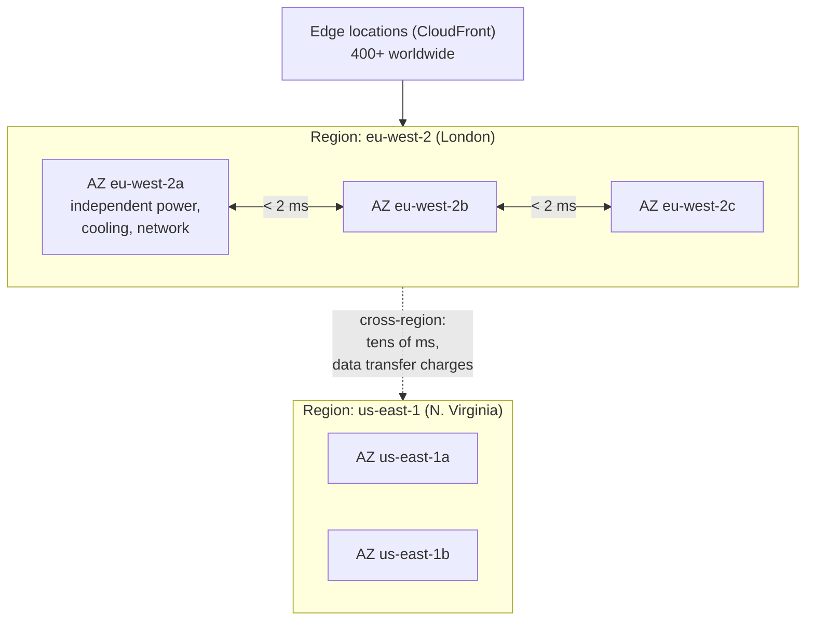

Cloud vocabulary is mostly straightforward once you stop treating it as marketing. Today's job is to attach each term to an operational consequence — because in a support role, the only reason to know what PaaS means is that it tells you **who gets paged**.

## The service models

The standard pizza-as-a-service analogy is fine but forgettable. Here is the version that matters:

| Layer | On-premises | IaaS | PaaS | SaaS |
|---|---|---|---|---|
| Application code | **You** | **You** | **You** | Provider |
| Data | **You** | **You** | **You** | **You** |
| Runtime / middleware | **You** | **You** | Provider | Provider |
| Operating system | **You** | **You** | Provider | Provider |
| Virtualisation | **You** | Provider | Provider | Provider |
| Servers, storage, network | **You** | Provider | Provider | Provider |
| Physical facility | **You** | Provider | Provider | Provider |

Note that **data is yours in every column.** There is no service model in which the provider is responsible for your data being correct, backed up in a way you have tested, or not accidentally made public.

### What each means for a support engineer

:::cards

:::card{title="IaaS — e.g. EC2, Azure VMs"}
Symptoms you own: unpatched OS, full disks, misconfigured firewalls, a service that did not restart after reboot. You have SSH. You also have all the toil.
:::

:::card{title="PaaS — e.g. Lambda, App Service, Azure Functions"}
Symptoms you own: application errors, cold starts, hitting a platform quota, a bad deployment. You usually cannot SSH in, which means **logging is your only diagnostic surface** — a point Day 18 leans on heavily.
:::

:::card{title="SaaS — e.g. Microsoft 365, Salesforce"}
Symptoms you own: configuration, permissions, licensing, integration payloads. When the product itself is broken, your job is to establish that fact convincingly and open a vendor ticket with evidence.
:::

:::card{title="Serverless / FaaS"}
A subset of PaaS where you are billed per invocation and there is no idle capacity. Great economics, plus two support quirks: cold starts and hard execution timeouts.
:::

:::

```quiz
question: A customer reports their Azure Function is timing out. Under the service model, which layer is your team most likely responsible for investigating first?
options:
  - The physical data centre hardware
  - The host operating system and its patch level
  - The application code, its dependencies and the configured timeout
  - The hypervisor
answer: 2
explanation: Functions are PaaS — Microsoft owns everything from the OS down. Your investigation starts at the code, its downstream calls, and the configured timeout and memory settings.
```

## Regions, availability zones, edge



**Region** — a geographic area, e.g. `eu-west-2` (London), `us-east-1` (N. Virginia). Choose based on:

1. **Data residency.** GDPR, or a contract that says UK data stays in the UK. Often the deciding factor and not negotiable.
2. **Latency to your users.** Physics is not optional; London to Sydney is ~250 ms round trip at best.
3. **Service availability.** New AWS services launch in `us-east-1` first, sometimes by a year.
4. **Price.** Regions differ, sometimes by 20–30% for the same instance.

**Availability Zone** — one or more data centres inside a region with independent power, cooling and networking. Milliseconds apart, so you can run synchronous replication between them. **Deploying across two AZs is the single cheapest resilience improvement available**, and its absence is a very common finding in an incident review.

**Edge location** — CDN points of presence. Static assets and cached responses served close to the user.

:::hint{type=warning}
`us-east-1` is special and not in a good way. It hosts control planes for several global AWS services (IAM, CloudFront, Route 53, billing), which means a significant `us-east-1` incident can degrade things in *other* regions. If you see global weirdness, check the `us-east-1` status first.
:::

### High availability vs disaster recovery

These get conflated constantly, and the distinction shows up in interviews.

| | High availability | Disaster recovery |
|---|---|---|
| Scope | Within a region, across AZs | Across regions |
| Protects against | Rack, data centre, or AZ failure | Regional outage, catastrophic loss |
| Typical mechanism | Load balancer + multi-AZ replicas | Cross-region backups or replicas |
| Measured by | Uptime SLA | **RTO** (how long to recover) and **RPO** (how much data you can lose) |

Know **RTO** and **RPO** by name. "What is our RPO?" is a question you may be asked during an incident, and the answer determines whether restoring from last night's backup is acceptable.

## Shared responsibility, precisely

The slogan is "AWS is responsible for security **of** the cloud; you are responsible for security **in** the cloud." The useful version is a list of things that are unambiguously yours:

- IAM users, roles, policies and key rotation
- Security groups, network ACLs, and what you expose to `0.0.0.0/0`
- Encryption choices — at rest and in transit
- Guest OS patching **on IaaS** (not on PaaS)
- Application-layer vulnerabilities
- **Your data**, its classification, and its backups
- The public/private setting on every S3 bucket you create

:::hint{type=danger}
Publicly-readable object storage remains one of the most common causes of real-world data breaches. AWS now blocks public access by default at the account level, and you have to deliberately turn that off. **Do not turn it off** unless you are hosting a static website and you understand exactly which bucket you are changing.
:::

## Setting up an AWS account safely

Do these in order. The billing steps come first for a reason.

:::steps

1. **Create the account** at `aws.amazon.com`. You need a card even for free tier. Use a real email you monitor.

2. **Secure the root user immediately.**
   - Enable MFA on root (an authenticator app is fine; a hardware key is better).
   - Do **not** create access keys for root. If any already exist, delete them.
   - Then stop using root. It is for account-level tasks only — closing the account, changing billing, a handful of others.

3. **Set a budget before you create anything.** Billing → Budgets → Create budget → Cost budget → monthly, $1. Alert at 50%, 80% and 100% to your email.

   :::hint{type=warning}
   $1, not $10. A one-dollar budget alerts you the moment *anything* is costing money, which is exactly the signal you want while learning. Real charges usually come from something you forgot to delete — a NAT gateway, an idle RDS instance, an unattached Elastic IP.
   :::

4. **Enable the billing alarm in CloudWatch too.** Budgets and CloudWatch alarms are separate systems; belt and braces costs nothing.

5. **Create an admin IAM user for yourself.** IAM → Users → Create user, attach `AdministratorAccess`, enable MFA, and use that from now on. Even solo, practising least privilege builds the habit.

6. **Set an account alias** so the sign-in URL is memorable: `https://yourname-lab.signin.aws.amazon.com/console`.

7. **Install and configure the AWS CLI.**

   ```bash
   aws --version
   aws configure
   # AWS Access Key ID:     AKIA...
   # AWS Secret Access Key: ...
   # Default region name:   eu-west-2
   # Default output format: json

   aws sts get-caller-identity      # confirms who you are authenticated as
   ```

8. **Turn on Cost Explorer** (Billing → Cost Explorer → Enable). It takes up to 24 hours to populate, so enable it today and it will be useful tomorrow.

:::

```bash title="cost-check.sh"
# Run this at the end of every AWS day. Ten seconds, saves real money.
aws ce get-cost-and-usage \
  --time-period Start=$(date -d '7 days ago' +%Y-%m-%d),End=$(date +%Y-%m-%d) \
  --granularity DAILY \
  --metrics UnblendedCost \
  --group-by Type=DIMENSION,Key=SERVICE \
  --output table
```

:::hint{type=tip}
Tag everything you create with `Project=learning`. It costs nothing, and it lets you filter Cost Explorer to find exactly what you left running. Get in the habit now — tagging discipline is something ops teams care about a lot and candidates rarely mention.
:::

## Understanding the free tier

Three different things wear the same name, and confusing them is how people get surprise bills:

| Type | Duration | Examples |
|---|---|---|
| **12-month free** | 12 months from signup | 750 h/month `t2.micro`/`t3.micro` EC2, 5 GB S3, 750 h RDS |
| **Always free** | Forever | 1M Lambda requests/month, 25 GB DynamoDB, CloudWatch basics |
| **Trials** | Short, one-off | Various — read the terms |

Things that are **not** free and catch everyone:

- **NAT Gateway** — roughly $32/month, always on, plus data processing. The most common surprise bill in AWS.
- **Elastic IPs** that are allocated but not attached to a running instance.
- **EBS volumes** left behind after terminating an instance (they do not always delete).
- **Data transfer out** to the internet beyond the free allowance.
- **RDS** running past 750 hours, or on a non-eligible instance class.

:::hint{type=danger}
Delete lab resources at the end of each day. Write a teardown note in your repo as you build: *"created X, delete with `aws ... delete-y`"*. Future you, three weeks from now, will not remember what that VPC endpoint was for.
:::

## Start the Cloud Practitioner path

AWS Skill Builder's **Cloud Practitioner Essentials** is free, roughly seven hours, and maps directly onto the CLF-C02 exam. Start it today; aim to finish it across Days 10–13, then take the practice exam on Day 14.

The four exam domains:

1. **Cloud Concepts** (24%) — value proposition, economics, design principles
2. **Security and Compliance** (30%) — shared responsibility, IAM, governance
3. **Technology and Services** (34%) — compute, storage, network, database, and how to choose
4. **Billing, Pricing and Support** (12%) — pricing models, support plans, cost tools

Domain 2 is the largest weighted after 3, which surprises people. It is also the most directly relevant to a support role.

## Exercise

:::checklist{title="Day 10 checklist"}
- [ ] AWS account created
- [ ] MFA enabled on the root user; no root access keys exist
- [ ] $1 monthly budget with alerts at 50/80/100%
- [ ] CloudWatch billing alarm configured
- [ ] Admin IAM user created, with MFA, and being used instead of root
- [ ] Account alias set
- [ ] AWS CLI installed; `aws sts get-caller-identity` returns your IAM user
- [ ] Cost Explorer enabled
- [ ] Cloud Practitioner Essentials started — at least the first two modules
- [ ] In `docs/`, write a one-page note in your own words on IaaS/PaaS/SaaS and who is on call for what
:::

:::details{summary="A written answer worth having ready"}
> "IaaS gives me virtual machines — I patch the OS, manage the disks and own everything above the hypervisor, so a full disk or an unrestarted service is my problem. PaaS gives me a runtime — the provider owns the OS and scaling, so my investigation starts at my code and my configuration, and because I usually cannot get a shell, logging and metrics are my only diagnostic surface. SaaS means I own configuration, permissions and integration data, and when the product itself is broken my job is to prove it with evidence and escalate to the vendor.
>
> Across all three, the data is always mine — including whether the backups actually restore."

That last sentence is the part interviewers remember.
:::

## Where this is going

Tomorrow you actually build something: an EC2 instance you SSH into, and an S3 bucket serving a static page. The first time you launch a VM in a browser and shell into it ninety seconds later is a genuinely clarifying moment.
