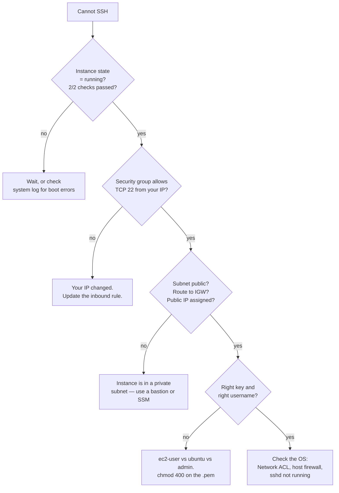

Today you stop reading about the cloud and put things in it. Two services, both foundational: **EC2** (a virtual machine) and **S3** (object storage). Between them they underpin most of what runs on AWS.

## EC2: launching an instance

:::steps

1. **EC2 → Launch instance.** Name it `learning-web-01`.

2. **AMI** — Amazon Linux 2023 (free-tier eligible, `dnf` package manager, AWS CLI preinstalled) or Ubuntu 24.04 if you prefer `apt`. Either is fine; Amazon Linux is what you will meet most in AWS shops.

3. **Instance type** — `t3.micro` (or `t2.micro` in older regions). Free-tier eligible: 2 vCPU, 1 GB RAM.

   Decoding `t3.micro`: `t` = burstable general purpose, `3` = generation, `micro` = size. Families you should recognise: `t` burstable, `m` general purpose, `c` compute-optimised, `r` memory-optimised, `i` storage-optimised, `g`/`p` GPU.

4. **Key pair** — create a new one, RSA, `.pem` format. Download it. **This is the only time AWS will give it to you.**

   ```bash
   chmod 400 ~/Downloads/learning-key.pem     # SSH refuses keys readable by others
   ```

5. **Network settings** — default VPC, and create a security group:
   - Inbound: SSH (22) from **My IP** — *not* `0.0.0.0/0`
   - Inbound: HTTP (80) from `0.0.0.0/0` (we are serving a page)
   - Outbound: leave the default allow-all

6. **Storage** — 8 GB gp3 is plenty and free-tier eligible.

7. **Launch**, then wait for **Status checks: 2/2 passed**. This takes a minute or two and is worth waiting for; connecting before the checks pass gives confusing errors.

:::

:::hint{type=danger}
SSH open to `0.0.0.0/0` is scanned and brute-forced within **minutes** of the instance coming up. Restrict to your IP. If your IP is dynamic, use EC2 Instance Connect or SSM Session Manager instead — the latter needs no inbound rule at all, which is the modern best practice.
:::

### Connecting

```bash title="connect.sh"
ssh -i ~/Downloads/learning-key.pem ec2-user@<public-ipv4-dns>
# Ubuntu AMIs use 'ubuntu' as the default user, not 'ec2-user'
```

Once in:

```bash title="setup-web.sh"
sudo dnf update -y
sudo dnf install -y nginx
sudo systemctl enable --now nginx
sudo systemctl status nginx

echo "<h1>Hello from $(hostname -f)</h1>" | sudo tee /usr/share/nginx/html/index.html
curl -s localhost | head
```

Now visit `http://<public-ip>` in a browser. If you see the page, you have deployed a web server on the internet.

### The four causes of "I cannot SSH"

Memorise this list. It is a real triage sequence, and a variant of it is a common interview question.



The order matters: cheapest checks first, and each one eliminates a whole class of cause. That instinct — *what is the cheapest question that halves the search space?* — is what separates fast triage from flailing.

:::hint{type=tip}
`Permission denied (publickey)` almost always means the **wrong username**, not the wrong key. Amazon Linux is `ec2-user`, Ubuntu is `ubuntu`, Debian is `admin`, RHEL is `ec2-user` or `root`. A `Connection timed out`, by contrast, is a network problem — security group, route table, or NACL — never a credentials problem.
:::

### Instance lifecycle and cost

| Action | What happens | Billed? |
|---|---|---|
| **Stop** | Instance shuts down; EBS volume persists; public IP is released | EBS storage only |
| **Start** | Boots again, **new public IP** unless you attached an Elastic IP | Yes |
| **Reboot** | OS restart; IP and volumes unchanged | Yes |
| **Terminate** | Instance destroyed; root volume usually deleted | No (check for orphaned volumes) |

:::hint{type=warning}
**Stopping does not delete.** You still pay for the EBS volume. When you finish a lab, *terminate*, then check EC2 → Volumes for anything left behind. Orphaned volumes are the second most common surprise on a learning bill.
:::

## S3: object storage

S3 is not a filesystem. It is a key/value store where values are blobs. There are no directories — `logs/2026/08/app.log` is a *key* that happens to contain slashes, and the console renders it as a folder tree for your comfort.

Consequences that matter:

- **No partial writes.** You replace an entire object; you cannot append to one.
- **No rename.** A rename is a copy plus a delete, and costs accordingly.
- **Strongly consistent reads** since 2020 — a write is immediately readable. Older documentation says otherwise; ignore it.
- **Effectively unlimited** capacity, 5 TB max per object.

### Create a bucket and use it

```bash title="s3-basics.sh"
# Bucket names are globally unique across all AWS customers, and DNS-compatible
BUCKET="learning-static-site-$(date +%s)"

aws s3 mb "s3://$BUCKET" --region eu-west-2

echo '<h1>Hello from S3</h1>' > index.html
echo '<h1>Not found</h1>'     > error.html

aws s3 cp index.html "s3://$BUCKET/"
aws s3 cp error.html "s3://$BUCKET/"

aws s3 ls "s3://$BUCKET/"
aws s3 sync ./site "s3://$BUCKET/" --delete   # mirror a local folder
```

### Static website hosting

```bash title="s3-website.sh"
aws s3 website "s3://$BUCKET/" \
  --index-document index.html \
  --error-document error.html

# Public buckets are blocked by default. This is a deliberate, narrow exception.
aws s3api put-public-access-block --bucket "$BUCKET" \
  --public-access-block-configuration \
  "BlockPublicAcls=false,IgnorePublicAcls=false,BlockPublicPolicy=false,RestrictPublicBuckets=false"

cat > policy.json <<EOF
{
  "Version": "2012-10-17",
  "Statement": [{
    "Sid": "PublicReadGetObject",
    "Effect": "Allow",
    "Principal": "*",
    "Action": "s3:GetObject",
    "Resource": "arn:aws:s3:::$BUCKET/*"
  }]
}
EOF

aws s3api put-bucket-policy --bucket "$BUCKET" --policy file://policy.json
echo "http://$BUCKET.s3-website.eu-west-2.amazonaws.com"
```

:::hint{type=danger}
Read that policy carefully. `"Principal": "*"` with `s3:GetObject` on `bucket/*` makes **every object in the bucket world-readable**. That is correct for a static website and catastrophic for anything else. Before you ever apply a policy like this, ask: *if a search engine indexed every object in this bucket, would that be fine?*
:::

The production answer, incidentally, is not a public bucket at all — it is a private bucket behind **CloudFront** with an Origin Access Control. You get HTTPS, caching and a custom domain, and the bucket stays private.

### Storage classes

| Class | Retrieval | Min duration | For |
|---|---|---|---|
| **Standard** | Instant | — | Active data |
| **Intelligent-Tiering** | Instant | — | Unknown or changing access patterns |
| **Standard-IA** | Instant | 30 days | Infrequent but needs to be fast |
| **Glacier Instant Retrieval** | Instant | 90 days | Archives with occasional instant reads |
| **Glacier Flexible Retrieval** | Minutes–hours | 90 days | Backups |
| **Glacier Deep Archive** | Up to 12 hours | 180 days | Compliance retention |

:::hint{type=warning}
Infrequent-access and Glacier classes have **minimum billable durations** and **per-GB retrieval charges**. Moving a lot of small, frequently-read objects to Standard-IA can cost *more* than Standard. Lifecycle rules are the right tool, but read the numbers before you write one.
:::

Lifecycle rules automate the transitions:

```json title="lifecycle.json"
{
  "Rules": [{
    "ID": "archive-old-logs",
    "Filter": { "Prefix": "logs/" },
    "Status": "Enabled",
    "Transitions": [
      { "Days": 30,  "StorageClass": "STANDARD_IA" },
      { "Days": 90,  "StorageClass": "GLACIER" }
    ],
    "Expiration": { "Days": 365 }
  }]
}
```

### Versioning and pre-signed URLs

```bash title="s3-extras.sh"
# Versioning: protects against overwrite and accidental delete
aws s3api put-bucket-versioning --bucket "$BUCKET" \
  --versioning-configuration Status=Enabled

# A time-limited link to a PRIVATE object — no credentials shared
aws s3 presign "s3://$BUCKET/reports/incident-2026-08-06.pdf" --expires-in 3600
```

Pre-signed URLs are a genuinely useful support tool: they let you hand a customer a log bundle or an export without granting them an account, and the link expires on its own.

:::hint{type=tip}
Versioning does not delete anything — a "delete" writes a delete marker and keeps the old version, **which you keep paying for**. Pair versioning with a lifecycle rule that expires non-current versions after 30–90 days, or the bucket grows forever.
:::

```quiz
question: An instance stops responding to SSH with "Connection timed out", though it was working an hour ago and nothing was deployed. What is the most likely cause?
options:
  - The SSH private key has expired
  - Your public IP changed, so the security group rule no longer matches
  - The AMI was deprecated
  - S3 versioning is enabled on the root volume
answer: 1
explanation: A timeout is a network-reachability symptom, not an authentication one. With SSH restricted to "My IP", a changing home or VPN IP is far and away the most common cause. Authentication problems produce "Permission denied", not a timeout.
```

## Tear down

```bash title="teardown.sh"
aws ec2 terminate-instances --instance-ids i-0123456789abcdef0
aws ec2 describe-volumes --filters Name=status,Values=available \
  --query 'Volumes[].VolumeId' --output text          # orphans

aws s3 rm "s3://$BUCKET" --recursive
aws s3api delete-bucket --bucket "$BUCKET"
```

A versioned bucket will refuse to delete while versions remain; you must delete every version and delete marker first. Worth doing once so the error is familiar.

## Exercise

:::checklist{title="Day 11 checklist"}
- [ ] EC2 instance launched with a security group restricting SSH to your IP
- [ ] SSH connection successful; nginx installed and serving a page over HTTP
- [ ] Deliberately break SSH by changing the security group; observe the timeout
- [ ] Deliberately use the wrong username; observe "Permission denied (publickey)"
- [ ] Stop and start the instance; note that the public IP changed
- [ ] S3 bucket created; two files uploaded; `aws s3 sync` used with `--delete`
- [ ] Static website hosting enabled and reachable in a browser
- [ ] Versioning enabled; overwrite a file; list both versions
- [ ] Generate a pre-signed URL and confirm it works, then confirm the plain URL 403s
- [ ] Write a lifecycle rule JSON (you do not have to apply it)
- [ ] **Everything terminated and deleted**; orphaned volumes checked
- [ ] Teardown commands committed to `docs/aws-teardown.md`
:::

:::details{summary="Why is my static website URL not HTTPS?"}
S3 website endpoints (`bucket.s3-website-region.amazonaws.com`) are **HTTP only**. There is no way to add a certificate to them.

For HTTPS you put CloudFront in front, with an ACM certificate — and once you have done that, the bucket should be private with an Origin Access Control so it is only reachable through CloudFront. This is a good example of a pattern where the simple version is fine for learning and wrong for production, and knowing *why* is the interesting part.
:::

## Where this is going

Tomorrow: the network those instances sit in, and the permissions system that decides what they may do. VPC and IAM — the two AWS topics that generate the most support tickets.
