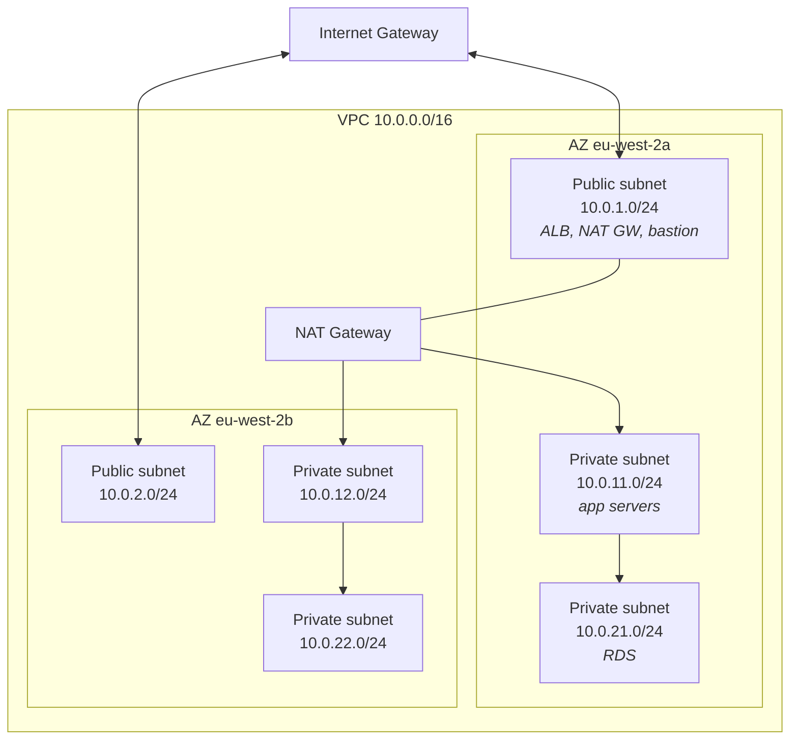
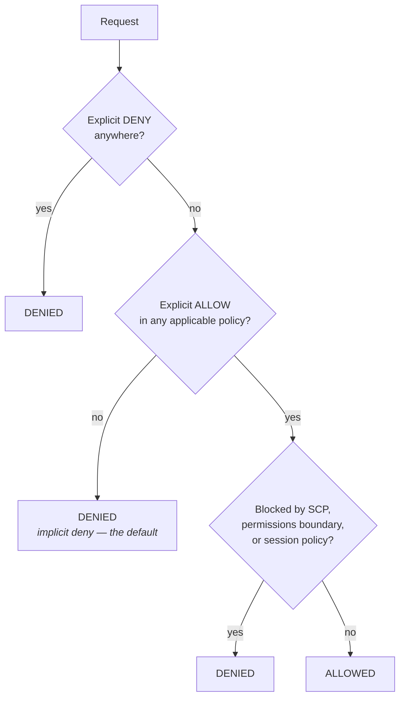

Two topics today, and they share a theme: both are about **boundaries**, and almost every AWS support ticket is ultimately a question about a boundary that is either too tight (something cannot reach something) or too loose (something reached something it should not have).

## VPC: the network

A **VPC** is an isolated network with a CIDR block, e.g. `10.0.0.0/16` — 65,536 addresses. Inside it you carve **subnets**, each in exactly one Availability Zone.



That three-tier, two-AZ layout is the standard reference architecture. Recognise it — you will see it in diagrams constantly.

### What makes a subnet "public"

Not a checkbox. A subnet is public **if and only if its route table has a route for `0.0.0.0/0` pointing at an internet gateway.** That is the whole definition, and it is the answer to "why can't my instance reach the internet?" more often than anything else.

| Destination | Target | Meaning |
|---|---|---|
| `10.0.0.0/16` | `local` | Within the VPC. Always present, cannot be removed |
| `0.0.0.0/0` | `igw-xxxx` | **Public subnet** — direct internet, both directions |
| `0.0.0.0/0` | `nat-xxxx` | **Private subnet** — outbound only |
| *(no default route)* | | **Isolated** — VPC-internal traffic only |

An instance in a public subnet also needs a **public IP** to be reachable from outside. Public subnet + no public IP = outbound works, inbound does not.

### Security groups vs network ACLs

The classic exam and interview comparison:

| | Security group | Network ACL |
|---|---|---|
| Attaches to | ENI / instance | Subnet |
| Rules | **Allow only** | Allow **and** deny |
| Evaluation | All rules; any match allows | In rule-number order; first match wins |
| State | **Stateful** — return traffic automatic | **Stateless** — needs an explicit return rule |
| Default | Deny all inbound, allow all outbound | Allow all both ways |

:::hint{type=warning}
Statelessness is the one that bites. If a NACL allows inbound TCP 443 but does not allow outbound on the **ephemeral port range (1024–65535)**, the response never leaves and the connection hangs. Security groups have no such problem, which is why most teams use permissive NACLs and do their real filtering in security groups.
:::

Security groups can reference **other security groups** as a source, which is the idiomatic way to express "the database accepts connections from the app tier" without hard-coding IPs:

```bash title="sg-reference.sh"
aws ec2 authorize-security-group-ingress \
  --group-id sg-database \
  --protocol tcp --port 1433 \
  --source-group sg-app-tier
```

That rule keeps working as instances come and go. An IP-based rule does not.

### The network triage sequence

When something cannot reach something else, check in this order:

:::steps

1. **Security group on the destination** — does it allow the port from the source?
2. **Security group on the source** — outbound is allow-all by default, but people restrict it.
3. **Route table** — is there a route to the destination at all?
4. **Network ACL** — both directions, including ephemeral ports.
5. **Host firewall** — `firewalld`, `iptables`, Windows Firewall inside the OS.
6. **The service itself** — is it listening, and on `0.0.0.0` rather than `127.0.0.1`?

:::

Step 6 catches people constantly. A service bound to `127.0.0.1` is unreachable from anywhere else no matter how permissive the network is. `ss -tlnp` on the host tells you in one line.

```quiz
question: An EC2 instance in a private subnet can reach RDS but cannot download OS updates from the internet. What is the most likely missing piece?
options:
  - A public IP address on the instance
  - A NAT gateway in a public subnet, plus a 0.0.0.0/0 route to it in the private subnet's route table
  - An inbound security group rule allowing port 443
  - A network ACL denying outbound traffic
answer: 1
explanation: Private subnets have no route to the internet by default. Outbound-only internet access requires a NAT gateway in a public subnet and a default route pointing at it. A public IP would not help, because there is no internet gateway route from a private subnet.
```

## IAM: the permissions system

IAM answers one question: **is this principal allowed to perform this action on this resource, under these conditions?**

### The four building blocks

- **User** — a person or a long-lived service identity. Has a password and/or access keys.
- **Group** — a collection of users. Policies attach to groups; users inherit.
- **Role** — an identity with permissions that is *assumed* temporarily. **No long-lived credentials.**
- **Policy** — a JSON document granting or denying permissions.

### Reading a policy

```json title="policy-read-one-bucket.json"
{
  "Version": "2012-10-17",
  "Statement": [
    {
      "Sid": "ListTheBucket",
      "Effect": "Allow",
      "Action": ["s3:ListBucket"],
      "Resource": "arn:aws:s3:::support-ticket-exports",
      "Condition": {
        "StringLike": { "s3:prefix": ["exports/*"] }
      }
    },
    {
      "Sid": "ReadObjectsUnderExports",
      "Effect": "Allow",
      "Action": ["s3:GetObject"],
      "Resource": "arn:aws:s3:::support-ticket-exports/exports/*"
    }
  ]
}
```

Details that matter:

- `"Version": "2012-10-17"` is a **policy language version**, not a date you choose. It is always this string.
- Bucket-level actions (`ListBucket`) target the **bucket ARN**; object-level actions (`GetObject`) target `bucket/*`. Getting this wrong is the most common IAM policy mistake with S3.
- `Condition` narrows further. Common keys: `aws:SourceIp`, `aws:MultiFactorAuthPresent`, `aws:RequestedRegion`, `s3:prefix`.

### Evaluation logic



Three rules to memorise:

1. **Default is deny.** Nothing is permitted unless something allows it.
2. **Explicit deny always wins.** No allow can override it, anywhere, ever.
3. **Guardrails apply on top.** Service Control Policies and permissions boundaries can only *restrict*, never grant.

This is why "I gave the user AdministratorAccess and they still get AccessDenied" happens: an SCP at the organisation level, or a permissions boundary on the user, is capping them. That is a real ticket, and knowing where to look is the answer.

### Roles beat keys

:::hint{type=danger}
**Never put access keys on an EC2 instance.** Attach an instance profile (a role) instead. The instance retrieves short-lived credentials from the metadata service, and they rotate automatically. Keys in a `.env` file, in user data, or committed to a repo are the leading cause of AWS account compromise — and automated scanners find keys pushed to public GitHub within *seconds*.
:::

```bash title="instance-role.sh"
# Trust policy: who may assume this role
cat > trust.json <<'EOF'
{
  "Version": "2012-10-17",
  "Statement": [{
    "Effect": "Allow",
    "Principal": { "Service": "ec2.amazonaws.com" },
    "Action": "sts:AssumeRole"
  }]
}
EOF

aws iam create-role --role-name app-server-role \
  --assume-role-policy-document file://trust.json

aws iam attach-role-policy --role-name app-server-role \
  --policy-arn arn:aws:iam::aws:policy/AmazonS3ReadOnlyAccess

aws iam create-instance-profile --instance-profile-name app-server-profile
aws iam add-role-to-instance-profile \
  --instance-profile-name app-server-profile --role-name app-server-role

aws ec2 associate-iam-instance-profile \
  --instance-id i-0123456789abcdef0 \
  --iam-instance-profile Name=app-server-profile
```

Every role has **two** policies, which confuses people:

- The **trust policy** — *who may assume this role.*
- The **permissions policy** — *what the role may do once assumed.*

Human access follows the same principle: rather than an IAM user per person per account, federate through identity (IAM Identity Center, or Entra ID on the Azure side — which is Day 24) and assume roles.

## Building a least-privilege user

The exercise: create a user who can read exactly one S3 prefix and nothing else, then prove the boundary.

```bash title="least-privilege.sh"
BUCKET=support-ticket-exports

aws iam create-user --user-name ticket-reader

cat > reader-policy.json <<EOF
{
  "Version": "2012-10-17",
  "Statement": [
    {
      "Effect": "Allow",
      "Action": "s3:ListBucket",
      "Resource": "arn:aws:s3:::$BUCKET",
      "Condition": { "StringLike": { "s3:prefix": ["exports/*"] } }
    },
    {
      "Effect": "Allow",
      "Action": "s3:GetObject",
      "Resource": "arn:aws:s3:::$BUCKET/exports/*"
    },
    {
      "Effect": "Deny",
      "Action": "s3:*",
      "Resource": "arn:aws:s3:::$BUCKET/internal/*"
    }
  ]
}
EOF

aws iam put-user-policy --user-name ticket-reader \
  --policy-name ReadExportsOnly --policy-document file://reader-policy.json
```

Now verify — and *verifying* is the part people skip:

```bash title="verify-boundary.sh"
aws iam create-access-key --user-name ticket-reader     # note the output
aws configure --profile reader                          # paste the keys

aws s3 ls "s3://$BUCKET/exports/"          --profile reader   # should work
aws s3 cp "s3://$BUCKET/exports/a.csv" .   --profile reader   # should work
aws s3 ls "s3://$BUCKET/internal/"         --profile reader   # AccessDenied
aws s3 rm "s3://$BUCKET/exports/a.csv"     --profile reader   # AccessDenied
aws ec2 describe-instances                 --profile reader   # AccessDenied
```

:::hint{type=tip}
The **IAM Policy Simulator** answers "would this work?" without creating credentials or touching real resources. When a colleague asks whether a policy change will break something, that is the tool. `aws iam simulate-principal-policy` does the same from the CLI, which means you can put it in CI.
:::

Also worth knowing: **IAM Access Analyzer** can generate a least-privilege policy from CloudTrail history — "here is what this role actually used in the last 90 days." That turns least privilege from a guessing game into a data question.

## Exercise

:::checklist{title="Day 12 checklist"}
- [ ] Sketch the default VPC's subnets and route tables; identify which are public and why
- [ ] Create a VPC with one public and one private subnet across two AZs (do **not** create a NAT gateway — it costs real money)
- [ ] Launch an instance in the private subnet; confirm it cannot reach the internet
- [ ] Add a security group rule referencing another security group rather than a CIDR
- [ ] Write out, from memory, the six-step network triage sequence
- [ ] Create the `ticket-reader` user with the least-privilege policy above
- [ ] Prove all five verification commands behave as expected
- [ ] Run the same checks through the IAM Policy Simulator
- [ ] Create a role with a trust policy for EC2 and attach it as an instance profile
- [ ] Confirm the instance can use S3 with **no access keys present** on the box
- [ ] Delete the access keys you created; **terminate everything**
:::

:::details{summary="Why did AdministratorAccess still get AccessDenied?"}
Work down this list:

1. **An explicit `Deny`** in another attached policy — resource policy, session policy, or a second identity policy. Explicit deny always wins.
2. **A Service Control Policy** at the AWS Organizations level capping the whole account.
3. **A permissions boundary** on the user or role.
4. **A resource-based policy** (S3 bucket policy, KMS key policy) that does not grant the principal access. For cross-account, you need *both* sides to allow.
5. **The region is disabled**, or an SCP restricts `aws:RequestedRegion`.
6. **MFA condition** not satisfied — the policy requires `aws:MultiFactorAuthPresent` and the session does not have it.

Point 4 catches people with KMS constantly: a role with `s3:GetObject` still cannot read an SSE-KMS encrypted object without `kms:Decrypt` on the key.
:::

## Where this is going

Tomorrow is the heaviest day of the week: Lambda behind API Gateway, plus a managed database — pulling Week 1's SQL Server knowledge into the cloud. It is also where the pieces start to look like an actual system.
