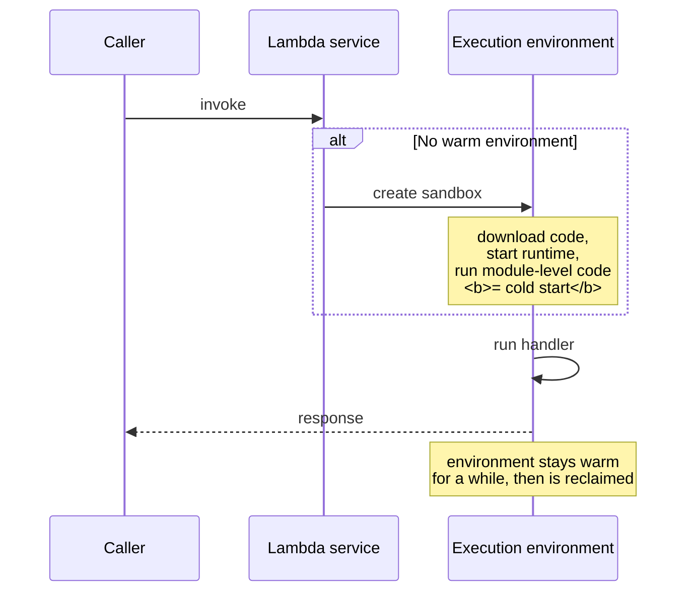

Today has more moving parts than any previous day. Take it in three passes: get a function running, put an endpoint in front of it, then give it a database. Each stage works on its own.

## Lambda

A Lambda is a function AWS runs for you. No servers to patch, no capacity to size, billed per millisecond of execution and per GB-second of memory.

```python title="lambda_function.py"
import json
import logging
import os

# Module-level code runs ONCE per execution environment, not per invocation.
# Put expensive setup — clients, connections, config parsing — here.
logger = logging.getLogger()
logger.setLevel(os.environ.get("LOG_LEVEL", "INFO"))

STAGE = os.environ.get("STAGE", "dev")


def lambda_handler(event, context):
    logger.info(json.dumps({
        "msg": "invocation_start",
        "request_id": context.aws_request_id,
        "remaining_ms": context.get_remaining_time_in_millis(),
        "stage": STAGE,
    }))

    try:
        name = (event.get("queryStringParameters") or {}).get("name", "world")
        body = {"message": f"Hello, {name}", "stage": STAGE}
        return {
            "statusCode": 200,
            "headers": {"Content-Type": "application/json"},
            "body": json.dumps(body),
        }
    except Exception:
        logger.exception("unhandled_error")
        return {
            "statusCode": 500,
            "headers": {"Content-Type": "application/json"},
            "body": json.dumps({"error": "internal_error",
                                "request_id": context.aws_request_id}),
        }
```

Three things in that handler that are not decoration:

- **Module-level setup.** Creating a `boto3` client or a database connection inside the handler pays that cost on every invocation. Outside, it is paid once per environment.
- **`context.aws_request_id` in the response.** When a customer reports an error, this is the single value that lets you find the exact invocation in the logs. Return it.
- **`logger.exception`** rather than `print`. It captures the stack trace and integrates with CloudWatch.

### Deploy it

```bash title="deploy-lambda.sh"
cat > trust.json <<'EOF'
{"Version":"2012-10-17","Statement":[{"Effect":"Allow",
 "Principal":{"Service":"lambda.amazonaws.com"},"Action":"sts:AssumeRole"}]}
EOF

aws iam create-role --role-name hello-lambda-role \
  --assume-role-policy-document file://trust.json

# Minimum viable: permission to write its own logs
aws iam attach-role-policy --role-name hello-lambda-role \
  --policy-arn arn:aws:iam::aws:policy/service-role/AWSLambdaBasicExecutionRole

zip function.zip lambda_function.py

aws lambda create-function \
  --function-name hello-support \
  --runtime python3.12 \
  --role "arn:aws:iam::$(aws sts get-caller-identity --query Account --output text):role/hello-lambda-role" \
  --handler lambda_function.lambda_handler \
  --zip-file fileb://function.zip \
  --timeout 10 \
  --memory-size 256 \
  --environment "Variables={STAGE=dev,LOG_LEVEL=INFO}"

aws lambda invoke \
  --function-name hello-support \
  --payload '{"queryStringParameters":{"name":"Ada"}}' \
  --cli-binary-format raw-in-base64-out \
  response.json && cat response.json
```

### Cold starts, timeouts, concurrency



| Symptom | Likely cause | What to do |
|---|---|---|
| First request slow, rest fast | Cold start | More memory (more CPU), smaller package, provisioned concurrency if latency is contractual |
| `Task timed out after 3.00 seconds` | Default 3 s timeout | Raise it — but find out *why* it is slow first |
| Works alone, fails under load | Account concurrency limit (1,000 default) or a downstream connection cap | Reserved concurrency, connection pooling, or RDS Proxy |
| Intermittent 502 from API Gateway | Handler returned a malformed response, or crashed | Check the response shape — API Gateway is strict |
| Duplicate side effects | Retries on async invocation | **Make the handler idempotent** |

:::hint{type=warning}
Lambda memory and CPU are coupled — allocating more memory gives you proportionally more CPU. A CPU-bound function at 1,769 MB often runs *fast enough that it costs less* than at 512 MB, despite the higher per-millisecond price. Measure before assuming smaller is cheaper.
:::

:::hint{type=danger}
Asynchronous invocations (S3 events, SNS, EventBridge) **retry twice by default** on failure. If your handler charges a card and then fails while writing the receipt, you can charge the card three times. Idempotency is not optional in serverless — use a deduplication key and check it before acting.
:::

## Putting an endpoint in front

The quickest option is a **function URL**:

```bash title="function-url.sh"
aws lambda create-function-url-config \
  --function-name hello-support \
  --auth-type NONE          # public — fine for a lab, not for production

aws lambda add-permission \
  --function-name hello-support \
  --statement-id FunctionURLAllowPublicAccess \
  --action lambda:InvokeFunctionUrl \
  --principal "*" \
  --function-url-auth-type NONE
```

**API Gateway** gives you more: custom domains, request validation, throttling, API keys, usage plans, WAF integration.

```bash title="api-gateway.sh"
API_ID=$(aws apigatewayv2 create-api \
  --name hello-support-api \
  --protocol-type HTTP \
  --target "arn:aws:lambda:eu-west-2:$(aws sts get-caller-identity --query Account --output text):function:hello-support" \
  --query ApiId --output text)

aws lambda add-permission \
  --function-name hello-support \
  --statement-id apigw-invoke \
  --action lambda:InvokeFunction \
  --principal apigateway.amazonaws.com

curl "https://$API_ID.execute-api.eu-west-2.amazonaws.com/?name=Grace"
```

:::hint{type=tip}
API Gateway's own **access logs** are separate from Lambda's logs and are off by default. Turn them on. When you are debugging a 403 or a 429, the question "did the request even reach Lambda?" is answered by the access log, and without it you are guessing.
:::

### Reading the logs

```bash title="logs.sh"
# Tail live
aws logs tail /aws/lambda/hello-support --follow

# Filter a window
aws logs filter-log-events \
  --log-group-name /aws/lambda/hello-support \
  --start-time $(( ($(date +%s) - 3600) * 1000 )) \
  --filter-pattern '"ERROR"'
```

Every invocation writes a `REPORT` line, and it is dense with useful information:

```text
REPORT RequestId: 8f3c...  Duration: 143.22 ms  Billed Duration: 144 ms
       Memory Size: 256 MB  Max Memory Used: 78 MB  Init Duration: 412.55 ms
```

- **`Init Duration` present** → this was a cold start.
- **`Max Memory Used` near `Memory Size`** → you are about to start seeing OOM kills.
- **`Max Memory Used` far below** → you are over-provisioned, though remember the CPU coupling above.

## A managed database

Two options; pick one, and know what the other is for.

:::tabs

:::tab{title="RDS for SQL Server"}
Ties directly to Week 1. Free tier covers `db.t3.micro` on SQL Server Express Edition, 20 GB, 750 hours/month for 12 months.

```bash
aws rds create-db-instance \
  --db-instance-identifier support-lab-sql \
  --db-instance-class db.t3.micro \
  --engine sqlserver-ex \
  --engine-version 15.00.4430.1.v1 \
  --master-username admin \
  --master-user-password "$(openssl rand -base64 18)" \
  --allocated-storage 20 \
  --backup-retention-period 1 \
  --no-publicly-accessible \
  --license-model license-included
```

Then connect from SSMS or Azure Data Studio using the endpoint from `describe-db-instances`. You are now querying a cloud database with the tool you learned in Week 1 — a genuinely satisfying moment.

**Watch out for:** creation takes 10–20 minutes; the security group must allow TCP 1433 from your IP; and `--no-publicly-accessible` means you need a bastion or a VPN, so for a lab you may temporarily want it public *with a tightly scoped security group*.
:::

:::tab{title="DynamoDB"}
Simpler, always-free tier, no VPC to think about, and no instance to forget about and get billed for.

```bash
aws dynamodb create-table \
  --table-name Tickets \
  --attribute-definitions \
      AttributeName=customerId,AttributeType=N \
      AttributeName=createdAt,AttributeType=S \
  --key-schema \
      AttributeName=customerId,KeyType=HASH \
      AttributeName=createdAt,KeyType=RANGE \
  --billing-mode PAY_PER_REQUEST

aws dynamodb put-item --table-name Tickets --item '{
  "customerId": {"N": "29825"},
  "createdAt":  {"S": "2026-08-06T14:22:01Z"},
  "subject":    {"S": "Payments failing"},
  "priority":   {"S": "high"}
}'

aws dynamodb query --table-name Tickets \
  --key-condition-expression "customerId = :c" \
  --expression-attribute-values '{":c":{"N":"29825"}}'
```

The mental shift: with DynamoDB you design the table around the **queries you will run**, not around normalised entities. A partition key plus a sort key gives you "all items for this customer, ordered by time" — which is exactly the access pattern a ticket system needs.
:::

:::

:::hint{type=danger}
An RDS instance runs 24/7 and consumes free-tier hours whether you use it or not. 750 hours is roughly one instance for one month — **two instances exhausts it in a fortnight.** Delete the instance when you finish the lab, and take a final snapshot if you want the data back later.
:::

### Lambda talking to a database

```python title="db_handler.py"
import json, os, logging
import boto3

logger = logging.getLogger()
logger.setLevel("INFO")

# Created once per execution environment, reused across invocations.
dynamodb = boto3.resource("dynamodb")
table = dynamodb.Table(os.environ["TABLE_NAME"])


def lambda_handler(event, context):
    params = event.get("queryStringParameters") or {}
    customer_id = params.get("customerId")

    if not customer_id or not customer_id.isdigit():
        return _response(400, {"error": "customerId must be a positive integer"})

    try:
        result = table.query(
            KeyConditionExpression=boto3.dynamodb.conditions.Key("customerId").eq(int(customer_id)),
            ScanIndexForward=False,
            Limit=25,
        )
    except Exception:
        logger.exception("query_failed", extra={"customer_id": customer_id})
        return _response(500, {"error": "internal_error",
                               "request_id": context.aws_request_id})

    logger.info(json.dumps({
        "msg": "query_ok",
        "customer_id": customer_id,
        "count": result["Count"],
        "consumed_capacity": result.get("ConsumedCapacity"),
    }))
    return _response(200, {"count": result["Count"], "items": result["Items"]})


def _response(status: int, body: dict) -> dict:
    return {
        "statusCode": status,
        "headers": {"Content-Type": "application/json"},
        "body": json.dumps(body, default=str),
    }
```

:::hint{type=warning}
**Lambda plus RDS is a known-awkward pairing.** Each concurrent execution opens its own connection, and a burst of 500 invocations will exhaust a small SQL Server's connection pool. The answers are **RDS Proxy** (which pools on your behalf), reserved concurrency to cap the fan-out, or a queue in front to smooth the load. Knowing this trade-off, and naming RDS Proxy, is a strong signal in an interview.
:::

```quiz
question: A Lambda works in testing but returns intermittent 500s under load, with database connection errors in the logs. Which fix addresses the root cause?
options:
  - Increase the Lambda timeout
  - Increase the Lambda memory allocation
  - Add RDS Proxy or set reserved concurrency to cap simultaneous connections
  - Switch the runtime to a newer Python version
answer: 2
explanation: Each concurrent Lambda opens its own database connection, so a burst exhausts the connection limit. Pooling with RDS Proxy, or capping concurrency, addresses that directly. Timeout and memory changes do not reduce the number of connections.
```

## Tear down

```bash title="teardown.sh"
aws apigatewayv2 delete-api --api-id "$API_ID"
aws lambda delete-function --function-name hello-support
aws logs delete-log-group --log-group-name /aws/lambda/hello-support
aws dynamodb delete-table --table-name Tickets
aws rds delete-db-instance --db-instance-identifier support-lab-sql --skip-final-snapshot
aws iam detach-role-policy --role-name hello-lambda-role \
  --policy-arn arn:aws:iam::aws:policy/service-role/AWSLambdaBasicExecutionRole
aws iam delete-role --role-name hello-lambda-role
```

## Exercise

:::checklist{title="Day 13 checklist"}
- [ ] Lambda deployed and invoked from the CLI
- [ ] HTTP endpoint working — function URL or API Gateway
- [ ] Read a `REPORT` line and identify the cold start by its `Init Duration`
- [ ] Deliberately set the timeout to 1 s with a `sleep(2)` and read the timeout error
- [ ] Move client creation from inside the handler to module level; compare warm durations
- [ ] Environment variables used for configuration rather than hard-coded values
- [ ] DynamoDB table **or** RDS SQL Server instance created and queried
- [ ] Lambda successfully reading from the database
- [ ] Request ID returned in every error response and located in CloudWatch Logs
- [ ] Write a paragraph in `docs/` on the Lambda + RDS connection problem and its remedies
- [ ] **Everything torn down**; costs checked in Cost Explorer
:::

:::details{summary="API Gateway returns 502 and the Lambda logs look fine"}
Almost always a **malformed response**. For a proxy integration, API Gateway requires exactly this shape:

```json
{
  "statusCode": 200,
  "headers": { "Content-Type": "application/json" },
  "body": "{\"already\":\"serialised as a string\"}",
  "isBase64Encoded": false
}
```

The trap: `body` must be a **string**, not an object. Returning a dict gives you a 502 with nothing useful in the Lambda log, because from Lambda's point of view the invocation succeeded. This is exactly the situation API Gateway access logs exist for.
:::

## Where this is going

Tomorrow is consolidation: a full Cloud Practitioner practice exam, reviewing every miss properly. Then Week 3 turns to how code gets deployed and how you find out when it breaks.
