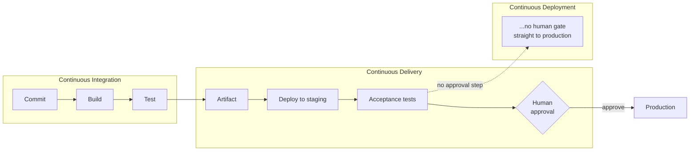
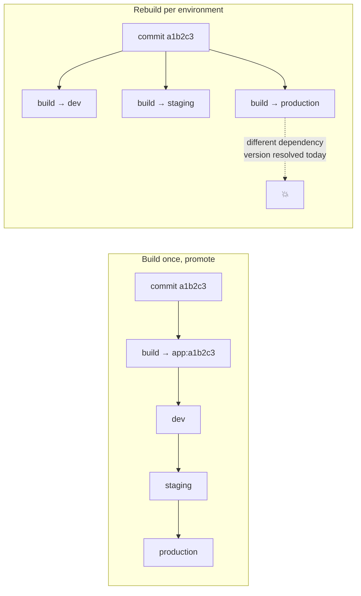
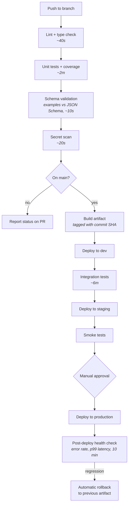

Before writing any pipeline YAML, get the vocabulary right. Half of CI/CD confusion is people using the same words for different things — and in a support role, being precise about *which* environment a change is in, and *how* it got there, is often the first half of an incident investigation.

## The three CDs



- **Continuous Integration** — everyone merges into the trunk frequently, and every merge triggers an automated build and test. The problem it solves is "integration hell": three developers working in isolation for two weeks and discovering on Friday that their changes are mutually incompatible.

- **Continuous Delivery** — every change that passes the pipeline *could* go to production right now. The artifact is built, tested, and sitting there. A human decides when to push it.

- **Continuous Deployment** — the same, minus the human. Merge to `main` and it is live in twenty minutes.

:::hint{type=tip}
Both abbreviate to "CD", which is why people talk past each other. The distinction is exactly one thing: **is there a human approval gate before production?** Delivery has one; deployment does not. Most organisations do continuous delivery and call it continuous deployment.
:::

Which is right depends on context. Continuous deployment requires high test confidence, feature flags, fast rollback, and good monitoring. A regulated environment with change-advisory-board requirements will have the approval gate whether the engineers want it or not.

## Pipeline stages

A conventional pipeline, and what each stage is *for*:

| Stage | Does | Fails when | Typical duration |
|---|---|---|---|
| **Source** | Checkout the commit | — | seconds |
| **Build** | Compile, bundle, produce the artifact | Compile errors, missing deps | 1–5 min |
| **Static analysis** | Lint, type-check, format, secret scan | Style violations, leaked credentials | < 1 min |
| **Unit tests** | Test units in isolation | Logic regressions | 1–5 min |
| **Package** | Produce the immutable artifact, tag it | Packaging errors | < 1 min |
| **Deploy → dev** | Push to a throwaway environment | Bad config, missing infra | 1–3 min |
| **Integration tests** | Test against real dependencies | Contract mismatches | 5–20 min |
| **Deploy → staging** | Production-like environment | Config drift | 1–3 min |
| **Acceptance / smoke** | End-to-end, performance, security scan | Broken user journeys | 5–30 min |
| **Approval** | Human gate (delivery only) | Someone says no | minutes to days |
| **Deploy → production** | The real thing | Anything | 1–10 min |
| **Post-deploy verification** | Health checks, key metrics, error rate | Regression | 5–15 min |

Two principles govern the ordering:

1. **Fail fast.** Cheap, fast checks first. A lint error should fail in forty seconds, not after a twenty-minute integration suite.
2. **Increasing fidelity.** Each stage runs in an environment closer to production than the last. Confidence accumulates.

:::hint{type=warning}
A pipeline slower than about ten minutes to first feedback stops being used properly. People batch changes, stop watching the results, and start merging on hope. **Pipeline speed is a feature**, and shortening it is legitimate engineering work, not tidying.
:::

## The artifact, and why "build once" matters

An **artifact** is the immutable output of the build: a `.zip`, a container image, a `.jar`, an npm tarball. It is versioned and content-addressable.

The rule that follows: **build once, promote everywhere.**



If you rebuild for each environment, you are deploying three *different* binaries. A transitive dependency that published a patch release between the staging build and the production build means the thing you tested is not the thing you shipped. This is a real failure mode, and it produces the most frustrating class of incident: "but it worked in staging."

The corollary is that **configuration must be external to the artifact.** The same image runs in dev, staging and production; only environment variables, secrets and config maps differ. If your build bakes in a connection string, you cannot promote.

```quiz
question: Why does "build once, promote the same artifact" matter more than rebuilding per environment?
options:
  - Rebuilding is slower and uses more CI minutes
  - Rebuilding can produce a different binary, so what you tested is not what you shipped
  - Container registries charge per build
  - Rebuilding invalidates the Git history
answer: 1
explanation: Speed is a real but secondary benefit. The substantive reason is determinism — a rebuild can resolve different dependency versions or pick up a changed base image, so the artifact validated in staging is not the artifact running in production.
```

## Environments and promotion

| Environment | Data | Who uses it | Deploy frequency |
|---|---|---|---|
| **Local** | Fixtures | One developer | Constantly |
| **Dev / integration** | Synthetic | The team | Every merge |
| **Staging / pre-prod** | Anonymised production-like | QA, product, support | Every release candidate |
| **Production** | Real | Customers | On approval |

Sometimes also: **UAT** (customer sign-off) and **DR** (a warm standby you fail over to).

Two things to insist on:

- **Staging must genuinely resemble production** — same topology, same instance sizes proportionally, same TLS, same auth. A staging environment that skips the load balancer will never reproduce the load balancer's bugs.
- **Never use real customer data in a lower environment.** Anonymise or synthesise. A staging database with real personal data is a data-protection incident waiting for a misconfigured security group.

## Deployment strategies

:::tabs

:::tab{title="Rolling"}
Replace instances a few at a time. Simple, no extra capacity needed.

- **Pro**: cheap, built into most orchestrators.
- **Con**: both versions serve traffic simultaneously — your database schema must be compatible with both. Rollback means another rolling deploy, so it is slow.
:::

:::tab{title="Blue/green"}
Two complete environments. Blue serves live traffic; deploy to green; test it; switch the load balancer.

- **Pro**: instant rollback — switch back. Testing happens on real infrastructure before any user sees it.
- **Con**: double the infrastructure during the deploy. Stateful services and in-flight sessions need thought.
:::

:::tab{title="Canary"}
Route 1% of traffic to the new version. Watch error rate and latency. Go to 5%, 25%, 100% — or roll back.

- **Pro**: real production traffic, tiny blast radius, automatable against metrics.
- **Con**: needs traffic-splitting infrastructure and trustworthy metrics. Both versions run at once, so the same compatibility constraint as rolling.
:::

:::tab{title="Feature flags"}
Deploy the code dark, then enable it for a cohort at runtime.

- **Pro**: deployment and release become separate events. Turning a feature off is instant and needs no deploy.
- **Con**: flags accumulate. Every flag doubles the number of code paths, and stale flags are technical debt with a security dimension.
:::

:::

:::hint{type=tip}
**Deployment and release are different events.** Deployment puts code on servers; release exposes behaviour to users. Feature flags separate them, which is what allows continuous deployment in an organisation that still wants control over when customers see something new. Making that distinction out loud in an interview is a strong signal.
:::

### Backwards-compatible database changes

Any strategy where two versions run simultaneously requires the **expand/contract** pattern:

:::steps

1. **Expand** — add the new column as nullable. Deploy. Both versions work; the old one ignores it.
2. **Migrate** — backfill data. Deploy code that writes to both old and new columns and reads from the new one.
3. **Contract** — once no running version reads the old column, drop it in a later release.

:::

Three deploys instead of one. It is the price of being able to roll back at any point, and skipping it is how a rollback turns into an outage.

## What this gives a support engineer

This is the part that makes CI/CD your business rather than only the developers'.

:::cards

:::card{title="A precise answer to 'what changed?'"}
Every deploy is a commit, a build number and a timestamp. "The error rate rose at 14:20; deploy `a1b2c3` went out at 14:18" is the single most valuable correlation in incident response.
:::

:::card{title="A rollback you can actually perform"}
If deploys are automated and artifacts are immutable, rolling back is redeploying the previous artifact — a two-minute operation you can run at 3am without waking a developer.
:::

:::card{title="An audit trail"}
Who approved it, which tests passed, which commits are included. Regulated environments require this; everyone benefits from it.
:::

:::card{title="Reproducible environments"}
When a customer reports a bug in production, you can stand up staging on the same artifact and try to reproduce it without touching live data.
:::

:::

## The DORA metrics

Worth knowing by name; they are the standard vocabulary for pipeline health.

| Metric | Question | Elite performance |
|---|---|---|
| **Deployment frequency** | How often do you ship? | On demand, multiple times a day |
| **Lead time for changes** | Commit to production? | Under an hour |
| **Change failure rate** | What share of deploys cause a problem? | 0–15% |
| **Time to restore service** | How fast do you recover? | Under an hour |

The counter-intuitive finding from the DORA research is that speed and stability **correlate positively**. Teams that deploy more often have *lower* change failure rates, because small changes are easier to reason about, test and revert. "Move fast" and "be careful" are not opposites when the changes are small.

## Exercise

No YAML today — that is tomorrow. Today is design.

:::checklist{title="Day 15 checklist"}
- [ ] Write, in `docs/pipeline-design.md`, a stage-by-stage design for a pipeline for your repo
- [ ] For each stage: what it does, what makes it fail, and roughly how long it should take
- [ ] Decide continuous delivery or continuous deployment for your project, and justify it in two sentences
- [ ] List the environments you will use and what data each holds
- [ ] Choose a deployment strategy and explain the trade-off you accepted
- [ ] Write out the expand/contract sequence for adding a `priority` column to a live table
- [ ] Define, in your own words, what your artifact will be and how it will be versioned
- [ ] List every piece of configuration that must live outside the artifact
- [ ] Sketch the pipeline as a Mermaid diagram in the same document
:::

:::details{summary="A pipeline design sketch to compare yours against"}

:::

## Where this is going

Tomorrow you build this for real in GitHub Actions: tests on every PR, deploy on merge to `main`, with the JSON Schema validation from Day 9 wired in as a gate.
