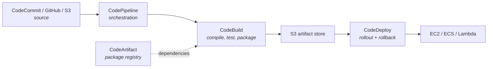

Today is mostly conceptual, and deliberately so. You are unlikely to build production pipelines in CodePipeline in a support role, but you are very likely to have to **read** one during an incident and answer "did this deploy, and if not, where did it stop?"

## The four services



| Service | Role | GitHub Actions analogue |
|---|---|---|
| **CodePipeline** | Orchestrates stages, moves artifacts | The workflow file itself |
| **CodeBuild** | Runs build commands in a container | A job on a runner |
| **CodeDeploy** | Manages the rollout strategy | Your deploy step (Actions has no equivalent) |
| **CodeArtifact** | Private package registry | GitHub Packages |
| **CodeCommit** | Managed Git hosting | GitHub itself |

:::hint{type=warning}
AWS closed CodeCommit to new customers in 2024. Existing repositories continue to work, but new projects use GitHub, GitLab or Bitbucket as the source and connect via **CodeConnections**. If you see CodeCommit in a diagram, it is an older system.
:::

## buildspec.yml

The CodeBuild equivalent of a GitHub Actions job:

```yaml title="buildspec.yml"
version: 0.2

env:
  variables:
    PYTHON_VERSION: "3.12"
    LOG_LEVEL: INFO
  parameter-store:
    # Pulled from SSM Parameter Store at build time
    SONAR_TOKEN: /support-tool/build/sonar-token
  secrets-manager:
    DB_PASSWORD: support-tool/staging:password

phases:
  install:
    runtime-versions:
      python: 3.12
    commands:
      - pip install --upgrade pip
      - pip install -r requirements.txt -r requirements-dev.txt

  pre_build:
    commands:
      - echo "Commit $CODEBUILD_RESOLVED_SOURCE_VERSION"
      - ruff check python/
      - mypy python/ --ignore-missing-imports

  build:
    commands:
      - pytest --junitxml=reports/junit.xml --cov=python --cov-report=xml
      - python python/scripts/validate_examples.py schemas/

  post_build:
    commands:
      - mkdir -p dist
      - pip install -r requirements.txt -t package/
      - cp -r python/src/* package/
      - cd package && zip -r ../dist/app.zip . && cd ..
      - echo "Build completed $(date -u +%FT%TZ)"

reports:
  pytest-reports:
    files: [reports/junit.xml]
    file-format: JUNITXML
  coverage:
    files: [coverage.xml]
    file-format: COBERTURAXML

artifacts:
  files:
    - dist/app.zip
    - appspec.yml
  discard-paths: no

cache:
  paths:
    - '/root/.cache/pip/**/*'
```

Points that matter:

- **Four fixed phase names** — `install`, `pre_build`, `build`, `post_build`. You cannot invent new ones, which is more rigid than Actions' free-form steps.
- **`parameter-store` and `secrets-manager`** — secrets are pulled at build time from AWS services rather than stored in the CI system. This is genuinely cleaner than GitHub secrets and is one of the real advantages of staying in-ecosystem.
- **`reports`** — CodeBuild parses JUnit and coverage XML and renders it in the console.
- **`artifacts`** — what gets written to the S3 artifact store for the next stage.

:::hint{type=danger}
If any command in a phase exits non-zero, the phase fails and the build stops — but `post_build` still runs, on purpose, so you can publish reports and clean up. Do not put "publish to production" in `post_build` expecting it to be skipped on failure. Check `$CODEBUILD_BUILD_SUCCEEDING` if the behaviour must be conditional.
:::

## Pipeline structure

```json title="pipeline-stages.json (abridged)"
{
  "pipeline": {
    "name": "support-tool-pipeline",
    "roleArn": "arn:aws:iam::123456789012:role/codepipeline-service-role",
    "artifactStore": { "type": "S3", "location": "codepipeline-eu-west-2-artifacts" },
    "stages": [
      {
        "name": "Source",
        "actions": [{
          "name": "GitHub",
          "actionTypeId": { "category": "Source", "owner": "AWS",
                            "provider": "CodeStarSourceConnection", "version": "1" },
          "outputArtifacts": [{ "name": "SourceOutput" }],
          "configuration": {
            "ConnectionArn": "arn:aws:codeconnections:eu-west-2:123456789012:connection/abc",
            "FullRepositoryId": "your-org/support-tool",
            "BranchName": "main"
          }
        }]
      },
      {
        "name": "Build",
        "actions": [{
          "name": "CodeBuild",
          "actionTypeId": { "category": "Build", "owner": "AWS",
                            "provider": "CodeBuild", "version": "1" },
          "inputArtifacts":  [{ "name": "SourceOutput" }],
          "outputArtifacts": [{ "name": "BuildOutput" }],
          "configuration": { "ProjectName": "support-tool-build" }
        }]
      },
      {
        "name": "DeployStaging",
        "actions": [{
          "name": "Deploy",
          "actionTypeId": { "category": "Deploy", "owner": "AWS",
                            "provider": "CodeDeploy", "version": "1" },
          "inputArtifacts": [{ "name": "BuildOutput" }],
          "configuration": { "ApplicationName": "support-tool",
                             "DeploymentGroupName": "staging" }
        }]
      },
      {
        "name": "Approve",
        "actions": [{
          "name": "ManualApproval",
          "actionTypeId": { "category": "Approval", "owner": "AWS",
                            "provider": "Manual", "version": "1" },
          "configuration": {
            "NotificationArn": "arn:aws:sns:eu-west-2:123456789012:deploy-approvals",
            "CustomData": "Approve deployment of support-tool to production"
          }
        }]
      },
      {
        "name": "DeployProduction",
        "actions": [{
          "name": "Deploy",
          "actionTypeId": { "category": "Deploy", "owner": "AWS",
                            "provider": "CodeDeploy", "version": "1" },
          "inputArtifacts": [{ "name": "BuildOutput" }],
          "configuration": { "ApplicationName": "support-tool",
                             "DeploymentGroupName": "production" }
        }]
      }
    ]
  }
}
```

Verbose compared with a GitHub Actions workflow, and that verbosity is characteristic of AWS-native tooling. In practice teams generate this with CloudFormation, CDK or Terraform rather than writing JSON by hand.

Note that `BuildOutput` flows unchanged from `Build` through both deploy stages — **build once, promote**, enforced structurally by the artifact store.

## CodeDeploy is the genuinely distinctive piece

GitHub Actions has no equivalent. CodeDeploy owns the *rollout*, and it can roll back automatically on a CloudWatch alarm.

```yaml title="appspec.yml (Lambda)"
version: 0.0
Resources:
  - SupportIngestFunction:
      Type: AWS::Lambda::Function
      Properties:
        Name: support-ingest
        Alias: live
        CurrentVersion: "12"
        TargetVersion: "13"
Hooks:
  - BeforeAllowTraffic:  ValidateNewVersionFunction
  - AfterAllowTraffic:   RunSmokeTestsFunction
```

Deployment configurations you can choose from:

| Configuration | Behaviour |
|---|---|
| `AllAtOnce` | Everything at once. Fast, maximum blast radius |
| `HalfAtATime` | 50%, then the rest |
| `OneAtATime` | Safest rolling, slowest |
| `Canary10Percent5Minutes` | 10% for five minutes, then the remaining 90% |
| `Linear10PercentEvery1Minute` | Ten equal steps |

:::hint{type=success}
The automatic-rollback-on-alarm behaviour is the strongest argument for CodeDeploy. You attach a CloudWatch alarm on error rate; if it fires during the canary window, CodeDeploy reverts to the previous version without a human being involved. That capability turns "we deployed a bug at 2am" into a five-minute blip nobody was paged for — which is precisely a support engineer's interest.
:::

## Honest comparison

| | GitHub Actions | AWS CodePipeline |
|---|---|---|
| Configuration | YAML in the repo | Console, CloudFormation, CDK or Terraform |
| Learning curve | Gentle | Steep — several services to wire together |
| Ecosystem | Enormous marketplace | Small; you write the glue |
| Runs on PRs | Native and excellent | Awkward; usually needs a separate CodeBuild trigger |
| Secrets | GitHub secrets, or OIDC to a cloud | Native Secrets Manager / Parameter Store |
| AWS permissions | OIDC federation | IAM roles directly — no federation needed |
| Deployment strategies | You implement them | CodeDeploy handles them, with auto-rollback |
| Cost | Free minutes then per-minute | Per pipeline per month plus build minutes |
| Visibility to non-developers | Requires GitHub access | AWS console, which ops teams already have |
| Air-gapped / restricted networks | Needs self-hosted runners | Runs entirely inside your VPC |

### When AWS-native genuinely wins

- **Regulated or air-gapped environments** where source and build must not leave your AWS account.
- **CodeDeploy's rollout strategies**, especially automatic rollback on alarm.
- **Organisations already fully in AWS**, where one IAM model and one bill is worth real money in operational simplicity.

### When GitHub Actions wins

- Almost everything else. Faster to write, better PR integration, a huge action ecosystem, and the configuration lives next to the code it builds.

:::hint{type=tip}
A common and sensible hybrid: **GitHub Actions for CI** (fast PR feedback, tests, lint) and **CodeDeploy for the production rollout** (canary, alarms, auto-rollback). Suggesting that split in an interview reads as pragmatic rather than dogmatic.
:::

```quiz
question: A team must keep source code, build and deployment entirely inside their AWS account for compliance reasons. Which factor most favours CodePipeline over GitHub Actions?
options:
  - CodePipeline is cheaper for small teams
  - The whole pipeline runs inside the AWS account and VPC, with no code or artifacts leaving it
  - CodePipeline has a larger marketplace of reusable steps
  - GitHub Actions cannot deploy to AWS
answer: 1
explanation: GitHub Actions can absolutely deploy to AWS, and its marketplace is far larger. The decisive factor here is the compliance boundary — CodePipeline and CodeBuild execute inside the account, whereas GitHub-hosted runners are external unless you operate self-hosted runners.
```

## The Azure equivalents

Week 4 covers Azure properly, but the mapping is worth planting now:

| AWS | Azure | GitHub |
|---|---|---|
| CodePipeline | Azure Pipelines | Actions (workflow) |
| CodeBuild | Azure Pipelines (build job) | Actions (job) |
| CodeDeploy | Azure Pipelines deployment jobs / App Service slots | — |
| CodeArtifact | Azure Artifacts | Packages |
| CodeCommit | Azure Repos | GitHub |

Azure DevOps bundles all of these into one product, which is a genuine ergonomic advantage over AWS's four-service split. And since Microsoft owns GitHub, a Microsoft-stack shop increasingly uses **GitHub Actions deploying to Azure** — worth knowing if the role is Microsoft-flavoured.

## Exercise

Mostly reading and mapping today; keep spend at zero.

:::checklist{title="Day 17 checklist"}
- [ ] Write a `buildspec.yml` for your repository that mirrors your CI workflow
- [ ] Create a CodeBuild project in the console pointing at your GitHub repo (free tier: 100 build minutes/month)
- [ ] Run one build; read the phase-by-phase log output
- [ ] Deliberately fail a `pre_build` command; observe that `post_build` still runs
- [ ] In `docs/`, produce a table mapping every GitHub Actions concept you used to its AWS equivalent
- [ ] Write two paragraphs on when you would choose each, with a concrete scenario for each
- [ ] Read the CodeDeploy deployment configuration list; write down which you would use for a payments service and why
- [ ] Explain, in writing, how auto-rollback-on-alarm changes on-call life
- [ ] **Delete the CodeBuild project** when done
:::

:::details{summary="Reading a CodePipeline during an incident"}
The question is always "did it deploy, and if not where did it stop?" Work through:

1. **Pipeline view** — which stage is red? Stages run in order, so everything after a red stage never ran.
2. **Failed action → Details** — CodeBuild links straight to its CloudWatch log group.
3. **Source stage revision** — which commit? Compare it to what you believe is live.
4. **Approval stage** — a pipeline can sit waiting for an approval nobody noticed. Check the SNS topic actually notifies a channel people read.
5. **CodeDeploy deployment** — if the deploy started and rolled back, the deployment detail shows which alarm fired and when.
6. **The artifact bucket** — timestamps confirm what was produced and when.

`aws codepipeline get-pipeline-state --name support-tool-pipeline` gives you all of that in one JSON blob, which is faster than clicking when you are on a call.
:::

## Where this is going

You can now get code deployed. Tomorrow: finding out what it did once it got there. Logging fundamentals — and the direct line back to Day 9's JSON Schema work, because a structured log line is just schema-shaped JSON.
