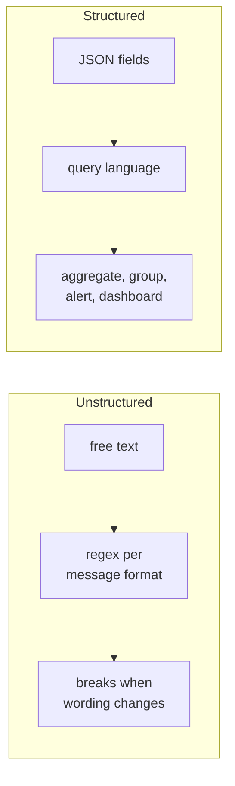

On Day 10 we noted that with PaaS you often cannot get a shell. That has a direct consequence: **logs and metrics are your only diagnostic surface.** If the information you need is not in the log, it does not exist, and you cannot go and get it after the fact.

That reframes logging. It is not developer debris. It is the deliberate instrumentation of a system for the people who will be woken up by it.

## Log levels

Five levels, and the discipline is using them consistently.

| Level | Means | Action | Production volume |
|---|---|---|---|
| `DEBUG` | Internal detail for development | None | Off |
| `INFO` | Normal, notable events — startup, request completed | None | High |
| `WARNING` | Unexpected, but handled — a retry succeeded, a fallback used | Investigate if frequent | Low |
| `ERROR` | An operation failed; a user is affected | Investigate | Should be rare |
| `CRITICAL` | The service cannot continue | Page someone | Should be ~never |

:::hint{type=warning}
The most common failure is **log-level inflation** — everything is `ERROR` because it felt important while writing it. The result is 40,000 daily `ERROR`s, nobody reads them, and the real one is invisible.

A workable test: *if this fires at 3am, should someone be woken?* If not, it is not `CRITICAL`. *Is a user's request failing?* If not, it is not `ERROR`. A retry that eventually succeeded is `WARNING`.
:::

The corollary is worth stating: **your `ERROR` count should be a metric you can alert on.** That is only true if `ERROR` means something.

## Unstructured vs structured

Unstructured:

```text
2026-08-06 14:22:01 ERROR Payment failed for customer 29825, order 88213, gateway timed out after 30012ms
```

Readable by a human. To a machine it is a string. Answering "how many gateway timeouts in the last hour, by customer?" requires a regex, and that regex breaks the moment someone rewords the message.

Structured:

```json
{"timestamp":"2026-08-06T14:22:01.334Z","level":"ERROR","service":"payments","env":"prod","message":"payment failed","error_code":"GATEWAY_TIMEOUT","customer_id":29825,"order_id":88213,"latency_ms":30012,"correlation_id":"c1f0a5e2-9b3a-4a1e-8f77-2c0f0a3d1b44","attempt":3}
```

Slightly harder to read raw. But now the question is a query:

```sql title="CloudWatch Logs Insights"
fields @timestamp, customer_id, latency_ms
| filter level = "ERROR" and error_code = "GATEWAY_TIMEOUT"
| stats count() as failures by customer_id
| sort failures desc
| limit 20
```

That is the whole argument. **Structured logs turn grep into SQL.** At ten events a day the difference does not matter; at ten million it is the difference between answering a question in thirty seconds and not being able to answer it at all.



```quiz
question: What is the primary operational reason to emit structured JSON logs rather than formatted text?
options:
  - JSON files compress better
  - Log events become queryable and aggregatable by field, instead of requiring per-format regex parsing
  - JSON is required by CloudWatch
  - Structured logs are smaller
answer: 1
explanation: Structured logs are usually slightly larger, and CloudWatch accepts any text. The decisive benefit is that fields can be filtered, grouped and aggregated directly, which makes questions answerable at scale.
```

## Structured logging in Python

The standard library can do it with a custom formatter — no dependency required, which matters on locked-down hosts.

```python title="python/src/logging_setup.py"
import json
import logging
import os
import sys
import uuid
from contextvars import ContextVar
from datetime import datetime, timezone

# Survives across async boundaries, unlike a thread-local.
correlation_id: ContextVar[str] = ContextVar("correlation_id", default="")

SERVICE = os.environ.get("SERVICE_NAME", "unknown")
ENV = os.environ.get("ENVIRONMENT", "local")

# Attributes LogRecord always carries; anything else was passed via `extra`.
_STANDARD = {
    "name", "msg", "args", "levelname", "levelno", "pathname", "filename",
    "module", "exc_info", "exc_text", "stack_info", "lineno", "funcName",
    "created", "msecs", "relativeCreated", "thread", "threadName",
    "processName", "process", "taskName", "message", "asctime",
}


class JsonFormatter(logging.Formatter):
    def format(self, record: logging.LogRecord) -> str:
        event = {
            "timestamp": datetime.fromtimestamp(record.created, timezone.utc)
                                 .isoformat(timespec="milliseconds")
                                 .replace("+00:00", "Z"),
            "level": record.levelname,
            "service": SERVICE,
            "env": ENV,
            "logger": record.name,
            "message": record.getMessage(),
        }

        cid = correlation_id.get()
        if cid:
            event["correlation_id"] = cid

        # Anything passed as extra={...} becomes a top-level field.
        for key, value in record.__dict__.items():
            if key not in _STANDARD and not key.startswith("_"):
                event[key] = value

        if record.exc_info:
            event["exception"] = {
                "type": record.exc_info[0].__name__,
                "message": str(record.exc_info[1]),
                "stack": self.formatException(record.exc_info),
            }

        return json.dumps(event, default=str)


def configure(level: str | None = None) -> None:
    handler = logging.StreamHandler(sys.stdout)
    handler.setFormatter(JsonFormatter())
    root = logging.getLogger()
    root.handlers.clear()
    root.addHandler(handler)
    root.setLevel(level or os.environ.get("LOG_LEVEL", "INFO"))


def new_correlation_id() -> str:
    cid = str(uuid.uuid4())
    correlation_id.set(cid)
    return cid
```

Using it:

```python title="python/src/handler.py"
import logging
from logging_setup import configure, new_correlation_id

configure()
log = logging.getLogger(__name__)


def process_payment(customer_id: int, order_id: int, amount_pence: int) -> dict:
    cid = new_correlation_id()
    log.info("payment_started", extra={
        "customer_id": customer_id,
        "order_id": order_id,
        "amount_pence": amount_pence,
    })

    try:
        result = call_gateway(customer_id, amount_pence)
    except GatewayTimeout as exc:
        log.error("payment_failed", extra={
            "customer_id": customer_id,
            "order_id": order_id,
            "error_code": "GATEWAY_TIMEOUT",
            "latency_ms": exc.elapsed_ms,
            "attempt": exc.attempt,
        })
        raise

    log.info("payment_succeeded", extra={
        "customer_id": customer_id,
        "order_id": order_id,
        "gateway_reference": result.reference,
        "latency_ms": result.elapsed_ms,
    })
    return result
```

Four conventions in there worth adopting:

1. **The message is a stable event name**, not a sentence. `payment_failed`, not `"Payment failed for customer 29825"`. Values go in fields, so you can `filter message = "payment_failed"` and it keeps working forever.
2. **Log both sides.** `payment_started` and `payment_succeeded` lets you compute a duration and, crucially, detect the case where a request started and *neither* completion appeared.
3. **Correlation ID everywhere.** One value ties every line of one request together.
4. **`extra={}`, not string formatting.** The whole point is fields.

:::hint{type=tip}
Take the correlation ID from an inbound header (`X-Correlation-Id` or W3C `traceparent`) if present, and pass it downstream on every outbound call. That is how one identifier follows a request across five services — and it is the cheapest possible step toward distributed tracing, which is tomorrow's topic.
:::

## Log events have a schema

Here is the connection to Day 9, and it is not an analogy — it is literally the same mechanism.

```json title="schemas/log-event.schema.json"
{
  "$schema": "https://json-schema.org/draft/2020-12/schema",
  "$id": "https://example.com/schemas/log-event.schema.json",
  "title": "LogEvent",
  "type": "object",
  "required": ["timestamp", "level", "service", "env", "message"],
  "properties": {
    "timestamp":      { "type": "string", "format": "date-time" },
    "level":          { "enum": ["DEBUG", "INFO", "WARNING", "ERROR", "CRITICAL"] },
    "service":        { "type": "string" },
    "env":            { "enum": ["local", "dev", "staging", "prod"] },
    "message":        { "type": "string", "pattern": "^[a-z][a-z0-9_]*$" },
    "correlation_id": { "type": "string", "format": "uuid" },
    "customer_id":    { "type": "integer", "minimum": 1 },
    "error_code":     { "type": "string", "pattern": "^[A-Z][A-Z0-9_]*$" },
    "latency_ms":     { "type": "number", "minimum": 0 }
  }
}
```

Note the `pattern` on `message`: it *enforces* the snake_case event-name convention. A developer who logs `"Payment failed!"` fails the schema test.

:::hint{type=success}
Add a test that captures your service's log output and validates every event against this schema. It runs in CI, costs nothing, and it prevents the slow drift that otherwise breaks your dashboards six months later. This is the single most under-used idea in this lesson.

```python
def test_all_log_events_match_schema(caplog):
    with caplog.at_level(logging.INFO):
        process_payment(customer_id=1, order_id=2, amount_pence=100)
    for record in caplog.records:
        event = json.loads(JsonFormatter().format(record))
        assert validate(VALIDATOR, event) == []
```
:::

## What to log, and what never to

### Log

- Service start and stop, with version and configuration summary
- Every inbound request: method, path, status, duration, correlation ID
- Every outbound call: target, status, duration, retry count
- Every state change: what changed, from what, to what, by whom
- Every error: code, context, and enough to reproduce
- Authorisation decisions, especially denials

### Never log

:::hint{type=danger}
- Passwords, tokens, API keys, session cookies, connection strings
- Full payment card numbers (PAN), CVV — this is a PCI-DSS violation
- National insurance / social security numbers, health data
- Full request bodies from an authentication endpoint
- Personal data beyond what you can justify, given your retention period

Logs are copied to aggregators, backed up, and often retained for years with looser access controls than your database. **A secret in a log is a secret in a dozen places you have forgotten about**, and rotating it means finding all of them.
:::

Redact structurally rather than hoping:

```python title="redact.py"
SENSITIVE = {"password", "token", "secret", "authorization", "api_key",
             "card_number", "cvv", "ssn"}

def redact(payload: dict) -> dict:
    out = {}
    for key, value in payload.items():
        if key.lower() in SENSITIVE:
            out[key] = "***REDACTED***"
        elif isinstance(value, dict):
            out[key] = redact(value)
        elif key.lower() == "email" and isinstance(value, str) and "@" in value:
            local, _, domain = value.partition("@")
            out[key] = f"{local[:2]}***@{domain}"
        else:
            out[key] = value
    return out
```

## Volume, cost and retention

Logs cost money — ingestion, storage and query. A chatty service can produce a five-figure annual bill on its own.

| Lever | Effect |
|---|---|
| Level filtering | `DEBUG` off in production. Usually the biggest single win |
| Sampling | Keep 100% of errors, 1–10% of successful requests |
| Retention tiers | 7 days hot and queryable, then S3/Glacier for compliance |
| Field discipline | Do not log the whole request body "just in case" |
| Aggregation | Emit one summary line per batch, not one per item |

:::hint{type=warning}
**Never sample errors.** Sampling successful requests to 1% is fine — they are interchangeable. Sampling errors means the one occurrence of the bug you are chasing may simply not have been recorded, and you will spend a day concluding the problem is intermittent when it is not.
:::

Retention is also a legal question. Under GDPR, logs containing personal data are subject to data-minimisation and storage-limitation principles. "We keep everything for seven years" is not a neutral default.

## Exercise

:::checklist{title="Day 18 checklist"}
- [ ] Implement `JsonFormatter` in your repo; do not copy it wholesale, type it out
- [ ] Convert an existing script to structured logging with `extra={}` fields
- [ ] Add a correlation ID using `ContextVar`; verify it appears on every line of one operation
- [ ] Log both sides of an operation and compute the duration from the two events
- [ ] Write `schemas/log-event.schema.json` with the snake_case `message` pattern
- [ ] Write the CI test that validates emitted events against that schema
- [ ] Implement `redact()` and test it against a payload containing a password and an email
- [ ] Write a "logging standards" page in `docs/` — levels, required fields, banned fields
- [ ] Deliberately log at the wrong level, then write down how you would notice in production
- [ ] Estimate your service's daily log volume in MB and what that would cost in CloudWatch
:::

:::details{summary="A logging standard worth adopting verbatim"}
**Every event must include:** `timestamp` (ISO 8601 UTC, ms precision), `level`, `service`, `env`, `message` (snake_case event name), and `correlation_id` when handling a request.

**Every error event must additionally include:** `error_code` (SCREAMING_SNAKE_CASE, from a documented enum) and enough context to reproduce.

**Message names are stable identifiers.** Changing one is a breaking change to every dashboard and alert built on it. Treat it like renaming a database column.

**Never log:** credentials of any kind, payment card data, health data, or personal data beyond an internal identifier.

**Levels:** `ERROR` means a user-visible operation failed. `WARNING` means something unexpected was handled. If it does not meet those bars, it is `INFO`.
:::

## Where this is going

Tomorrow: shipping these logs somewhere useful. CloudWatch Logs, metrics and alarms on a real deployed service — turning the events you now emit into something that wakes the right person at the right time.
