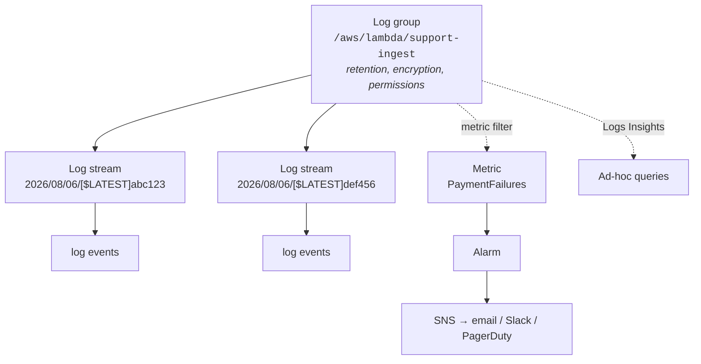

Yesterday you made your service emit good events. Today those events go somewhere they can be queried, counted and alerted on.

Redeploy your Day 13 Lambda with the structured logger from Day 18 before starting — you need real data to query.

## The CloudWatch hierarchy



:::hint{type=danger}
**Log groups default to "Never expire."** That is a silently accumulating bill. Set retention on every log group you create — 7 or 14 days for lab work, 30–90 for production, with anything needing longer exported to S3 where storage is an order of magnitude cheaper.

```bash
aws logs put-retention-policy \
  --log-group-name /aws/lambda/support-ingest --retention-in-days 14
```

Audit your account: `aws logs describe-log-groups --query 'logGroups[?!retentionInDays].logGroupName'` lists every group with no retention set.
:::

## Logs Insights

This is where yesterday's discipline pays off. Insights parses JSON log events into fields automatically.

```sql title="errors-by-code.sql"
fields @timestamp, error_code, customer_id, latency_ms
| filter level = "ERROR"
| stats count() as failures by error_code
| sort failures desc
```

```sql title="one-request-end-to-end.sql"
fields @timestamp, message, level, latency_ms
| filter correlation_id = "c1f0a5e2-9b3a-4a1e-8f77-2c0f0a3d1b44"
| sort @timestamp asc
```

That second query is the single most useful thing in this lesson. A customer gives you a request ID from an error page; you get every log line from every step of that request, in order. That is why Day 18 insisted on correlation IDs.

```sql title="latency-percentiles.sql"
fields latency_ms
| filter message = "payment_succeeded"
| stats count() as n,
        avg(latency_ms)  as mean,
        pct(latency_ms, 50) as p50,
        pct(latency_ms, 95) as p95,
        pct(latency_ms, 99) as p99
        by bin(5m)
```

:::hint{type=warning}
Alert on **p95 or p99, never the mean.** A service where the mean is 120 ms and p99 is 14 seconds is failing badly for one request in a hundred, and the mean will never tell you. If a customer is complaining while your dashboard looks fine, you are almost certainly looking at an average.
:::

```sql title="blast-radius.sql"
fields @timestamp, customer_id
| filter level = "ERROR" and error_code = "GATEWAY_TIMEOUT"
| stats count_distinct(customer_id) as affected_customers,
        count()                     as total_failures
        by bin(15m)
| sort @timestamp desc
```

Day 3's third query, in a different query language. The instinct is the same: **always check how many customers, not just how many events.**

```sql title="find-the-slowest.sql"
fields @timestamp, correlation_id, customer_id, latency_ms
| filter ispresent(latency_ms) and latency_ms > 5000
| sort latency_ms desc
| limit 20
```

```sql title="cold-starts.sql"
filter @type = "REPORT"
| stats count() as invocations,
        count(@initDuration) as cold_starts,
        100.0 * count(@initDuration) / count() as cold_start_pct,
        avg(@initDuration) as avg_init_ms,
        max(@maxMemoryUsed) as peak_memory_mb
        by bin(1h)
```

Insights understands Lambda's `REPORT` lines natively, which makes cold-start and memory analysis a one-query job.

:::hint{type=tip}
Save queries you use more than once (there is a Save button). Build a small library — "one request", "errors by code", "latency percentiles", "blast radius". During an incident you want to *run* a query, not *write* one.
:::

## From logs to metrics

Logs are events; metrics are numbers over time. Metrics are cheap to store, fast to query and can be alarmed on. Two ways to get from one to the other.

### Metric filters

```bash title="metric-filter.sh"
aws logs put-metric-filter \
  --log-group-name /aws/lambda/support-ingest \
  --filter-name payment-failures \
  --filter-pattern '{ $.level = "ERROR" && $.error_code = "GATEWAY_TIMEOUT" }' \
  --metric-transformations \
      metricName=GatewayTimeouts,metricNamespace=SupportTool,metricValue=1,defaultValue=0
```

`defaultValue=0` matters. Without it, the metric has *no data points* when nothing is failing, and an alarm on missing data behaves differently from an alarm on zero — a subtlety that causes alarms to sit in `INSUFFICIENT_DATA` forever.

### Embedded Metric Format

EMF is better: one log line produces both the log event and the metric, with no filter to maintain.

```python title="emf.py"
import json, sys, time

def emit_metric(name: str, value: float, unit: str = "Count", **dimensions) -> None:
    """Write an EMF log line. CloudWatch extracts the metric automatically."""
    payload = {
        "_aws": {
            "Timestamp": int(time.time() * 1000),
            "CloudWatchMetrics": [{
                "Namespace": "SupportTool",
                "Dimensions": [list(dimensions.keys())] if dimensions else [[]],
                "Metrics": [{"Name": name, "Unit": unit}],
            }],
        },
        name: value,
        **dimensions,
    }
    sys.stdout.write(json.dumps(payload) + "\n")


emit_metric("TicketsIngested", 42, "Count", Environment="prod", Source="api")
emit_metric("IngestLatency", 137.4, "Milliseconds", Environment="prod")
```

:::hint{type=danger}
**Dimensions multiply.** Every unique combination of dimension values is a separate metric, and CloudWatch bills per metric per month. Adding `customer_id` as a dimension with 50,000 customers creates 50,000 metrics and a very memorable invoice.

High-cardinality identifiers belong in **log fields**, which are cheap and queryable. Low-cardinality categories — environment, region, status class — belong in **dimensions**. Getting this wrong is one of the most expensive mistakes available in CloudWatch.
:::

## Alarms

```bash title="alarm.sh"
aws cloudwatch put-metric-alarm \
  --alarm-name support-ingest-error-rate \
  --alarm-description "Ingest error rate above 5% for 10 minutes" \
  --namespace AWS/Lambda \
  --metric-name Errors \
  --dimensions Name=FunctionName,Value=support-ingest \
  --statistic Sum \
  --period 300 \
  --evaluation-periods 2 \
  --datapoints-to-alarm 2 \
  --threshold 5 \
  --comparison-operator GreaterThanThreshold \
  --treat-missing-data notBreaching \
  --alarm-actions arn:aws:sns:eu-west-2:123456789012:support-alerts \
  --ok-actions       arn:aws:sns:eu-west-2:123456789012:support-alerts
```

Every parameter there is a decision:

| Parameter | Decision |
|---|---|
| `period` | Resolution. 60 s is responsive but noisy; 300 s is calmer |
| `evaluation-periods` × `datapoints-to-alarm` | How much sustained badness before firing. `2 of 2` avoids single-spike noise |
| `treat-missing-data` | `notBreaching` for error counts, `breaching` for heartbeats |
| `ok-actions` | **Set these.** An alarm that never tells you it recovered leaves people checking manually |

### An error *rate* alarm

Absolute error counts are misleading — five errors out of ten is a disaster, five out of a million is background. Use a metric maths expression:

```bash title="rate-alarm.sh"
aws cloudwatch put-metric-alarm \
  --alarm-name support-ingest-error-rate-pct \
  --metrics '[
    {"Id":"errors","MetricStat":{"Metric":{"Namespace":"AWS/Lambda","MetricName":"Errors",
      "Dimensions":[{"Name":"FunctionName","Value":"support-ingest"}]},
      "Period":300,"Stat":"Sum"},"ReturnData":false},
    {"Id":"invocations","MetricStat":{"Metric":{"Namespace":"AWS/Lambda","MetricName":"Invocations",
      "Dimensions":[{"Name":"FunctionName","Value":"support-ingest"}]},
      "Period":300,"Stat":"Sum"},"ReturnData":false},
    {"Id":"rate","Expression":"100*(errors/invocations)","Label":"Error rate %","ReturnData":true}
  ]' \
  --threshold 5 --comparison-operator GreaterThanThreshold \
  --evaluation-periods 2 --datapoints-to-alarm 2 \
  --alarm-actions arn:aws:sns:eu-west-2:123456789012:support-alerts
```

### What to alarm on

The **four golden signals** (from Google's SRE practice) are the standard starting set:

| Signal | Metric | Typical threshold |
|---|---|---|
| **Latency** | p99 duration | Above your SLO for 10 minutes |
| **Traffic** | Requests per minute | Sudden drop is often worse news than a spike |
| **Errors** | Error rate % | Above 1–5% sustained |
| **Saturation** | Memory, connections, queue depth, concurrency | Above 80% |

Plus, for serverless specifically: **throttles**, **dead-letter queue depth**, and **iterator age** for stream consumers.

:::hint{type=success}
A **drop in traffic** is one of the most under-configured alarms and one of the most valuable. If requests per minute fall to zero, something upstream is broken and no error will ever be logged — because nothing is arriving to fail. Error-rate alarms are structurally blind to this.
:::

:::hint{type=warning}
**Every alarm must have a documented action.** If the answer to "what do I do when this fires?" is "have a look", it should be a dashboard, not an alarm. Alarms that fire without a required action train people to ignore alarms, and then the important one arrives and is dismissed with the rest.
:::

Composite alarms reduce noise by expressing the real condition:

```bash
aws cloudwatch put-composite-alarm \
  --alarm-name support-ingest-degraded \
  --alarm-rule "ALARM(support-ingest-error-rate-pct) OR (ALARM(support-ingest-p99-latency) AND ALARM(support-ingest-throttles))"
```

## Dashboards

One dashboard per service, answering one question: **is this healthy right now?**

- Top row: the four golden signals as time series
- Second row: business metrics — tickets ingested, payments processed
- Third row: dependencies — database connections, downstream latency
- Bottom: a Logs Insights widget showing the last twenty errors

:::hint{type=tip}
Put the **deployment markers** on your dashboards — CloudWatch supports vertical annotations. Seeing "error rate rose at 14:20" next to "deploy at 14:18" is the fastest correlation in incident response, and it removes an entire round of "did anything change?"
:::

```quiz
question: Your Lambda error-rate alarm has been quiet for six hours, but customers report the service is down. What monitoring gap most likely explains this?
options:
  - The alarm period is too short
  - No alarm on a drop in traffic — if requests never arrive, no errors are recorded
  - CloudWatch Logs retention is too low
  - The metric filter is missing defaultValue=0
answer: 1
explanation: An error-rate alarm can only fire when requests are being processed. If an upstream component stopped sending traffic, invocations fall to zero, errors stay at zero, and the alarm stays green while the service is effectively down. A low-traffic alarm catches this.
```

## Exercise

:::checklist{title="Day 19 checklist"}
- [ ] Redeploy your Lambda using the structured logger from Day 18
- [ ] Generate traffic, including deliberate failures
- [ ] Set retention on every log group in your account
- [ ] Write and save five Logs Insights queries: errors by code, one request end to end, latency percentiles, blast radius, cold starts
- [ ] Create a metric filter with `defaultValue=0`
- [ ] Emit a custom metric using EMF and confirm it appears in the console
- [ ] Create an error-*rate* alarm using a metric maths expression
- [ ] Create a **low-traffic** alarm and prove it fires by stopping traffic
- [ ] Wire alarms to an SNS topic and subscribe your email; confirm you receive both ALARM and OK
- [ ] Build a dashboard with the four golden signals plus an errors widget
- [ ] Write, for each alarm, one sentence: what you would do when it fires
- [ ] **Delete alarms and the SNS topic** when finished
:::

:::details{summary="An incident walkthrough using only these tools"}
Customer reports: *"Ticket submissions have been failing since about 2pm."*

1. **Dashboard** — error rate jumped at 14:18. Traffic normal, so it is not upstream.
2. **Deployment annotation** — a deploy landed at 14:16. Strong suspect, not yet proof.
3. **Insights, errors by code** — 94% are `SCHEMA_VALIDATION_FAILED`. Not infrastructure.
4. **Insights, blast radius** — 3 distinct customers, 1,200 failures. Concentrated, not systemic.
5. **Insights, one request** — filter by a correlation ID from the errors; the failing field is `/priority`, value `"critical"`.
6. **Diagnosis** — the 14:16 deploy tightened the `priority` enum. Three customers were sending a value that used to be silently accepted.
7. **Response** — roll back (two minutes, previous artifact), then contact the three customers with the exact field and accepted values.

Total elapsed: under ten minutes, no source code read, no developer woken. Every step used something built in the last two days.
:::

## Where this is going

Tomorrow, the other two pillars: metrics and traces as first-class things rather than log by-products — and a look at Azure Monitor and Application Insights, which is what you will actually use on a Microsoft stack.
