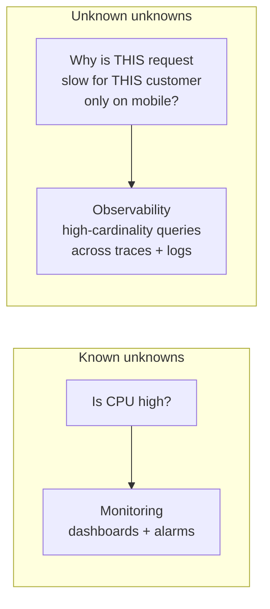
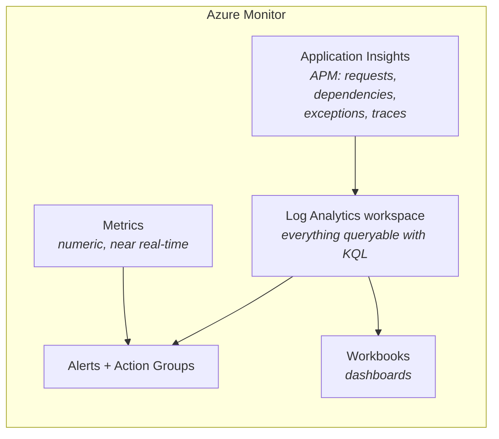

Yesterday's alarms tell you *that* something is wrong. Today is about answering *why* — including the questions nobody thought to build a dashboard for.

## Monitoring vs observability

The distinction is not marketing, though it is marketed heavily.

**Monitoring** answers questions you decided to ask in advance. You chose the metrics, set the thresholds, built the dashboards. It catches known failure modes, and it catches them well.

**Observability** is the property of being able to answer questions you did *not* anticipate, from the data the system already emits. "Why are requests from customers on the new pricing tier, in eu-west-2, using the mobile client, slow only on Tuesdays?" — nobody built that dashboard.



The practical test: **can you answer a new question without deploying new code?** If investigating requires adding a log line and waiting for a release, you have monitoring but not observability.

## The three pillars

| | Logs | Metrics | Traces |
|---|---|---|---|
| Shape | Discrete events with context | Numbers over time | Causally linked spans |
| Cardinality | High — cheap | Low — expensive | High — cheap |
| Best for | *What exactly happened?* | *Is it healthy? Alert me* | *Where did the time go?* |
| Cost model | Per GB ingested | Per metric per month | Per span, usually sampled |
| Retention | Days to weeks | Months to years | Days |
| Weakness | Expensive to aggregate | No detail | Sampling means gaps |

They are complements, not alternatives. The standard investigation path uses all three:

:::steps

1. **A metric alarms.** p99 latency crossed the SLO.
2. **A dashboard localises it.** Only the checkout endpoint, only in eu-west-2.
3. **Traces show where the time goes.** 4.2 s of a 4.6 s request is one downstream call.
4. **Logs explain why.** That service is logging connection-pool exhaustion.

:::

Each pillar narrows the search. Trying to do step 3 with logs alone is possible and slow; doing step 4 with traces alone is usually impossible.

## Distributed tracing

In a monolith, a stack trace tells you where time went. Across seven services, it does not — you need spans stitched together.

```mermaid
gantt
    title Trace 4bf92f — POST /checkout — 4,612 ms
    dateFormat X
    axisFormat %L ms
    section api-gateway
    HTTP POST /checkout        :0, 4612
    section checkout-svc
    validate cart              :12, 40
    call pricing-svc           :55, 180
    call payments-svc          :240, 4310
    write order                :4560, 45
    section payments-svc
    acquire db connection      :250, 4180
    execute charge             :4432, 110
```

Read that and the answer is immediate: 4.18 seconds waiting to *acquire a database connection* in `payments-svc`. Not the charge itself, not the network — connection pool exhaustion. No amount of staring at logs gets you there as fast.

### How spans join up

Each service passes trace context on every outbound call. The W3C standard header:

```text
traceparent: 00-4bf92f3577b34da6a3ce929d0e0e4736-00f067aa0ba902b7-01
             ▲  ▲                                ▲                ▲
             │  │                                │                └ flags (01 = sampled)
             │  │                                └ parent span id
             │  └ trace id (same for the whole request)
             └ version
```

:::hint{type=warning}
Tracing breaks the moment **one** service in the chain fails to propagate the header. You get two disconnected traces and no way to relate them. This is the most common reason tracing is installed and useless — and it is usually one legacy service, or one HTTP client that was configured by hand.
:::

### Instrumenting with OpenTelemetry

```python title="tracing_setup.py"
from opentelemetry import trace
from opentelemetry.sdk.trace import TracerProvider
from opentelemetry.sdk.trace.export import BatchSpanProcessor
from opentelemetry.sdk.resources import Resource
from opentelemetry.exporter.otlp.proto.http.trace_exporter import OTLPSpanExporter
from opentelemetry.instrumentation.requests import RequestsInstrumentor

resource = Resource.create({
    "service.name": "payments-svc",
    "service.version": "1.4.2",
    "deployment.environment": "prod",
})

provider = TracerProvider(resource=resource)
provider.add_span_processor(BatchSpanProcessor(OTLPSpanExporter()))
trace.set_tracer_provider(provider)

# Auto-instrument outbound HTTP: spans created and traceparent injected for free
RequestsInstrumentor().instrument()

tracer = trace.get_tracer(__name__)
```

```python title="manual_span.py"
def charge_customer(customer_id: int, amount_pence: int) -> str:
    with tracer.start_as_current_span("charge_customer") as span:
        span.set_attribute("customer.id", customer_id)
        span.set_attribute("payment.amount_pence", amount_pence)
        span.set_attribute("payment.currency", "GBP")

        try:
            with tracer.start_as_current_span("acquire_db_connection"):
                conn = pool.acquire(timeout=5)

            with tracer.start_as_current_span("execute_charge") as charge_span:
                reference = gateway.charge(conn, customer_id, amount_pence)
                charge_span.set_attribute("gateway.reference", reference)

            span.set_status(trace.Status(trace.StatusCode.OK))
            return reference

        except Exception as exc:
            span.set_status(trace.Status(trace.StatusCode.ERROR, str(exc)))
            span.record_exception(exc)
            raise
```

:::hint{type=success}
**OpenTelemetry is vendor-neutral, and that is the point.** Instrument once with OTel and you can export to CloudWatch, Application Insights, Jaeger, Datadog, Honeycomb or Grafana Tempo by changing configuration — not code. Before OTel, changing observability vendor meant re-instrumenting every service. This is the single most consequential thing to know about modern observability.
:::

Attach the trace ID to your log events and the pillars connect:

```python
span_context = trace.get_current_span().get_span_context()
log.info("payment_started", extra={
    "trace_id": format(span_context.trace_id, "032x"),
    "span_id":  format(span_context.span_id, "016x"),
    "customer_id": customer_id,
})
```

Now a slow trace links directly to its logs, and a log line links back to its trace.

### Sampling

Tracing every request at scale is unaffordable.

| Strategy | How | Trade-off |
|---|---|---|
| **Head-based** | Decide at the first service, e.g. keep 1% | Simple, but you might discard the slow one |
| **Tail-based** | Buffer the whole trace, decide after | Keeps every error and slow request; needs a collector holding state |
| **Rate-limited** | N traces per second per service | Predictable cost, bias toward low-traffic paths |

Tail-based sampling is what you want if you can afford the collector: keep 100% of errors and anything over the latency threshold, 1% of the boring successes.

```quiz
question: A request spanning five services takes 4.6 seconds. Logs from each service show nothing unusual. What does distributed tracing add?
options:
  - More detailed error messages
  - The time attribution across services and operations, showing exactly which span consumed the 4.2 seconds
  - Automatic alerting on slow requests
  - Longer log retention
answer: 1
explanation: Each service individually looks fine because none is aware of the whole. A trace shows the causal timeline, making it immediately visible which operation in which service consumed the time.
```

## Azure Monitor and Application Insights

A first proper look, because on a Microsoft-stack team this is what you will use daily. Day 25 goes deeper.



**Application Insights** is the piece with no direct AWS equivalent. It is a full APM product: install the SDK (or enable codeless attach) and you get, without writing instrumentation:

- **Request telemetry** — every inbound request with duration and result code
- **Dependency telemetry** — every outbound SQL query, HTTP call and queue operation, timed
- **Exception telemetry** — with stack traces, grouped by type
- **Application Map** — an auto-generated topology diagram with error rates on the edges
- **End-to-end transaction view** — a waterfall per request, which is distributed tracing by another name
- **Live Metrics** — a one-second-resolution real-time feed, genuinely useful during a deploy

:::hint{type=success}
**Dependency telemetry is the killer feature for support work.** Every SQL statement your app runs, with duration, automatically. When someone says "the app is slow", Application Insights will often show you the exact query — which connects straight back to Week 1's execution plans. That loop, from "app is slow" to "this specific T-SQL is doing a table scan", is a genuinely valuable thing to be able to do.
:::

A first KQL query — Day 25 does this properly:

```kusto title="failed-dependencies.kql"
dependencies
| where timestamp > ago(1h)
| where success == false
| summarize failures = count(),
            p95 = percentile(duration, 95)
          by target, type, resultCode
| order by failures desc
```

### The mapping

| Concern | AWS | Azure |
|---|---|---|
| Logs | CloudWatch Logs | Azure Monitor Logs (Log Analytics) |
| Log query language | Logs Insights | **KQL** (Kusto Query Language) |
| Metrics | CloudWatch Metrics | Azure Monitor Metrics |
| Alarms | CloudWatch Alarms | Azure Monitor Alerts |
| Notification target | SNS topic | Action Group |
| Dashboards | CloudWatch Dashboards | Workbooks / Azure Dashboards |
| Tracing | X-Ray | Application Insights |
| APM | *(no direct equivalent)* | **Application Insights** |
| Audit log | CloudTrail | Azure Activity Log |
| Config compliance | AWS Config | Azure Policy |

:::hint{type=tip}
KQL is genuinely pleasant — pipeline-based, readable, and far more capable than Logs Insights. It is also used by Microsoft Sentinel, Azure Data Explorer and Microsoft 365 Defender, so learning it pays off across the Microsoft estate. Treat it as a transferable skill, not an Azure Monitor feature.
:::

## SLIs, SLOs and error budgets

The vocabulary that makes alert thresholds defensible rather than arbitrary.

- **SLI** (Service Level *Indicator*) — a measurement. "Proportion of requests served in under 300 ms."
- **SLO** (Service Level *Objective*) — your internal target. "99.5% of requests under 300 ms, measured over 30 days."
- **SLA** (Service Level *Agreement*) — a contractual promise, usually with money attached. Always looser than the SLO.
- **Error budget** — `100% − SLO`. At 99.5%, you may fail 0.5% of requests: about 3.6 hours of downtime in 30 days.

The error budget is the useful idea. It converts "should we ship this risky change?" from an argument into arithmetic: budget remaining, ship; budget spent, freeze and fix reliability.

:::hint{type=warning}
Alert on **error budget burn rate**, not raw thresholds. "We are consuming the monthly budget 14× faster than sustainable" is actionable and roughly noise-free. "Error rate is above 1%" fires during every deploy and gets muted within a fortnight.
:::

## Exercise

:::checklist{title="Day 20 checklist"}
- [ ] Write a page in `docs/` distinguishing monitoring from observability, with an example of a question each can and cannot answer
- [ ] Instrument a two-service local app with OpenTelemetry (a Flask app calling another Flask app is enough)
- [ ] Export traces to a local Jaeger container (`docker run -p 16686:16686 -p 4318:4318 jaegertracing/all-in-one`)
- [ ] View a trace waterfall and identify the slowest span
- [ ] Deliberately break propagation in one service; observe the trace split in two
- [ ] Add `trace_id` and `span_id` to your structured log events
- [ ] Create an Azure account if you have not (needed for Week 4 anyway)
- [ ] Create an Application Insights resource and connect a small app
- [ ] Explore Application Map, Live Metrics and the end-to-end transaction view
- [ ] Run the failed-dependencies KQL query
- [ ] Write an SLI, SLO and error budget for your Week 5 project
- [ ] Produce the AWS ↔ Azure observability mapping table from memory, then check it
:::

:::details{summary="Minimal two-service tracing lab"}
```python
# service_a.py — run on :5000
from flask import Flask
import requests
from opentelemetry.instrumentation.flask import FlaskInstrumentor
from opentelemetry.instrumentation.requests import RequestsInstrumentor
from tracing_setup import tracer            # from earlier in this lesson

app = Flask(__name__)
FlaskInstrumentor().instrument_app(app)
RequestsInstrumentor().instrument()

@app.get("/checkout")
def checkout():
    with tracer.start_as_current_span("validate_cart"):
        pass
    return requests.get("http://localhost:5001/charge", timeout=10).json()
```

```python
# service_b.py — run on :5001
import time, random
from flask import Flask, jsonify
from opentelemetry.instrumentation.flask import FlaskInstrumentor
from tracing_setup import tracer

app = Flask(__name__)
FlaskInstrumentor().instrument_app(app)

@app.get("/charge")
def charge():
    with tracer.start_as_current_span("acquire_db_connection"):
        time.sleep(random.uniform(0.5, 4.0))     # the artificial bottleneck
    with tracer.start_as_current_span("execute_charge"):
        time.sleep(0.1)
    return jsonify(status="ok")
```

Set `OTEL_EXPORTER_OTLP_ENDPOINT=http://localhost:4318` and hit `/checkout` a few times. Open Jaeger at `http://localhost:16686`. You will see, unmistakably, that `acquire_db_connection` is the problem — which is the entire lesson in one screenshot.
:::

## Where this is going

Tomorrow closes the chapter: put real logging, metrics and at least one alarm on your deployed project, then write an incident-response note — what you would check first if this broke at 2am. That document is directly relevant to any on-call rotation, and it makes an excellent interview artefact.
