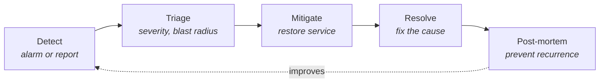

Everything from this chapter converges today. You will instrument your service properly, then write the document that makes the instrumentation useful to someone who is not you, at an hour when nobody is at their best.

## Part 1 — Instrument the service

Take the Lambda from Day 13 and make it production-shaped.

:::steps

1. **Structured logging** — the `JsonFormatter` from Day 18, with `service`, `env`, `correlation_id` and snake_case event names on every line.

2. **Business metrics via EMF** — not just infrastructure metrics. Emit:
   - `TicketsIngested` (Count)
   - `TicketsRejected` (Count, dimensioned by `Reason`)
   - `IngestLatency` (Milliseconds)
   - `SchemaValidationFailures` (Count)

3. **Log retention** — 14 days on every log group.

4. **Four alarms**, each with a documented action:

   | Alarm | Condition | Action when it fires |
   |---|---|---|
   | `ingest-error-rate` | > 5% over 10 min | Runbook § Elevated errors |
   | `ingest-p99-latency` | p99 > 3 s over 10 min | Runbook § Slow ingestion |
   | `ingest-no-traffic` | Invocations = 0 for 15 min during business hours | Runbook § No traffic |
   | `ingest-dlq-depth` | Dead-letter queue > 0 | Runbook § Poison messages |

5. **Dashboard** — four golden signals, business metrics, and a recent-errors widget.

6. **SNS topic** with your email subscribed, wired to both `alarm-actions` and `ok-actions`.

:::

:::hint{type=tip}
The `no-traffic` alarm is the one most people skip, and it is the one that catches the failure mode where an upstream system stops calling you. An error-rate alarm is structurally incapable of detecting silence.
:::

## Part 2 — Write the runbook

This is the deliverable. Write it for **a tired stranger at 2am** — someone competent, unfamiliar with this service, who wants to restore service and go back to bed.

Rules:

- **Commands to copy and paste**, not descriptions of what to do.
- **Decision trees, not prose.** "If X, do Y; otherwise go to §4."
- **Mitigation before diagnosis.** Restoring service is the priority; understanding it is tomorrow's job.
- **Say when to escalate**, and to whom, with a time bound.

````markdown title="docs/runbooks/support-ingest.md"
# Runbook — support-ingest

**Service:** support-ingest (Lambda, eu-west-2)
**Owner:** Platform team · #platform-oncall
**Dependencies:** API Gateway → Lambda → DynamoDB `Tickets`; DLQ `support-ingest-dlq`
**Dashboard:** https://console.aws.amazon.com/cloudwatch/…
**Repo:** https://github.com/your-org/support-tool

---

## 0 · First 5 minutes — always do these

```bash
# 1. Is anything broken right now?
aws cloudwatch describe-alarms --state-value ALARM \
  --query 'MetricAlarms[].{Name:AlarmName,Since:StateUpdatedTimestamp}' --output table

# 2. What deployed recently? Correlate against the start of the problem.
aws lambda list-versions-by-function --function-name support-ingest \
  --query 'Versions[-5:].{Version:Version,Modified:LastModified}' --output table

# 3. How bad, and how many customers?
aws logs start-query --log-group-name /aws/lambda/support-ingest \
  --start-time $(( ($(date +%s) - 3600) )) --end-time $(date +%s) \
  --query-string 'filter level="ERROR" | stats count() as failures,
                  count_distinct(customer_id) as customers by error_code'
```

**Declare an incident** if: more than 10 customers affected, OR error rate above 25%,
OR any data loss is suspected. Post in `#incidents` with: what is broken, since when,
how many customers, what you are doing.

---

## 1 · Elevated error rate

**Alarm:** `ingest-error-rate`

1. Identify the dominant error code (query 3 above).

| Dominant code | Likely cause | Go to |
|---|---|---|
| `SCHEMA_VALIDATION_FAILED` | A caller changed their payload, or we tightened the schema | § 1a |
| `DYNAMO_THROTTLED` | Write capacity exceeded | § 1b |
| `GATEWAY_TIMEOUT` | Downstream dependency degraded | § 1c |
| `INTERNAL_ERROR` | Our bug — almost certainly the recent deploy | § 1d |

### 1a · Schema validation failures
```bash
aws logs start-query --log-group-name /aws/lambda/support-ingest \
  --start-time $(( $(date +%s) - 3600 )) --end-time $(date +%s) \
  --query-string 'filter error_code="SCHEMA_VALIDATION_FAILED"
                  | stats count() by customer_id, validation_field'
```
- **Concentrated in 1–3 customers** → not an outage. Contact them with the exact
  field and accepted values. No rollback.
- **Spread across many customers** → we broke the contract. **Roll back (§ 5).**

### 1b · DynamoDB throttling
```bash
aws dynamodb update-table --table-name Tickets --billing-mode PAY_PER_REQUEST
```
On-demand billing absorbs the spike immediately. Review cost in the morning.

### 1c · Downstream timeouts
Check the dependency's own status page and dashboard. If it is genuinely down,
our job is to fail gracefully and communicate — not to fix their service.
Confirm the DLQ is capturing rejected work so nothing is lost.

### 1d · Internal errors
**Roll back first (§ 5), investigate afterwards.** Capture one `correlation_id`
from a failing request before rolling back, so the trail survives.

---

## 2 · Slow ingestion

**Alarm:** `ingest-p99-latency`

```bash
aws logs start-query --log-group-name /aws/lambda/support-ingest \
  --start-time $(( $(date +%s) - 3600 )) --end-time $(date +%s) \
  --query-string 'filter @type="REPORT"
                  | stats count() as n, count(@initDuration) as cold,
                          avg(@duration) as avg_ms, max(@maxMemoryUsed) as peak_mb
                  by bin(5m)'
```

- **High `cold` proportion** → traffic pattern changed. Consider provisioned concurrency.
- **`peak_mb` near the configured memory** → raise memory (which also raises CPU).
- **Neither** → a downstream dependency is slow. Check its dashboard.

---

## 3 · No traffic

**Alarm:** `ingest-no-traffic`

This usually means the problem is **upstream of us**.

1. Is API Gateway receiving requests? Check its `Count` metric — if that is also zero,
   nothing is reaching us and the fault is DNS, the CDN, or the caller.
2. `curl -fsS https://api.example.com/health` from outside the VPC.
3. Check the AWS Health Dashboard for a regional event.
4. If API Gateway shows traffic but Lambda shows none, check throttling and the
   API Gateway → Lambda permission.

---

## 4 · Poison messages / DLQ growing

```bash
aws sqs get-queue-attributes --queue-url "$DLQ_URL" \
  --attribute-names ApproximateNumberOfMessages

aws sqs receive-message --queue-url "$DLQ_URL" --max-number-of-messages 5
```

Inspect one message. If it fails schema validation, it will never succeed —
do not redrive it. Record the customer and the field, and leave it in the DLQ
for the morning.

---

## 5 · Rollback

```bash
# List versions and pick the last known-good
aws lambda list-versions-by-function --function-name support-ingest \
  --query 'Versions[].{V:Version,Modified:LastModified}' --output table

# Point the live alias at it. Takes effect immediately.
aws lambda update-alias --function-name support-ingest \
  --name live --function-version <GOOD_VERSION>
```

Verify: error rate returns to baseline within 5 minutes. If it does not,
**the deploy was not the cause** — go back to § 1.

---

## 6 · Escalation

| Condition | Escalate to | How |
|---|---|---|
| Not mitigated within 30 min | Platform lead | Phone, then #incidents |
| Data loss suspected | Platform lead + Data protection officer | Phone immediately |
| Regional AWS event | Nobody — communicate status, wait | Post updates every 30 min |
| Security suspected | Security on-call | Out-of-band channel, do not post details in Slack |

---

## 7 · After the incident

- Post a closing note in `#incidents` with the timeline.
- Open a post-mortem document within 24 hours (template in `docs/postmortems/`).
- Raise a ticket for anything in this runbook that was wrong, missing or slow.
````

:::hint{type=success}
Section 7's last bullet is what keeps a runbook alive. Every incident is a test of the runbook, and the test always finds something. A runbook nobody has edited in a year is a runbook nobody used.
:::

## Part 3 — Incident response, briefly



Roles, in anything larger than a two-person incident:

- **Incident Commander** — coordinates and decides. Explicitly *not* fixing anything; the moment the IC starts debugging, coordination stops.
- **Operations lead** — the person actually running commands.
- **Communications lead** — updates stakeholders and customers on a fixed cadence.
- **Scribe** — timestamps everything. Invaluable for the post-mortem and nearly impossible to reconstruct afterwards.

:::hint{type=warning}
**Mitigation and resolution are different.** Rolling back mitigates; understanding why the change broke resolves. Teams that insist on understanding before restoring service extend outages by hours. Restore first — the evidence is in the logs and it will still be there tomorrow.
:::

### Severity levels

| Sev | Meaning | Response |
|---|---|---|
| **1** | Complete outage or data loss | Page immediately, all hands, customer comms |
| **2** | Major feature broken, or many customers affected | Page during hours, urgent out of hours |
| **3** | Minor degradation, workaround exists | Next business day |
| **4** | Cosmetic or single-customer | Normal ticket queue |

## Part 4 — The blameless post-mortem

```markdown title="docs/postmortems/2026-08-06-ingest-schema.md"
# Post-mortem — Ticket ingestion rejecting valid payloads

**Date:** 2026-08-06 · **Duration:** 14:18–14:41 UTC (23 min) · **Severity:** 2
**Author:** … · **Status:** Action items open

## Impact
1,247 ticket submissions rejected with HTTP 400 across 3 customers.
No data loss — all rejected payloads captured in the DLQ and replayed at 15:10.

## Timeline (UTC)
| Time | Event |
|---|---|
| 14:16 | Deploy `a1b2c3d` tightens the `priority` enum |
| 14:18 | Error rate begins climbing |
| 14:23 | `ingest-error-rate` alarm fires |
| 14:25 | On-call acknowledges, opens runbook |
| 14:29 | Errors identified as `SCHEMA_VALIDATION_FAILED`, 3 customers |
| 14:33 | Correlated with the 14:16 deploy |
| 14:38 | Rolled back to the previous version |
| 14:41 | Error rate back to baseline |
| 15:10 | DLQ replayed; all 1,247 tickets ingested |

## Root cause
The `priority` enum previously accepted any string. A change narrowed it to four
values. Three customers had been sending `"critical"`, which was silently accepted
and mapped to `high` downstream. The schema change made that a hard rejection.

## What went well
- Alarm fired 5 minutes after onset; on-call responded in 2 minutes.
- The runbook's dominant-error-code table led straight to the right section.
- The DLQ meant zero data loss.

## What did not
- **Time to detect was 5 minutes.** The alarm needs 2 datapoints of 5 minutes.
- The schema change was not recognised as a breaking change during review.
- No customer notification went out until after the rollback.

## Contributing factors
- No inventory of which values customers actually send in practice.
- The PR template does not prompt for API-compatibility impact.
- No canary deployment — the change reached 100% of traffic immediately.

## Action items
| # | Action | Owner | Due |
|---|---|---|---|
| 1 | Add a schema-compatibility check to CI comparing against the previous version | | 2026-08-13 |
| 2 | Add "Does this change an API contract?" to the PR template | | 2026-08-09 |
| 3 | Dashboard of enum values received per field over 30 days | | 2026-08-20 |
| 4 | Canary deploy for the ingest function (10% for 5 min) | | 2026-08-27 |
| 5 | Reduce alarm evaluation to 1 datapoint of 5 min; measure noise for a week | | 2026-08-09 |

## Blameless note
The engineer who tightened the enum was doing exactly what our own logging standard
asks for — validating input strictly. The failure is in the system, which had no way
to reveal that three customers depended on the previous leniency. Action item 3
addresses that gap directly.
```

:::hint{type=success}
That last section is not decoration. **Blamelessness is a practical technique, not politeness.** In a culture where incidents produce blame, people stop reporting near-misses, and you lose the cheapest source of information about how your system fails. Assume everyone acted reasonably given what they knew, and ask what the system should have shown them.
:::

```quiz
question: At 3am you are paged for a service you have never worked on. What should you do first?
options:
  - Read the source code to understand the architecture
  - Open the runbook, establish blast radius, and check what deployed recently
  - Wake a developer who knows the service
  - Restart the service and see whether that helps
answer: 1
explanation: The runbook exists exactly for this. Establishing scope and correlating against recent changes are the two highest-yield first steps. Reading source at 3am is slow; waking someone is premature; blind restarts destroy evidence and often do not help.
```

## Exercise

:::checklist{title="Day 21 checklist"}
- [ ] Structured logging deployed to your Lambda
- [ ] Four EMF business metrics emitting
- [ ] Retention set on all log groups
- [ ] Four alarms created, each mapped to a runbook section
- [ ] SNS topic subscribed; confirm you receive both ALARM and OK emails
- [ ] Dashboard built with golden signals plus business metrics
- [ ] **Runbook written** and committed to `docs/runbooks/`
- [ ] Every runbook command tested by actually running it
- [ ] Deliberately break the service; follow your own runbook start to finish
- [ ] Note every place the runbook was wrong or slow, and fix it
- [ ] Write a post-mortem for the incident you just caused
- [ ] **Tear down** billable resources
:::

:::hint{type=tip}
"I deliberately broke my own service and followed my runbook, then rewrote the three steps that did not work" is a genuinely strong interview answer. Very few candidates have done it, and it demonstrates the operational instinct these roles are actually hiring for.
:::

## Where this is going

Week 3 is complete: you can deploy code and find out what it did. Week 4 is the Microsoft half of the stack — Azure, Entra ID, and Docker — with constant mapping back to the AWS equivalents you already know.
