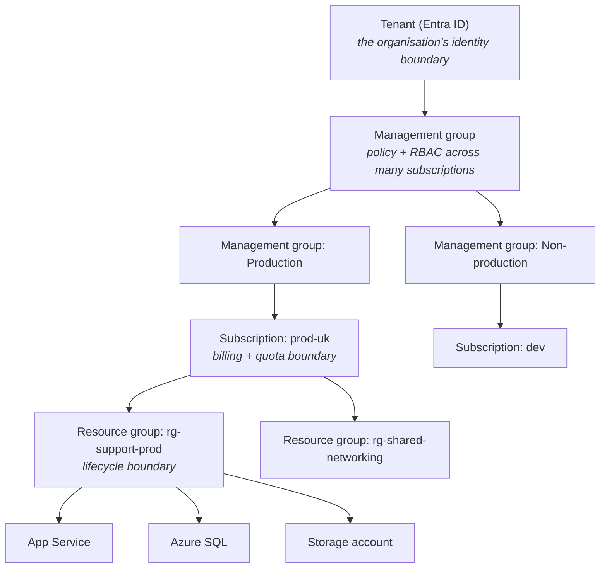

You already know a cloud. That makes this week much faster than Week 2 was — most concepts transfer directly, and the work is mostly learning new names for things you understand. But a few Azure ideas have **no AWS equivalent**, and those are where the real learning is.

## Getting an account

:::steps

1. **Sign up** at `azure.microsoft.com/free`. You get a credit for the first 30 days plus a set of always-free services. A card is required for identity verification.

2. **Check the spending limit.** Free trial subscriptions have one enabled by default — when the credit runs out, resources are *disabled* rather than billed. This is genuinely better than AWS's behaviour, and it is worth knowing that converting to pay-as-you-go removes it.

3. **Create a budget anyway.** Cost Management → Budgets → monthly, £1, alerts at 50/80/100%.

4. **Install the CLI.**

   ```bash
   az login
   az account show --output table
   az account list --output table
   az account set --subscription "Azure subscription 1"
   ```

5. **Or use Cloud Shell** — the `>_` icon in the portal. A browser terminal with the CLI, PowerShell, Python, Git and Terraform preinstalled, backed by a small file share. Genuinely useful when you are on a machine that is not yours.

:::

:::hint{type=tip}
`az interactive` gives you autocomplete and inline help for the CLI. And every blade in the portal has an **"Export template"** option showing the ARM JSON for what you just clicked — the fastest way to learn the resource schema is to build something in the portal and then read what it produced.
:::

## The resource hierarchy

This is the first genuinely new idea. AWS has accounts and, optionally, Organizations. Azure has four levels, and they all matter.



| Level | Purpose | AWS analogue |
|---|---|---|
| **Tenant** | Identity boundary; one Entra directory | AWS Organizations root, loosely |
| **Management group** | Apply policy and RBAC across many subscriptions | Organizational Unit |
| **Subscription** | Billing, quotas, isolation | **Account** |
| **Resource group** | Lifecycle container; delete it, delete everything in it | *(nothing)* |

:::hint{type=success}
**Resource groups have no AWS equivalent and they are excellent.** Every resource belongs to exactly one. They give you a natural unit for deployment, RBAC, cost reporting and — best of all — deletion.

```bash
az group delete --name rg-learning-lab --yes --no-wait
```

That one command removes every resource in the group. Compare to the AWS teardown scripts from Week 2, where you had to remember every resource you created. **Create one resource group per lab day** and you cannot leave anything running by accident.
:::

Naming matters more in Azure than AWS because resource names appear in DNS and are often globally unique. Microsoft's Cloud Adoption Framework recommends `<type>-<workload>-<env>-<region>-<instance>`:

```text
rg-support-prod-uks-01        resource group
app-ingest-prod-uks-01        App Service
sqldb-tickets-prod-uks        SQL database
stsupportproduks01            storage account (no hyphens allowed, ≤24 chars, lowercase)
kv-support-prod-uks           key vault
```

## The translation table

Print this. You will use it all week.

### Compute

| AWS | Azure | Notes |
|---|---|---|
| EC2 | Virtual Machines | Near-identical concept |
| Auto Scaling Group | Virtual Machine Scale Sets | |
| Lambda | **Azure Functions** | Consumption plan ≈ Lambda pricing |
| Elastic Beanstalk | **App Service** | App Service is more capable and much more used |
| ECS / Fargate | Container Apps / Container Instances | |
| EKS | **AKS** (Azure Kubernetes Service) | |
| Batch | Azure Batch | |

### Storage and databases

| AWS | Azure | Notes |
|---|---|---|
| S3 | **Blob Storage** | Containers, not buckets |
| EBS | Managed Disks | |
| EFS | Azure Files | Azure Files also speaks SMB natively |
| Glacier | Blob Archive tier | A tier, not a separate service |
| RDS | **Azure SQL Database** / Azure Database for PostgreSQL/MySQL | |
| RDS for SQL Server | Azure SQL Database or SQL Managed Instance | |
| DynamoDB | **Cosmos DB** | Multi-model; more capable and more complex |
| ElastiCache | Azure Cache for Redis | |
| Redshift | **Synapse Analytics** / Fabric | |

### Networking

| AWS | Azure |
|---|---|
| VPC | **Virtual Network (VNet)** |
| Subnet | Subnet |
| Security group | **Network Security Group (NSG)** |
| Network ACL | NSG at subnet scope |
| Internet Gateway | *(implicit — no separate resource)* |
| NAT Gateway | NAT Gateway |
| Route 53 | Azure DNS + Traffic Manager |
| CloudFront | Azure Front Door / Azure CDN |
| ALB / NLB | Application Gateway (L7) / Load Balancer (L4) |
| Direct Connect | ExpressRoute |
| Transit Gateway | Virtual WAN |

### Identity, security, management

| AWS | Azure |
|---|---|
| IAM (permissions) | **Azure RBAC** |
| IAM (identities) | **Microsoft Entra ID** |
| IAM roles for EC2 | **Managed identities** |
| Secrets Manager / Parameter Store | **Key Vault** |
| KMS | Key Vault / Managed HSM |
| CloudTrail | Azure Activity Log |
| Config | Azure Policy |
| Organizations SCPs | Management groups + Azure Policy |
| CloudWatch | **Azure Monitor** |
| CloudWatch Logs Insights | Log Analytics + **KQL** |
| X-Ray | **Application Insights** |
| CloudFormation | **ARM templates / Bicep** |
| CDK | Bicep, or Azure CDK |
| Systems Manager | Azure Automation / Update Manager |
| Trusted Advisor | Azure Advisor |
| Cost Explorer | Cost Management |

:::hint{type=warning}
The mapping is never exact. Two that catch people:

- **Cosmos DB is not DynamoDB.** It is multi-model (document, key-value, graph, column) with five tunable consistency levels and a global-distribution model that has no AWS single-service equivalent.
- **App Service has no real AWS peer.** Beanstalk is the closest, but App Service is far more widely used on Azure than Beanstalk is on AWS, has deployment slots built in, and is often the default choice for a web app.
:::

## Azure RBAC vs AWS IAM

The philosophies differ, and the difference matters.

| | AWS IAM | Azure RBAC |
|---|---|---|
| Policy attaches to | Identity, or resource | **A scope** (MG, subscription, RG, resource) |
| Inheritance | No — resource ARNs are explicit | **Yes — downward through the hierarchy** |
| Language | JSON policy documents | Role definitions with Actions/NotActions |
| Deny | Explicit `Deny` in any policy wins | Deny assignments exist but are rare; mostly allow-only |
| Default | Deny | Deny |

```bash title="rbac.sh"
# Grant Reader over an entire resource group. Inherited by every resource in it.
az role assignment create \
  --assignee user@example.com \
  --role "Reader" \
  --scope "/subscriptions/$SUB_ID/resourceGroups/rg-support-prod"

# Common built-in roles
az role definition list --query "[].roleName" --output tsv | sort | head -30
```

The four you will use most:

| Role | Can |
|---|---|
| **Owner** | Everything, including granting access |
| **Contributor** | Everything except granting access |
| **Reader** | View only |
| **User Access Administrator** | Manage access, nothing else |

:::hint{type=tip}
**Contributor cannot grant access.** This is a genuinely well-designed default and a common source of confusion — someone with Contributor can delete your database but cannot give their colleague permission to read it. Separating "change things" from "change who can change things" is worth understanding as a principle, not just a fact.
:::

Scope inheritance means a Reader assignment at the management group level applies to every subscription, resource group and resource beneath it. That is powerful and easy to over-apply: **assign at the narrowest scope that works.**

```quiz
question: Which Azure concept has no direct AWS equivalent, and what does it give you?
options:
  - Subscription — it is a billing boundary, unlike anything in AWS
  - Resource group — a lifecycle container whose deletion removes every resource inside it
  - Virtual Network — AWS has no equivalent networking construct
  - Managed identity — AWS has nothing comparable
answer: 1
explanation: Subscriptions map roughly to AWS accounts, VNets to VPCs, and managed identities to IAM roles for EC2. Resource groups are the genuinely new idea: every resource belongs to exactly one, and deleting the group deletes everything in it.
```

## Infrastructure as code: Bicep

Azure's answer to CloudFormation, and much more pleasant than the ARM JSON it compiles to.

```bicep title="infra/main.bicep"
@description('Environment short name')
@allowed(['dev', 'staging', 'prod'])
param env string = 'dev'

@description('Azure region')
param location string = resourceGroup().location

var namePrefix = 'support-${env}'

resource storage 'Microsoft.Storage/storageAccounts@2023-05-01' = {
  name: 'st${replace(namePrefix, '-', '')}${uniqueString(resourceGroup().id)}'
  location: location
  sku: { name: 'Standard_LRS' }
  kind: 'StorageV2'
  properties: {
    minimumTlsVersion: 'TLS1_2'
    allowBlobPublicAccess: false
    supportsHttpsTrafficOnly: true
  }
  tags: { environment: env, project: 'support-tool' }
}

resource plan 'Microsoft.Web/serverfarms@2023-12-01' = {
  name: 'plan-${namePrefix}'
  location: location
  sku: { name: 'F1', tier: 'Free' }
  properties: { reserved: true }     // Linux
}

output storageAccountName string = storage.name
```

```bash title="deploy-bicep.sh"
az group create --name rg-learning-day22 --location uksouth

az deployment group create \
  --resource-group rg-learning-day22 \
  --template-file infra/main.bicep \
  --parameters env=dev

# What would change, without changing it — like terraform plan
az deployment group what-if \
  --resource-group rg-learning-day22 \
  --template-file infra/main.bicep \
  --parameters env=dev
```

:::hint{type=success}
`az deployment group what-if` is Azure's dry run, and it is excellent — colour-coded, showing exactly which properties would change. AWS CloudFormation change sets are clunkier. If a team is deciding between Bicep and Terraform for an Azure-only estate, `what-if` plus no state file to manage is a real argument for Bicep.
:::

## Exercise

:::checklist{title="Day 22 checklist"}
- [ ] Azure account created; confirm the spending limit is enabled
- [ ] £1 budget with alerts configured
- [ ] Azure CLI installed; `az account show` works
- [ ] Cloud Shell opened and used at least once
- [ ] Resource group `rg-learning-day22` created in `uksouth`
- [ ] Reproduce the AWS→Azure table **from memory**, then check it against yours
- [ ] Create a storage account through the portal, then use "Export template" to read its ARM JSON
- [ ] Write and deploy the Bicep template above
- [ ] Run `what-if` after changing a parameter; read the diff
- [ ] Assign yourself the Reader role at resource-group scope and observe the inheritance
- [ ] `az group delete` the resource group and confirm everything disappeared
- [ ] Commit `infra/main.bicep` and the mapping table to your repo
:::

:::details{summary="Where the AWS mental model actively misleads"}
1. **Resource names are often global.** Storage account names must be globally unique across all of Azure, 3–24 characters, lowercase alphanumeric only. `uniqueString(resourceGroup().id)` is the idiomatic fix.

2. **No internet gateway resource.** VNets have outbound internet by default. You *restrict* it with NSGs and route tables rather than *enabling* it with a gateway. This inverts the AWS mental model and is a common early mistake.

3. **Regions are named, not coded.** `uksouth`, `eastus`, `westeurope` — not `eu-west-2`.

4. **Availability Zones are opt-in and not universal.** Not every region has them, and not every service supports them. Always check for the specific service and region rather than assuming.

5. **Deleting a resource group is instant and irreversible.** There is no equivalent of S3 versioning at the group level. `az group delete` with the wrong name is genuinely destructive — which is why per-day lab groups with obvious names are a good habit.
:::

## Where this is going

Tomorrow you deploy things: a VM, a Blob Storage container and an Azure Function — the Azure counterparts of the EC2, S3 and Lambda work from Week 2.
