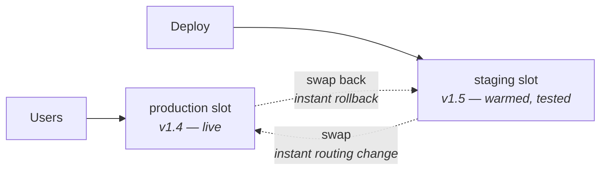

Everything today has a Week 2 counterpart, so the concepts are familiar. Focus your attention on the differences — and on App Service and deployment slots, which are genuinely new.

Create today's resource group first, so cleanup is one command:

```bash
az group create --name rg-learning-day23 --location uksouth
```

## Virtual Machines

```bash title="vm.sh"
RG=rg-learning-day23

az vm create \
  --resource-group $RG \
  --name vm-learning-01 \
  --image Ubuntu2404 \
  --size Standard_B1s \
  --admin-username azureuser \
  --generate-ssh-keys \
  --public-ip-sku Standard \
  --nsg-rule SSH

# Open HTTP
az vm open-port --resource-group $RG --name vm-learning-01 --port 80

IP=$(az vm show -d -g $RG -n vm-learning-01 --query publicIps -o tsv)
ssh azureuser@$IP
```

```bash title="on-the-vm.sh"
sudo apt update && sudo apt install -y nginx
echo "<h1>Hello from $(hostname)</h1>" | sudo tee /var/www/html/index.html
curl -s localhost | head -1
```

### Differences from EC2 worth noting

| | EC2 | Azure VM |
|---|---|---|
| Firewall | Security group on the instance | **NSG** on the NIC *and/or* the subnet — **both apply** |
| Key management | Key pair you download once | `--generate-ssh-keys` writes to `~/.ssh`; can also use Entra login |
| Stopped billing | Stops compute charges immediately | **`az vm stop` still bills!** You must `az vm deallocate` |
| Metadata service | 169.254.169.254 | Same address, different API and required header |
| Serial console | System log only | Full interactive serial console |

:::hint{type=danger}
**`az vm stop` does not stop the bill.** It shuts the guest OS down but keeps the compute reserved. You must use `az vm deallocate` to release it. This is the single most expensive Azure gotcha for people arriving from AWS, and the portal's "Stop" button does the right thing (deallocate) while the CLI's `stop` does not — which makes it worse.

```bash
az vm deallocate --resource-group $RG --name vm-learning-01
```
:::

The NSG double-application is the other one:

```bash title="nsg.sh"
# NSGs can attach to a subnet AND to a NIC. Traffic must be allowed by both.
az network nsg rule list --resource-group $RG --nsg-name vm-learning-01NSG --output table
```

If a connection fails and the NIC's NSG looks correct, check the subnet's. Azure's **Network Watcher → IP flow verify** answers "would this packet get through, and which rule decides?" directly — there is no AWS equivalent that good.

## Blob Storage

The hierarchy is one level deeper than S3: **storage account → container → blob.**

```bash title="blob.sh"
RG=rg-learning-day23
SA="stlearning$RANDOM$RANDOM"

az storage account create \
  --name $SA --resource-group $RG --location uksouth \
  --sku Standard_LRS --kind StorageV2 \
  --min-tls-version TLS1_2 --allow-blob-public-access false

# Authenticate with your Entra identity rather than an account key
az role assignment create \
  --assignee $(az ad signed-in-user show --query id -o tsv) \
  --role "Storage Blob Data Contributor" \
  --scope $(az storage account show -n $SA -g $RG --query id -o tsv)

az storage container create --name reports --account-name $SA --auth-mode login

echo "incident summary" > report.txt
az storage blob upload --account-name $SA --container-name reports \
  --name 2026/08/report.txt --file report.txt --auth-mode login

az storage blob list --account-name $SA --container-name reports \
  --auth-mode login --output table
```

:::hint{type=tip}
`--auth-mode login` uses your Entra identity. The alternative is `--account-key`, which is a **shared key granting full control of the entire storage account** — the Azure equivalent of root credentials for that resource. Prefer Entra auth everywhere, and consider disabling shared key access entirely:

```bash
az storage account update -n $SA -g $RG --allow-shared-key-access false
```
:::

### Redundancy and access tiers

Two independent axes, unlike S3 where they are conflated into "storage class".

**Redundancy** — how many copies, and where:

| SKU | Copies | Survives |
|---|---|---|
| **LRS** | 3, one data centre | Disk and rack failure |
| **ZRS** | 3, across availability zones | Data centre loss |
| **GRS** | 6, paired region, async | Regional loss (with failover) |
| **RA-GRS** | 6, secondary readable | Regional loss, plus read access to the secondary |
| **GZRS / RA-GZRS** | ZRS primary + GRS secondary | Both |

**Access tier** — how often you read it:

| Tier | Storage cost | Access cost | Minimum retention |
|---|---|---|---|
| Hot | Highest | Lowest | — |
| Cool | Lower | Higher | 30 days |
| Cold | Lower still | Higher still | 90 days |
| Archive | Lowest | Rehydration, hours | 180 days |

:::hint{type=warning}
**Archive tier blobs are not readable.** You must rehydrate to Hot or Cool first, which takes 1–15 hours depending on priority. Discovering this during an incident, when the log you need is archived, is a very bad moment. Keep anything you might need urgently at Cool or above.
:::

### SAS tokens

The pre-signed URL equivalent, and more flexible:

```bash title="sas.sh"
EXPIRY=$(date -u -d '2 hours' '+%Y-%m-%dT%H:%MZ')

az storage blob generate-sas \
  --account-name $SA --container-name reports \
  --name 2026/08/report.txt \
  --permissions r --expiry "$EXPIRY" \
  --auth-mode login --as-user --full-uri
```

`--as-user` produces a **user delegation SAS**, signed with an Entra key rather than the account key. That means it can be revoked by revoking the user's access, and it never exposes the account key. This is strictly better than the account-key SAS most tutorials show.

## Azure Functions

```bash title="function.sh"
RG=rg-learning-day23
SA=$SA                                   # Functions needs a storage account
FUNC="func-learning-$RANDOM"

az functionapp create \
  --resource-group $RG \
  --name $FUNC \
  --storage-account $SA \
  --consumption-plan-location uksouth \
  --runtime python --runtime-version 3.11 \
  --functions-version 4 \
  --os-type Linux
```

```python title="function_app.py"
import json
import logging
import azure.functions as func

app = func.FunctionApp(http_auth_level=func.AuthLevel.ANONYMOUS)


@app.route(route="tickets")
def ingest(req: func.HttpRequest) -> func.HttpResponse:
    invocation_id = req.headers.get("x-ms-invocation-id", "")
    logging.info(json.dumps({"msg": "ingest_start", "invocation_id": invocation_id}))

    try:
        payload = req.get_json()
    except ValueError:
        return _json(400, {"error": "body must be valid JSON"})

    customer_id = payload.get("customerId")
    if not isinstance(customer_id, int) or customer_id < 1:
        logging.warning(json.dumps({"msg": "validation_failed", "field": "customerId"}))
        return _json(400, {"error": "customerId must be a positive integer"})

    logging.info(json.dumps({"msg": "ingest_ok", "customer_id": customer_id}))
    return _json(202, {"accepted": True, "invocation_id": invocation_id})


def _json(status: int, body: dict) -> func.HttpResponse:
    return func.HttpResponse(json.dumps(body), status_code=status,
                             mimetype="application/json")
```

```bash title="deploy-function.sh"
func azure functionapp publish $FUNC          # Azure Functions Core Tools
az functionapp log tail --name $FUNC --resource-group $RG
```

### Functions vs Lambda

| | Lambda | Azure Functions |
|---|---|---|
| Plans | On-demand, provisioned concurrency | **Consumption**, Premium, Dedicated (App Service), Flex Consumption |
| Max duration | 15 min | 5 min default on Consumption (configurable to 10); unlimited on Dedicated |
| Triggers | Event source mappings | **Bindings** — declarative input *and output* |
| Local dev | SAM / serverless framework | `func start` — genuinely excellent |
| Logs | CloudWatch Logs | Application Insights |

:::hint{type=success}
**Bindings are the distinctive Azure Functions idea.** Instead of writing SDK code to read from a queue and write to a database, you declare them:

```python
@app.route(route="tickets")
@app.queue_output(arg_name="msg", queue_name="ingest",
                  connection="AzureWebJobsStorage")
def ingest(req: func.HttpRequest, msg: func.Out[str]) -> func.HttpResponse:
    msg.set(req.get_body().decode())
    return func.HttpResponse(status_code=202)
```

No storage SDK, no connection handling, no retry logic. Less code, but also less control — and a debugging surface that is opaque when a binding silently fails. Know the trade-off.
:::

## App Service and deployment slots

This is the piece with no real AWS analogue, and it is what a lot of Microsoft-stack web applications actually run on.

```bash title="app-service.sh"
RG=rg-learning-day23
APP="app-learning-$RANDOM"

az appservice plan create --name plan-learning --resource-group $RG \
  --sku B1 --is-linux

az webapp create --name $APP --resource-group $RG \
  --plan plan-learning --runtime "PYTHON:3.12"

# A staging slot — a full parallel environment with its own hostname
az webapp deployment slot create --name $APP --resource-group $RG --slot staging

az webapp up --name $APP --resource-group $RG --slot staging

# Warm it, test it, then swap. The swap is a routing change, not a deploy.
az webapp deployment slot swap --name $APP --resource-group $RG \
  --slot staging --target-slot production
```



This is blue/green deployment as a first-class feature, and the swap does two things that matter:

- **Warm-up.** Azure sends requests to the staging instance and waits for it to respond before switching traffic, so the first real user does not pay the cold-start cost.
- **Instant rollback.** Swapping back is one command.

:::hint{type=tip}
Mark connection strings and app settings as **slot settings** ("Deployment slot setting" checkbox) for anything environment-specific. Otherwise the staging database connection string swaps into production with the code, which is a memorable way to learn this.
:::

## Managed identity

The Azure equivalent of an IAM role for EC2 — and arguably cleaner, because it is an Entra identity like any other.

```bash title="managed-identity.sh"
# Give the function app a system-assigned identity
PRINCIPAL=$(az functionapp identity assign \
  --name $FUNC --resource-group $RG --query principalId -o tsv)

# Grant it access to the storage account
az role assignment create \
  --assignee $PRINCIPAL \
  --role "Storage Blob Data Contributor" \
  --scope $(az storage account show -n $SA -g $RG --query id -o tsv)
```

```python title="use-managed-identity.py"
from azure.identity import DefaultAzureCredential
from azure.storage.blob import BlobServiceClient

# Locally this uses your `az login`; in Azure it uses the managed identity.
# Same code, no credentials, either way.
credential = DefaultAzureCredential()
client = BlobServiceClient(f"https://{STORAGE_ACCOUNT}.blob.core.windows.net", credential)
```

:::hint{type=success}
`DefaultAzureCredential` tries a chain: environment variables, managed identity, Azure CLI login, VS Code login. The result is that **the same code authenticates correctly on your laptop and in production with no configuration**. It is one of the genuinely nicer pieces of ergonomics in the Azure SDKs, and worth mentioning if you are asked how you handle credentials.
:::

```quiz
question: You run `az vm stop` on a lab VM at the end of the day. What happens to the bill?
options:
  - Compute charges stop immediately
  - Compute charges continue, because the VM is stopped but still allocated
  - The VM is deleted and all charges stop
  - Only storage is billed, at the archive rate
answer: 1
explanation: `az vm stop` shuts down the guest OS but keeps the compute allocated and billed. You must `az vm deallocate` to release the compute. The portal's Stop button deallocates, which makes the CLI difference easy to miss.
```

## Tear down

```bash
az group delete --name rg-learning-day23 --yes --no-wait
```

One command. This is why per-day resource groups are worth the discipline.

## Exercise

:::checklist{title="Day 23 checklist"}
- [ ] Resource group `rg-learning-day23` created
- [ ] VM deployed; SSH working; nginx serving over HTTP
- [ ] Deliberately break connectivity with an NSG rule; use Network Watcher IP flow verify to diagnose
- [ ] `az vm stop`, check the cost implication, then `az vm deallocate`
- [ ] Storage account created with public access disabled and shared key access disabled
- [ ] Blob uploaded and listed using `--auth-mode login`
- [ ] User delegation SAS generated; confirm it works and that the plain URL does not
- [ ] Set a blob to Archive tier; attempt to read it; observe the error
- [ ] Azure Function deployed and returning 202 for a valid payload, 400 for an invalid one
- [ ] Logs tailed with `az functionapp log tail`
- [ ] App Service deployed with a staging slot; perform a swap and then swap back
- [ ] Managed identity assigned and used to access storage with **no credentials in code**
- [ ] `az group delete` — confirm the portal shows nothing left
:::

:::details{summary="Function returns 500 with nothing useful in the log"}
1. **Is Application Insights connected?** Functions logging is thin without it. `az functionapp config appsettings list` and look for `APPLICATIONINSIGHTS_CONNECTION_STRING`.
2. **Check the deployment actually succeeded.** `az functionapp deployment source show`. A failed deploy leaves the previous version running.
3. **Python version mismatch.** The runtime version on the app must match what your dependencies were built for.
4. **Missing dependency.** `requirements.txt` must list everything; Functions does not install transitively from your local environment.
5. **Use the Kudu console** — `https://<app>.scm.azurewebsites.net` — to browse the deployed filesystem and read raw logs. This is the Azure equivalent of getting a shell, and it is the tool most people do not know exists.
:::

## Where this is going

Tomorrow is the day the job description was really pointing at: Azure Active Directory / Entra ID. Users, groups, roles, SSO and conditional access — the Azure counterpart to your AWS IAM day, and near-certain to come up if the company runs on Microsoft's stack.
