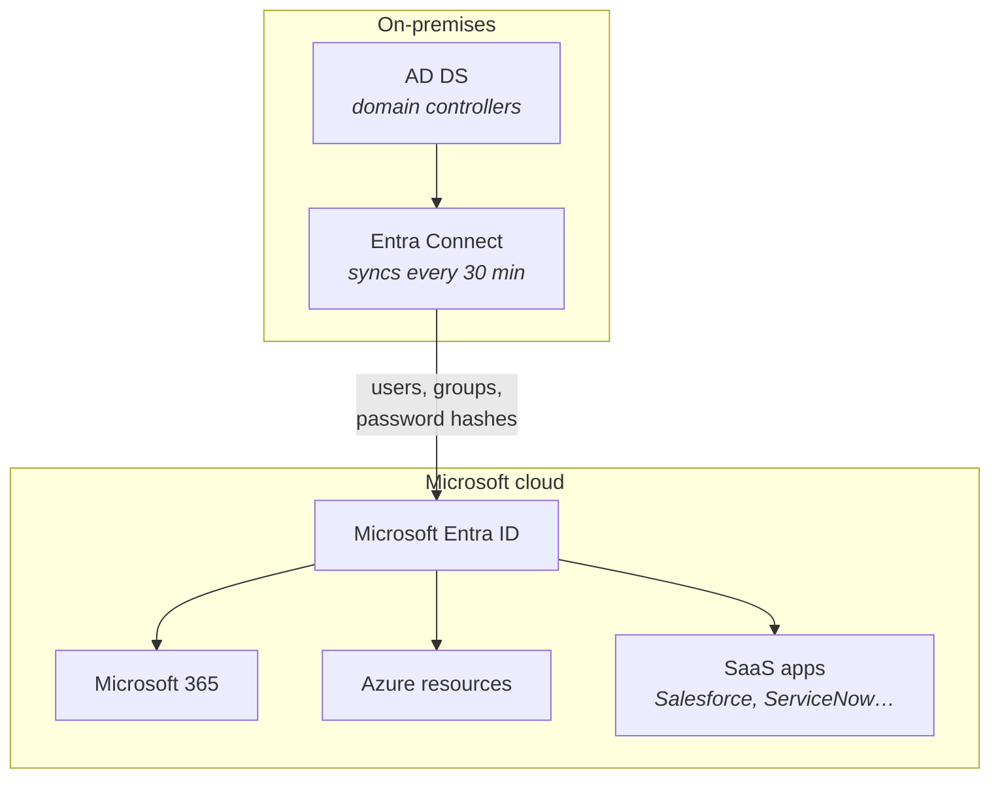
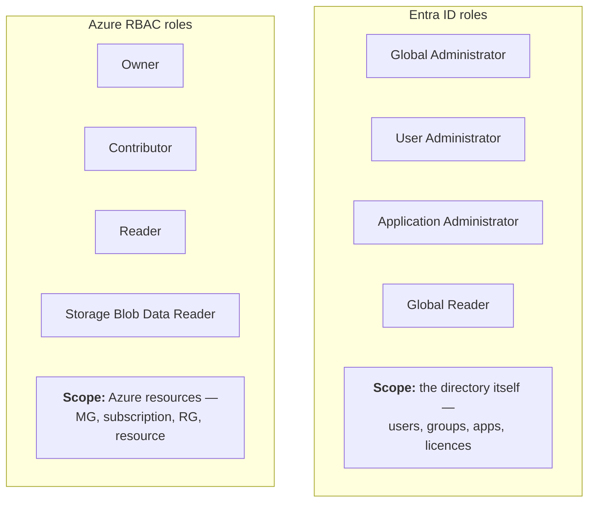
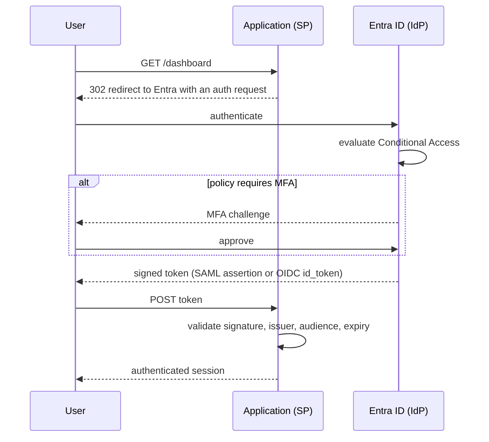
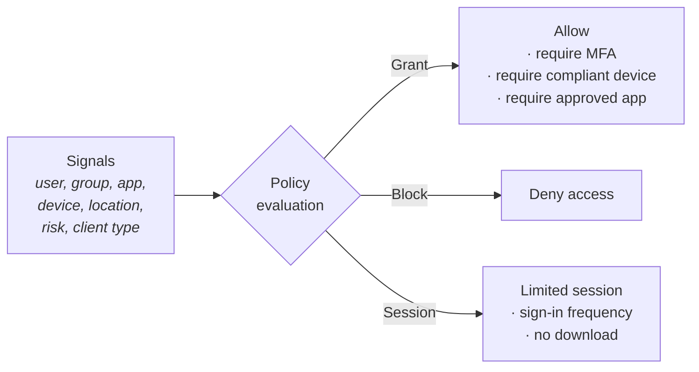

If the company runs on Microsoft's stack, this is the highest-probability topic in the whole course. Identity is where a large share of support tickets originate — *"I can't sign in"*, *"I don't have access"*, *"it keeps asking for MFA"* — and it is the area where a support engineer who genuinely understands the model is disproportionately valuable.

## Entra ID is not Active Directory

The naming is unhelpful. **Azure AD was renamed Microsoft Entra ID in 2023**, and it is a fundamentally different thing from the on-premises Active Directory it is named after.

| | On-premises AD (AD DS) | Microsoft Entra ID |
|---|---|---|
| Structure | Hierarchical: forests, domains, OUs | **Flat** directory with groups |
| Protocols | Kerberos, NTLM, LDAP | **OAuth 2.0, OIDC, SAML, WS-Fed** |
| Manages | Domain-joined Windows machines | Cloud apps, SaaS, Azure, M365 |
| Group Policy | Yes | No — Intune does device policy |
| Query | LDAP | **Microsoft Graph API** |
| Trusts | Forest and domain trusts | B2B guest invitations, cross-tenant access |

:::hint{type=warning}
The most common misconception is that Entra ID is "AD in the cloud". It is not — there are no OUs, no Group Policy, no LDAP, no Kerberos. Most enterprises run **both**, synchronised with **Entra Connect**, and the hybrid seam is where a lot of tickets live: an account disabled on-premises that has not yet synced to the cloud, a password changed in one place and not the other, a sync cycle that has been failing for a week.
:::



## Users and groups

```bash title="users.sh"
az ad user create \
  --display-name "Ada Lovelace" \
  --user-principal-name ada@yourtenant.onmicrosoft.com \
  --password "$(openssl rand -base64 20)" \
  --force-change-password-next-sign-in true

az ad group create --display-name "Support Engineers" --mail-nickname support-eng

az ad group member add \
  --group "Support Engineers" \
  --member-id $(az ad user show --id ada@yourtenant.onmicrosoft.com --query id -o tsv)

az ad group member list --group "Support Engineers" --query "[].displayName" -o table
```

### Group types

| Type | Purpose |
|---|---|
| **Security group** | Access control. What you use for RBAC and app assignment |
| **Microsoft 365 group** | Collaboration — brings a mailbox, SharePoint site and Teams team |
| **Distribution list** | Email only, no access control |
| **Mail-enabled security** | Both, and legacy |

### Assignment types

- **Assigned** — you add members manually.
- **Dynamic** — membership is computed from a rule and re-evaluated automatically.

```text title="dynamic membership rule"
(user.department -eq "Support") and (user.accountEnabled -eq true)
and (user.userType -ne "Guest")
```

:::hint{type=tip}
Dynamic groups are the right answer to "how do we make sure new joiners get the correct access?" HR sets the department in the source system, it syncs to Entra, the rule adds them to the group, and the group grants the access. No ticket, no manual step, and — crucially — **it revokes correctly when they move teams**, which manual assignment never does.

Dynamic groups require Entra ID P1. That licence question is itself a common support answer.
:::

## Two different role systems

This is the distinction people get wrong most often, and being clear about it is a real signal of competence.



| | Entra ID roles | Azure RBAC roles |
|---|---|---|
| Control | The directory: users, groups, apps, licences | Azure resources: VMs, storage, databases |
| Assigned at | Tenant (or an administrative unit) | Management group / subscription / RG / resource |
| Examples | Global Administrator, User Administrator | Owner, Contributor, Reader |
| Managed in | Entra ID → Roles and administrators | Resource → Access control (IAM) |

**A Global Administrator has no access to Azure resources by default.** They can grant themselves access (there is a toggle for elevating to User Access Administrator at root scope), but out of the box, directory power and resource power are separate. Conversely, an Azure subscription **Owner** cannot create users.

:::hint{type=danger}
Global Administrator is the most powerful role in the tenant and should be:

- Assigned to **fewer than five** people
- **Never** used for day-to-day work
- Always protected by phishing-resistant MFA
- Preferably granted **just-in-time** via Privileged Identity Management rather than standing

Keep **two break-glass accounts** excluded from conditional access, with long random passwords stored physically, and monitor them for any sign-in. Locking yourself out of your own tenant with a conditional access policy is a real and recoverable-only-with-difficulty situation.
:::

## Single sign-on

At the level you need to explain to a customer:



| | SAML 2.0 | OIDC / OAuth 2.0 |
|---|---|---|
| Token | XML assertion | JSON Web Token |
| Transport | HTTP POST form | Query string / POST, then a token endpoint |
| Age | 2005 | 2014 |
| Best for | Established enterprise apps | New apps, SPAs, mobile, APIs |
| Common failures | Clock skew, certificate expiry, mismatched entity ID | Wrong redirect URI, wrong audience, missing consent |

:::hint{type=warning}
**Certificate expiry is the classic SAML outage.** The signing certificate has a lifetime, typically three years, and when it expires every user of that application is locked out simultaneously — with no warning, on a date nobody has in a calendar. Entra emails a notification 60 days ahead to the app's notification address, which is frequently an inbox nobody reads.

If an application that has worked for years suddenly fails for everyone at once, **check the certificate expiry first.** It is a two-minute check that resolves a whole-company outage.
:::

## Conditional Access

Conditional access is the policy engine that decides what happens on each sign-in. Think of it as: **if these signals, then require these controls.**



A realistic set of policies:

| Policy | Condition | Control |
|---|---|---|
| Baseline MFA | All users, all apps | Require MFA |
| Admin protection | Directory role holders | Require phishing-resistant MFA, 4-hour sign-in frequency |
| Block legacy auth | Legacy authentication clients | **Block** |
| Trusted locations | Not from a named location | Require MFA |
| Device compliance | Access to SharePoint/Exchange | Require compliant or hybrid-joined device |
| Risk-based | Sign-in risk = high | Block, or require password change |

:::hint{type=danger}
**Blocking legacy authentication is the single highest-value policy.** Legacy protocols — IMAP, POP3, SMTP AUTH, older Office clients — cannot perform MFA. As long as they are enabled, an attacker with a valid password bypasses MFA entirely by using one. Microsoft's own data has repeatedly shown the overwhelming majority of password-spray compromises come through legacy auth.

The support consequence: turning it off breaks old scanners, printers and line-of-business apps that use SMTP AUTH. Expect tickets. The answer is usually to move that device to a modern-auth-capable path, not to re-enable legacy.
:::

:::hint{type=warning}
**Always use Report-only mode first.** A new policy in report-only is evaluated and logged but not enforced, so you can see exactly who it *would* have blocked. Deploying a conditional access policy straight to enforced is how people lock out their entire finance department on a Friday afternoon — and, occasionally, themselves.
:::

## Diagnosing sign-in failures

This is the practical skill. **Entra ID → Sign-in logs**, filter by user and time.

Each entry gives you: user, application, IP, location, device, client app, conditional access policies evaluated with their result, and — most importantly — a **numeric error code**.

| Code | Meaning | Usual fix |
|---|---|---|
| `50126` | Invalid username or password | Genuine credential problem |
| `50053` | Account locked (smart lockout) | Wait, or investigate a password spray |
| `50055` | Password expired | Reset |
| `50057` | Account disabled | Re-enable — check whether on-premises disabled it and synced |
| `50058` | Silent sign-in failed | Usually benign; the client retries interactively |
| `50076` | MFA required, not satisfied | Complete MFA; check the registered method still exists |
| `50079` | User must enrol in MFA | Registration required |
| `53003` | **Blocked by Conditional Access** | Read *which* policy in the log entry |
| `53000` / `53001` | Device not compliant / not joined | Intune enrolment |
| `65001` | User has not consented to the app | Admin consent required |
| `700016` | Application not found in the directory | Wrong client ID, or wrong tenant |
| `7000215` | Invalid client secret | Secret expired — very common |

:::hint{type=success}
`53003` deserves special attention: the log entry lists **every conditional access policy evaluated and its result**. You can see exactly which policy said no and which condition triggered it. That converts "I can't log in" from a mystery into a one-screen answer, and it is the single most useful screen in the Entra portal.
:::

A workable triage order for *"I can't sign in"*:

:::steps

1. **Sign-in logs, filtered to that user.** Is there a failure at all? If not, they are not reaching Entra — check the URL they are using, DNS, or a cached credential.
2. **Read the error code.** It usually names the problem outright.
3. **If `53003`,** expand the Conditional Access tab and find the failing policy.
4. **Check account state** — enabled, not locked, licence assigned.
5. **Check the app assignment** — is the user (or a group they are in) assigned to the enterprise application?
6. **If hybrid,** check Entra Connect sync health and when the last successful sync ran.
7. **Check the app's certificate or secret expiry** if it is failing for *everyone*.

:::

```quiz
question: A user reports they cannot access a SaaS application that worked yesterday. The sign-in log shows error 53003. What does that tell you?
options:
  - Their password is wrong
  - Their account is disabled
  - A Conditional Access policy blocked the sign-in — the log names which one
  - The application's SAML certificate has expired
answer: 2
explanation: 53003 is specifically "access blocked by Conditional Access". The log entry lists every policy evaluated and its result, so you can identify the exact policy and condition without guessing.
```

## Applications and service principals

An **app registration** defines an application; a **service principal** is that application's identity inside a particular tenant. One registration, potentially many service principals across tenants.

```bash title="app-registration.sh"
APP_ID=$(az ad app create --display-name "support-ingest-tool" --query appId -o tsv)
az ad sp create --id $APP_ID

# A client secret — note the expiry
az ad app credential reset --id $APP_ID --years 1 --query password -o tsv
```

:::hint{type=danger}
**Client secrets expire, and when they do the application stops working with no warning.** Error `7000215`. Prefer, in order:

1. **Managed identity** — no credential at all. Use this wherever the workload runs in Azure.
2. **Workload identity federation** — for GitHub Actions and other external CI, exactly like the OIDC setup from Day 16.
3. **Certificate credentials** — longer-lived and harder to exfiltrate than a secret.
4. **Client secrets** — last resort, with a calendar reminder 30 days before expiry.

An expiring secret nobody tracked is one of the most common self-inflicted outages in Microsoft estates.
:::

## Exercise

You need a tenant with some directory permissions. A free Azure account gives you one where you are Global Administrator.

:::checklist{title="Day 24 checklist"}
- [ ] Create three users and two security groups
- [ ] Create a dynamic group with a membership rule; verify it populates
- [ ] Assign a user an **Entra role** (e.g. Global Reader); confirm they cannot see Azure resources
- [ ] Assign the same user an **Azure RBAC role** at resource-group scope; confirm they now can
- [ ] Write out, in your own words, the difference between the two role systems
- [ ] Create a conditional access policy in **report-only** mode requiring MFA
- [ ] Sign in and find the report-only result in the sign-in log
- [ ] Deliberately trigger a failed sign-in; find it in the logs and identify the error code
- [ ] Look up three unfamiliar error codes in the reference and note what they mean
- [ ] Create an app registration with a client secret; note the expiry date
- [ ] Configure workload identity federation for a GitHub repo (no secret) if you can
- [ ] Write `docs/runbooks/cannot-sign-in.md` using the seven-step triage sequence
:::

:::details{summary="An answer to 'how does SSO work?' that lands well"}
> "The user hits the application, which redirects them to Entra ID with an authentication request. Entra authenticates them — password, MFA, whatever conditional access requires for that combination of user, device and location — and issues a signed token: a SAML assertion for older enterprise apps, or an OIDC ID token for newer ones. The browser posts that token back to the application, which validates the signature against Entra's published keys and checks the issuer, audience and expiry. If it is valid, the app creates its own session.
>
> The application never sees the password. That is the point — it is why a compromised application does not yield credentials, and why MFA and conditional access can be enforced centrally rather than reimplemented in every app.
>
> For support, the two things worth knowing: sign-in failures show up in the Entra sign-in logs with a specific error code, and if an app that has worked for years fails for everyone at once, the signing certificate has probably expired."
:::

## Where this is going

Tomorrow: Azure Monitor, Log Analytics and KQL properly — the direct counterpart of your CloudWatch work in Week 3, and the query language that pays off across the whole Microsoft estate.
