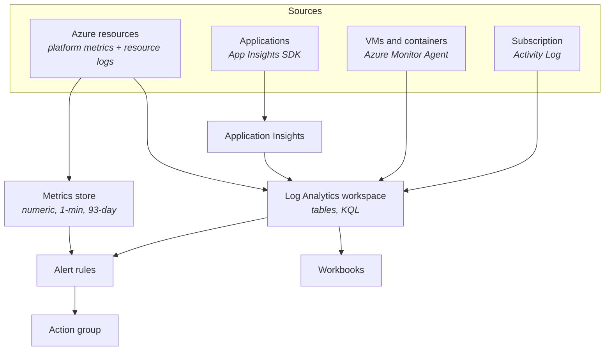

Everything from Week 3 applies conceptually. What is new is the query language — and KQL is worth learning properly, because the same language drives Microsoft Sentinel (SIEM), Azure Data Explorer, Defender and Resource Graph. Learn it once, use it across the estate.

## The data model



Two stores, and the distinction matters:

- **Metrics** — numeric, one-minute granularity, 93-day retention, very fast, cheap. Alert here when you can.
- **Logs** — schema-on-write tables in a Log Analytics workspace, queried with KQL, retention configurable. Richer, slower, billed per GB.

The AWS mapping from Day 20 applies: Log Analytics ≈ CloudWatch Logs, Azure Monitor Metrics ≈ CloudWatch Metrics, Application Insights ≈ X-Ray plus an APM product AWS does not have.

## KQL

The mental model is a Unix pipeline. Data flows left to right through operators.

```kusto title="basics.kql"
requests
| where timestamp > ago(1h)
| where success == false
| project timestamp, name, resultCode, duration, operation_Id
| order by timestamp desc
| take 50
```

| Operator | Does | SQL analogue |
|---|---|---|
| `where` | Filter rows | `WHERE` |
| `project` | Choose/rename columns | `SELECT` |
| `extend` | Add a computed column | `SELECT expr AS x` |
| `summarize` | Aggregate | `GROUP BY` |
| `order by` / `sort by` | Sort | `ORDER BY` |
| `take` / `limit` | Cap rows | `TOP` |
| `join` | Combine tables | `JOIN` |
| `union` | Stack tables | `UNION` |
| `render` | Chart the result | — |
| `bin()` | Bucket a value, usually time | date truncation |

:::hint{type=tip}
**Always filter on `timestamp` first.** Log Analytics partitions by time, so an early time filter is the difference between a query that returns in two seconds and one that scans a month of data. This is the KQL equivalent of Day 4's SARGability lesson — same principle, different engine.
:::

### Aggregation

```kusto title="error-rate-over-time.kql"
requests
| where timestamp > ago(24h)
| summarize
    total    = count(),
    failed   = countif(success == false),
    p50      = percentile(duration, 50),
    p95      = percentile(duration, 95),
    p99      = percentile(duration, 99)
  by bin(timestamp, 15m)
| extend errorRatePct = round(100.0 * failed / total, 2)
| order by timestamp asc
| render timechart
```

`countif()` is KQL's conditional aggregation — the equivalent of Day 3's `SUM(CASE WHEN … THEN 1 ELSE 0 END)`, and considerably more pleasant to write.

`render timechart` produces a chart directly in the results pane. Small feature, disproportionately useful — you can go from question to visual in one query.

### Joins

```kusto title="failed-requests-with-exceptions.kql"
requests
| where timestamp > ago(2h) and success == false
| project timestamp, operation_Id, requestName = name, resultCode, duration
| join kind=leftouter (
    exceptions
    | where timestamp > ago(2h)
    | project operation_Id, exceptionType = type, outerMessage, problemId
  ) on operation_Id
| project timestamp, requestName, resultCode, duration, exceptionType, outerMessage
| order by timestamp desc
```

`operation_Id` is Application Insights' correlation ID, set automatically by the SDK — the same idea you implemented by hand on Day 18. It ties requests, dependencies, exceptions and traces from one operation together.

Join kinds: `inner`, `leftouter`, `rightouter`, `fullouter`, plus `leftanti` and `rightanti` — which are Day 2's anti-joins as first-class operators:

```kusto title="requests-with-no-dependency-call.kql"
requests
| where timestamp > ago(1h)
| join kind=leftanti (
    dependencies | where timestamp > ago(1h) and type == "SQL"
  ) on operation_Id
| summarize count() by name
```

"Which request types never touched the database?" — one operator.

## The Application Insights tables

| Table | Contains |
|---|---|
| `requests` | Inbound HTTP requests: name, duration, resultCode, success |
| `dependencies` | Outbound calls: SQL, HTTP, queues — with duration and success |
| `exceptions` | Unhandled and tracked exceptions with stack traces |
| `traces` | Your application log statements |
| `customEvents` | Business events you emit deliberately |
| `customMetrics` | Numeric measurements you emit |
| `pageViews` / `browserTimings` | Client-side telemetry |
| `availabilityResults` | Synthetic ping-test results |

### Queries worth saving

```kusto title="slowest-sql.kql"
// The support engineer's favourite: which query is slow?
dependencies
| where timestamp > ago(6h) and type in ("SQL", "mssql")
| summarize
    calls = count(),
    failures = countif(success == false),
    p95_ms = percentile(duration, 95),
    total_ms = sum(duration)
  by target, operation_Name, data
| order by total_ms desc
| take 20
```

:::hint{type=success}
That query closes the loop with Week 1. `data` contains the actual SQL statement. You get "the app is slow" → the specific T-SQL consuming the most total time → paste it into SSMS → look at the execution plan → find the missing index.

Notice the sort is on **`total_ms`, not `p95`**. A query taking 80 ms called 40,000 times costs far more than one taking 3 seconds called twice. Optimising for tail latency alone misses the actual load, and this is the mistake most people make when reading an APM.
:::

```kusto title="exceptions-grouped.kql"
exceptions
| where timestamp > ago(24h)
| summarize occurrences = count(),
            users = dcount(user_Id),
            firstSeen = min(timestamp),
            lastSeen  = max(timestamp)
  by problemId, type, outerMessage
| order by occurrences desc
| take 20
```

`problemId` groups exceptions by type and throwing location, so 4,000 occurrences of one bug collapse to one row.

```kusto title="one-operation-end-to-end.kql"
let opId = "8f3c9a2b1d4e5f60";
union requests, dependencies, exceptions, traces
| where operation_Id == opId
| project timestamp, itemType, name = coalesce(name, type, message),
          duration, success, severityLevel
| order by timestamp asc
```

The Azure counterpart of Day 19's "one request end to end". Same instinct, different syntax.

```kusto title="failed-signins.kql"
// Requires Entra sign-in logs to be routed to the workspace (Day 24)
SigninLogs
| where TimeGenerated > ago(24h)
| where ResultType != 0
| summarize attempts = count(), users = dcount(UserPrincipalName)
  by ResultType, ResultDescription, AppDisplayName
| order by attempts desc
```

```kusto title="who-deleted-it.kql"
// Azure Activity Log — the CloudTrail equivalent
AzureActivity
| where TimeGenerated > ago(7d)
| where OperationNameValue endswith "/DELETE"
| where ActivityStatusValue == "Success"
| project TimeGenerated, Caller, OperationNameValue, ResourceGroup, _ResourceId
| order by TimeGenerated desc
```

That last one answers "who deleted the storage account?" and is worth having saved before you need it.

### Useful KQL features

```kusto title="kql-features.kql"
// Variables
let threshold = 3000;
let window = ago(4h);
requests | where timestamp > window and duration > threshold

// Reusable subquery
let slowOps =
    requests
    | where timestamp > ago(1h) and duration > 2000
    | distinct operation_Id;
dependencies
| where operation_Id in (slowOps)
| summarize sum(duration) by type, target

// Parse text out of a message
traces
| extend parsed = parse_json(message)
| extend customerId = tolong(parsed.customer_id)

// Fill gaps in a time series so charts do not lie
requests
| make-series count() default=0 on timestamp from ago(24h) to now() step 1h

// Detect anomalies statistically
requests
| make-series total = count() default=0 on timestamp from ago(7d) to now() step 1h
| extend (anomalies, score, baseline) = series_decompose_anomalies(total)
| render anomalychart
```

:::hint{type=tip}
`series_decompose_anomalies` does seasonal decomposition and flags outliers — it understands that Tuesday 3pm should look like last Tuesday 3pm. Getting the equivalent in CloudWatch means exporting data and analysing it elsewhere. This is where KQL is genuinely ahead.
:::

## Alerts

```bash title="alert.sh"
RG=rg-learning-day25
WS_ID=$(az monitor log-analytics workspace show -g $RG -n law-learning --query id -o tsv)

# Action group: who gets told
az monitor action-group create \
  --resource-group $RG --name ag-support \
  --short-name support \
  --action email oncall you@example.com

# Log-based alert rule
az monitor scheduled-query create \
  --resource-group $RG \
  --name "high-error-rate" \
  --scopes $WS_ID \
  --condition "count > 10" \
  --condition-query "requests | where timestamp > ago(5m) and success == false | summarize count()" \
  --evaluation-frequency 5m \
  --window-size 15m \
  --severity 2 \
  --action-groups $(az monitor action-group show -g $RG -n ag-support --query id -o tsv)
```

Azure alert severities run **0 (critical) to 4 (verbose)** — inverted relative to the Sev 1–4 incident scale from Day 21, which is a genuinely confusing overlap. Be explicit about which scale you mean.

:::hint{type=success}
**Dynamic thresholds** are Azure's best alerting feature. Instead of "alert if latency > 2000 ms", you say "alert if latency is anomalous relative to its own history". The model learns daily and weekly seasonality, so your Monday-morning traffic spike does not page anyone.

Use them for anything with a natural rhythm — request rate, latency, CPU. Keep static thresholds for things with a hard, meaningful limit: disk above 90%, dead-letter queue above zero, certificate expiring within 30 days.
:::

Action groups can do more than email: SMS, push, voice call, webhook, Logic App, Azure Function, Automation Runbook, and ITSM connectors into ServiceNow. Auto-remediation — an alert triggering a runbook that restarts a service — is a real pattern.

## Honest comparison with CloudWatch

| | CloudWatch | Azure Monitor |
|---|---|---|
| Query language | Logs Insights — adequate | **KQL — considerably better** |
| APM | X-Ray (tracing only) | **Application Insights (full APM)** |
| Cross-resource query | Awkward | Natural — one workspace, many sources |
| Anomaly detection | Basic anomaly detection bands | `series_decompose_anomalies`, dynamic thresholds |
| Dashboards | CloudWatch Dashboards | Workbooks — more powerful, steeper learning curve |
| Metrics granularity | 1 s (high-resolution custom) | 1 min standard |
| Cost model | Per GB, per metric, per alarm | Per GB, per alert rule; commitment tiers available |
| Setup effort | Lower — a lot is on by default | Higher — diagnostic settings must be configured per resource |

:::hint{type=warning}
**Azure resource logs are off by default.** Metrics flow automatically, but resource logs require a **diagnostic setting** on each resource, routing them to a workspace. Realising during an incident that the logs you need were never being collected is a very bad moment.

Use Azure Policy to enforce diagnostic settings across a subscription — `DeployIfNotExists` policies apply them automatically to new resources. That is the correct answer to "how do we make sure this never happens again?"
:::

```quiz
question: In Application Insights, you want to find which database query costs the most overall. Which aggregation should you sort by?
options:
  - p95 duration, to find the slowest individual query
  - Maximum duration, to find the worst case
  - Sum of duration, because total time equals calls multiplied by duration
  - Count of calls
answer: 2
explanation: A query taking 80 ms called 40,000 times consumes far more total time than one taking 3 seconds called twice. Sorting by summed duration finds where the load actually is; p95 alone finds the tail, which may be irrelevant to overall load.
```

## Exercise

:::checklist{title="Day 25 checklist"}
- [ ] Create a Log Analytics workspace and an Application Insights resource
- [ ] Connect a small app (the Day 23 Function is fine) and generate traffic including failures
- [ ] Enable diagnostic settings on at least two resources, routing to the workspace
- [ ] Write and save ten KQL queries: error rate over time, latency percentiles, slowest SQL, exceptions grouped, one operation end to end, failed dependencies, requests with no DB call, blast radius, activity-log deletions, anomaly chart
- [ ] Use `render timechart` and `render anomalychart` at least once each
- [ ] Write a query using `let`, a subquery, and a `leftanti` join
- [ ] Create an action group with your email
- [ ] Create one metric alert with a **dynamic threshold** and one log alert with a static one
- [ ] Trigger both; confirm you receive the notifications
- [ ] Build a workbook with four tiles
- [ ] Produce a KQL ↔ Logs Insights ↔ SQL translation table in `docs/`
- [ ] `az group delete` the lab resource group
:::

:::details{summary="KQL ↔ SQL translation, for when your brain is still in T-SQL"}
| Intent | T-SQL | KQL |
|---|---|---|
| Filter | `WHERE x = 1` | `\| where x == 1` |
| Choose columns | `SELECT a, b` | `\| project a, b` |
| Computed column | `SELECT a*2 AS d` | `\| extend d = a*2` |
| Aggregate | `GROUP BY a` | `\| summarize count() by a` |
| Conditional count | `SUM(CASE WHEN … THEN 1 ELSE 0 END)` | `countif(…)` |
| Sort | `ORDER BY a DESC` | `\| order by a desc` |
| Limit | `TOP (10)` | `\| take 10` |
| Distinct count | `COUNT(DISTINCT a)` | `dcount(a)` |
| Time bucket | `DATEFROMPARTS(...)` | `bin(timestamp, 1h)` |
| Anti-join | `LEFT JOIN … WHERE b.id IS NULL` | `\| join kind=leftanti (…) on id` |
| Variable | `DECLARE @x INT = 5` | `let x = 5;` |
| Percentile | `PERCENTILE_CONT(0.95)` | `percentile(duration, 95)` |

The two biggest adjustments: `==` for equality (not `=`), and the pipeline order matching *execution* order rather than SQL's declarative order. KQL's ordering is arguably more intuitive once you stop fighting it.
:::

## Where this is going

Tomorrow: Docker. The packaging format both clouds agree on, and the thing that makes "it works on my machine" a solvable problem rather than a joke.
