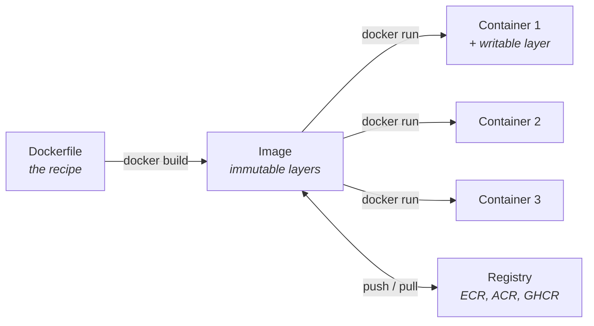
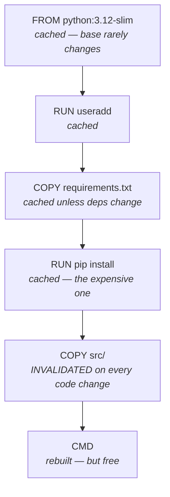

Containers are the format both clouds agree on. An image built on your laptop runs identically on ECS, AKS, App Service, a colleague's machine and a CI runner. That portability is the whole value proposition, and it is why "works on my machine" stops being a defence.

## Images vs containers



An **image** is a stack of read-only layers. A **container** is that stack plus a thin writable layer, with a process running in it. Ten containers from one image share the layers on disk — only the writable layer is per-container.

Two consequences:

1. **Containers are disposable.** Anything written to the writable layer disappears when the container is removed. Persistent state goes in a volume or an external service.
2. **Images are cacheable and shareable.** Pulling an image whose base layers you already have downloads only the difference.

:::hint{type=warning}
A container is **not a virtual machine.** It shares the host kernel and isolates using namespaces and cgroups. Consequences: containers start in milliseconds rather than seconds, you cannot run a Windows container on a Linux kernel (or vice versa), and the isolation boundary is weaker than a VM's — which matters if you are running untrusted code.
:::

## A Dockerfile worth copying

```dockerfile title="Dockerfile"
# ---------- build stage ----------
FROM python:3.12-slim AS builder

WORKDIR /build

# Copy ONLY the dependency manifest first. This layer is cached and only
# invalidated when requirements.txt itself changes — not on every code edit.
COPY requirements.txt .
RUN pip install --no-cache-dir --prefix=/install -r requirements.txt

# ---------- runtime stage ----------
FROM python:3.12-slim AS runtime

# Run as a non-root user
RUN groupadd --gid 10001 app \
 && useradd --uid 10001 --gid app --no-create-home --shell /usr/sbin/nologin app

WORKDIR /app

# Take only the installed packages from the builder — no pip cache, no build tools
COPY --from=builder /install /usr/local
COPY --chown=app:app src/ ./src/

ENV PYTHONUNBUFFERED=1 \
    PYTHONDONTWRITEBYTECODE=1 \
    LOG_LEVEL=INFO \
    PORT=8000

USER app
EXPOSE 8000

HEALTHCHECK --interval=30s --timeout=3s --start-period=10s --retries=3 \
  CMD python -c "import urllib.request,sys; sys.exit(0 if urllib.request.urlopen('http://localhost:8000/health').status==200 else 1)"

# Exec form, not shell form — the process gets PID 1 and receives SIGTERM
CMD ["python", "-m", "uvicorn", "src.main:app", "--host", "0.0.0.0", "--port", "8000"]
```

Every line there is a decision:

:::steps

1. **Multi-stage.** The builder has pip's cache and any compilers; the runtime image gets only the installed packages. Typically saves 300–800 MB.

2. **`COPY requirements.txt` before `COPY src/`.** Layer caching invalidates every layer after a changed one. Copying code first means every code edit reinstalls all dependencies — turning a five-second rebuild into a three-minute one. **This single ordering decision is the most consequential thing in most Dockerfiles.**

3. **Non-root user.** If the process is compromised, the attacker is not root inside the container. Many Kubernetes clusters refuse to run root containers at all.

4. **`PYTHONUNBUFFERED=1`.** Without it, Python buffers stdout and your logs appear in chunks — or not at all when the container is killed. This is the most common reason "my container has no logs".

5. **`HEALTHCHECK`.** Orchestrators use it to decide whether to route traffic and when to restart.

6. **Exec form `CMD`.** Shell form (`CMD python -m ...`) wraps the process in `/bin/sh`, which becomes PID 1 and does not forward signals. Your container then takes ten seconds to stop, because Docker gives up waiting and sends SIGKILL.

:::

And the `.dockerignore`, which people forget:

```text title=".dockerignore"
.git
.github
__pycache__/
*.pyc
.venv/
.pytest_cache/
.mypy_cache/
node_modules/
*.md
.env
*.log
tests/
```

:::hint{type=tip}
Without a `.dockerignore`, `COPY . .` sends your entire `.git` directory and virtualenv to the Docker daemon as build context. On a mature repo that is hundreds of megabytes on every build. It also risks **baking secrets into the image** — a `.env` file copied into a layer is retrievable from the image forever, even if a later layer deletes it.
:::

## Building and running

```bash title="docker-basics.sh"
docker build -t support-tool:1.0.0 .
docker build -t support-tool:1.0.0 --progress=plain --no-cache .   # debug the build

docker images
docker history support-tool:1.0.0        # per-layer size — find the fat layer

docker run -d --name support \
  -p 8000:8000 \
  -e LOG_LEVEL=DEBUG \
  -e DATABASE_URL="$DATABASE_URL" \
  --restart unless-stopped \
  support-tool:1.0.0

docker ps
docker logs -f support
docker logs --since 10m --tail 100 support
docker exec -it support /bin/sh
docker stats support
docker stop support && docker rm support
```

:::hint{type=danger}
**Never bake secrets into an image.** Not with `ENV`, not with `COPY`, not with a build argument — `docker history` reveals build arguments, and every layer is retrievable from the registry by anyone who can pull the image. Deleting the file in a later layer does not remove it from the earlier one.

Pass secrets at **run time** via environment variables, mounted files, or a secrets manager. In CI, use BuildKit secret mounts:

```dockerfile
RUN --mount=type=secret,id=pip_token \
    pip install --extra-index-url "https://$(cat /run/secrets/pip_token)@pypi.internal/simple" -r requirements.txt
```
:::

## Docker Compose

For local development with dependencies.

```yaml title="compose.yaml"
services:
  app:
    build:
      context: .
      target: runtime
    ports:
      - "8000:8000"
    environment:
      LOG_LEVEL: DEBUG
      DATABASE_URL: "mssql+pyodbc://sa:${SA_PASSWORD}@db:1433/tickets?driver=ODBC+Driver+18+for+SQL+Server&TrustServerCertificate=yes"
    depends_on:
      db:
        condition: service_healthy
    volumes:
      - ./src:/app/src:ro          # live reload in development only
    restart: unless-stopped

  db:
    image: mcr.microsoft.com/mssql/server:2022-latest
    environment:
      ACCEPT_EULA: "Y"
      MSSQL_SA_PASSWORD: ${SA_PASSWORD}
      MSSQL_PID: Developer
    ports:
      - "1433:1433"
    volumes:
      - mssql-data:/var/opt/mssql
    healthcheck:
      test: ["CMD-SHELL", "/opt/mssql-tools18/bin/sqlcmd -S localhost -U sa -P \"$$MSSQL_SA_PASSWORD\" -C -Q 'SELECT 1' || exit 1"]
      interval: 10s
      timeout: 5s
      retries: 12
      start_period: 30s

volumes:
  mssql-data:
```

```bash title="compose-commands.sh"
docker compose up -d
docker compose logs -f app
docker compose ps
docker compose exec db /opt/mssql-tools18/bin/sqlcmd -S localhost -U sa -P "$SA_PASSWORD" -C
docker compose down            # stop and remove containers
docker compose down -v         # ...and delete the volumes. Destroys the data.
```

:::hint{type=success}
That compose file gives you **SQL Server 2022 running locally in a container** — which means you can rebuild your Week 1 environment from scratch in ninety seconds on any machine, with no installer. For a Microsoft-stack support role, being able to say "I run SQL Server in Docker for local work" is a small but real credibility signal.
:::

`depends_on` with `condition: service_healthy` is important: without it, `depends_on` only waits for the container to *start*, not to be *ready*. SQL Server takes 20–30 seconds to accept connections, and your app will crash-loop in the meantime.

## Layer caching



The rule: **order instructions from least to most frequently changing.** Everything after a changed layer is rebuilt.

Other size wins:

```dockerfile
# Combine RUN steps so the cleanup happens in the SAME layer.
# In separate layers, the deleted files still exist in the earlier one.
RUN apt-get update \
 && apt-get install -y --no-install-recommends curl ca-certificates \
 && rm -rf /var/lib/apt/lists/*
```

```bash title="image-sizes.sh"
docker images --format "table {{.Repository}}\t{{.Tag}}\t{{.Size}}"
# python:3.12            ~1.02 GB   full
# python:3.12-slim       ~130 MB    good default
# python:3.12-alpine     ~55 MB     smallest, but musl libc breaks some wheels
# gcr.io/distroless/...  ~50 MB     no shell — most secure, hardest to debug
```

:::hint{type=warning}
Alpine looks attractive and often is not. It uses **musl** rather than glibc, so Python packages with compiled extensions have no prebuilt wheel and must compile from source — turning a 20-second build into an 8-minute one, and occasionally producing subtle runtime differences. `-slim` is the right default for Python. Reach for Alpine only when you have measured that the size actually matters.
:::

## Debugging containers

| Symptom | Investigate |
|---|---|
| Exits immediately | `docker logs <id>`. Usually the main process finished or crashed on startup |
| `Exit code 137` | **OOM-killed.** Raise the memory limit or fix the leak |
| `Exit code 139` | Segfault — often an architecture mismatch (arm64 image on amd64) |
| No logs at all | Output buffering. Set `PYTHONUNBUFFERED=1`, or logging to a file inside the container instead of stdout |
| Cannot reach it from the host | `-p` mapping missing, or the app is bound to `127.0.0.1` instead of `0.0.0.0` |
| Cannot reach another container | Use the **service name** as the hostname, not `localhost` |
| Slow build | Layer ordering, or a missing `.dockerignore` |
| Works locally, fails in CI | Architecture. Build with `--platform linux/amd64` on an Apple Silicon machine |

```bash title="debug.sh"
docker inspect support | jq '.[0].State'
docker run --rm -it --entrypoint /bin/sh support-tool:1.0.0   # poke around without starting the app
docker cp support:/app/config.json ./config.json
docker diff support                                            # what changed in the writable layer
docker exec support env | sort                                 # what does it actually see?
```

:::hint{type=tip}
`docker run --rm -it --entrypoint /bin/sh <image>` is the single most useful debugging command. It starts the image without running the application, so you can check that files landed where you expected, environment variables are present, and dependencies are installed. Most "why won't this start?" questions are answered in thirty seconds this way.
:::

```quiz
question: Your Dockerfile copies source code before installing dependencies. What is the practical consequence?
options:
  - The image will be larger
  - The application will not start
  - Every code change invalidates the dependency-install layer, so every build reinstalls everything
  - Secrets will be exposed in the image history
answer: 2
explanation: Docker invalidates every layer after a changed one. With code copied first, editing one line forces a full dependency reinstall — a five-second rebuild becomes minutes. Copy the dependency manifest first, install, then copy the code.
```

## Image security

```bash title="security.sh"
docker scout cves support-tool:1.0.0        # or: trivy image support-tool:1.0.0

# Pin the base image by digest for reproducibility
# FROM python:3.12-slim@sha256:abc123...
```

Baseline practices:

- **Pin base images by digest** in production. Tags are mutable.
- **Rebuild regularly** even when your code has not changed — base images accumulate CVE fixes.
- **Run as non-root**, and set `--read-only` with `tmpfs` for scratch space where you can.
- **Drop capabilities**: `--cap-drop=ALL --security-opt=no-new-privileges`.
- **Scan in CI** and fail the build on high-severity, fixable vulnerabilities.

## Exercise

:::checklist{title="Day 26 checklist"}
- [ ] Write a multi-stage Dockerfile for a small Python API
- [ ] Build it; note the size. Then break the multi-stage into one stage and compare
- [ ] Deliberately put `COPY src/` before `COPY requirements.txt`; time a rebuild after a one-line change; fix it and time again
- [ ] Add a `.dockerignore`; observe the change in build context size
- [ ] Run as non-root and confirm with `docker exec support whoami`
- [ ] Add a `HEALTHCHECK` and observe the health status in `docker ps`
- [ ] Use shell-form `CMD`, time `docker stop`, switch to exec form, time it again
- [ ] Write a compose file running your app plus SQL Server, with a healthcheck gate
- [ ] Connect to the containerised SQL Server from Azure Data Studio
- [ ] Build the lab schema inside it by running your repo's `sql/schema/lab-seed.sql` — and note what you have to change, since there is no `SalesLT.Customer` to draw customer IDs from
- [ ] Break the container in three ways (OOM, wrong bind address, buffered logs) and diagnose each
- [ ] Scan the image and read the report
- [ ] `docker compose down -v` and `docker system prune -a` to reclaim disk
:::

:::details{summary="Why does my container exit immediately with code 0?"}
Because the main process finished. A container lives exactly as long as PID 1.

The usual causes:

1. **The command completed.** `CMD ["python", "script.py"]` where the script runs and returns — that is correct behaviour, not a bug.
2. **The service daemonised.** A process that forks to the background exits in the foreground, so Docker sees PID 1 finish. Run servers in the **foreground** — `nginx -g "daemon off;"`, `gunicorn` without `--daemon`.
3. **Nothing to do.** `CMD ["/bin/bash"]` without `-it` gets no TTY, reads EOF and exits.

Diagnose with `docker logs <id>` and `docker inspect <id> --format '{{.State.ExitCode}} {{.State.Error}}'`.
:::

## Where this is going

Tomorrow: containerise your actual project, push it to a registry, and run it in the cloud — on ECR/ECS or Azure Container Registry/Container Apps. The first time your own image runs somewhere you did not build it, the portability argument stops being theoretical.
