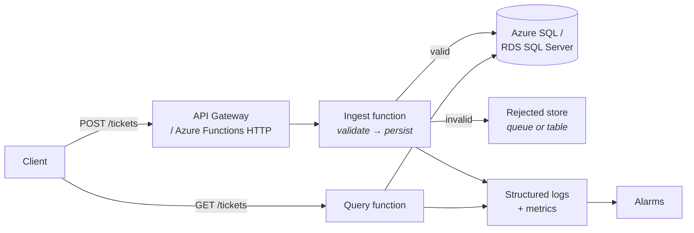
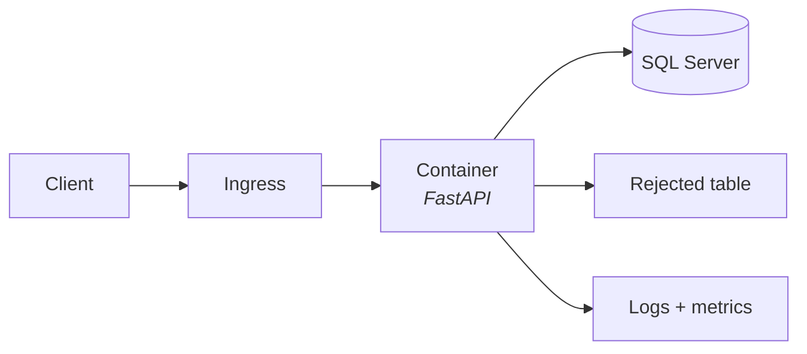

Today you design, and only design. Resisting the urge to start coding is the point — a project designed in advance takes less total time than one discovered while typing, and the design document is itself an interview artefact.

## The brief

> A tool that ingests support tickets submitted as JSON, validates them against a published schema, stores them in SQL Server / Azure SQL, and exposes a simple query interface. Deployed via CI/CD, logged and monitored.

That is deliberately close to what a real support-tooling team builds. It also exercises every skill in this course, which is why it is the right project.

## Requirements

### Functional

| # | Requirement |
|---|---|
| F1 | Accept a ticket as JSON over HTTP POST |
| F2 | Validate against a published JSON Schema; reject with field-level detail |
| F3 | Persist valid tickets to SQL Server |
| F4 | Be idempotent — the same `ticketId` submitted twice must not create two rows |
| F5 | Capture rejected payloads for later inspection rather than discarding them |
| F6 | Query tickets by customer, status, priority and date range |
| F7 | Provide a summary endpoint: counts by status and priority over a window |
| F8 | Expose `/health` and `/ready` |

### Non-functional

| # | Requirement |
|---|---|
| N1 | p95 ingestion latency under 500 ms |
| N2 | Structured JSON logs with a correlation ID on every line |
| N3 | Metrics for ingested, rejected and latency |
| N4 | At least one alarm with a documented runbook action |
| N5 | Deployed by CI/CD with no manual steps |
| N6 | No credentials in source, in the image, or in CI |

### Explicit non-scope

:::hint{type=success}
Writing down what you are **not** building is a mark of engineering judgement, and interviewers notice it.

- **No authentication.** Scoped as an internal service behind a gateway. *Would add: API keys via a gateway, or Entra ID app registration.*
- **No UI.** API only. *Would add: a small React page, or hand it to an existing portal.*
- **No full-text search on ticket bodies.** *Would add: SQL Server full-text indexing, or Azure AI Search.*
- **No multi-tenancy.** Single-organisation assumption throughout.
- **No ticket workflow.** Ingestion and query only — no assignment, SLA timers or escalation.

Each of those has a one-line answer for "how would you add it?", which is exactly what an interviewer will ask.
:::

## Architecture

Two options. Pick one and record why.

:::tabs

:::tab{title="Option A — Serverless (recommended)"}


- **Pro**: scales to zero, cheapest to run, least infrastructure, fastest to deploy.
- **Con**: cold starts; the Lambda/Functions-to-SQL connection issue from Day 13.
- **Mitigation**: reserved concurrency, or a connection-pooling proxy.
:::

:::tab{title="Option B — Containerised API"}


- **Pro**: one artefact, real connection pooling, no cold starts, trivially runnable locally with compose.
- **Con**: always-on cost unless the platform scales to zero; more to configure.
- **Note**: Azure Container Apps scales to zero, which removes much of the cost objection.
:::

:::

:::hint{type=tip}
Either is defensible. What matters is that you can **articulate the trade-off**. "I chose containers because connection pooling to SQL Server is materially simpler than managing serverless concurrency against a connection limit, and Container Apps still scales to zero so the cost argument mostly holds" is a much better answer than "I used containers."
:::

Write it down as an ADR:

```markdown title="docs/adr/0001-compute-platform.md"
# ADR 0001 — Compute platform for the ingestion service

**Status:** Accepted · **Date:** 2026-08-06

## Context
The service must accept HTTP POSTs, validate against JSON Schema and write to
SQL Server. Traffic is expected to be bursty and low-volume. Cost must be near
zero when idle. Local development must be straightforward.

## Options
1. **Azure Functions (Consumption)** — cheapest, scales to zero, but each
   concurrent execution opens its own SQL connection, and SQL Server connection
   limits are the binding constraint under burst.
2. **Container on Azure Container Apps** — one artefact, real connection pooling,
   still scales to zero, runs identically under docker compose locally.
3. **VM running the API** — most control, most operational burden, no scale to zero.

## Decision
Option 2. Connection pooling to SQL Server is the deciding factor; Container Apps
retains scale-to-zero so the cost advantage of option 1 largely disappears.

## Consequences
- Cold start on the first request after idle (~2–4 s). Acceptable for an internal tool.
- We must build and publish a container image — already covered by the Day 27 pipeline.
- Local development uses the same image, removing an entire class of environment bug.
- If traffic grows past a single replica's pooling capacity, revisit and consider
  a connection proxy.
```

## The database schema

```sql title="sql/schema/001_tickets.sql"
CREATE SCHEMA support;
GO

CREATE TABLE support.Customers (
    CustomerId   INT           NOT NULL,
    Name         NVARCHAR(200) NOT NULL,
    CreatedAtUtc DATETIME2(3)  NOT NULL CONSTRAINT DF_Customers_Created DEFAULT SYSUTCDATETIME(),
    CONSTRAINT PK_Customers PRIMARY KEY CLUSTERED (CustomerId)
);
GO

CREATE TABLE support.Tickets (
    TicketKey     BIGINT IDENTITY(1,1) NOT NULL,     -- surrogate, clustered
    TicketId      CHAR(10)             NOT NULL,     -- natural key, 'TKT-004217'
    CustomerId    INT                  NOT NULL,
    Subject       NVARCHAR(200)        NOT NULL,
    Body          NVARCHAR(MAX)        NULL,
    Priority      VARCHAR(10)          NOT NULL,
    Status        VARCHAR(20)          NOT NULL
                  CONSTRAINT DF_Tickets_Status DEFAULT 'open',
    ReporterEmail NVARCHAR(320)        NULL,
    CreatedAtUtc  DATETIME2(3)         NOT NULL,     -- when the caller says it was created
    IngestedAtUtc DATETIME2(3)         NOT NULL
                  CONSTRAINT DF_Tickets_Ingested DEFAULT SYSUTCDATETIME(),
    SourcePayload NVARCHAR(MAX)        NOT NULL,     -- the original JSON, verbatim

    CONSTRAINT PK_Tickets   PRIMARY KEY CLUSTERED (TicketKey),
    CONSTRAINT UQ_Tickets_TicketId UNIQUE (TicketId),          -- enforces idempotency
    CONSTRAINT FK_Tickets_Customers FOREIGN KEY (CustomerId)
        REFERENCES support.Customers (CustomerId),
    CONSTRAINT CK_Tickets_Priority CHECK (Priority IN ('low','normal','high','urgent')),
    CONSTRAINT CK_Tickets_Status   CHECK (Status   IN ('open','pending','resolved','closed'))
);
GO

-- The query pattern from F6: filter by customer, order by time
CREATE NONCLUSTERED INDEX IX_Tickets_Customer_Created
    ON support.Tickets (CustomerId, CreatedAtUtc DESC)
    INCLUDE (TicketId, Subject, Priority, Status);

-- The dashboard pattern from F7
CREATE NONCLUSTERED INDEX IX_Tickets_Status_Created
    ON support.Tickets (Status, CreatedAtUtc DESC)
    INCLUDE (Priority, CustomerId);
GO

CREATE TABLE support.RejectedPayloads (
    RejectionId   BIGINT IDENTITY(1,1) NOT NULL,
    ReceivedAtUtc DATETIME2(3)  NOT NULL CONSTRAINT DF_Rejected_Received DEFAULT SYSUTCDATETIME(),
    CorrelationId UNIQUEIDENTIFIER NOT NULL,
    Payload       NVARCHAR(MAX) NOT NULL,
    Errors        NVARCHAR(MAX) NOT NULL,             -- JSON array of field-level problems
    CONSTRAINT PK_RejectedPayloads PRIMARY KEY CLUSTERED (RejectionId)
);
GO
```

Design notes worth being able to defend:

:::steps

1. **Surrogate `TicketKey` clustered, natural `TicketId` unique.** The clustered index is a narrow, ever-increasing `BIGINT`, so inserts always append and never split pages. The unique constraint on `TicketId` is what actually enforces idempotency — at the engine level, not in application code.

2. **Both `CreatedAtUtc` and `IngestedAtUtc`.** One is what the caller claims; the other is what we observed. When they diverge by hours, that is itself diagnostic information about a stuck upstream queue.

3. **`SourcePayload` kept verbatim.** Disk is cheap; arguments about what a customer actually sent are expensive. This single column will settle support disputes.

4. **`CHECK` constraints mirroring the JSON Schema enums.** Defence in depth — if a bug bypasses validation, the database still refuses.

5. **Indexes designed from the queries**, not guessed. Each maps to a stated requirement, with `INCLUDE` columns making them covering.

6. **`NVARCHAR(320)` for email** — 64 local part + `@` + 255 domain, per the RFC limits.

:::

:::hint{type=warning}
`CHAR(10)` for `TicketId` assumes the exact format `TKT-######`. That is a deliberate constraint — it makes the column fixed-width and narrow — but it means a format change is a schema migration. Record that in the ADR, because it is exactly the kind of decision that looks arbitrary later.
:::

## The ingestion contract

Reuse the Day 9 schema, tightened:

```json title="schemas/v1/ticket.schema.json"
{
  "$schema": "https://json-schema.org/draft/2020-12/schema",
  "$id": "https://example.com/schemas/v1/ticket.schema.json",
  "title": "SupportTicket",
  "type": "object",
  "required": ["ticketId", "customerId", "subject", "priority", "createdAt"],
  "additionalProperties": false,
  "properties": {
    "ticketId":   { "type": "string", "pattern": "^TKT-[0-9]{6}$" },
    "customerId": { "type": "integer", "minimum": 1 },
    "subject":    { "type": "string", "minLength": 3, "maxLength": 200 },
    "body":       { "type": "string", "maxLength": 20000 },
    "priority":   { "enum": ["low", "normal", "high", "urgent"] },
    "status":     { "enum": ["open", "pending", "resolved", "closed"], "default": "open" },
    "createdAt":  { "type": "string", "format": "date-time" },
    "reporter": {
      "type": "object",
      "required": ["email"],
      "additionalProperties": false,
      "properties": {
        "name":  { "type": "string", "maxLength": 200 },
        "email": { "type": "string", "format": "email", "maxLength": 320 }
      }
    }
  }
}
```

## The API surface

| Method | Path | Behaviour |
|---|---|---|
| `POST` | `/v1/tickets` | 201 created · **200 already exists** (idempotent) · 400 validation failed · 503 database unavailable |
| `GET` | `/v1/tickets` | Query: `customerId`, `status`, `priority`, `from`, `to`, `limit`, `offset` |
| `GET` | `/v1/tickets/{ticketId}` | 200 or 404 |
| `GET` | `/v1/summary` | Counts by status and priority over a window |
| `GET` | `/health` | Liveness — process only |
| `GET` | `/ready` | Readiness — includes a database check |

:::hint{type=tip}
Returning **200 rather than 201** for a duplicate `ticketId` is the idempotent behaviour: the caller's intent ("this ticket should exist") is satisfied, so it is not an error. Returning 409 Conflict is also defensible and forces the caller to handle it. Pick one, **document it**, and be able to explain the reasoning — that is the actual test.
:::

## Three-day plan

| Day | Deliverable | Done when |
|---|---|---|
| **31** | Schema + ingestion | Migrations run; POST validates, persists, is idempotent; rejects are captured; tests pass |
| **32** | Deploy + CI/CD | Image builds in CI; deployed to the cloud; public URL responding; no manual steps |
| **33** | Observability + docs | Structured logs, metrics, one alarm, runbook, README with an architecture diagram |

:::hint{type=danger}
Three days is tight. **Protect the scope.** If you fall behind, cut features in this order: `/summary`, then the query filters beyond `customerId`, then the rejected-payload store. Do **not** cut: idempotency, tests, CI/CD, or logging — those are the things that make it look like professional work rather than a tutorial.
:::

```quiz
question: Why enforce ticket idempotency with a UNIQUE constraint on TicketId rather than an application-level "check then insert"?
options:
  - It is faster to write in code
  - The database enforces it atomically, so two concurrent requests cannot both pass the check and insert
  - UNIQUE constraints automatically create a clustered index
  - It avoids the need for a primary key
answer: 1
explanation: A check-then-insert has a race window: two concurrent requests can both find no existing row and both insert. A UNIQUE constraint is enforced atomically by the engine, so the second insert fails deterministically and the application can translate that into the idempotent 200 response.
```

## Exercise

:::checklist{title="Day 30 checklist"}
- [ ] Requirements written: functional, non-functional, and explicit non-scope
- [ ] Architecture chosen, with a Mermaid diagram
- [ ] `docs/adr/0001-compute-platform.md` written
- [ ] A second ADR written for the idempotency approach
- [ ] Database schema written as a migration file with keys, constraints and indexes
- [ ] Every index justified against a stated requirement, in a comment
- [ ] JSON Schema finalised at `schemas/v1/`
- [ ] API surface documented, including every status code and what it means
- [ ] Three-day plan written with per-day acceptance criteria
- [ ] Cut list agreed with yourself in advance
- [ ] Everything committed via a pull request
:::

:::details{summary="Why not just use MERGE for the upsert?"}
`MERGE` is the obvious T-SQL answer and has a long history of subtle bugs — including race conditions under concurrency without `HOLDLOCK`, and several since-fixed engine defects. Aaron Bertrand's well-known write-up documents the specifics.

The safer pattern for a simple upsert:

```sql
BEGIN TRY
    INSERT INTO support.Tickets (TicketId, CustomerId, Subject, Body, Priority,
                                 Status, ReporterEmail, CreatedAtUtc, SourcePayload)
    VALUES (@TicketId, @CustomerId, @Subject, @Body, @Priority,
            @Status, @ReporterEmail, @CreatedAtUtc, @SourcePayload);
    SELECT 'created' AS Outcome;
END TRY
BEGIN CATCH
    IF ERROR_NUMBER() = 2627           -- unique constraint violation
        SELECT 'exists' AS Outcome;
    ELSE
        THROW;
END CATCH
```

Insert-and-catch-2627 is atomic, race-free and needs no lock hints. Knowing *why* you avoided `MERGE` is a genuinely strong T-SQL answer in an interview.
:::

## Where this is going

Tomorrow you build it: the migration, the validation, the persistence layer, and the tests that prove idempotency actually works.
