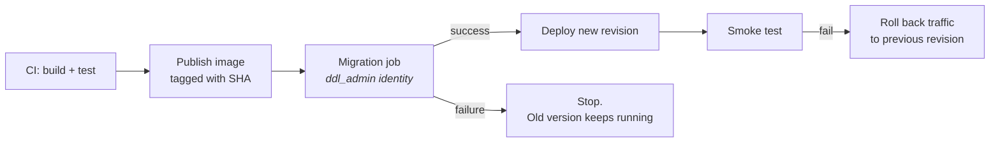

Build day two. By the end, `git push` will build, test, publish, migrate, deploy and verify — with no human step and no password anywhere in the repository.

## Provision the database

:::tabs

:::tab{title="Azure SQL"}
```bash
RG=rg-support-tool
LOC=uksouth
SQLSRV="sql-support-$RANDOM"
DB=tickets

az group create -n $RG -l $LOC

az sql server create \
  --name $SQLSRV --resource-group $RG --location $LOC \
  --enable-ad-only-auth \
  --external-admin-name "$(az ad signed-in-user show --query userPrincipalName -o tsv)" \
  --external-admin-sid  "$(az ad signed-in-user show --query id -o tsv)" \
  --external-admin-type User

az sql db create \
  --resource-group $RG --server $SQLSRV --name $DB \
  --edition GeneralPurpose --compute-model Serverless \
  --family Gen5 --capacity 1 --auto-pause-delay 60 \
  --backup-storage-redundancy Local

# Allow Azure services (Container Apps) to reach it
az sql server firewall-rule create \
  --resource-group $RG --server $SQLSRV \
  --name AllowAzureServices --start-ip-address 0.0.0.0 --end-ip-address 0.0.0.0
```

:::hint{type=success}
`--enable-ad-only-auth` **disables SQL logins entirely.** There is no `sa` password to leak, rotate or accidentally commit — every connection authenticates through Entra ID. Combined with `--auto-pause-delay 60`, the serverless tier pauses after an hour of inactivity and costs almost nothing while idle. Both are excellent defaults for this project and both are worth mentioning in an interview.
:::
:::

:::tab{title="Amazon RDS"}
```bash
aws rds create-db-instance \
  --db-instance-identifier support-tool-sql \
  --db-instance-class db.t3.micro \
  --engine sqlserver-ex \
  --master-username admin \
  --master-user-password "$(aws secretsmanager get-random-password \
       --exclude-punctuation --password-length 24 --query RandomPassword --output text)" \
  --allocated-storage 20 \
  --backup-retention-period 7 \
  --no-publicly-accessible \
  --enable-iam-database-authentication
```

RDS for SQL Server does **not** support IAM database authentication (it works for MySQL and PostgreSQL only), so store the password in Secrets Manager and grant the task role permission to read it. Rotate on a schedule.
:::

:::

## Connect without credentials

```python title="src/db.py (connection string)"
import struct
from azure.identity import DefaultAzureCredential

SQL_COPT_SS_ACCESS_TOKEN = 1256      # pyodbc/ODBC constant for a token connection


def _entra_token_attrs() -> dict[int, bytes]:
    """Fetch an Entra token and pack it the way the ODBC driver expects."""
    credential = DefaultAzureCredential()
    token = credential.get_token("https://database.windows.net/.default").token
    encoded = token.encode("utf-16-le")
    packed = struct.pack("<I", len(encoded)) + encoded
    return {SQL_COPT_SS_ACCESS_TOKEN: packed}


def connect() -> pyodbc.Connection:
    if settings.use_entra_auth:
        return pyodbc.connect(settings.database_url, attrs_before=_entra_token_attrs())
    return pyodbc.connect(settings.database_url)
```

```bash title="grant-access.sh"
# Give the Container App's managed identity a database login
CA_PRINCIPAL=$(az containerapp show -n ca-support-tool -g $RG --query identity.principalId -o tsv)
CA_NAME=ca-support-tool

# Run against the database as the Entra admin
sqlcmd -S "$SQLSRV.database.windows.net" -d tickets -G -Q "
CREATE USER [$CA_NAME] FROM EXTERNAL PROVIDER;
ALTER ROLE db_datareader ADD MEMBER [$CA_NAME];
ALTER ROLE db_datawriter ADD MEMBER [$CA_NAME];
"
```

:::hint{type=success}
The application's identity gets `db_datareader` and `db_datawriter` — **not** `db_owner`. It can read and write rows; it cannot drop a table. Migrations run under a separate, more privileged identity, only during deployment.

That separation is real least privilege applied to a database, and it is the kind of detail that distinguishes a portfolio project from a tutorial.
:::

## Running migrations safely

Migrations must run **before** the new code starts, and must not break the version still running.



```bash title="migration-job.sh"
az containerapp job create \
  --name job-support-migrate \
  --resource-group $RG \
  --environment cae-support \
  --trigger-type Manual \
  --replica-timeout 300 \
  --replica-retry-limit 1 \
  --image "$ACR.azurecr.io/support-tool:$SHA" \
  --command "python" "-m" "src.migrate" \
  --system-assigned \
  --env-vars DATABASE_CONNECTION_STRING=secretref:db-connection

az containerapp job start --name job-support-migrate --resource-group $RG
```

:::hint{type=danger}
**Every migration must be backwards-compatible** with the currently running version, because during a rolling deploy both versions are live against the same schema. Day 15's expand/contract pattern is not optional here:

| Change | Safe? | Do instead |
|---|---|---|
| Add a nullable column | ✅ | — |
| Add a column with a default | ✅ (SQL Server 2012+ is metadata-only for most types) | — |
| Add an index | ✅ (use `ONLINE = ON` on Enterprise/Azure SQL) | — |
| Add a `NOT NULL` column | ❌ | Add nullable → backfill → add the constraint in a later release |
| Rename a column | ❌ | Add new → dual-write → migrate reads → drop old |
| Drop a column | ❌ | Stop reading it, ship, **then** drop in a later release |
| Widen `VARCHAR(50)` → `VARCHAR(200)` | ✅ | — |
| Narrow `VARCHAR(200)` → `VARCHAR(50)` | ❌ | Almost never worth it |
:::

## The pipeline

```yaml title=".github/workflows/deploy.yml"
name: Build, migrate and deploy

on:
  push:
    branches: [main]
  workflow_dispatch:

permissions:
  contents: read
  id-token: write

env:
  RESOURCE_GROUP: rg-support-tool
  APP_NAME: ca-support-tool
  JOB_NAME: job-support-migrate

jobs:
  test:
    runs-on: ubuntu-latest
    steps:
      - uses: actions/checkout@v4
      - uses: actions/setup-python@v5
        with: { python-version: '3.12', cache: pip }
      - run: pip install -r requirements.txt -r requirements-dev.txt
      - run: ruff check src/ tests/
      - run: mypy src/ --ignore-missing-imports
      - name: Tests (spins up SQL Server via testcontainers)
        run: pytest -v --cov=src --cov-report=term-missing
      - name: Schema examples must validate
        run: python -m src.validate_examples schemas/

  build:
    needs: test
    runs-on: ubuntu-latest
    outputs:
      image: ${{ steps.meta.outputs.image }}
    steps:
      - uses: actions/checkout@v4
      - id: meta
        run: echo "image=${{ vars.ACR_NAME }}.azurecr.io/support-tool:${GITHUB_SHA::7}" >> "$GITHUB_OUTPUT"
      - uses: azure/login@v2
        with:
          client-id: ${{ vars.AZURE_CLIENT_ID }}
          tenant-id: ${{ vars.AZURE_TENANT_ID }}
          subscription-id: ${{ vars.AZURE_SUBSCRIPTION_ID }}
      - run: az acr login --name ${{ vars.ACR_NAME }}
      - uses: docker/setup-buildx-action@v3
      - uses: docker/build-push-action@v6
        with:
          context: .
          platforms: linux/amd64
          push: true
          tags: ${{ steps.meta.outputs.image }}
          cache-from: type=gha
          cache-to: type=gha,mode=max
      - uses: aquasecurity/trivy-action@0.24.0
        with:
          image-ref: ${{ steps.meta.outputs.image }}
          severity: CRITICAL,HIGH
          ignore-unfixed: true
          exit-code: '1'

  migrate:
    needs: build
    runs-on: ubuntu-latest
    environment: production
    steps:
      - uses: azure/login@v2
        with:
          client-id: ${{ vars.AZURE_CLIENT_ID }}
          tenant-id: ${{ vars.AZURE_TENANT_ID }}
          subscription-id: ${{ vars.AZURE_SUBSCRIPTION_ID }}
      - name: Point the migration job at this image and run it
        run: |
          az containerapp job update -n "$JOB_NAME" -g "$RESOURCE_GROUP" \
            --image "${{ needs.build.outputs.image }}"
          EXEC=$(az containerapp job start -n "$JOB_NAME" -g "$RESOURCE_GROUP" \
                  --query name -o tsv)
          for i in $(seq 1 30); do
            STATUS=$(az containerapp job execution show -n "$JOB_NAME" \
                      -g "$RESOURCE_GROUP" --job-execution-name "$EXEC" \
                      --query properties.status -o tsv)
            echo "migration status: $STATUS"
            [ "$STATUS" = "Succeeded" ] && exit 0
            [ "$STATUS" = "Failed" ] && { echo "Migration failed" >&2; exit 1; }
            sleep 10
          done
          echo "Migration timed out" >&2; exit 1

  deploy:
    needs: [build, migrate]
    runs-on: ubuntu-latest
    environment: production
    steps:
      - uses: azure/login@v2
        with:
          client-id: ${{ vars.AZURE_CLIENT_ID }}
          tenant-id: ${{ vars.AZURE_TENANT_ID }}
          subscription-id: ${{ vars.AZURE_SUBSCRIPTION_ID }}

      - name: Record the current revision for rollback
        id: current
        run: |
          echo "revision=$(az containerapp revision list -n "$APP_NAME" -g "$RESOURCE_GROUP" \
            --query "[?properties.active].name | [0]" -o tsv)" >> "$GITHUB_OUTPUT"

      - name: Deploy
        run: |
          az containerapp update -n "$APP_NAME" -g "$RESOURCE_GROUP" \
            --image "${{ needs.build.outputs.image }}" \
            --revision-suffix "sha${GITHUB_SHA::7}"

      - name: Smoke test
        id: smoke
        run: |
          FQDN=$(az containerapp show -n "$APP_NAME" -g "$RESOURCE_GROUP" \
                  --query properties.configuration.ingress.fqdn -o tsv)
          for i in $(seq 1 24); do
            if curl -fsS --max-time 10 "https://$FQDN/ready" | grep -q '"status":"ok"'; then
              echo "ready after $((i*5))s"

              # Functional check: ingest a ticket and confirm idempotency
              TID="TKT-$(date +%H%M%S)"
              BODY=$(printf '{"ticketId":"%s","customerId":1,"subject":"smoke test",
                              "priority":"low","createdAt":"%s"}' \
                     "$TID" "$(date -u +%FT%TZ)")
              C1=$(curl -s -o /dev/null -w '%{http_code}' -X POST "https://$FQDN/v1/tickets" \
                    -H 'content-type: application/json' -d "$BODY")
              C2=$(curl -s -o /dev/null -w '%{http_code}' -X POST "https://$FQDN/v1/tickets" \
                    -H 'content-type: application/json' -d "$BODY")
              [ "$C1" = "201" ] && [ "$C2" = "200" ] && exit 0
              echo "Idempotency check failed: $C1 then $C2" >&2
              exit 1
            fi
            sleep 5
          done
          echo "Never became ready" >&2; exit 1

      - name: Roll back on failure
        if: failure() && steps.current.outputs.revision != ''
        run: |
          az containerapp ingress traffic set -n "$APP_NAME" -g "$RESOURCE_GROUP" \
            --revision-weight "${{ steps.current.outputs.revision }}=100"
          echo "::error::Deployment failed; traffic returned to ${{ steps.current.outputs.revision }}"
```

:::hint{type=success}
The smoke test does not merely check `/health` — it **ingests a ticket twice and asserts 201 then 200.** That verifies the database connection, the schema, the validator and the idempotency guarantee in one step. A health check that only confirms the process is running will happily pass while the database is unreachable.
:::

## Infrastructure as code

Do not leave the infrastructure as a sequence of `az` commands in your shell history.

```bicep title="infra/main.bicep"
param env string = 'prod'
param location string = resourceGroup().location
param containerImage string

var prefix = 'support-${env}'

resource logs 'Microsoft.OperationalInsights/workspaces@2023-09-01' = {
  name: 'law-${prefix}'
  location: location
  properties: { retentionInDays: 30, sku: { name: 'PerGB2018' } }
}

resource cae 'Microsoft.App/managedEnvironments@2024-03-01' = {
  name: 'cae-${prefix}'
  location: location
  properties: {
    appLogsConfiguration: {
      destination: 'log-analytics'
      logAnalyticsConfiguration: {
        customerId: logs.properties.customerId
        sharedKey: logs.listKeys().primarySharedKey
      }
    }
  }
}

resource app 'Microsoft.App/containerApps@2024-03-01' = {
  name: 'ca-${prefix}'
  location: location
  identity: { type: 'SystemAssigned' }
  properties: {
    managedEnvironmentId: cae.id
    configuration: {
      ingress: { external: true, targetPort: 8000, transport: 'auto' }
    }
    template: {
      containers: [{
        name: 'api'
        image: containerImage
        resources: { cpu: json('0.5'), memory: '1.0Gi' }
        env: [
          { name: 'ENVIRONMENT', value: env }
          { name: 'LOG_LEVEL', value: 'INFO' }
          { name: 'USE_ENTRA_AUTH', value: 'true' }
        ]
        probes: [
          { type: 'Startup',   httpGet: { path: '/health', port: 8000 }, failureThreshold: 20, periodSeconds: 3 }
          { type: 'Liveness',  httpGet: { path: '/health', port: 8000 }, periodSeconds: 30 }
          { type: 'Readiness', httpGet: { path: '/ready',  port: 8000 }, periodSeconds: 10 }
        ]
      }]
      scale: {
        minReplicas: 0
        maxReplicas: 5
        rules: [{ name: 'http', http: { metadata: { concurrentRequests: '50' } } }]
      }
    }
  }
}

output fqdn string = app.properties.configuration.ingress.fqdn
output principalId string = app.identity.principalId
```

```quiz
question: Why should database migrations run as a separate job before the deployment, rather than at application startup?
options:
  - Application startup is too slow to run migrations
  - A failed migration stops the pipeline with the old version still serving, and multiple replicas starting at once would race to apply the same migration
  - Migrations require a different programming language
  - Container platforms forbid DDL from application containers
answer: 1
explanation: Two reasons, both decisive. A separate job gives a clean failure point — the old version keeps running and no broken deployment occurs. And with several replicas starting simultaneously, startup migrations race each other against the same schema.
```

## Exercise

:::checklist{title="Day 32 checklist"}
- [ ] Managed database provisioned, with SQL logins disabled if the platform allows
- [ ] Application connects using a managed identity or IAM role — **no password in code, image or CI**
- [ ] Application's database user has only `db_datareader` and `db_datawriter`
- [ ] Migration job created, running under a separate, more privileged identity
- [ ] Container deployed with startup, liveness and readiness probes
- [ ] Public URL responding; `/ready` correctly reports the database state
- [ ] CI pipeline: test → build → scan → migrate → deploy → smoke test
- [ ] OIDC federation configured; **zero secrets** in GitHub
- [ ] Smoke test verifies idempotency, not just liveness
- [ ] Automatic rollback tested by deliberately deploying a broken image
- [ ] Infrastructure defined in Bicep or Terraform and committed
- [ ] `what-if` / `plan` run and the output reviewed
- [ ] A backwards-incompatible migration attempted and its failure understood
:::

:::details{summary="Deployment succeeded but every request returns 503"}
Work down this list:

1. **`/ready` output** — it names the failing dependency. Start there rather than guessing.
2. **Firewall.** Azure SQL needs "Allow Azure services" or an explicit rule; RDS needs the security group to permit the app's subnet.
3. **The database user does not exist.** `CREATE USER … FROM EXTERNAL PROVIDER` is a manual step easy to forget; the app authenticates to the *server* and then fails to find a *database* login.
4. **Wrong token audience.** The scope must be `https://database.windows.net/.default`. A subtly wrong scope produces a login failure that looks like a permissions problem.
5. **Serverless database paused.** The first connection after auto-pause takes 30–60 seconds to resume and may time out. Raise the connection timeout, or accept a slow first request.
6. **Migrations never ran.** The tables genuinely do not exist. Check the migration job's execution log.

Note that steps 3, 4 and 5 all *present* as connection failures with different underlying causes — which is exactly why `/ready` should return the actual error text rather than a generic "degraded".
:::

## Where this is going

Tomorrow finishes the project: structured logging in production, metrics, an alarm, a runbook, and the README that determines whether a hiring manager spends ninety seconds or ten minutes on your repository.
