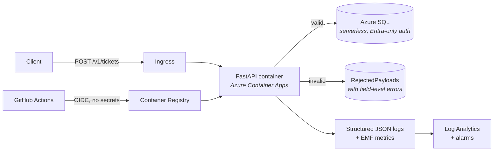

Final build day. The service works and is deployed; today it becomes **operable**, and the repository becomes something worth showing.

Be honest about the priority order here. If you run short of time, the README matters more than the fourth metric — because an unreadable repository is an invisible one.

## Structured logging in production

You built `JsonFormatter` on Day 18 and used it locally. Now confirm it survives the journey to the cloud.

```python title="src/logging_setup.py (production additions)"
import json, logging, os, sys, uuid
from contextvars import ContextVar
from datetime import datetime, timezone

correlation_id: ContextVar[str] = ContextVar("correlation_id", default="")

SERVICE = os.environ.get("SERVICE_NAME", "support-ingest")
ENV = os.environ.get("ENVIRONMENT", "local")
VERSION = os.environ.get("APP_VERSION", "dev")      # set from the commit SHA at build time

SENSITIVE = {"password", "token", "secret", "authorization", "api_key", "connection_string"}


class JsonFormatter(logging.Formatter):
    def format(self, record: logging.LogRecord) -> str:
        event = {
            "timestamp": datetime.fromtimestamp(record.created, timezone.utc)
                                 .isoformat(timespec="milliseconds").replace("+00:00", "Z"),
            "level": record.levelname,
            "service": SERVICE,
            "env": ENV,
            "version": VERSION,
            "message": record.getMessage(),
        }
        if cid := correlation_id.get():
            event["correlation_id"] = cid

        for key, value in record.__dict__.items():
            if key in _STANDARD or key.startswith("_"):
                continue
            event[key] = "***REDACTED***" if key.lower() in SENSITIVE else value

        if record.exc_info:
            event["exception"] = {
                "type": record.exc_info[0].__name__,
                "message": str(record.exc_info[1]),
                "stack": self.formatException(record.exc_info),
            }
        return json.dumps(event, default=str)
```

:::hint{type=tip}
Injecting `APP_VERSION` from the commit SHA at build time is a small change with outsized value. Every log line then carries the exact code version that produced it, so *"did the 14:16 deploy cause this?"* is answered by a filter rather than an inference.

```dockerfile
ARG APP_VERSION=dev
ENV APP_VERSION=${APP_VERSION}
```
```yaml
      - uses: docker/build-push-action@v6
        with:
          build-args: APP_VERSION=${{ github.sha }}
```
:::

Verify it actually arrives as JSON, not as escaped text inside a string:

```kusto title="verify-logs.kql"
ContainerAppConsoleLogs_CL
| where TimeGenerated > ago(15m)
| extend parsed = parse_json(Log_s)
| where isnotempty(parsed.correlation_id)
| project TimeGenerated, level = parsed.level, message = parsed.message,
          cid = parsed.correlation_id, version = parsed.version
| take 20
```

:::hint{type=warning}
`PYTHONUNBUFFERED=1` matters more in a container than anywhere else. Without it, Python buffers stdout in 8 KB blocks, so a low-traffic service can emit **nothing** for minutes — and if the container is killed, the buffer is lost. The logs you most need are the ones just before a crash.
:::

## Business metrics

Infrastructure metrics tell you the container is alive. Business metrics tell you it is doing its job.

```python title="src/metrics.py"
import json, sys, time


def emit(name: str, value: float, unit: str = "Count", **dimensions) -> None:
    """CloudWatch Embedded Metric Format. On Azure, use OpenTelemetry or customMetrics."""
    sys.stdout.write(json.dumps({
        "_aws": {
            "Timestamp": int(time.time() * 1000),
            "CloudWatchMetrics": [{
                "Namespace": "SupportTool",
                "Dimensions": [list(dimensions.keys())] if dimensions else [[]],
                "Metrics": [{"Name": name, "Unit": unit}],
            }],
        },
        name: value,
        **dimensions,
    }) + "\n")
```

Four metrics, chosen to answer four questions:

| Metric | Unit | Dimensions | Answers |
|---|---|---|---|
| `TicketsIngested` | Count | `Environment`, `Outcome` | Is work getting through? |
| `TicketsRejected` | Count | `Environment`, `Field` | Who is sending bad payloads, and which field? |
| `IngestLatency` | Milliseconds | `Environment` | Is it fast enough? |
| `DatabaseLatency` | Milliseconds | `Environment`, `Operation` | Is the database the bottleneck? |

:::hint{type=danger}
`Field` as a dimension is safe — there are perhaps a dozen possible values. **`CustomerId` would not be.** Day 19's cardinality warning applies exactly: every distinct dimension combination is a separately billed metric. Customer identifiers belong in log fields, which are cheap and fully queryable.
:::

```python title="src/main.py (instrumented)"
    started = time.perf_counter()
    ...
    problems = validate_ticket(payload)
    if problems:
        for problem in problems[:3]:                 # cap the cardinality
            metrics.emit("TicketsRejected", 1, "Count",
                         Environment=settings.environment, Field=problem["field"])
        ...

    outcome = db.insert_ticket(payload, raw.decode("utf-8"))
    metrics.emit("TicketsIngested", 1, "Count",
                 Environment=settings.environment, Outcome=outcome)
    metrics.emit("IngestLatency", (time.perf_counter() - started) * 1000,
                 "Milliseconds", Environment=settings.environment)
```

## The dashboard

One screen, answering one question: **is this healthy right now?**

| Row | Tiles |
|---|---|
| Golden signals | Request rate · Error rate % · p50/p95/p99 latency · Replica count |
| Business | Tickets ingested (stacked by outcome) · Rejections by field · Rejection rate % |
| Dependencies | Database p95 latency · Connection failures · Serverless resume events |
| Recent errors | Last 20 error events with correlation IDs |

```kusto title="dashboard-tiles.kql"
// Ingestion rate by outcome
ContainerAppConsoleLogs_CL
| where TimeGenerated > ago(6h)
| extend e = parse_json(Log_s)
| where e.message == "ticket_ingested"
| summarize count() by tostring(e.outcome), bin(TimeGenerated, 5m)
| render columnchart

// Rejections by field — which contract is breaking, and for whom
ContainerAppConsoleLogs_CL
| where TimeGenerated > ago(24h)
| extend e = parse_json(Log_s)
| where e.message == "validation_failed"
| mv-expand field = e.fields
| summarize rejections = count(), customers = dcount(tostring(e.customer_id))
  by tostring(field)
| order by rejections desc

// Latency percentiles
ContainerAppConsoleLogs_CL
| where TimeGenerated > ago(6h)
| extend e = parse_json(Log_s)
| where e.message == "request_completed" and e.path == "/v1/tickets"
| summarize p50 = percentile(todouble(e.latency_ms), 50),
            p95 = percentile(todouble(e.latency_ms), 95),
            p99 = percentile(todouble(e.latency_ms), 99)
  by bin(TimeGenerated, 5m)
| render timechart
```

## Alarms

Three, each mapped to a runbook section:

| Alarm | Condition | Severity | Runbook |
|---|---|---|---|
| `ingest-error-rate` | 5xx rate > 5% for 10 min | 2 | § Elevated errors |
| `ingest-rejection-spike` | Rejection rate > 25% for 15 min | 3 | § Validation failures |
| `ingest-no-traffic` | Zero ingests for 30 min, 08:00–20:00 | 3 | § No traffic |

:::hint{type=success}
The **rejection-spike** alarm is the interesting one, because rejections are not errors — the service is working correctly. What it detects is a *contract* problem: a customer changed their payload, or you tightened the schema and broke someone.

That distinction — the service is healthy but the integration is not — is precisely the kind of thing a support engineer is hired to notice before the customer emails. Including it shows you are thinking about the business, not just the process.
:::

```bash title="alarm.sh"
az monitor scheduled-query create \
  --name ingest-rejection-spike \
  --resource-group $RG \
  --scopes "$WORKSPACE_ID" \
  --condition "count 'rejection_rate' > 25" \
  --condition-query rejection_rate='
      ContainerAppConsoleLogs_CL
      | where TimeGenerated > ago(15m)
      | extend e = parse_json(Log_s)
      | where e.message in ("ticket_ingested", "validation_failed")
      | summarize total = count(),
                  rejected = countif(e.message == "validation_failed")
      | extend rejection_rate = iff(total == 0, 0.0, 100.0 * rejected / total)
      | project rejection_rate' \
  --evaluation-frequency 5m --window-size 15m --severity 3 \
  --action-groups "$ACTION_GROUP_ID"
```

Note `iff(total == 0, 0.0, ...)` — without it, a quiet period divides by zero and the alarm behaves unpredictably. Guarding rate calculations against a zero denominator is a small habit that prevents a category of phantom alerts.

## The README

This is the deliverable most people undervalue and hiring managers read first. Assume ninety seconds of attention, and design for someone deciding whether to spend ten minutes.

````markdown title="README.md"
# Support Ticket Ingestion Service

A production-shaped service that ingests support tickets as schema-validated JSON,
stores them in Azure SQL, and exposes a query API. Built to mirror the tooling a
cloud support engineer works with day to day: T-SQL, Python, JSON Schema, CI/CD,
containers and observability.

**Live:** https://ca-support-prod.uksouth.azurecontainerapps.io/health
**Schema:** [`schemas/v1/ticket.schema.json`](schemas/v1/ticket.schema.json)
**Runbook:** [`docs/runbooks/support-ingest.md`](docs/runbooks/support-ingest.md)

---

## What it does



1. Accepts a ticket as JSON.
2. Validates against a published JSON Schema, returning **every** failing field —
   not just the first.
3. Persists valid tickets to SQL Server. **Idempotent**: the same `ticketId`
   twice yields one row.
4. Stores rejected payloads with their errors, so support can answer "what did
   the customer actually send?"
5. Exposes query and summary endpoints.

## Why it is built this way

| Decision | Reason | ADR |
|---|---|---|
| Container over serverless | SQL Server connection pooling; Container Apps still scales to zero | [0001](docs/adr/0001-compute-platform.md) |
| `UNIQUE` constraint for idempotency | Race-free at the engine level; check-then-insert is not | [0002](docs/adr/0002-idempotency.md) |
| `INSERT` + catch 2627, not `MERGE` | `MERGE` has documented concurrency caveats | [0002](docs/adr/0002-idempotency.md) |
| Entra-only SQL auth | No password exists to leak or rotate | [0003](docs/adr/0003-database-auth.md) |
| Migrations as a pre-deploy job | Clean failure point; avoids replicas racing at startup | [0004](docs/adr/0004-migrations.md) |
| Original payload stored verbatim | Settles "what did they send?" disputes instantly | [0002](docs/adr/0002-idempotency.md) |

## API

| Method | Path | Responses |
|---|---|---|
| `POST` | `/v1/tickets` | `201` created · `200` already exists · `400` validation failed · `503` storage unavailable |
| `GET` | `/v1/tickets` | Filters: `customerId`, `status`, `priority`, `from`, `to`, `limit`, `offset` |
| `GET` | `/v1/tickets/{ticketId}` | `200` · `404` |
| `GET` | `/v1/summary` | Counts by status and priority |
| `GET` | `/health` | Liveness — process only |
| `GET` | `/ready` | Readiness — includes a database check |

A duplicate `ticketId` returns **200, not 409**: the caller's intent is satisfied,
so it is not an error. This is what makes the `503` response's advice to
"retry with the same ticketId" safe.

<details>
<summary>Example request and responses</summary>

```bash
curl -X POST https://.../v1/tickets -H 'content-type: application/json' -d '{
  "ticketId": "TKT-004217",
  "customerId": 29825,
  "subject": "Payments failing with gateway timeout",
  "priority": "high",
  "createdAt": "2026-08-06T14:22:01Z",
  "reporter": { "name": "Ada Lovelace", "email": "ada@example.com" }
}'
```

```json
{ "ticketId": "TKT-004217", "outcome": "created",
  "correlation_id": "c1f0a5e2-9b3a-4a1e-8f77-2c0f0a3d1b44" }
```

Invalid payload:

```json
{
  "error": "validation_failed",
  "message": "2 field(s) failed validation.",
  "details": [
    { "field": "/priority",       "problem": "'critical' is not one of ['low','normal','high','urgent']" },
    { "field": "/reporter/email", "problem": "'ops@' is not a 'email'" }
  ],
  "correlation_id": "…"
}
```
</details>

## Running it locally

```bash
git clone https://github.com/you/support-tool && cd support-tool
cp .env.example .env          # set SA_PASSWORD
docker compose up -d          # API + SQL Server 2022
python -m src.migrate
curl localhost:8000/ready
pytest -v                     # integration tests spin up their own SQL Server
```

## Operations

- **Logs** — structured JSON, one event per line, correlation ID on every line,
  `version` carrying the deploying commit SHA.
- **Metrics** — `TicketsIngested`, `TicketsRejected` (by field), `IngestLatency`,
  `DatabaseLatency`.
- **Alarms** — error rate, rejection-rate spike, no-traffic. Each maps to a
  numbered runbook section.
- **Runbook** — [`docs/runbooks/support-ingest.md`](docs/runbooks/support-ingest.md),
  written for 2am and tested by deliberately breaking the service.

## Deliberately not built

- **Authentication** — assumed to sit behind a gateway. Would add Entra ID app
  registration with scoped roles.
- **UI** — API only.
- **Full-text search** on ticket bodies. Would add SQL Server full-text indexing.
- **Ticket workflow** — no assignment, SLA timers or escalation.

## Tech

Python 3.12 · FastAPI · pyodbc · jsonschema · pytest + testcontainers ·
Docker (multi-stage, non-root, ~130 MB) · Azure Container Apps · Azure SQL
(serverless, Entra-only) · Bicep · GitHub Actions with OIDC · Log Analytics + KQL
````

:::hint{type=success}
Three things in that README do most of the work:

1. **The "Why it is built this way" table.** Almost nobody includes one. It converts a code dump into evidence of judgement, and it gives an interviewer six ready-made questions they already know you can answer.
2. **The "Deliberately not built" section.** It pre-empts "why didn't you add auth?" and reframes it as a scoping decision rather than an omission.
3. **The architecture diagram at the top.** Most readers form their opinion from it before reading a word.
:::

## Verify against your own requirements

Go back to Day 30 and check each one honestly:

:::checklist{title="Requirements verification"}
- [ ] F1 — accepts JSON over POST
- [ ] F2 — validates and rejects with field-level detail
- [ ] F3 — persists to SQL Server
- [ ] F4 — idempotent, proven under concurrency
- [ ] F5 — rejected payloads captured
- [ ] F6 — query by customer, status, priority, date range
- [ ] F7 — summary endpoint
- [ ] F8 — `/health` and `/ready`, behaving differently
- [ ] N1 — p95 under 500 ms (measured, not assumed)
- [ ] N2 — structured logs with correlation IDs
- [ ] N3 — four metrics emitting
- [ ] N4 — alarms with runbook actions
- [ ] N5 — deployed by CI/CD with no manual steps
- [ ] N6 — no credentials in source, image or CI
:::

Anything unchecked is either finished today or moved to "Deliberately not built" with a reason. **Do not leave it ambiguous** — an unchecked requirement you have not acknowledged reads as an oversight; one you have documented reads as a decision.

```quiz
question: Which addition to a portfolio README most improves how an interviewer reads the project?
options:
  - A longer list of technologies used
  - A table of design decisions with the reasoning and links to ADRs
  - More detailed installation instructions
  - Test coverage badges
answer: 1
explanation: Technology lists and install steps are table stakes; badges are decoration. A decisions table demonstrates judgement and trade-off reasoning — the thing that is hard to fake and hard to assess from code alone.
```

## Exercise

:::checklist{title="Day 33 checklist"}
- [ ] Structured JSON logs confirmed arriving in Log Analytics or CloudWatch, correctly parsed
- [ ] `APP_VERSION` injected from the commit SHA and visible on every log line
- [ ] Four business metrics emitting, with low-cardinality dimensions only
- [ ] Dashboard built with golden signals, business metrics and recent errors
- [ ] Three alarms created and wired to notifications
- [ ] Each alarm tested by causing the condition
- [ ] Runbook written, with a numbered section per alarm
- [ ] Runbook tested by breaking the service and following it
- [ ] README written, with architecture diagram and decisions table
- [ ] Four ADRs written
- [ ] Every Day 30 requirement verified or explicitly moved to non-scope
- [ ] p95 latency measured against the 500 ms target
- [ ] Repository tidy — CI green, no stray branches, no committed secrets
:::

:::details{summary="A five-minute demo script for interviews"}
Rehearse this. Being able to walk through it fluently is worth more than any single feature.

1. **The problem** (20 s) — "Support teams get tickets from several integrations. When a payload is malformed, working out whose fault it is takes days of back-and-forth."
2. **The architecture** (40 s) — point at the diagram. Client → validate → store, with rejects captured separately.
3. **A happy path** (30 s) — POST a ticket, show the 201, query it back.
4. **A bad payload** (40 s) — POST an invalid one, show the 400 naming both failing fields. *"That response closes the ticket before it is opened."*
5. **Idempotency** (30 s) — POST the same ticket twice, show 201 then 200. Mention the UNIQUE constraint and the concurrency test.
6. **The logs** (40 s) — take the correlation ID from the response, run the one-request KQL query, show every line of that request.
7. **The pipeline** (30 s) — one commit, tests, build, scan, migrate, deploy, smoke test, no secrets anywhere.
8. **The runbook** (30 s) — "I broke this deliberately and followed my own runbook. Three steps were wrong and I fixed them."
9. **What you would do next** (30 s) — auth, full-text search, and a schema-compatibility check in CI so you cannot break a caller's contract without noticing.

Point 8 is the one interviewers remember.
:::

## Where this is going

The project is done. Tomorrow is consolidation — drilling the terminology out loud until the explanations are fluent rather than reconstructed.
