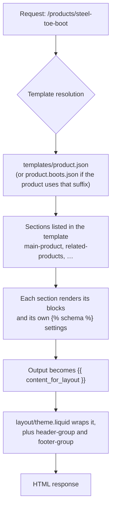

Yesterday you learned the language. Today you learn what the language is arranged into, and this is the part that separates a theme developer from someone who edits Liquid.

Here is the whole model in one sentence: **a request resolves to a template, the template lists sections, the sections render blocks, and all of it is injected into a layout.** Everything else is detail.

## The request lifecycle



Two things worth pausing on:

- **Template resolution is by convention, not configuration.** A URL of `/products/x` looks for `templates/product.json`, falling back to `templates/product.liquid`. If the product has a *template suffix* set in the admin (say `boots`), it looks for `templates/product.boots.json` first. That suffix is how merchandisers get a different page layout for a product category without a developer.
- **The layout is not part of the template.** `layout/theme.liquid` is chosen with `` — implicit unless overridden. A section or template can say ``, which is how you render a bare JSON or partial response.

## The layout

```liquid title="layout/theme.liquid (abridged)"
<!doctype html>
<html lang="{{ request.locale.iso_code }}">
  <head>
    <meta charset="utf-8">
    <meta name="viewport" content="width=device-width, initial-scale=1.0">
    <link rel="canonical" href="{{ canonical_url }}">
    <link rel="preconnect" href="https://cdn.shopify.com" crossorigin>

    <title>{{ page_title }} &ndash; Page {{ current_page }}</title>

    <meta name="description" content="{{ page_description | escape }}">

    
    {{ 'base.css' | asset_url | stylesheet_tag }}

    {{ content_for_header }}
  </head>

  <body class="template-{{ request.page_type | handle }}">
    <a class="skip-to-content-link" href="#MainContent">{{ 'accessibility.skip_to_text' | t }}</a>

    

    <main id="MainContent" class="content-for-layout" role="main" tabindex="-1">
      {{ content_for_layout }}
    </main>

    
  </body>
</html>
```

:::hint{type=danger}
`{{ content_for_header }}` is not optional and its position matters. Shopify injects analytics, the Web Pixels loader, app script tags, consent-management hooks and several CSS custom properties through it. Themes that move it below their own CSS to "improve performance" break app functionality and consent behaviour in ways that surface weeks later as an analytics discrepancy nobody can explain. Leave it in `<head>`, near the end.
:::

`layout/password.liquid` is the separate shell for the password page — worth knowing exists, because development stores use it and a surprising number of merchants want it branded before launch.

## Templates: JSON versus Liquid

Every page type gets a template. In an Online Store 2.0 theme, almost all of them are JSON.

```json title="templates/product.json"
{
  "sections": {
    "main": {
      "type": "main-product",
      "blocks": {
        "vendor": { "type": "text", "settings": { "text": "{{ product.vendor }}" } },
        "title": { "type": "title" },
        "price": { "type": "price" },
        "variant_picker": { "type": "variant_picker", "settings": { "picker_type": "button" } },
        "buy_buttons": { "type": "buy_buttons" },
        "description": { "type": "description" }
      },
      "block_order": ["vendor", "title", "price", "variant_picker", "buy_buttons", "description"],
      "settings": { "enable_sticky_info": true }
    },
    "related": { "type": "related-products", "settings": {} }
  },
  "order": ["main", "related"]
}
```

Read that carefully, because it explains the whole 2.0 shift. The template contains **no markup**. It is a manifest: which sections, in what order, with which blocks and settings. All of it is editable in the theme editor by a merchandiser, without touching code.

A Liquid template still exists for cases where a page is genuinely fixed:

```liquid title="templates/gift_card.liquid"
 No merchant configuration needed; a JSON template would add noise. 

…
```

| Use a JSON template when | Use a Liquid template when |
|---|---|
| Merchandisers should be able to rearrange the page | The page structure is fixed and technical |
| The page is composed of reusable sections | The page is a one-off (gift card, robots.txt, cart JSON endpoints) |
| You want app blocks to be addable | You need `` or a non-HTML response |
| It's product, collection, index, page, blog, article, list-collections, search, 404 | It's `robots.txt.liquid`, `gift_card.liquid`, or a custom endpoint |

:::hint{type=warning}
A JSON template **cannot contain Liquid at the top level** and cannot contain markup. If you find yourself wanting to, the answer is a new section, not a Liquid template. Reaching for `templates/product.liquid` because JSON felt restrictive is the most common way a team quietly loses the ability to let merchandisers do their own job — which then becomes your ticket queue.
:::

### Alternate templates

`templates/product.boots.json`, `templates/page.contact.json`, `templates/collection.wholesale.json`. These appear as options in the admin, on the product/page/collection, under "Theme template". This is the mechanism behind:

- A different product page for a category that needs a size chart and a fit guide
- A landing page template with no header
- **A wholesale-specific collection template** — which Chapter 5 uses directly

## Sections

A section is a `.liquid` file in `sections/` with markup and a ``.

```liquid title="sections/promo-banner.liquid"


<div
  class="promo-banner color-{{ section.settings.color_scheme }}"
  style="--promo-padding-block: {{ section.settings.padding }}px;"
>
  <div class="page-width promo-banner__inner">
    
      <div class="promo-banner__item" {{ block.shopify_attributes }}>
        
          
            
            <p>{{ block.settings.text | escape }}</p>
          
            <promo-countdown data-ends="{{ block.settings.ends_at }}"></promo-countdown>
        
      </div>
    
  </div>
</div>


{
  "name": "Promo banner",
  "tag": "aside",
  "class": "promo-banner-section",
  "settings": [
    { "type": "color_scheme", "id": "color_scheme", "label": "Colour scheme", "default": "scheme-2" },
    { "type": "range", "id": "padding", "min": 0, "max": 48, "step": 4, "unit": "px", "label": "Vertical padding", "default": 12 },
    { "type": "url", "id": "link", "label": "Banner link" }
  ],
  "blocks": [
    {
      "type": "icon_text",
      "name": "Icon + text",
      "limit": 4,
      "settings": [
        { "type": "select", "id": "icon", "label": "Icon", "options": [
          { "value": "truck", "label": "Shipping" },
          { "value": "return", "label": "Returns" },
          { "value": "shield", "label": "Warranty" }
        ]},
        { "type": "text", "id": "text", "label": "Text", "default": "Free shipping over £75" }
      ]
    },
    { "type": "countdown", "name": "Countdown", "limit": 1, "settings": [
      { "type": "text", "id": "ends_at", "label": "Ends at (ISO 8601)" }
    ]}
  ],
  "presets": [
    {
      "name": "Promo banner",
      "blocks": [
        { "type": "icon_text", "settings": { "icon": "truck", "text": "Free shipping over £75" } },
        { "type": "icon_text", "settings": { "icon": "return", "text": "90-day returns" } }
      ]
    }
  ]
}

```

Five details in there that matter:

1. **`{{ block.shopify_attributes }}` is mandatory.** It emits the `data-shopify-editor-block` attributes that let the theme editor highlight, select and live-update that block. Omit it and the editor silently degrades to a full page reload on every change, which merchandisers experience as "the theme editor is broken."
2. **`"tag"` and `"class"`** control the wrapper element Shopify emits around your section. By default it is a `<div>` with `id="shopify-section-…"`. You do not control that wrapper's existence, only its tag and extra classes — a constraint that shapes a lot of theme CSS.
3. **`"presets"`** is what makes the section appear in the "Add section" menu. A section with no presets can only be used where a template explicitly names it — which is the correct choice for `main-product` and friends.
4. **`"limit"` on a block type** caps how many the merchant can add. Use it. A carousel that renders acceptably with 4 slides and catastrophically with 40 should say so in the schema, not in a Slack message.
5. **`section.settings` and `block.settings`** are the only way settings arrive. There is no way to read another section's settings — sections are isolated by design.

:::hint{type=tip}
**Section limits.** A JSON template can hold up to 25 sections, and a section can hold up to 50 blocks. If you are approaching either, the design is wrong — you are probably using blocks where you should be using a metaobject-backed list (Day 5) or a collection.
:::

### `` versus ``

```liquid
     {# renders one section, statically, from a Liquid template or layout #}
        {# renders a section GROUP — a merchant-editable list #}
```

## Section groups

Before section groups, the header and footer lived in the layout, hard-coded, and merchants could not add anything to them. Section groups fixed that.

```json title="sections/header-group.json"
{
  "type": "header",
  "name": "Header",
  "sections": {
    "announcement-bar": {
      "type": "announcement-bar",
      "blocks": {
        "announcement-0": { "type": "announcement", "settings": { "text": "Free shipping over £75" } }
      },
      "block_order": ["announcement-0"]
    },
    "header": {
      "type": "header",
      "settings": { "menu": "main-menu", "sticky_header_type": "on-scroll-up" }
    }
  },
  "order": ["announcement-bar", "header"]
}
```

`"type"` at the top can be `header`, `footer`, `aside` or `custom`. It tells the theme editor where the group belongs in the page outline, and `custom` groups can be placed anywhere in the layout with ``.

This is more useful than it first appears. It is how a merchandiser adds a campaign announcement bar above the header for a sale weekend without a deployment — which, in Chapter 4, is exactly what Launchpad automates.

## Theme blocks: the composable layer

Section blocks have a structural weakness: they are defined *inside* one section's schema. If you want the same "icon + text" block in six sections, you define it six times, and the seventh developer defines it slightly differently.

**Theme blocks** move a block into its own file in `blocks/`, so many sections can accept it — and blocks can nest inside other blocks.

```liquid title="blocks/spec-row.liquid"

  A single spec line: label on the left, value on the right.
  Used by product specs, comparison tables and the wholesale product sheet.


<div class="spec-row" {{ block.shopify_attributes }}>
  <dt class="spec-row__label">{{ block.settings.label | escape }}</dt>
  <dd class="spec-row__value">{{ block.settings.value | escape }}</dd>
</div>


{
  "name": "Spec row",
  "settings": [
    { "type": "text", "id": "label", "label": "Label", "default": "Safety rating" },
    { "type": "text", "id": "value", "label": "Value", "default": "ASTM F2413" }
  ],
  "presets": [{ "name": "Spec row" }]
}

```

A section opts in to theme blocks by declaring them and rendering with `content_for`:

```liquid title="sections/product-specs.liquid"
<dl class="product-specs">
  
</dl>


{
  "name": "Product specs",
  "blocks": [
    { "type": "spec-row" },
    { "type": "@theme" },
    { "type": "@app" }
  ],
  "presets": [
    { "name": "Product specs", "blocks": [{ "type": "spec-row" }, { "type": "spec-row" }] }
  ]
}

```

- `{ "type": "spec-row" }` accepts that specific theme block.
- `{ "type": "@theme" }` accepts **any** theme block in `blocks/`.
- `{ "type": "@app" }` accepts **app blocks** — this is how an installed app can inject a reviews widget into your section without you writing integration code. Day 29 leans on this heavily.

:::hint{type=tip}
**Choosing the unit.** A quick decision rule you can defend in review:

- **Snippet** — no merchant configuration, called from code. A price display, an icon, an SVG.
- **Section block** — configurable, only ever meaningful inside one section. A slide in that specific slideshow.
- **Theme block** — configurable, reusable across sections, possibly nestable. Your design-system components live here.
- **Section** — a whole configurable region of a page that a merchandiser can place, reorder or remove.
:::

## What this architecture is actually for

It is easy to read all of the above as Shopify's internal plumbing. It is not. It is a **capacity strategy**, and for a solo developer supporting a marketing team it is the difference between a sustainable job and a queue you never clear.

Every hard-coded string, every fixed section order, every layout decision you bury in Liquid becomes a ticket for you later. Every schema setting, alternate template and theme block you expose becomes something the merchandising team does themselves at 4pm on a Friday without messaging you.

The senior version of this skill is knowing where to stop. Exposing *everything* as a setting produces a theme editor with 200 controls that nobody can navigate and a codebase where every branch is live. The judgement call — which axes of variation are real, and which are one merchandiser's Tuesday opinion — is the actual craft, and Day 4 is about making it deliberately.

```quiz
question: A merchandiser wants the same "icon + text" component available in the header, the product page and the footer, configured differently in each. What is the right structure?
options:
  - "A snippet, rendered from all three sections with different arguments"
  - "A section block, defined identically in all three section schemas"
  - "A theme block in blocks/, accepted by all three sections"
  - "Three separate sections with a shared CSS class"
answer: 2
explanation: "A theme block is defined once in `blocks/` and accepted by any section that lists it (or `@theme`). A snippet cannot be merchant-configured in the theme editor; duplicating a section block across three schemas means three places to change and three places to drift."
```

## Exercise

:::checklist{title="Day 3 checklist"}
- [ ] Traced one product page request on paper: URL → template file → sections → layout
- [ ] Read `templates/product.json` and `templates/index.json` in your theme and can explain every key
- [ ] Built `sections/promo-banner.liquid` with two block types, block limits and a preset
- [ ] Confirmed `{{ block.shopify_attributes }}` is present, then removed it temporarily and observed the theme editor degrade
- [ ] Added your section to the homepage from the theme editor, reordered it, and saw `templates/index.json` change when you pulled
- [ ] Created an alternate template `templates/page.lookbook.json` and assigned it to a page in the admin
- [ ] Converted one duplicated section block into a theme block in `blocks/`, accepted by two sections
- [ ] Added `{ "type": "@app" }` to one section and explained in a comment why
:::

### Stretch problems

1. Open `sections/header-group.json` and add a second announcement bar section above the existing one, entirely by editing JSON. Then do the same thing from the theme editor and diff the file. Which one produced cleaner output?
2. Deliberately exceed the block limit on a section by editing the JSON template by hand and pushing. Record what happens — this is the kind of edge you want to have met before a merchandiser meets it.
3. Take the "capacity strategy" argument seriously: list five tickets a merchandising team would plausibly send you in a month, and mark each one as *(a)* solvable by a schema setting you could add once, or *(b)* genuinely code. Aim to be honest, not generous.
4. Read Dawn's `sections/main-product.liquid` schema in full. Count the block types. Ask yourself whether you would have made the same call on which of those are blocks versus fixed markup.

## Where this is going

Tomorrow: the schema itself, in depth. Every setting type, dynamic sources, the theme editor's contract with your code, and how to design settings that merchandisers can actually use without producing a page that looks broken.
