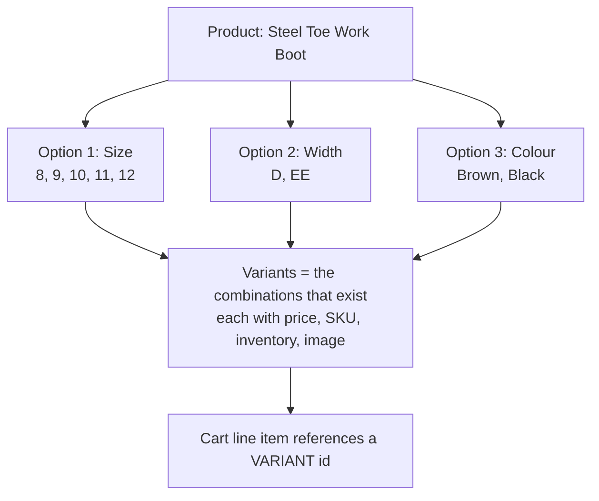

The product detail page is where conversion is won or lost, and it is the template you will spend more time in than any other. It is also the template with the most edge cases per square inch.

Start with the data model, because almost every PDP bug is really a misunderstanding of it.

## Options and variants



Facts that constrain every PDP you will build:

- **Up to three options per product.** A fourth axis means splitting the product, using a combined listing, or modelling it as a line item property.
- **Every variant carries every option.** There is no such thing as a variant that has a Size but no Colour.
- **Not every combination must exist.** Size 12 / EE / Black may simply not be a variant. Your UI must handle selecting an option combination that does not resolve to a variant, and this is the single most common PDP defect.
- **A variant carries the commercial data.** Price, compare-at price, SKU, barcode, inventory, weight, and its own image.
- **The cart holds variant IDs**, never product IDs.

:::hint{type=warning}
Shopify's variant limit per product is high but finite (1,000 at time of writing, with 100 per option value historically), and stores hit it with apparel size runs faster than you expect: 12 sizes × 3 widths × 8 colours is 288 before you have added anything. When a range is genuinely larger, the answers are **combined listings** or splitting by colour into separate products with a colour swatch navigator. Design the PDP knowing which model the merchandising team uses, because the swatch UI is completely different in each case.
:::

## The initial render

```liquid title="sections/main-product.liquid (abridged)"


<div class="product" data-section-id="{{ section.id }}" data-url="{{ product.url }}">
  

  <div class="product__info">
    
      
        
          <h1 class="product__title" {{ block.shopify_attributes }}>{{ product.title | escape }}</h1>

        
          <div id="price-{{ section.id }}" {{ block.shopify_attributes }}>
            
          </div>

        
          

        
          

        
          
      
    
  </div>
</div>
```

`selected_or_first_available_variant` does the work of reading `?variant=` off the URL. That matters more than it looks: it means a shared link, a Google Shopping listing or an email campaign deep-linking to a specific variant renders that variant server-side, with the right price in the HTML — which is good for SEO, good for LCP, and good for the customer who does not have to wait for JavaScript to correct the price.

:::hint{type=danger}
Rendering the *first* variant's price and letting JavaScript correct it is a real pattern in bad themes and it produces two visible failures: a price flash on load, and a wrong price in the HTML that structured data, ad platforms and price-comparison crawlers will pick up. Always render from `selected_or_first_available_variant`.
:::

## Variant switching: the two approaches

### Approach A — client-side state

Serialise the variants, listen for option changes, find the matching variant, update the DOM.

```js title="assets/variant-selects.js"
class VariantSelects extends HTMLElement {
  connectedCallback() {
    this.variants = JSON.parse(this.querySelector('[data-variant-json]').textContent)
    this.addEventListener('change', this.onOptionChange)
  }

  onOptionChange = () => {
    const selected = this.selectedOptions()
    const variant = this.variants.find((v) =>
      v.options.every((value, index) => value === selected[index])
    )

    if (!variant) return this.setUnavailable(selected)

    this.updateUrl(variant)
    this.updatePrice(variant)
    this.updateMedia(variant)
    this.updateBuyButton(variant)
    this.updateInventory(variant)
  }
  // …
}
```

**Pros:** instant, no network round trip.
**Cons:** every piece of variant-dependent UI must be reimplemented in JavaScript. Price formatting, discount badges, inventory thresholds, unit price, subscription selectors, custom metafield callouts — all of it exists in Liquid and now also has to exist in JavaScript, in a second implementation that drifts.

### Approach B — the Section Rendering API

Ask the server to re-render the section with the new variant, then swap in the parts you need.

```js title="assets/variant-selects-server.js"
class VariantSelects extends HTMLElement {
  connectedCallback() {
    this.addEventListener('change', this.onOptionChange)
  }

  onOptionChange = async () => {
    const variantId = this.resolveVariantId()
    if (!variantId) return this.setUnavailable()

    const url = `${this.dataset.url}?variant=${variantId}&section_id=${this.dataset.sectionId}`
    this.abortController?.abort()
    this.abortController = new AbortController()

    const html = await fetch(url, { signal: this.abortController.signal }).then((r) => r.text())
    const doc = new DOMParser().parseFromString(html, 'text/html')

    // Swap only the regions that depend on the variant.
    for (const id of ['price', 'inventory', 'sku', 'buy-buttons', 'variant-callout']) {
      const source = doc.getElementById(`${id}-${this.dataset.sectionId}`)
      const target = document.getElementById(`${id}-${this.dataset.sectionId}`)
      if (source && target) target.innerHTML = source.innerHTML
    }

    this.updateUrl(variantId)
    this.updateMedia(variantId)
  }
}
```

**Pros:** one implementation of every piece of variant-dependent logic, in Liquid, where the merchandiser's settings and metafields already live. New variant-dependent UI needs no JavaScript changes at all.
**Cons:** a network round trip (typically 100–250ms), which needs a considered loading state.

:::hint{type=tip}
**Take approach B for anything beyond price and availability.** Dawn moved this way for good reason. The moment a PDP has a discount badge, an inventory bar, a unit price, a subscription widget and a metafield-driven callout — all of which vary by variant — approach A means five duplicated implementations that will disagree with the Liquid within a quarter.

Note the `AbortController`. A customer clicking through five sizes quickly fires five requests; without abort, they can resolve out of order and you render a stale variant. This is a real bug and it is easy to miss in testing because you click slowly.
:::

### The URL must stay in sync

```js
updateUrl(variantId) {
  if (!variantId) return
  const url = new URL(window.location)
  url.searchParams.set('variant', variantId)
  window.history.replaceState({}, '', url)

  // Keep the non-JS form honest too
  document.querySelectorAll(`#${this.dataset.formId} input[name="id"]`)
    .forEach((input) => { input.value = variantId })
}
```

`replaceState`, not `pushState` — you do not want the back button to walk through every size a customer tried. And updating the hidden `id` input matters: if your JavaScript throws after the option change but before the swap, the form must still submit the variant the customer actually selected.

## Unavailable combinations

The case everyone gets wrong. A customer picks Size 12, then Width EE, and that combination does not exist.

Three strategies, in increasing order of quality:

:::cards

:::card{title="Do nothing"}
The selection is accepted, no variant resolves, add-to-cart silently does nothing. This is a bug, and it is common. If you take nothing else from this lesson, take that this is never acceptable.
:::

:::card{title="Disable unavailable values"}
Grey out option values that cannot combine with the current selection. Clear, but can dead-end the customer: if every width is disabled for size 12, they have to work out that they must change size first.
:::

:::card{title="Mark unavailable, keep selectable"}
Show unavailable combinations with a strike-through or "unavailable" state, let the customer select them, and respond with a clear message plus a route forward — a back-in-stock signup, or auto-adjusting the other option. This is what good apparel PDPs do.
:::

:::

```liquid title="snippets/variant-picker.liquid (abridged)"

  
  <input
    type="radio"
    id="{{ section.id }}-{{ option.position }}-{{ forloop.index0 }}"
    name="{{ option.name }}"
    value="{{ value | escape }}"
    checked
    class="disabled"
  >
  <label for="{{ section.id }}-{{ option.position }}-{{ forloop.index0 }}">{{ value }}</label>

```

Note this is one of the rare, legitimate cases for looping `product.variants` — you are on a single product page, not a listing, and there is no precomputed property that answers "is this option value available in combination with the current selection".

:::hint{type=tip}
Newer Liquid exposes `product.options_with_values` along with per-value availability data, which removes much of the manual cross-referencing above. Check the current product object reference before hand-rolling this — Shopify has been steadily adding the precomputed properties that used to require nested loops, and using them is both faster and less code.
:::

## The media gallery

`product.media` is an ordered list containing four types.

```liquid title="snippets/product-media-gallery.liquid"
<media-gallery data-section-id="{{ section.id }}">
  
    
    <div class="media-item" data-media-id="{{ media.id }}" data-media-type="{{ media.media_type }}">
      
        
          {{ media
             | image_url: width: 1946
             | image_tag:
                 loading: loading,
                 widths: '246, 493, 600, 713, 823, 990, 1100, 1206, 1346, 1426, 1646, 1946',
                 sizes: '(min-width: 990px) 50vw, 100vw',
                 alt: media.alt | escape }}

        
          {{ media | media_tag: image_size: '1100x', controls: true, preload: 'none' }}

        
           Do not autoload YouTube — it costs ~500KB per embed. 
          <deferred-media data-media-id="{{ media.id }}">
            <button type="button" class="deferred-media__poster">
              {{ media.preview_image | image_url: width: 1100 | image_tag: loading: 'lazy', alt: media.alt }}
              <span class="visually-hidden">{{ 'products.product.play_video' | t }}</span>
            </button>
            <template>{{ media | external_video_tag }}</template>
          </deferred-media>

        
          <deferred-media data-media-id="{{ media.id }}">
            <button type="button">{{ media.preview_image | image_url: width: 1100 | image_tag: loading: 'lazy' }}</button>
            <template>{{ media | model_viewer_tag: reveal: 'interaction', toggleable: true }}</template>
          </deferred-media>
      
    </div>
  
</media-gallery>
```

The `<template>` pattern is the important one: markup inside a `<template>` is parsed but **not loaded** — no network requests, no iframe, no script. Cloning it into the DOM on click is what turns a 2MB PDP with four videos into a 400KB PDP that loads video on demand. Dawn's `DeferredMedia` does exactly this, and copying it is the correct move.

### Linking media to variants

`variant.featured_media.id` tells you which media item belongs to the selected variant. On variant change, scroll or switch the gallery to it:

```js
updateMedia(variantId) {
  const mediaId = this.mediaMap[variantId]
  if (!mediaId) return                       // variant has no dedicated image; leave the gallery alone
  this.gallery.setActiveMedia(mediaId)
}
```

The `if (!mediaId) return` guard matters: many stores only assign images to colour variants, so switching size should not reset the gallery to slide one. Doing so is a small thing that makes a PDP feel cheap.

```quiz
question: A customer clicks quickly through four sizes on a PDP that fetches re-rendered section HTML on each change. Occasionally the price shown does not match the selected size. What is the defect?
options:
  - "The Section Rendering API caches responses per product rather than per variant"
  - "Concurrent requests resolve out of order and a stale response overwrites a newer one; the fix is aborting the previous request"
  - "replaceState is being used where pushState is required"
  - "selected_or_first_available_variant does not read the variant parameter"
answer: 1
explanation: "Without an AbortController (or a request sequence number that discards late responses), a slower earlier request can resolve after a faster later one and render stale markup. It is easy to miss in testing because developers click slowly and on fast connections."
```

## The edge cases that separate good from adequate

:::details{summary="Single-variant products"}
`product.has_only_default_variant` is true when a product has no real options — Shopify creates a single variant named "Default Title". Rendering a variant picker with one option called "Title" and one value called "Default Title" is a classic amateur tell.

```liquid

  

```
:::

:::details{summary="Inventory messaging"}
`variant.inventory_quantity` is only exposed when `variant.inventory_management` is set and the policy allows it. Three states to design for:

- **In stock, plentiful** — say nothing, or "In stock".
- **Low stock** — "Only 3 left". Requires a threshold, which should be a schema setting, not a magic number.
- **Continue selling when out of stock** — `variant.inventory_policy == 'continue'` means the customer can buy it while `inventory_quantity` is zero or negative. Your "sold out" logic must check `variant.available`, not the quantity.

Getting this wrong shows customers "Only -14 left", which is a screenshot that circulates.
:::

:::details{summary="Pre-orders and selling plans"}
If a product has `product.selling_plan_groups`, the PDP needs a selling-plan selector, and the form needs a `selling_plan` input alongside `id`. The price shown must be the selling-plan-adjusted price (`selected_selling_plan_allocation.price`), not the variant price — otherwise a subscription discount is invisible until checkout, which reads as a bait-and-switch.
:::

:::details{summary="Line item properties"}
Custom engraving, a gift note, a size-fitting appointment: these are line item properties, submitted as `properties[Name]` inputs in the product form. Properties beginning with an underscore (`properties[_source]`) are hidden from the customer and the order confirmation, which makes them the right place for internal metadata your integrations need.

Two gotchas: properties make otherwise-identical line items distinct in the cart, and empty properties still create a line item property unless you omit the input entirely.
:::

:::details{summary="Structured data"}
The PDP should emit `Product` JSON-LD with `offers` reflecting the **selected** variant's price and availability. Get it from the variant, not the product, and update it on variant change if you are rendering server-side anyway. Bad structured data shows wrong prices in Google Shopping, which is a merchandising escalation rather than a bug report.
:::

## Exercise

:::checklist{title="Day 8 checklist"}
- [ ] PDP renders from `selected_or_first_available_variant`, and a `?variant=` deep link shows the right price with JavaScript disabled
- [ ] Implemented variant switching using the Section Rendering API, swapping price, inventory, SKU and buy button
- [ ] Added an `AbortController` and proved out-of-order responses no longer occur when clicking rapidly
- [ ] URL updates with `replaceState`, and the hidden `id` input stays in sync
- [ ] Unavailable option combinations are visibly marked and produce a clear message rather than a dead button
- [ ] Media gallery handles image, video, external video and model types
- [ ] External video and 3D models use the `<template>` deferred pattern; confirmed in the network panel that nothing loads until click
- [ ] Variant change switches gallery media only when the variant has its own featured media
- [ ] `has_only_default_variant` suppresses the variant picker
- [ ] Inventory messaging handles the `continue` policy without showing a negative quantity
- [ ] JSON-LD reflects the selected variant's price and availability
:::

### Stretch problems

1. Build the same variant switcher both ways — client-side and Section Rendering — on a branch each. Then add a new variant-dependent element (a metafield-driven callout) and record how many lines each approach needed. That measurement is the argument.
2. Add a colour swatch picker that reads swatch colours from a metaobject rather than a hard-coded CSS map, and confirm a merchandiser can add a new colour with no deployment.
3. Take a product with 200+ variants and measure the PDP's HTML size and main-thread parse time with and without `{{ product.variants | json }}`. Decide what you would actually ship.
4. Write the QA test plan for this PDP — every state a tester should check, including no-JavaScript, deep-linked variant, unavailable combination, sold out with continue-selling, and single-variant. Day 15 will ask you to hand exactly this to a QA engineer.

## Where this is going

Tomorrow: the cart. The Ajax Cart API in full, the Section Rendering API used properly, a cart drawer that stays consistent across four independent components, and cart-level concerns like discount codes, notes, attributes and free-shipping thresholds.
