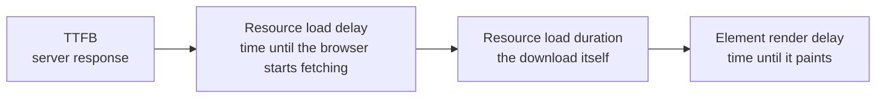

Performance work on a storefront has an unusual property: it is one of the few engineering activities with a direct, measurable revenue argument, and it is also one of the easiest to do theatrically. A team can spend a sprint raising a Lighthouse score from 42 to 68 and change nothing that any customer experiences.

The distinction that prevents that is **field data versus lab data**, and it is where this lesson starts.

## The three metrics

| Metric | Measures | Good | Needs work | Poor |
|---|---|---|---|---|
| **LCP** | Loading — when the main content appears | ≤ 2.5s | 2.5–4.0s | > 4.0s |
| **INP** | Responsiveness — interaction to next paint | ≤ 200ms | 200–500ms | > 500ms |
| **CLS** | Visual stability — unexpected movement | ≤ 0.1 | 0.1–0.25 | > 0.25 |

All three are assessed at the **75th percentile** of real visits over a 28-day window. That percentile matters: it means your metric is set by the slower quarter of your traffic, not the median. On a trade-focused storefront where a meaningful share of visits happen on mid-range Android phones on site with poor signal, the 75th percentile is a very different device from the one on your desk.

:::hint{type=warning}
**A Lighthouse score is a diagnostic, not a target.** It runs one page, once, on a simulated mid-tier device, with none of your real customers' extensions, network conditions or cache state. It is excellent for "what is slow on this page and why" and actively misleading as a KPI.

If someone asks you to "get the score to 90", the useful counter-offer is: *"let me show you the field data for the three metrics Google actually ranks on, and let's set targets there."* That conversation goes better than it sounds, because field data comes with revenue-adjacent numbers attached.
:::

## Where to get real data

:::cards

:::card{title="Shopify's Web Performance dashboard"}
Admin → Online Store → your theme, and the store speed report. Shopify surfaces Core Web Vitals from real visits to your store, split by page type. Free, already there, and the first place to look. Its page-type breakdown is genuinely useful — PDP and collection usually differ a lot.
:::

:::card{title="Chrome UX Report via PageSpeed Insights"}
Enter your URL at pagespeed.web.dev. The top section is **field data** (CrUX, real Chrome users); the bottom is the Lighthouse lab run. Read the top for truth, the bottom for causes. Origin-level data covers the whole store; URL-level needs enough traffic.
:::

:::card{title="Your own RUM"}
The `web-vitals` library, reporting to your analytics. This is the only way to segment by template, by device, by market, and to see the effect of a release the day it ships rather than 28 days later.
:::

:::card{title="Lighthouse and DevTools"}
For diagnosis. The Performance panel's trace tells you exactly which element was the LCP, which script blocked the main thread, and which node shifted. Nothing else gives you that specificity.
:::

:::

```js title="assets/vitals.js — minimal RUM"
// Loaded with defer, guarded so it never affects the metrics it measures.
import { onLCP, onINP, onCLS } from 'https://unpkg.com/web-vitals@4?module'

function report(metric) {
  const body = JSON.stringify({
    name: metric.name,
    value: metric.value,
    rating: metric.rating,
    template: document.body.dataset.template,
    id: metric.id
  })
  navigator.sendBeacon('/apps/telemetry/vitals', body)
}

onLCP(report)
onINP(report)
onCLS(report)
```

:::hint{type=danger}
That example imports from a public CDN for brevity. **Do not ship that.** Theme Check's `RemoteAsset` rule will flag it, and correctly: a third-party origin on the critical path adds a DNS lookup, a TLS handshake and a dependency on someone else's uptime. Vendor the library into `assets/` and serve it from Shopify's CDN like everything else.
:::

## What you control, and what you do not

This matters for both engineering and for the conversation with stakeholders.

| Layer | Owner | Your leverage |
|---|---|---|
| DNS, TLS, edge, CDN | Shopify | None. It is already fast. |
| Liquid render time (TTFB) | **You** | High — nested loops, unpaginated collections, heavy sections |
| HTML size and structure | **You** | High |
| Theme CSS and JS | **You** | High |
| Images | **You** | Very high — usually the largest single win |
| Web fonts | **You** | High |
| App scripts via `content_for_header` | Shared | Medium — you choose which apps, and how they load |
| App embed blocks and theme app extensions | Shared | Medium — you can disable and challenge them |
| Checkout | Shopify | None on Plus except via approved extensibility |

The honest summary: **images, fonts and third-party scripts are where the wins are.** Micro-optimising your own JavaScript is usually the least valuable work available, which is counter-intuitive because it is the most fun.

## LCP

The LCP element on a storefront is nearly always one of: the hero image, the first product image on a collection grid, the product gallery's first image, or a large heading.

Find it, do not guess: DevTools → Performance → record a reload → the LCP marker in the timings track names the exact element.

### The four phases of LCP



Diagnose which phase dominates before changing anything.

**TTFB high?** That is Liquid render time. Look for: nested loops touching `.variants` or `.metafields` on listing pages, unpaginated collections, sections that loop `all_products`, and snippets rendered inside loops that do heavy work. This is the phase most theme developers never check, and on a heavily customised theme it can be a second on its own.

**Load delay high?** The browser did not learn about the image early enough. Causes: the image is set via CSS `background-image` (discovered only after CSSOM), it is inside a lazily-hydrated component, or it is behind `loading="lazy"`. Fixes:

```liquid title="preload the hero"

  <link rel="preload" as="image"
        href="{{ section.settings.image | image_url: width: 1600 }}"
        imagesrcset="{{ section.settings.image | image_url: width: 800 }} 800w,
                     {{ section.settings.image | image_url: width: 1600 }} 1600w"
        imagesizes="100vw"
        fetchpriority="high">

```

```liquid title="and mark it high priority"
{{ section.settings.image
   | image_url: width: 1600
   | image_tag: loading: 'eager', fetchpriority: 'high', sizes: '100vw' }}
```

**Load duration high?** The image is too big. Check the transferred size against the rendered size in DevTools. A 1600px-wide image in a 400px slot means your `sizes` attribute is wrong. Shopify serves WebP automatically to browsers that accept it, so format is usually already handled — dimensions are the problem.

**Render delay high?** Render-blocking CSS, or a font that must load before text paints. Fixes: inline critical CSS for above-the-fold, defer the rest, and use `font-display: swap` (accepting the CLS trade — see below).

### Fonts

```liquid title="Shopify-hosted fonts"
{{ settings.type_body_font | font_face: font_display: 'swap' }}
{{ settings.type_body_font | font_modify: 'weight', 'bold' | font_face: font_display: 'swap' }}
```

Shopify's font library is served from the same CDN as the rest of the theme, so there is no extra connection. A custom font uploaded to `assets/` is nearly as good. A font loaded from a third-party origin costs a DNS lookup, a connection and a dependency — and Theme Check will flag it.

For a custom font, preload the one weight that renders above the fold:

```liquid
<link rel="preload" as="font" type="font/woff2"
      href="{{ 'brand-regular.woff2' | asset_url }}" crossorigin>
```

Only the one. Preloading six weights competes with your LCP image for bandwidth and makes things worse.

## INP

INP is where third-party scripts do their damage. Your handler may be fast, but if an app's analytics script is executing a 300ms task when the customer taps, the interaction waits.

Diagnosis, in order:

1. **DevTools → Performance → record while interacting.** Long tasks appear as red-flagged blocks. Click one; the call tree names the script.
2. Note whether the script is yours, `content_for_header`'s, or an app embed.
3. If it is yours, apply the pattern from Day 7 — paint a state change, yield, then work.
4. If it is not yours, Day 12 is about what you can do.

```js title="yielding, properly"
async function yieldToMain() {
  // scheduler.yield() is the modern form; setTimeout is the universal fallback.
  if ('scheduler' in window && 'yield' in scheduler) return scheduler.yield()
  return new Promise((resolve) => setTimeout(resolve, 0))
}

async function processLongList(items) {
  for (const item of items) {
    doWork(item)
    if (performance.now() - start > 50) {
      await yieldToMain()      // give the browser a chance to respond to input
      start = performance.now()
    }
  }
}
```

Theme-specific INP offenders worth checking:

- A cart drawer that re-parses a large HTML string synchronously on every quantity change.
- A variant switcher parsing a 200-variant JSON blob on each option click. Parse it once in `connectedCallback`.
- Scroll or resize handlers without `requestAnimationFrame` throttling.
- Layout thrash — reading `offsetHeight` inside a loop that also writes styles.
- An `IntersectionObserver` on every card doing expensive work in its callback.

## CLS

CLS is the most fixable of the three and the one most often left broken.

Ranked by how often they are the cause:

1. **Images without dimensions.** `image_tag` fixes this by emitting `width` and `height`. Confirm your CSS uses `height: auto` so the aspect ratio is preserved rather than overridden.
2. **App content injected after paint.** A review star rating that appears under the title, a promotional bar that pushes everything down. Reserve the space:

   ```css
   .rating-placeholder { min-height: 22px; }
   .promo-bar-slot { min-height: 44px; }
   ```

3. **Web font swap.** `font-display: swap` shows fallback text immediately (good for LCP) and then reflows when the real font loads (bad for CLS). Reduce the shift by matching the fallback's metrics:

   ```css
   @font-face {
     font-family: 'Brand Fallback';
     src: local('Arial');
     size-adjust: 104%;
     ascent-override: 92%;
     descent-override: 24%;
   }
   body { font-family: 'Brand', 'Brand Fallback', sans-serif; }
   ```

4. **Sections that render conditionally on client state.** A "recently viewed" row that appears after reading localStorage, a B2B-only banner shown by JavaScript. Reserve the space or render server-side.
5. **Cart drawer or announcement bar animating layout properties.** Animate `transform` and `opacity`, never `height` or `top`.

```quiz
question: A store's Lighthouse performance score is 91, but the field data in PageSpeed Insights shows LCP failing at 3.8s. What is the most likely explanation?
options:
  - "The Lighthouse run is wrong and should be ignored"
  - "Lab data uses a fixed device and network profile with a cold, extension-free browser; field data is the 75th percentile of real visitors on slower devices and connections"
  - "Field data lags by 28 days, so it reflects an older theme"
  - "The Lighthouse run tested a different page type"
answer: 1
explanation: "This gap is normal and expected. Lab conditions are a single simulated profile; field data aggregates real hardware, real networks, real cache states and real extensions at the 75th percentile. Both explanations offered as distractors can also be true, which is why you check the page type and the reporting window — but the fundamental reason is that they measure different things."
```

## A performance budget you can defend

Numbers make the argument. Put these in your repository as `docs/performance-budget.md` and check them in CI (Day 14):

```markdown title="docs/performance-budget.md"
## Field targets (75th percentile, 28-day window)

| Metric | Target | Page types |
|---|---|---|
| LCP | ≤ 2.5s | Home, collection, PDP |
| INP | ≤ 200ms | All |
| CLS | ≤ 0.1  | All |

## Lab budgets (enforced in CI on every PR)

| Resource | Budget | Rationale |
|---|---|---|
| Theme JavaScript, total | 100 KB compressed | Parse cost on mid-tier Android |
| Theme CSS, critical path | 50 KB compressed | Render-blocking |
| LCP image, transferred | 200 KB | Above-the-fold only |
| Total requests, PDP | 60 | Proxy for third-party sprawl |
| Third-party scripts | 8 | Every addition needs an owner and a review date |
```

That last row is the one that will do the most work over two years, and it is why Day 12 exists.

## Exercise

Measure first. Every change today gets a before and an after number.

:::checklist{title="Day 11 checklist"}
- [ ] Read your store's Web Performance dashboard and recorded LCP, INP and CLS by page type
- [ ] Ran PageSpeed Insights and recorded field versus lab figures for home, a collection and a PDP
- [ ] Identified the actual LCP element on each of those three pages with a DevTools trace
- [ ] Determined which LCP phase dominates on each — TTFB, load delay, load duration or render delay
- [ ] Preloaded the hero image with `fetchpriority="high"` and measured the LCP change
- [ ] Corrected at least one wrong `sizes` attribute and recorded the byte saving
- [ ] Found the longest task during a cart interaction and identified whether it is yours
- [ ] Reserved space for one app-injected element and measured the CLS change
- [ ] Added a fallback font with `size-adjust` metrics and measured the font-swap shift
- [ ] Wrote `docs/performance-budget.md` with defensible numbers
- [ ] Set up minimal RUM with the vitals library vendored into `assets/`, not loaded from a CDN
:::

### Stretch problems

1. Deliberately regress: add a nested `product.variants` loop to your collection grid and measure TTFB before and after on a 200-product collection. That number is your argument in every future code review.
2. Take the same page and measure it on a throttled "Slow 4G" profile with 4× CPU slowdown. That is closer to your 75th percentile than your laptop is. Note which problems only appear there.
3. Build a simple dashboard from your RUM beacons showing LCP by template over time. Then ship a change and watch it move. Being able to say "this release improved PDP LCP by 400ms for the 75th percentile" is a different kind of conversation than "I improved the Lighthouse score".
4. Audit fonts: how many families, weights and styles does the theme load? How many are used above the fold? Remove one and measure.

## Where this is going

Tomorrow: the third-party problem. App scripts, app embed blocks, the Web Pixels API, tag managers, and how to govern what other people put on your pages — which is, on a mature store, the single largest performance lever you have.
