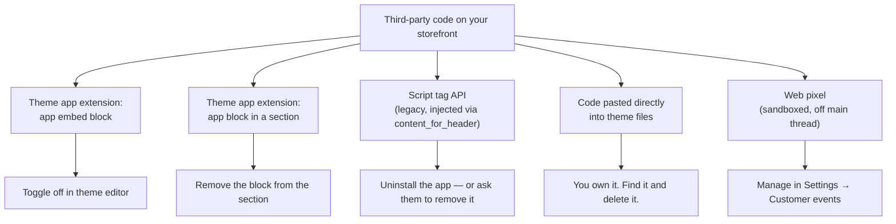

Yesterday's uncomfortable conclusion: your own code is usually not the problem. A theme with 30KB of hand-written JavaScript routinely scores worse than a stock theme because eleven apps have added 1.2MB between them, and nobody knows which of them are still needed.

This is the part of the job that is not really coding. It is inventory, attribution, and the ability to say "no, and here is the number" to a marketing request. It is also, on a mature store, the single largest performance lever available.

## How code gets onto your pages

Five routes, with very different levels of control.



:::cards

:::card{title="App embed blocks"}
Registered by a theme app extension, toggled per app in **Theme editor → App embeds**. Injected into the layout on every page. Because they are togglable, you can measure their cost precisely: toggle off, re-run the trace, compare.
:::

:::card{title="App blocks"}
Added by a merchandiser into a section that accepts `{ "type": "@app" }`. Scoped to where they are placed, which is much better — a review widget that only loads on the PDP rather than everywhere.
:::

:::card{title="Script tags (legacy)"}
Registered through the Script Tag API and injected into every page. They do not appear anywhere in your theme, which makes them the hardest to attribute. Shopify has been steering apps away from these for years, but older apps still use them.
:::

:::card{title="Pasted code"}
Someone put a snippet into `theme.liquid` in 2022 for a campaign that ended. It is still there. Every store has some. Finding it is a `git grep` for `<script` and an afternoon.
:::

:::

## The audit

Do this on a real store before you propose anything. Findings beat opinions.

:::steps

1. **Capture the baseline.** DevTools → Network, disable cache, load a PDP. Record: total requests, total transferred, JavaScript transferred, number of distinct third-party origins.

2. **List every third-party origin.** Sort the network panel by domain. Anything not `cdn.shopify.com`, your own domain, or `shopify.com` is third-party.

3. **Attribute each one.** This is the slow part. Cross-reference against your installed apps list, `content_for_header` output, and the App embeds panel. Something you cannot attribute is a finding in itself.

4. **Measure each individually.** Toggle one app embed off, reload, record the delta. Do this one at a time. Note both bytes and main-thread time — a 20KB script that runs a 400ms task is worse than a 200KB one that runs 10ms.

5. **Find pasted code.** `git grep -n "<script" -- '*.liquid'` and read every result. Anything pointing at an external domain gets an owner or gets deleted.

6. **Check for orphans.** Uninstalled apps frequently leave behind script tags, snippets, and `` calls in your templates. Look for snippets nothing renders and renders of snippets that no longer exist.

:::

```markdown title="docs/third-party-inventory.md"
| Script / origin | Route | Owner | Business purpose | Bytes | Main-thread | Loads on | Review by |
|---|---|---|---|---|---|---|---|
| reviews.example.com | App embed | Merch | Review stars + PDP widget | 180 KB | 240 ms | All pages | 2026-Q4 |
| chat.example.com | App embed | CX | Live chat | 320 KB | 180 ms | All pages | 2026-Q4 |
| px.adnetwork.example | Web pixel | Growth | Retargeting | — | sandboxed | All pages | 2026-Q3 |
| legacy-popup.js | Script tag | **unknown** | unknown | 90 KB | 310 ms | All pages | **investigate** |
```

That table is the artefact. It converts "the site feels slow" into a prioritised list with named owners, and it turns the next app request into a conversation about trade-offs rather than a yes.

:::hint{type=warning}
**Every unattributed script is a security finding, not just a performance one.** A script you cannot trace has arbitrary access to your DOM, including the customer's session on account pages and anything typed into a form. Attribute it or remove it. "It has been there for ages and nothing broke" is not an attribution.
:::

## Web Pixels: the right home for tracking

Historically, tracking went into theme code or the Plus-only "Additional Scripts" box on the checkout and order status pages. Both are the wrong place, and Shopify has been closing them off.

Checkout extensibility (Day 18) removes `checkout.liquid` and Additional Scripts entirely. Tracking's supported home is the **Web Pixels API**.

```js title="a custom web pixel"
// Runs in a sandbox (a worker or isolated iframe), not on your main thread,
// with no access to your DOM.
analytics.subscribe('product_added_to_cart', (event) => {
  const item = event.data.cartLine.merchandise

  sendToVendor({
    event: 'add_to_cart',
    variant_id: item.id,
    product_title: item.product.title,
    value: event.data.cartLine.cost.totalAmount.amount,
    currency: event.data.cartLine.cost.totalAmount.currencyCode
  })
})

analytics.subscribe('checkout_completed', (event) => {
  sendToVendor({
    event: 'purchase',
    order_id: event.data.checkout.order.id,
    value: event.data.checkout.totalPrice.amount,
    currency: event.data.checkout.currencyCode,
    items: event.data.checkout.lineItems.map((line) => ({
      id: line.variant.id,
      quantity: line.quantity,
      price: line.variant.price.amount
    }))
  })
})
```

Standard events you can subscribe to include `page_viewed`, `product_viewed`, `collection_viewed`, `search_submitted`, `product_added_to_cart`, `cart_viewed`, `checkout_started`, `checkout_address_info_submitted`, `payment_info_submitted` and `checkout_completed`. You can also publish **custom events** from theme code:

```js title="from your theme"
// Publish a domain event; the pixel subscribes to it in its sandbox.
Shopify.analytics.publish('size_guide_opened', {
  product_id: this.dataset.productId,
  source: 'pdp'
})
```

Why this is strictly better than a script in the theme:

:::cards

:::card{title="Off your main thread"}
Sandboxed execution means a slow vendor script cannot block a customer's tap. This is a direct INP win and the main reason the API exists.
:::

:::card{title="Cannot break your storefront"}
A pixel with a JavaScript error takes down the pixel, not the page. Theme-embedded tracking that throws before your `defer`red script runs can break add-to-cart.
:::

:::card{title="Consent-aware"}
Pixels respect the customer privacy API and regional consent settings, so you are not hand-rolling GDPR logic in Liquid. Consent state is enforced by the platform rather than by a checkbox someone remembered.
:::

:::card{title="Survives checkout"}
Because checkout is not your theme, theme-based tracking cannot see the funnel. Pixels get `checkout_started` and `checkout_completed` from the platform, which is the only supported route now that Additional Scripts is going away.
:::

:::

:::hint{type=danger}
Migrating tracking to pixels changes where events fire and how they are attributed. **Run both in parallel and reconcile before switching off the old path.** A discrepancy discovered a month later, after the old tracking is gone, is unresolvable — and marketing spend decisions were made on those numbers in the interim. Agree the reconciliation window and the acceptable variance with the growth team in writing before you start.
:::

## Making unavoidable third parties cheaper

Sometimes the answer is genuinely "we need this app". You can still change how it loads.

**Facade pattern.** A live chat widget costs 300KB and nobody opens it on 97% of sessions. Replace it with a button that looks like the widget and loads the real thing on click:

```js title="assets/chat-facade.js"
class ChatFacade extends HTMLElement {
  connectedCallback() {
    this.addEventListener('click', this.load, { once: true })
    // Also warm it up when the customer looks like they might need help
    if ('requestIdleCallback' in window) {
      requestIdleCallback(() => this.prefetch(), { timeout: 10000 })
    }
  }

  load = () => {
    const script = document.createElement('script')
    script.src = this.dataset.src
    script.async = true
    script.onload = () => this.replaceWith(document.createElement('div'))
    document.head.appendChild(script)
  }

  prefetch = () => {
    const link = document.createElement('link')
    link.rel = 'prefetch'
    link.href = this.dataset.src
    document.head.appendChild(link)
  }
}
customElements.define('chat-facade', ChatFacade)
```

**Scope by page type.** Reviews are needed on the PDP, not the blog. If the app supports an app block rather than an app embed, use the block — it only loads where placed.

**Delay until idle.** Non-interactive scripts (heatmaps, session recording) can wait for `requestIdleCallback` or the first scroll. Ask the vendor; many have a documented delayed-init mode.

**Challenge the requirement.** "We need a countdown timer app" often means "we want a countdown timer", which is a section you can build in 40 lines with zero third-party code. A significant share of installed apps duplicate something the theme could do natively, and building it is frequently cheaper than the monthly subscription plus the performance cost.

```quiz
question: Marketing asks you to add a new analytics vendor's tracking snippet to theme.liquid. What is the best response?
options:
  - "Add it in the head so it loads early and captures everything"
  - "Add it with defer at the end of body"
  - "Implement it as a custom web pixel so it runs sandboxed, off the main thread, and respects consent"
  - "Refuse — third-party analytics is always a performance problem"
answer: 2
explanation: "The Web Pixels API is the supported home for tracking. It runs in a sandbox off the main thread, cannot break the storefront, respects the customer privacy and consent APIs, and receives checkout events that theme code cannot see. Refusing outright is not the job — routing the request to the correct mechanism is."
```

## Governance that survives

The audit is a one-off. The governance is what stops you doing it again in eighteen months.

**An app request template**, which the requester fills in before the conversation:

```markdown title="docs/app-request-template.md"
## App request

- **App name and vendor:**
- **Business outcome it delivers:** (a number, not a capability)
- **Who owns it:** (a person, not a team)
- **Can this be built in the theme instead?** (you answer this)
- **Injection method:** app block / app embed / script tag / pixel
- **Measured cost:** KB transferred, main-thread ms, added requests — measured on a dev store
- **Data access requested:** which Shopify scopes, which customer data leaves the store
- **Review date:** (12 months maximum)
- **Removal plan:** what has to happen to uninstall it cleanly
```

**A quarterly review** against the inventory. Anything past its review date is either re-justified or removed. Anything whose owner has left the company is removed.

**A pre-install measurement** on a development store. Install, measure, uninstall, report. Fifteen minutes that regularly prevents a 300KB permanent addition.

**A performance budget in CI** (Day 14), so a regression fails a build rather than being discovered by a customer.

:::hint{type=tip}
Uninstalling an app rarely removes everything it added. Check for: leftover script tags (visible via the Admin API's `scriptTags` query), orphaned snippets in your theme, `` calls to snippets that no longer exist, metafield definitions in the app's namespace, and webhooks. Build an "app removal checklist" the first time you do it and reuse it — this is the sort of institutional knowledge a solo platform owner is uniquely positioned to hold, and uniquely damaged by losing.
:::

## Exercise

Use a real store if you have access to one, otherwise install three or four free apps on your development store to give yourself something genuine to audit.

:::checklist{title="Day 12 checklist"}
- [ ] Captured a baseline: requests, transferred bytes, JavaScript bytes, third-party origins on a PDP
- [ ] Listed every third-party origin and attributed each to an app or a person
- [ ] Measured at least three app embeds individually by toggling them off and re-tracing
- [ ] Recorded both bytes and main-thread milliseconds for each
- [ ] Grepped the theme for `<script` and reviewed every hit
- [ ] Found at least one orphan — a snippet nothing renders, or a render of a missing snippet
- [ ] Wrote `docs/third-party-inventory.md` with owners and review dates
- [ ] Built a custom web pixel subscribing to `product_added_to_cart` and `checkout_completed`, and verified events in the browser
- [ ] Published one custom event from theme code and consumed it in the pixel
- [ ] Implemented a facade for one heavy widget and measured the saving
- [ ] Wrote `docs/app-request-template.md` and used it to evaluate one real app
:::

### Stretch problems

1. Take the heaviest app on the store and write the one-page case for replacing it with theme code — build cost, subscription saved, performance gain, and what you would lose. Be honest about the last one; a credible case names the downside.
2. Set up the customer privacy API in your pixel so events only fire with the appropriate consent, and test with consent denied. Confirm nothing fires.
3. Build a facade for an embedded video or map that loads on interaction, and measure the change in requests and bytes on a page that has three of them.
4. Write the app removal checklist, then actually uninstall an app from your development store and follow it. Note everything the checklist missed and add it.

## Where this is going

Tomorrow: Shopify's APIs. The Admin GraphQL API, the Storefront API, rate limits and cost, custom apps and access scopes — the tools for everything the theme cannot do, and the foundation for the Functions, B2B and POS work in the second half of the course.
