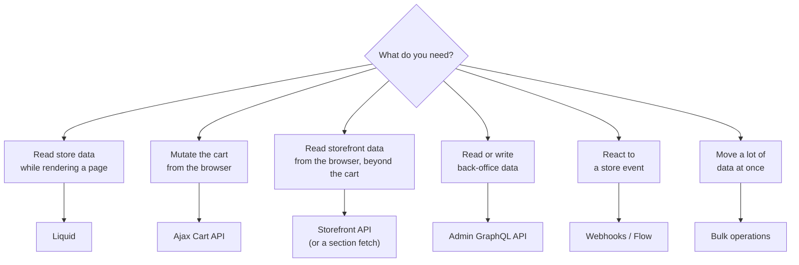

Liquid reads the storefront. Ajax mutates the cart. Everything else — creating metafield definitions, exporting orders, syncing inventory from an ERP, provisioning a B2B company, reading POS sales by location — is the Admin API.

You do not need to become a backend developer. You do need to be able to write a query, read a rate limit header, create a custom app with the right scopes, and hold an informed opinion when an integration partner tells you something is impossible.

## Which API for which job



The mistake to avoid: reaching for the Admin API from theme JavaScript. **The Admin API must never be called from a browser** — its token grants back-office access to the entire store. Anything the storefront needs goes through Liquid, the Ajax API, the Storefront API, or an app proxy that calls the Admin API server-side.

## Admin GraphQL

```graphql title="a query"
query ProductsWithMetafields($cursor: String) {
  products(first: 50, after: $cursor, query: "product_type:Boots AND status:ACTIVE") {
    pageInfo { hasNextPage endCursor }
    nodes {
      id
      title
      handle
      totalInventory
      safetyRating: metafield(namespace: "custom", key: "safety_ratings") { value type }
      variants(first: 100) {
        nodes { id sku price inventoryQuantity selectedOptions { name value } }
      }
    }
  }
}
```

```graphql title="a mutation"
mutation SetProductMetafield($input: ProductInput!) {
  productUpdate(input: $input) {
    product { id title }
    userErrors { field message }
  }
}
```

```json title="variables"
{
  "input": {
    "id": "gid://shopify/Product/8123456789",
    "metafields": [
      { "namespace": "custom", "key": "break_in_days", "type": "number_integer", "value": "14" }
    ]
  }
}
```

:::hint{type=danger}
**`userErrors` is not optional.** A GraphQL mutation can return HTTP 200 with an empty `userErrors` array and have done nothing, or return 200 with `userErrors` populated and have done nothing. Neither raises an exception in your client.

Every mutation you write checks `userErrors` before treating the call as successful. Integrations that skip this fail silently and are discovered weeks later as missing data. This is the GraphQL equivalent of Liquid's silent failure, and it deserves the same paranoia.
:::

### Global IDs

Admin GraphQL uses `gid://shopify/Product/8123456789`. Two consequences:

- You cannot pass a numeric ID from Liquid straight into a GraphQL variable. Construct the GID or use the numeric-ID-accepting fields where they exist.
- Copying an ID out of an admin URL gives you the numeric part; the GID needs the prefix.

### Pagination

```js title="cursor pagination"
async function fetchAllProducts(client) {
  const all = []
  let cursor = null

  do {
    const { data } = await client.request(PRODUCTS_QUERY, { variables: { cursor } })
    all.push(...data.products.nodes)
    cursor = data.products.pageInfo.hasNextPage ? data.products.pageInfo.endCursor : null
  } while (cursor)

  return all
}
```

Cursor-based, always. There is no offset pagination, deliberately — offsets are unstable while data changes underneath you.

## Rate limits: cost, not requests

REST limits requests per second. **GraphQL limits calculated cost**, which is a better model once you understand it.

```json title="every response includes this"
{
  "extensions": {
    "cost": {
      "requestedQueryCost": 502,
      "actualQueryCost": 112,
      "throttleStatus": {
        "maximumAvailable": 2000,
        "currentlyAvailable": 1888,
        "restoreRate": 100
      }
    }
  }
}
```

- **Requested cost** is calculated before execution from the shape of your query. Ask for `first: 250` on a nested connection and the requested cost is high even if only three records come back.
- **Actual cost** is what you were charged after execution.
- **Throttle status** is the leaky bucket: a maximum capacity, a current balance, and a refill rate per second. Standard Shopify plans get a smaller bucket; **Plus gets a substantially larger one**, which is one of the concrete operational benefits of the tier.

```js title="a client that respects the bucket"
async function request(query, variables) {
  const response = await fetch(endpoint, {
    method: 'POST',
    headers: {
      'Content-Type': 'application/json',
      'X-Shopify-Access-Token': process.env.SHOPIFY_ADMIN_TOKEN
    },
    body: JSON.stringify({ query, variables })
  })

  if (response.status === 429) {
    const retryAfter = Number(response.headers.get('Retry-After') || 2)
    await sleep(retryAfter * 1000)
    return request(query, variables)
  }

  const json = await response.json()

  if (json.errors) throw new Error(JSON.stringify(json.errors))

  // Proactive backoff: slow down before being throttled.
  const { currentlyAvailable, restoreRate } = json.extensions.cost.throttleStatus
  if (currentlyAvailable < 200) {
    await sleep(((200 - currentlyAvailable) / restoreRate) * 1000)
  }

  return json
}
```

Practical cost reductions:

1. **Ask only for the fields you use.** This is not style advice — every field has a cost.
2. **Lower your page size.** `first: 50` costs far less than `first: 250` and is usually fast enough.
3. **Do not nest connections deeply.** `products → variants → inventoryLevels` multiplies cost. Fetch separately if you can.
4. **Above a few thousand records, stop paginating and use a bulk operation.**

## Bulk operations

```graphql title="start a bulk query"
mutation {
  bulkOperationRunQuery(
    query: """
    {
      products {
        edges {
          node {
            id
            title
            variants { edges { node { id sku inventoryQuantity } } }
          }
        }
      }
    }
    """
  ) {
    bulkOperation { id status }
    userErrors { field message }
  }
}
```

Poll `currentBulkOperation` until `status: COMPLETED`, then download the `url` — a JSONL file where each line is one object, with child objects carrying a `__parentId`. One request, no rate limit anxiety, any volume.

Use it for: full catalogue exports, order history extracts, inventory reconciliation, anything feeding a data warehouse. There is a corresponding `bulkOperationRunMutation` for writes, driven by a JSONL file you stage first.

:::hint{type=warning}
Only **one bulk operation of each type runs at a time per store**. If an integration partner's nightly export is running, yours will be rejected. On a store with an outsourced development partner and several integrations, that collision is a real coordination problem — and it is exactly the kind of thing that belongs in the shared operational documentation from Day 30.
:::

## Custom apps and access scopes

For internal integrations you do not need a Partner app. Create a **custom app** in the store's admin:

:::steps

1. **Settings → Apps and sales channels → Develop apps → Create an app.**

2. **Configure Admin API scopes.** Grant only what you need. `read_products` and `write_products` are different scopes for a reason.

3. **Install the app.** This generates an **Admin API access token**, shown **once**. Store it in your secret manager immediately.

4. **Configure Storefront API scopes separately** if the integration needs buyer-facing access.

5. **Set the API version** the app targets, and record it in your documentation with its sunset date.

:::

:::hint{type=danger}
The Admin API access token is equivalent to a back-office login for the scopes it holds. Rules that are not negotiable:

- **Never in the theme.** Not in Liquid, not in JavaScript, not in a metafield. A token in a theme file is a token in every visitor's browser.
- **Never in Git.** Environment variables or a managed secret store only.
- **Rotate on staff change.** When someone with access leaves, the token leaves with them.
- **Least privilege.** An integration that reads orders does not need `write_customers`. Scope creep on a token is how a minor vendor incident becomes a customer-data incident.
:::

### App proxies: the safe bridge

When the storefront genuinely needs Admin-only data — a wholesale customer's credit limit, an order history view richer than Liquid allows — an **app proxy** is the mechanism. You register a proxy path (`/apps/wholesale`), Shopify forwards matching storefront requests to your server with a signed payload, and your server calls the Admin API and responds.

The customer's browser talks only to your store's domain. The token never leaves your server. Requests carry a signature you must verify — and verifying it is not optional, because an unverified proxy endpoint is an open API against your store data.

## Webhooks

Polling for changes is wasteful and slow. Webhooks push.

```graphql title="subscribe"
mutation {
  webhookSubscriptionCreate(
    topic: ORDERS_CREATE
    webhookSubscription: {
      callbackUrl: "https://integrations.example.com/shopify/orders-create"
      format: JSON
    }
  ) {
    webhookSubscription { id }
    userErrors { field message }
  }
}
```

Four rules that make webhook consumers reliable, learned the hard way by everyone:

1. **Verify the HMAC signature** on every request. An unverified endpoint accepts forged orders.
2. **Respond 200 within five seconds.** Enqueue the work; do not process inline. Slow endpoints get retried and eventually unsubscribed.
3. **Be idempotent.** Shopify guarantees at-least-once delivery. The same order-created webhook can arrive twice, and your consumer must not create two ERP records.
4. **Reconcile.** Webhooks can be missed. A nightly job that compares yesterday's orders against what you received catches the gaps before finance does.

Useful topics for this role: `ORDERS_CREATE`, `ORDERS_UPDATED`, `PRODUCTS_UPDATE`, `INVENTORY_LEVELS_UPDATE`, `CUSTOMERS_CREATE`, `COMPANY_LOCATIONS_CREATE` (B2B, Chapter 5), `THEMES_PUBLISH` (useful for release notifications), and `APP_UNINSTALLED`.

```quiz
question: >-
  A GraphQL mutation returns HTTP 200 with a populated `userErrors` array —
  `field: ["input", "metafields"]`, `message: "Value is invalid"`. What happened?
options:
  - "The mutation succeeded but Shopify logged a warning"
  - "The mutation did not apply; userErrors carries business-logic validation failures that do not raise HTTP errors"
  - "The request was rate limited and should be retried"
  - "The API version is out of date"
answer: 1
explanation: "GraphQL returns 200 for a syntactically valid request even when the business logic rejected it. `userErrors` is where those rejections live. An integration that only checks HTTP status will silently fail to write data and nobody will notice for weeks."
```

## API versioning is an operational duty

Shopify releases a new API version quarterly (`2025-01`, `2025-04`, `2025-07`, `2025-10`) and supports each for a minimum of twelve months. When a version is sunset, calls to it stop working on a published date.

That makes version tracking part of platform ownership, not a developer chore:

```markdown title="docs/api-versions.md"
| Integration | Owner | API version | Sunset | Upgrade planned |
|---|---|---|---|---|
| ERP order sync | Vendor A | 2025-01 | 2026-01 | Sprint 28 |
| Warehouse inventory feed | Internal | 2025-07 | 2026-07 | not yet |
| Custom app — catalog admin | Internal | 2025-10 | 2026-10 | n/a |
| POS extension | Internal | 2025-10 | 2026-10 | n/a |
```

Read the changelog and the version release notes each quarter. Breaking changes are documented in advance, and the difference between a planned two-hour upgrade and an unplanned outage is entirely whether someone was reading.

:::hint{type=tip}
**REST is legacy.** Shopify has designated GraphQL as the primary Admin API surface and stopped adding new functionality to REST — several newer areas, including significant parts of the B2B and Functions surfaces, are GraphQL-only. Write new integrations in GraphQL, and when you inherit REST code, treat migration as scheduled work rather than an emergency. Check the current documentation for the state of any specific REST endpoint before relying on it.
:::

## Exercise

:::checklist{title="Day 13 checklist"}
- [ ] Created a custom app in your development store with least-privilege scopes
- [ ] Stored the access token in an environment variable, never in the repository
- [ ] Ran a products query in the GraphiQL explorer and read the `extensions.cost` block
- [ ] Deliberately wrote an expensive query (deep nesting, `first: 250`) and compared requested versus actual cost
- [ ] Wrote a paginated fetch that walks every product using cursors
- [ ] Wrote a mutation that sets a metafield, and handled `userErrors` explicitly
- [ ] Created a metafield definition via `metafieldDefinitionCreate` — the schema-migration pattern from Day 5
- [ ] Ran a bulk operation, polled it to completion and parsed the JSONL
- [ ] Subscribed to a webhook, received it (a tunnelling tool such as the CLI's is fine), and verified the HMAC
- [ ] Implemented backoff that reads `throttleStatus` and slows down before being throttled
- [ ] Wrote `docs/api-versions.md` for every integration you know about
:::

### Stretch problems

1. Write a script that exports every product with its metafields to CSV, twice — once with pagination, once with a bulk operation — on a store with at least 500 products. Compare wall-clock time and the amount of code.
2. Build a tiny app proxy that returns a wholesale customer's recent orders as JSON, verify the request signature, and call it from theme JavaScript. This is the exact pattern Chapter 5 needs.
3. Write the idempotency logic for an `ORDERS_CREATE` consumer, then deliberately deliver the same payload three times and confirm one record is created.
4. Take an existing REST integration (Shopify's docs have examples) and rewrite one endpoint in GraphQL. Note what got easier and what got harder — the honest answer includes both.

## Where this is going

Tomorrow: getting all of this into production safely. Git-based theme deployment, the GitHub integration, branching strategy for a team with an external partner, CI that runs Theme Check and a performance budget, and a release process nobody has to be brave to follow.
