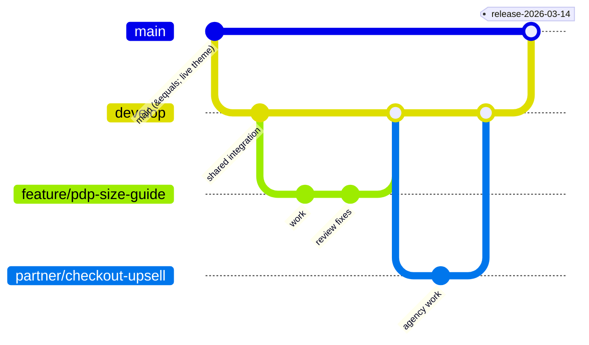

Everything so far has been building. This lesson is about shipping, which on Shopify has one property that makes it different from every other deployment you have done: **part of your production state is owned by other people, lives in the same files as your code, and changes without your knowledge.**

A merchandiser rearranging the homepage writes to `templates/index.json`. A campaign manager changing a colour writes to `config/settings_data.json`. If your deployment overwrites those files with what was in Git at the time you branched, you have just deleted their work — during a campaign, usually.

Everything below exists to prevent that while still letting you ship weekly.

## Branching for this particular team shape

The realistic shape for this role is one internal developer, an external agency working in parallel, and a merchandising team editing live. That constrains the model.



- **`main` mirrors the live theme.** Nothing lands here except a release merge. Protected: no direct pushes, review required, CI must pass.
- **`develop` is the integration branch**, connected to a permanent unpublished **Staging** theme via the GitHub integration. Everything merges here first, and stakeholders preview here.
- **`feature/*`** — your work. Each connected to a development theme via `shopify theme dev`, or to a temporary preview theme when someone else needs to look at it.
- **`partner/*`** — the agency's branches. Same CI, same review requirements, merged by you into `develop`. This is the mechanism through which "consistent standards across both teams" actually happens: it is a branch protection rule, not a shared document.

:::hint{type=tip}
**Give the external partner their own preview theme, not access to yours.** A named theme — "Agency – Feature Preview" — connected to their branch means they can demo without touching staging, and you can see their work at any time without asking. It also makes the boundary of responsibility legible when something breaks.
:::

### Reviewing an agency's pull request

You are the internal technical reference, which in practice means your review is the quality gate. A checklist keeps it consistent and keeps it depersonalised:

```markdown title=".github/pull_request_template.md"
## What and why
<!-- One paragraph. Link the ticket. -->

## Screenshots / preview
<!-- Preview theme link. Before/after for visual changes. -->

## Checks
- [ ] `shopify theme check` passes with no new offences
- [ ] Tested in the theme editor: settings change live, no full reload
- [ ] Tested at 375px, 768px and 1440px
- [ ] Tested with JavaScript disabled — core purchase path still works
- [ ] Keyboard navigable; focus visible; new strings in locales, not hard-coded
- [ ] No new third-party origins (or one is justified below with measurements)
- [ ] No changes to `config/settings_data.json` or `templates/*.json` unless intended and called out
- [ ] Images use `image_url` + `image_tag` with a correct `sizes`
- [ ] New settings have defaults and the section looks correct on first add
- [ ] B2B and POS impact considered (or explicitly N/A)

## QA notes
<!-- What to test, what data is needed, what should NOT have changed. -->

## Rollback
<!-- What to do if this misbehaves in production. -->
```

## The GitHub integration

Connect a branch to a theme in **Online Store → Themes → Add theme → Connect from GitHub**.

What it does:

- Commits to the branch update that theme, automatically.
- Changes made in the **theme editor** to that theme are committed back to the branch.

That second behaviour is the important one, and it is why the model above puts a *staging* theme on `develop` rather than nothing.

:::hint{type=danger}
**Connect the live theme to `main` and understand what you have done.** Merchandiser edits to the live theme now commit directly to `main` — which is good (their work is versioned and you cannot clobber it) and startling (your protected branch receives commits from people who have never seen GitHub).

Two consequences to plan for:

1. **Always pull `main` before branching.** Yesterday's merchandising work is in there.
2. **Those commits skip CI meaningfully** — they are data changes, not code, and your linter has nothing to say about them. Do not be reassured by a green build on a commit that only changed `settings_data.json`.

The alternative — no connection, deploy by CLI — means merchandiser edits live only on the theme and are wiped by your next deploy. That is worse. Take the connection and adjust the process.
:::

## CI

```yaml title=".github/workflows/theme-ci.yml"
name: Theme CI

on:
  pull_request:
    branches: [develop, main]

jobs:
  lint:
    runs-on: ubuntu-latest
    steps:
      - uses: actions/checkout@v4

      - uses: actions/setup-node@v4
        with:
          node-version: '20'

      - name: Install Shopify CLI
        run: npm install -g @shopify/cli

      - name: Theme Check
        run: shopify theme check --fail-level error

      - name: Reject merchant-owned file changes
        run: |
          CHANGED=$(git diff --name-only origin/${{ github.base_ref }}...HEAD)
          if echo "$CHANGED" | grep -qE '^(config/settings_data\.json|templates/.*\.json)$'; then
            if ! echo "${{ github.event.pull_request.body }}" | grep -q 'INTENTIONAL_JSON_CHANGE'; then
              echo "::error::This PR changes merchant-owned JSON. Add INTENTIONAL_JSON_CHANGE to the description if deliberate."
              exit 1
            fi
          fi

      - name: Asset size budget
        run: |
          JS_BYTES=$(find assets -name '*.js' -exec cat {} + | gzip -c | wc -c)
          echo "Theme JS (gzipped): $JS_BYTES bytes"
          if [ "$JS_BYTES" -gt 102400 ]; then
            echo "::error::Theme JavaScript exceeds the 100KB budget."
            exit 1
          fi

      - name: Detect remote assets
        run: |
          if grep -rnE 'src="https?://(?!cdn\.shopify\.com)' --include='*.liquid' . ; then
            echo "::error::A remote asset was added. Vendor it into assets/ or justify it."
            exit 1
          fi
```

The middle step is the one worth stealing. It cannot stop a bad deploy on its own, but it forces the person opening the PR to state that a merchant-owned JSON change is deliberate — which converts the most destructive class of mistake from silent to explicit.

Add a Lighthouse CI job against the staging theme's preview URL once the basics are green:

```yaml title="lighthouse job (abridged)"
      - name: Lighthouse CI
        run: |
          npm install -g @lhci/cli
          lhci autorun \
            --collect.url=$STAGING_URL/products/steel-toe-work-boot \
            --collect.url=$STAGING_URL/collections/all \
            --assert.preset=lighthouse:recommended \
            --assert.assertions.largest-contentful-paint="error,maxNumericValue=2500"
```

Remember Day 11's caveat: this is lab data. Use it as a **regression detector** — "this PR made LCP 600ms worse" — rather than as an absolute score to chase.

## Deploying

```bash title="deploy.sh"
#!/usr/bin/env bash
set -euo pipefail

STORE="${SHOPIFY_STORE:?set SHOPIFY_STORE}"
THEME_ID="${1:?usage: deploy.sh <theme-id>}"

# 1. Take a snapshot of what is currently live. This is the rollback artefact.
shopify theme pull --store "$STORE" --theme "$THEME_ID" --path ./.rollback

# 2. Push code, but never merchant-owned data.
shopify theme push \
  --store "$STORE" \
  --theme "$THEME_ID" \
  --ignore=config/settings_data.json \
  --ignore='templates/*.json' \
  --ignore='sections/*-group.json'

echo "Deployed to theme $THEME_ID. Rollback snapshot in ./.rollback"
```

If you are using the GitHub integration, this script is your break-glass path rather than your normal one — normally the merge does the deploy. Keep it, keep it tested, and keep it documented, because the day you need it is the day the integration is having a bad time.

:::hint{type=warning}
**When a JSON template change genuinely is part of the release** — a new section added to the PDP, say — it needs coordinating, not ignoring. The reliable sequence:

1. Announce a short freeze on theme editor changes for the affected templates.
2. Pull the current live JSON so you are merging onto today's reality, not last week's.
3. Merge your section addition into that current JSON.
4. Deploy including that one file, explicitly.
5. Lift the freeze and tell the merchandising team what changed.

Skipping step 2 is how a campaign homepage disappears. There is no clever automation that removes the need for the announcement — this is a coordination problem wearing an engineering costume.
:::

## Publishing and rolling back

The safe publish sequence:

:::steps

1. **Merge to `main`.** The GitHub integration updates the theme connected to `main`, or your pipeline pushes it.
2. **Duplicate the live theme first** if it is not already versioned — this is your rollback target and it costs nothing.
3. **Preview the release theme.** Walk the critical paths: home, collection, PDP, add to cart, cart, checkout initiation, account login, and — from Chapter 5 onward — a B2B session.
4. **Publish.** Online Store → Themes → Actions → Publish. Near-instant.
5. **Verify on production.** The same critical paths, plus a real test order through Bogus Gateway on a development store, or a genuine low-value order on production if the business allows it.
6. **Watch.** Error rates, the vitals dashboard, and the support inbox for the next hour.

:::

**Rollback is publishing the previous theme.** Ten seconds, no build, no cache invalidation. That is a genuine advantage of the platform and it should shape how you think about risk: the cost of a bad release is low *provided the previous theme still exists*.

Which produces the housekeeping rule: a store holds 20 themes, so keep the last three or four releases and delete the rest on a schedule. Discovering you cannot roll back because someone tidied up is a bad twenty minutes.

```quiz
question: You merge a release that includes a new section added to `templates/product.json`. After deploy, merchandisers report that a promotional section they added to product pages yesterday has vanished. What happened?
options:
  - "The new section's schema is invalid and Shopify removed conflicting sections"
  - "Your branch's copy of product.json was based on an older state and overwrote yesterday's theme editor changes"
  - "The GitHub integration reverted the file to match main"
  - "Publishing a theme always resets JSON templates to their committed state"
answer: 1
explanation: "JSON templates are merchant-owned data as well as code. Your branch held the file as it was when you branched; merchandisers edited the live copy since. Deploying it replaced their edits. The fix is to pull current live JSON, merge your change onto it, and coordinate a short freeze — not to hope."
```

## Commits, and why the discipline pays here specifically

Conventional commits are useful anywhere; on a Shopify theme they are unusually useful, because your Git history is the *only* record of what changed. There is no build artefact, no version number in a package manifest, and the theme editor shows a merchant nothing about code.

```text title="commit style"
feat(pdp): add size guide drawer bound to fit_guide metaobject
fix(cart): use line key instead of index in quantity change
perf(collection): remove nested variants loop, TTFB 780ms → 210ms
chore(deps): vendor web-vitals into assets
refactor(sections): extract spec-row into a theme block
docs(custom-data): record ops.* namespace ownership
```

That `perf` message is doing real work: six months from now, when someone asks whether the collection page has always been this fast, the answer is in `git log`. Include the measurement in the commit body when you have one.

Tag releases (`release-2026-03-14`) and write release notes into the tag. When a merchandiser asks "when did the PDP change?", the answer is one command away.

## Exercise

:::checklist{title="Day 14 checklist"}
- [ ] Repository has `main`, `develop` and a feature branch, with branch protection on `main`
- [ ] `develop` connected via the GitHub integration to a permanent unpublished Staging theme
- [ ] Made a theme editor change on staging and confirmed it committed back to `develop`
- [ ] Pull request template committed, covering theme editor, no-JS, responsive and merchant-JSON checks
- [ ] CI runs Theme Check with `--fail-level error` on every PR
- [ ] CI fails a PR that touches `settings_data.json` or `templates/*.json` without an explicit marker — verified by opening one deliberately
- [ ] CI enforces a JavaScript size budget, and you confirmed it fails when exceeded
- [ ] CI rejects new remote asset origins
- [ ] `deploy.sh` written, with a rollback snapshot step and `--ignore` flags
- [ ] Performed a full release: merge, preview, publish, verify, and then a rollback to the previous theme
- [ ] Timed the rollback and wrote the number in your runbook
- [ ] Theme library tidied to the last three releases plus staging
:::

### Stretch problems

1. Simulate the disaster: make a theme editor change to staging, then deploy a branch with a stale `templates/index.json` and watch the change disappear. Then restore it from the theme editor's own version history. Knowing that history exists — and its limits — is worth the exercise.
2. Add a CI step that comments on the pull request with the byte-size delta of `assets/` versus the base branch. Reviewers respond to numbers far more reliably than to guidelines.
3. Write the release runbook: pre-flight checks, deploy steps, verification list, rollback procedure, who to notify. Aim for something a colleague could execute at 7am without you.
4. Set up a second, partner-facing preview theme connected to a `partner/*` branch and confirm the agency workflow end to end — including that their PR runs the same CI as yours.

## Where this is going

Tomorrow closes the chapter: the human process around all of this. Sprint ceremonies, writing tickets that survive contact with a designer and a product manager, the handoff to QA, and how a solo developer manages competing priorities across three commerce channels without becoming the bottleneck.
