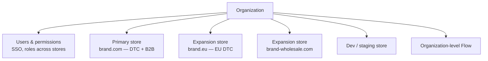

Plus is often described in sales terms — dedicated support, a launch manager, higher limits. Those are real, but they are not what changes your job. What changes your job is a short list of capabilities that either exist or do not, and each one has architectural consequences.

Being precise about that list is genuinely useful, because a lot of published advice is out of date. Several features that were once Plus-only are now on every plan, and the most important Plus-era features — Scripts and `checkout.liquid` — are the ones being retired.

## What is actually Plus-only

| Capability | Plus-only? | What it means for you |
|---|---|---|
| Organization admin, expansion stores | **Yes** | Multi-store architecture becomes viable |
| Checkout UI extensions and branding API | **Yes** for the deeper surfaces | Checkout customisation without unsupported hacks |
| B2B (companies, catalogs, price lists) | **Yes** | Wholesale on the same store, native — Chapter 5 |
| Launchpad | **Yes** | Scheduled, automated campaign events — Day 20 |
| Shopify Scripts | **Yes**, and **legacy** | Being replaced by Functions; do not build new ones |
| Multipass SSO | **Yes** | Login from an external identity system |
| Higher API rate limits | **Yes** | Larger GraphQL cost bucket, more headroom for integrations |
| More staff accounts and locations | **Yes** | Matters for a growing retail footprint |
| Shopify Functions | **No** — all plans | Discounts, delivery, payment and validation logic |
| Shopify Flow | **No** — all plans now | Automation; still central to how you operate |
| Metafields, metaobjects, Online Store 2.0 | **No** | Everything in Chapter 1 works everywhere |
| Shopify Markets | **No**, with Plus-tier extras | International selling |

:::hint{type=warning}
Plan-gating changes. Flow and Functions both moved from Plus-only to broadly available, and the checkout extensibility surfaces have been rolling out in stages. **Check the current documentation before telling a stakeholder that something requires an upgrade** — being wrong in that direction is embarrassing and expensive. The durable Plus differentiators are organization/multi-store, B2B, Launchpad, Multipass and the higher limits.
:::

## Organization admin and expansion stores

A Plus organization holds multiple stores under one roof, with centralised user management.



What is **not** shared between stores, and this is the part that surprises people:

- **Themes.** No sync. Two stores means two theme deployments — which is why the Day 14 release process needs to be scripted, not manual.
- **Products and inventory.** Separate catalogues unless an app or an integration syncs them.
- **Customers and their accounts.** Separate. A customer on `brand.com` does not exist on `brand.eu`.
- **Apps.** Installed and paid for per store.
- **Metafield and metaobject definitions.** Separate. This is where `metafieldDefinitionCreate` from Day 13 earns its keep — you script definitions rather than recreating them in a form.
- **Orders and reporting.** Separate, with some organization-level roll-up.

That list is the argument against expansion stores, and it is a strong one. Every store you add multiplies your maintenance surface by roughly one.

### One store or two?

```quiz
question: A brand selling in the UK wants to launch in Germany with German language, EUR pricing, local payment methods and a .de domain. Should this be an expansion store or a market on the existing store?
options:
  - "An expansion store — different country, different currency"
  - "A market on the existing store, unless legal, catalogue or operational separation genuinely requires otherwise"
  - "An expansion store, because themes cannot be translated"
  - "A market, because expansion stores cannot have their own domain"
answer: 1
explanation: "Markets handle currency, language, domain, market-specific pricing and catalogs on one store — one theme, one product catalogue, one customer base, one set of apps to pay for. Expansion stores are correct when there is a genuine reason for separation: a distinct legal entity, a substantially different product range, a different business model, or regulatory constraints. Defaulting to a second store because the country is different is how a two-person team ends up maintaining five storefronts."
```

Situations where an expansion store genuinely is right:

- A **separate legal entity** with its own tax registration, banking and terms.
- A **different business model** on the same brand — a franchise portal, an employee store, a warranty-parts store.
- A **substantially different catalogue** where sharing would create more mapping work than separation.
- A **hard requirement to isolate** for compliance or for a partner relationship.

Situations where it is not: different currency, different language, different domain, "the wholesale site should look different." All of those are Markets, or B2B on the same store, or a theme with an alternate template.

## Functions: the replacement for Scripts

Shopify Scripts were the Plus feature: Ruby scripts running in the checkout to alter line item pricing, shipping and payment options. They are legacy, and Shopify has been migrating stores off them onto **Shopify Functions**.

The difference is architectural, not cosmetic:

| | Scripts (legacy) | Functions |
|---|---|---|
| Language | Ruby, in the Script Editor | Rust, JavaScript or any language compiling to WebAssembly |
| Where it lives | In the store's admin | In an app, deployed via the Shopify CLI |
| Version control | None meaningful | Real Git, real CI, real review |
| Testing | In production, mostly | Local unit tests plus preview |
| Availability | Plus only | All plans |
| Surfaces | Line items, shipping, payment | Discounts, delivery and payment customization, cart transform, validation, and a growing list |

If you inherit a store with Scripts, cataloguing and migrating them is real, schedulable work with a deadline attached — and it is exactly the kind of platform-health item that loses every individual sprint argument unless it has a standing allocation (Day 15). Tomorrow is a full lesson on writing Functions.

## Checkout extensibility

The other Plus-era feature being retired is `checkout.liquid`. For years, Plus merchants could customise the checkout by editing a Liquid template and pasting code into "Additional Scripts" boxes. Both are being wound down on published timelines, in stages — information/shipping/payment pages first, then the thank-you and order status pages.

The replacement is a set of supported seams:

:::cards

:::card{title="Checkout UI extensions"}
React-based components rendered at defined extension points in the checkout — a delivery instructions field, an upsell, a trade-account notice. Sandboxed, reviewed, and stable across Shopify's own checkout updates.
:::

:::card{title="Branding API"}
Programmatic control of the checkout's colours, typography, corner radii and logo, per checkout profile. This is how the checkout stays on-brand without templating it.
:::

:::card{title="Checkout profiles"}
Named checkout configurations you can publish independently — including scheduling a campaign look, and running a separate profile for B2B.
:::

:::card{title="Functions and Web Pixels"}
Discount and shipping logic moves to Functions; tracking moves to pixels. Between them they cover most of what Additional Scripts was used for.
:::

:::

:::hint{type=danger}
If you join a company still on `checkout.liquid` or Additional Scripts, **establish the exact sunset dates and the inventory of what is running there in your first fortnight**. Every one of those customisations needs a new home, some have no direct equivalent and need a product decision, and the deadline does not move. This is the single highest-risk piece of undiscovered work on a legacy Plus store, and finding it early is the difference between a planned migration and a scramble.
:::

## The limits that shape architecture

Plus raises numbers you would otherwise design around:

- **API rate limits.** A materially larger GraphQL cost bucket. This is what makes a real-time ERP integration viable rather than a nightly batch.
- **Staff accounts.** Effectively unbounded, which matters when every retail associate needs POS access (Chapter 6).
- **Locations.** A higher cap — directly relevant to a growing retail network.
- **Checkout throughput.** Higher guaranteed capacity, which is the real reason drop-driven brands are on Plus.
- **Variants per product.** Higher ceilings for large size runs.

Two more worth knowing by name:

**Multipass** lets an external system authenticate a customer into the storefront by passing a signed, encrypted token. If the business has a trade portal or a membership system that owns identity, Multipass is how a customer arrives logged in. It is Plus-only and it comes up more often in B2B contexts than DTC.

**Shopify Audiences and the wholesale/marketplace connectors** are commercial features rather than developer surfaces, but knowing they exist stops you building something the platform already offers.

## What this means for the workwear store

Concretely, the architecture for our three-channel business:

- **One store**, not three. DTC, B2B and POS on the same store, sharing one product catalogue, one inventory pool and one set of metafield definitions. The channels differ through B2B catalogs, alternate templates, POS configuration and Functions.
- **Markets** for any international expansion, until a legal entity forces otherwise.
- **One expansion store** for a genuinely separate concern if one appears — an employee store, say — and a written justification when it does.
- **A staging store or staging theme** that mirrors production closely enough to test B2B and POS behaviour, because those cannot be meaningfully tested on the live store.
- **Functions, not Scripts**, for every pricing rule, from the first one.

:::hint{type=tip}
Write this down as `docs/architecture-decisions.md`, in the form of short ADRs: the decision, the date, the alternatives considered, the consequences. When someone asks in eighteen months why wholesale is not a separate store, the answer should be a document, not a memory. On a solo-owned platform, ADRs are also the closest thing you have to a second opinion — writing the alternatives down forces you to have actually considered them.
:::

## Exercise

:::checklist{title="Day 16 checklist"}
- [ ] Confirmed your development store is on a Plus plan and located the organization-level settings
- [ ] Listed which Plus features are visible in your admin and which are not
- [ ] Checked the current documentation for three features you believed were Plus-only, and corrected anything you had wrong
- [ ] Written the one-store-versus-expansion-store decision for the workwear business, with reasoning
- [ ] Enumerated exactly what would need duplicating if a second store were added — themes, apps, definitions, integrations
- [ ] Found the Scripts editor (or established that the store has none) and inventoried anything there
- [ ] Established whether the store uses `checkout.liquid` or Additional Scripts, and what is in them
- [ ] Reviewed checkout settings and located checkout profiles and the branding controls
- [ ] Written `docs/architecture-decisions.md` with your first three ADRs
:::

### Stretch problems

1. Cost the second store honestly: apps, theme deployments, definition duplication, testing surface, integration endpoints, and your time per sprint. Produce a number. It is usually larger than anyone expects.
2. Draft the migration plan for a hypothetical store with four Scripts and 300 lines in Additional Scripts. What becomes a Function, what becomes a pixel, what becomes a UI extension, what needs a product decision, and what is the sequencing?
3. Research Multipass and write a one-page explanation for a non-technical stakeholder of what it would and would not solve for a trade-account portal.
4. Compare Markets against expansion stores for a specific scenario: the workwear brand selling into Canada with CAD pricing, a `.ca` domain, and a slightly different product range due to certification differences. Argue it both ways, then commit.

## Where this is going

Tomorrow: Shopify Functions in depth. Writing, testing and deploying one — a volume discount that applies to wholesale customers but not DTC, which is the exact shape of requirement this role receives constantly.
