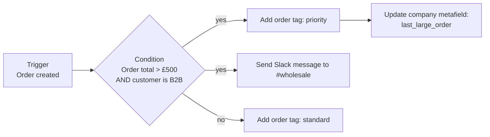

Flow is a no-code automation builder, which is exactly the kind of tool developers dismiss and then, a year later, quietly rely on for eleven business-critical processes.

Take it seriously for two reasons. First, a meaningful share of the requests you receive are automation requests wearing a feature costume, and Flow answers them in twenty minutes with no deployment. Second, when a solo developer owns three commerce channels, anything that moves work out of the code path and into a merchant-editable surface is a permanent capacity gain.

The risk is the same as with any low-code tool: it becomes an undocumented shadow system. The governance section at the end is not optional reading.

## The model



One trigger, any number of conditions and actions, arbitrary branching. Data flows forward: later steps can reference anything from the trigger and from previous steps.

### Triggers worth knowing

| Category | Examples |
|---|---|
| Orders | created, paid, fulfilled, cancelled, refunded, risk analysed |
| Products | created, added to or removed from a collection, published |
| Inventory | quantity changed, below threshold |
| Customers | created, tag added, account state changed |
| B2B | company created, company location created, contact added |
| Draft orders | created, completed |
| Fulfilment | order fulfilled, fulfilment request accepted |
| Apps | anything a connector exposes |
| **Custom** | events your own app or Function emits |

### Liquid inside Flow

Flow supports Liquid in most fields, which is where its real power sits:

```liquid title="a Slack message body"
🔔 *Large wholesale order* — {{ order.name }}

Company: {{ order.purchasingEntity.company.name }}
Location: {{ order.purchasingEntity.location.name }}
Total: {{ order.currentTotalPriceSet.shopMoney.amount }} {{ order.currentTotalPriceSet.shopMoney.currencyCode }}
PO number: {{ order.customAttributes | where: "key", "po_number" | first | map: "value" }}

Lines:

• {{ line.quantity }} × {{ line.title }} ({{ line.sku }})


⚠️ First order from this account
```

The same Liquid you learned on Day 2, against the Admin API's object shapes rather than the storefront's. Note `order.customAttributes` — that is the cart attribute your checkout UI extension wrote yesterday, arriving here as workflow data. The pieces connect.

## Workflows worth building for this business

:::cards

:::card{title="Wholesale order routing"}
Order created → purchasing company present → tag by company tier, notify the wholesale channel, and set a fulfilment priority tag the 3PL reads. Replaces a person watching an inbox.
:::

:::card{title="Low stock escalation"}
Inventory below threshold at a retail location → notify that store's manager and the buying team, with the SKU, location and current quantity. Directly supports the multi-location work in Chapter 6.
:::

:::card{title="New B2B account onboarding"}
Company created → assign the default catalog, tag the company, create a task in the CRM via HTTP, and email the assigned sales rep. Turns a twenty-minute manual checklist into a workflow.
:::

:::card{title="High-risk order hold"}
Order created with elevated risk → hold fulfilment, tag, and notify. This is the kind of thing that would otherwise be a custom app and is thirty minutes in Flow.
:::

:::card{title="Product data quality"}
Product published → missing a required metafield → add a `needs-data` tag and notify merchandising. A quiet, permanent quality gate that costs nothing to run.
:::

:::

That last one is worth dwelling on. It is a *validation* workflow, and building validation into the platform rather than into a document is one of the highest-return things a platform owner does.

## HTTP requests: Flow as a lightweight integration layer

```json title="an HTTP request action"
{
  "url": "https://erp.internal.example.com/api/v2/orders",
  "method": "POST",
  "headers": {
    "Authorization": "Bearer {{ shop.metafields.integrations.erp_token }}",
    "Content-Type": "application/json",
    "Idempotency-Key": "{{ order.id }}"
  },
  "body": {
    "shopify_order_id": "{{ order.id }}",
    "order_number": "{{ order.name }}",
    "company_id": "{{ order.purchasingEntity.company.externalId }}",
    "po_number": "{{ order.customAttributes | where: 'key', 'po_number' | first | map: 'value' }}",
    "lines": "{{ order.lineItems | map: 'sku' | json }}"
  }
}
```

This is a real integration path and for low-volume, non-critical flows it is genuinely appropriate. Know its boundaries before you rely on it:

:::hint{type=warning}
**Flow's HTTP action is not a resilient integration platform.**

- Retry behaviour is limited and not configurable to arbitrary policies.
- There is no dead-letter queue you own.
- Failures are visible in the run log, but nobody is watching the run log.
- Secrets in workflow fields are visible to anyone with Flow access.

Use it for: internal notifications, low-volume enrichment, triggering a job in a system that is itself resilient. Do **not** use it as the only path for order data reaching an ERP — that belongs on a webhook consumer you control, with idempotency and reconciliation (Day 13). The `Idempotency-Key` above is the minimum bar, not a substitute for that.
:::

For secrets, prefer a shop-level metafield with restricted access over pasting a token into a workflow field, and rotate it like any other credential.

## Custom triggers: Flow as an extension point in your own code

This is the most interesting pattern in this lesson, and the least used.

Your app or Function emits a Flow trigger. The merchant then decides what happens next, in a workflow they can edit, without you deploying anything.

```graphql title="emitting a custom trigger"
mutation FlowTriggerReceive($handle: String!, $payload: JSON!) {
  flowTriggerReceive(handle: $handle, payload: $payload) {
    userErrors { field message }
  }
}
```

```json title="payload"
{
  "handle": "wholesale-credit-limit-exceeded",
  "payload": {
    "company_id": "gid://shopify/Company/123",
    "attempted_total": "12400.00",
    "credit_limit": "10000.00",
    "sales_rep_email": "rep@example.com"
  }
}
```

Now the business can decide — this quarter — whether that emails the rep, creates a draft order, notifies finance, tags the company, or all four. Next quarter they can change it without you. You built an event; they built the response.

That is the same principle as section schema settings and Function configuration metafields, applied to business process. It is the single most reliable way for a solo developer to stop being the bottleneck, and it is worth deliberately looking for opportunities to apply it.

```quiz
question: >-
  A stakeholder asks for a feature — when a wholesale order over £5,000 comes in,
  notify the sales rep, tag the order, and create a task in the CRM. What is the
  right first move?
options:
  - "Build a custom app with an ORDERS_CREATE webhook"
  - "Build it in Flow, and only move to code if Flow's limits are genuinely reached"
  - "Add it to the theme's order status page"
  - "Write a Function"
answer: 1
explanation: "Every element of that request is a standard Flow trigger, condition and action, including the CRM task via a connector or HTTP request. It takes half an hour, needs no deployment, and the business can adjust the threshold themselves. Reaching for a custom app first creates code you own forever for something the platform already does."
```

## Governance

The failure mode is predictable: two years in, there are 60 workflows, a third are disabled, several duplicate each other, two are tagging orders in ways nobody can explain, and one has been silently failing for months.

Prevent it with four cheap habits.

**1. Name workflows so the list is readable.**

```text
[ORDERS] Wholesale order over £5k → notify rep + tag
[INVENTORY] Retail low stock → notify store manager
[B2B] Company created → assign catalog + CRM task
[QUALITY] Product published without safety rating → tag + notify
[DEPRECATED 2026-02] Old fulfilment routing — replaced by ERP webhook
```

Category prefix, trigger, outcome. Sortable, searchable, and obvious at a glance which one to look at when something odd happens to an order.

**2. Document them where developers look.**

```markdown title="docs/flows.md"
| Workflow | Trigger | Owner | Business purpose | Touches | Review |
|---|---|---|---|---|---|
| [ORDERS] Wholesale >£5k | Order created | Sales ops | Rep visibility on large accounts | Order tags, Slack, CRM | 2026-Q4 |
| [B2B] Company created | Company created | Sales ops | Onboarding checklist | Catalog, company tags, CRM | 2026-Q4 |
| [QUALITY] Missing safety rating | Product published | Merch | Prevent incomplete PDPs | Product tags | 2026-Q3 |
```

Same shape as the app inventory and the custom data document. A platform owner's real deliverable is often a table.

**3. Check the run log when something is strange.** "Why is this order tagged?" is answered in the run log in thirty seconds. Knowing to look there is a superpower on a store with heavy automation.

**4. Review quarterly.** Disabled workflows get deleted. Workflows past their review date get re-justified. Anything whose owner has left gets a new owner or gets removed.

:::hint{type=danger}
**Flow can create loops.** A workflow that adds a tag, triggered by a tag being added, will run until Shopify stops it. Worse are indirect loops across several workflows — A tags the order, B triggers on that tag and updates a metafield, C triggers on the metafield and re-tags.

Before adding any workflow that *writes* data, check what else triggers on that data. This is the strongest practical argument for the inventory table: it is the only way to answer that question without opening sixty workflows.
:::

## When Flow is the wrong tool

Be honest about the boundaries:

- **Real-time customer-facing behaviour.** Flow runs asynchronously with variable latency. It cannot decide anything at page-render or checkout time — that is Liquid or a Function.
- **High volume.** Thousands of executions an hour is not what it is for.
- **Complex multi-step logic with state.** If a workflow has fifteen branches, it should be code. The readability crossover comes sooner than people expect.
- **Anything requiring transactional guarantees.** Flow does not roll back.
- **Anything where silent failure is unacceptable** without your own monitoring on top.

The corollary is worth stating positively: for asynchronous, low-to-moderate volume, business-owned reactions to store events, Flow is not the compromise — it is the correct architecture, because it puts the logic where the people who change it can reach it.

## Exercise

:::checklist{title="Day 19 checklist"}
- [ ] Built a workflow with a trigger, a condition with two branches, and different actions on each
- [ ] Used Liquid in an action to compose a rich notification including line items
- [ ] Built the low-stock workflow with a location-aware notification
- [ ] Built a data quality workflow that tags products missing a required metafield
- [ ] Used an HTTP request action against a test endpoint, including an idempotency key
- [ ] Stored the endpoint's credential in a shop metafield rather than in the workflow field
- [ ] Triggered a workflow failure deliberately and found it in the run log
- [ ] Emitted a custom trigger from a script via `flowTriggerReceive` and built a workflow on it
- [ ] Adopted the naming convention across every workflow in the store
- [ ] Wrote `docs/flows.md` with owners and review dates
- [ ] Mapped which workflows write data, and confirmed none can trigger another
:::

### Stretch problems

1. Take one of the workflows you built and write the equivalent as a webhook consumer. Compare: lines of code, deployment surface, failure handling, who can change it. Then decide which one you would actually run in production, and write the reasoning down.
2. Design the full B2B onboarding workflow for the workwear store: company created → catalog assignment, payment terms, tags, rep assignment, welcome email, CRM record. Note which steps Flow can do natively and which need HTTP or an app action.
3. Deliberately build a two-workflow loop in a development store, observe what happens, and then write the guidance you would give a colleague to prevent it.
4. Audit an existing store's workflows (or a set you create) and produce the inventory table. Time how long the audit takes — that number is the argument for maintaining the table continuously.

## Where this is going

Tomorrow closes the chapter: Launchpad and campaign engineering. Scheduling theme publishes, price changes and inventory releases for a drop — and the release discipline that keeps a high-traffic launch from becoming an incident.
