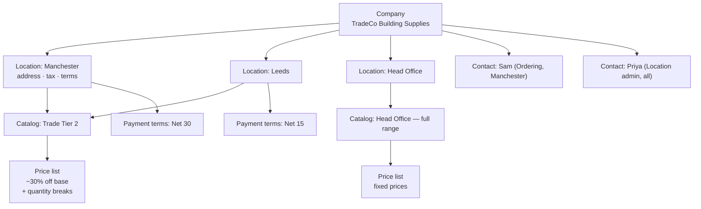

Most stores that sell wholesale do it badly, and the pattern is always the same: a customer tag called `wholesale`, a discount code, a hidden collection, some Liquid conditionals, and a spreadsheet the sales team maintains separately.

It works until it does not. It cannot express different prices for different accounts, it cannot handle a company with five buying locations and different terms at each, it leaks trade prices to anyone who guesses a URL, and it puts the sales team's real pricing outside the system that fulfils the orders.

Shopify Plus has a native B2B model instead, and understanding it properly is the single most differentiating thing in this course. Most Shopify developers have never touched it.

## The model



Read the arrows carefully, because the important detail is easy to miss:

**Pricing is resolved at the company _location_, not the company.** A company's Manchester branch can be on Trade Tier 2 while Head Office sees the full range at different prices. That is not an edge case — it is how distribution businesses actually work, and it is the reason a tag-based approach cannot be retrofitted.

### Companies

A company holds: name, external ID (your ERP's identifier for them — set it), locations, contacts, metafields, and its default location. Companies can be tagged, and they support metafields, which is where account tier, assigned sales rep, credit limit and anything else the business tracks should live.

### Company locations

Each location has its own shipping and billing address, tax registration and exemptions, payment terms, assigned catalogs, and its own metafields.

A buyer who belongs to multiple locations chooses which one they are ordering for. That choice changes prices, available products, tax, terms and the shipping address — which means your theme must display the current location clearly and let them switch. Day 22 builds that.

### Contacts and roles

A company contact is a customer record linked to a company with a role at one or more locations. Roles determine what they can do — place orders, view all of a location's orders rather than just their own, manage the location.

:::hint{type=warning}
**B2B requires the newer customer accounts.** The classic account system does not support the company context — there is nowhere for it to live. If you inherit a store on classic accounts, migrating is a prerequisite for B2B, not an optional modernisation, and it affects login flows, account page templates and any account-related theme work.

Check which account system the store uses before scoping any B2B work. This one has caught out entire projects.
:::

## Catalogs and price lists

A **catalog** answers two questions for a set of company locations: *what can they see?* and *what do they pay?*

Publication is the first half. A catalog can include the whole catalogue or a subset — which is how you keep DTC-only ranges out of wholesale, and trade-only products (bulk packs, case quantities, contractor SKUs) out of the consumer storefront.

The **price list** is the second half, and it supports three mechanisms, which can combine:

:::cards

:::card{title="Percentage adjustment"}
"30% off the base price, everything." Simple, maintains itself as base prices change, and correct for most tiered trade programmes. Start here.
:::

:::card{title="Fixed per-variant prices"}
An explicit price for specific variants. Necessary for negotiated pricing and for products whose trade price is not a clean percentage. Requires maintenance when costs change — this is what the CSV import and the Admin API are for.
:::

:::card{title="Quantity price breaks"}
Per-variant tiers: 1–5 at one price, 6–11 at another, 12+ at another. This is volume pricing done natively, and it is far better than a discount Function because the price is *shown* on the product page rather than appearing at checkout.
:::

:::card{title="Quantity rules"}
Not pricing, but configured alongside it: minimum, maximum and increment per variant. "Sold in cases of 12" is an increment of 12 with a minimum of 12, enforced by the platform.
:::

:::

### Catalog pricing versus discounts

This distinction comes up constantly and getting it wrong produces a wholesale experience that feels like a consumer sale.

| | Catalog price list | Discount / Function |
|---|---|---|
| What it is | The customer's actual price | A reduction applied to a price |
| Shown on PDP | **Yes** — it is the price | Usually only in cart or checkout |
| Compare-at shown | No — no struck-through DTC price | Often yes, which looks like a sale |
| Applies to | Assigned company locations | Whatever the rule matches |
| Stacks with discounts | Yes, discounts apply on top | n/a |
| Right for | Trade pricing, contract pricing, volume tiers | Promotions, campaigns, conditional offers |

The test: *would the customer describe this as "our price" or as "a deal"?* Trade accounts have prices. Promotions are deals. Model each accordingly.

```quiz
question: A distributor has negotiated 35% off list on boots and 20% off on gloves, with an extra 5% when ordering 24 or more of any single SKU. How should this be modelled?
options:
  - "A Function that reads a customer tag and applies percentage discounts by product type"
  - "A catalog with a price list using per-product-type percentage adjustments and quantity price breaks, assigned to that company's locations"
  - "Two discount codes given to the buyer"
  - "A separate expansion store for that distributor"
answer: 1
explanation: "These are prices, not promotions. A catalog price list expresses the percentage adjustments and the volume tiers natively, shows the correct price on the product page rather than at checkout, and is assigned to exactly the locations entitled to it. A Function would show DTC prices struck through, which reads as a consumer sale."
```

## Quantity rules in practice

```text title="a variant's rules in a catalog"
Minimum:   12      (cannot order fewer than a case)
Maximum:   240     (allocation cap)
Increment: 12      (must order in whole cases)
```

Enforced by the platform in the cart and at checkout. Your theme's job is to make them **visible before** the customer hits them, which is the difference between a good wholesale experience and an irritating one.

In Liquid, the rules are available on the variant so you can drive the quantity input directly:

```liquid title="quantity input honouring rules"

<quantity-input>
  <input
    type="number"
    name="quantity"
    value="{{ rule.min | default: 1 }}"
    min="{{ rule.min | default: 1 }}"
    max="{{ rule.max }}"
    step="{{ rule.increment | default: 1 }}"
  >
</quantity-input>


  <p class="quantity-note">{{ 'products.b2b.sold_in_cases' | t: count: rule.increment }}</p>

```

Note this is the same `quantity-input` component from Day 7 — the `min`, `max` and `step` attributes it already honoured now come from the platform's rules. That is the payoff for building it as a proper custom element that respected its own HTML attributes rather than hard-coding a step of 1.

## Payment terms

Payment terms are what make B2B ordering feel like B2B rather than retail with a bigger cart.

- **Due on receipt**, **Net 15 / 30 / 60**, **fixed date**, or **due on fulfilment**.
- Assigned per **company location**.
- An order placed on terms is created **without payment collected**. It appears as unpaid with a due date, and finance collects separately.
- The order lifecycle changes: there is a payment-due state, a possibility of being overdue, and a reconciliation step.

:::hint{type=tip}
Payment terms have consequences well beyond checkout, and surfacing them is a genuine differentiator:

- The **thank-you page** should state the terms and the due date, not "payment received".
- **Order confirmation emails** need different copy for terms orders.
- The **account order history** should show payment status prominently — an overdue invoice is the most important thing on that page.
- **Fulfilment** may or may not wait for payment, and that is a business rule someone must decide explicitly.
- Anything that assumes an order is paid — an ERP integration, a Flow workflow, a loyalty accrual — needs auditing when terms are introduced.

That last point is the one that bites. A workflow written for a DTC store that triggers on "order paid" simply never fires for terms orders, silently.
:::

## Setting it up

:::steps

1. **Enable B2B.** Settings → Customer accounts → confirm the newer accounts are in use. B2B features appear once the store is on a Plus plan with the right account configuration.

2. **Create a company.** Customers → Companies → Add company. Name, external ID (use your ERP's), and a first location.

3. **Add locations** with distinct addresses, tax settings and payment terms. Create at least two, with different terms, so you can test the switching case.

4. **Add contacts.** Create customers and assign them to the company with roles. Assign one contact to a single location and one to all, so you can test both.

5. **Create a catalog.** Catalogs → Create catalog. Choose the products it includes and create its price list.

6. **Configure the price list.** Start with a percentage adjustment, then add fixed prices for a few variants and quantity breaks for one, so all three mechanisms are represented.

7. **Set quantity rules** on at least one variant with an increment greater than 1.

8. **Assign the catalog** to your company locations.

9. **Test as the buyer.** Log in as a contact and confirm: correct prices, correct product availability, quantity rules enforced, correct location shown, terms available at checkout.

:::

:::hint{type=danger}
Step 9 is not optional and it is not a formality. B2B bugs are invisible from the admin — everything looks correctly configured while a buyer sees DTC prices, because their location has no catalog assigned or their contact has no role.

Keep at least two test company contacts with known configurations and use them in every release's regression pass. Add them to `docs/regression-suite.md` today.
:::

## Managing catalogs at scale

Fifteen accounts is a form. Three hundred is an integration.

```graphql title="creating a company via the Admin API"
mutation CreateCompany($input: CompanyCreateInput!) {
  companyCreate(input: $input) {
    company {
      id
      name
      externalId
      locations(first: 5) { nodes { id name } }
    }
    userErrors { field message }
  }
}
```

The relevant mutations include `companyCreate`, `companyLocationCreate`, `companyContactCreate`, `companyContactAssignRole`, `catalogCreate`, `priceListCreate`, `priceListFixedPricesAdd` and `companyLocationAssignCatalogs` — check the current API reference for exact names and shapes, which have evolved.

Two patterns that matter operationally:

1. **Provision from your source of truth.** If the ERP or CRM owns the account list, companies and locations should be created from it, with `externalId` as the join key. Manual creation in two systems diverges within a month.
2. **Update prices in bulk.** A cost increase across 4,000 SKUs is a bulk operation (Day 13) or a price list CSV import, not an afternoon of clicking.

## Exercise

:::checklist{title="Day 21 checklist"}
- [ ] Confirmed the store uses the newer customer accounts
- [ ] Created a company with at least two locations on different payment terms
- [ ] Created two contacts: one assigned to a single location, one to all
- [ ] Created a catalog with a restricted product selection — some DTC products excluded
- [ ] Price list combines a percentage adjustment, at least two fixed prices, and quantity breaks on one variant
- [ ] Set quantity rules with an increment greater than 1 on at least one variant
- [ ] Assigned the catalog to the company locations
- [ ] Logged in as a B2B contact and verified prices, availability and quantity rules
- [ ] Placed an order on payment terms and inspected the order in the admin
- [ ] Confirmed the terms order does NOT trigger a workflow keyed on "order paid"
- [ ] Created a company via the Admin API with an `externalId`
- [ ] Added B2B test accounts to `docs/regression-suite.md`
:::

### Stretch problems

1. Model a three-tier trade programme — Bronze, Silver, Gold — as catalogs and price lists. Then write down what has to happen when an account moves from Silver to Gold, and how much of it can be automated with Flow.
2. Write the API script that provisions a company, its locations, its contacts and its catalog assignment from a JSON file. This is the shape of a real onboarding integration and it is a strong portfolio piece.
3. Compare, in writing, catalog pricing against a discount Function for volume pricing: what the customer sees on the PDP, in the cart, at checkout and on the order. Include screenshots.
4. Audit an imaginary tag-based wholesale implementation and write the migration plan to native B2B: data model changes, theme changes, what breaks for existing customers, and how you would sequence it.

## Where this is going

Tomorrow: the theme side. B2B Liquid objects, detecting company context, a location switcher, catalog-aware pricing display, and the alternate templates that let one theme serve both a consumer and a trade buyer well.
