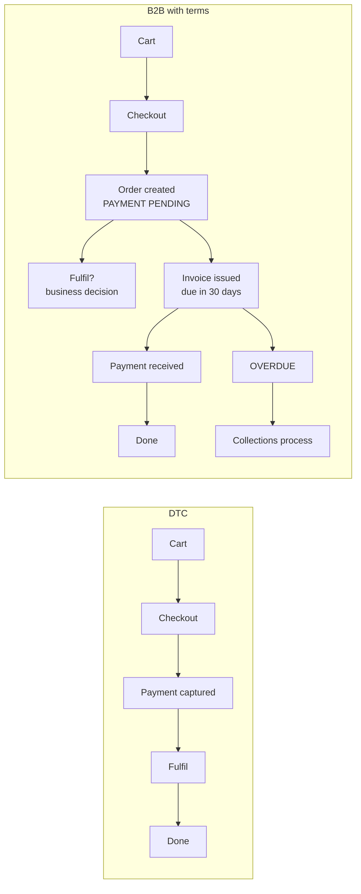

Everything so far has been about the buyer. A wholesale channel has a second set of users who matter just as much — the sales reps, the finance team and the customer service people who handle trade accounts — and they are usually served last or not at all.

They are also the people who decide whether the channel succeeds. If a rep finds the storefront slower than their existing spreadsheet-and-email process, they will keep using the spreadsheet, and the buyers will follow them.

## Terms orders change the lifecycle

A DTC order is paid at the moment it is placed. A terms order is not, and that difference propagates further than people expect.



Three consequences to design for.

**1. Fulfilment before payment is a business decision.** Somebody has to decide whether goods ship before the invoice is paid. That decision differs by account, and it is often the thing that a credit limit exists to govern. It is not your decision, but it is your job to ask the question early — because it determines whether fulfilment automation should filter on payment status.

**2. Every downstream assumption needs auditing.** Anything keyed on "order paid" silently stops working for terms orders:

- Flow workflows triggered by order payment
- Fulfilment automation and 3PL exports
- Loyalty and rewards accrual
- Analytics and revenue reporting — is revenue recognised at order or at payment?
- ERP sync, which may have its own idea of what an unpaid order means

:::hint{type=danger}
This is the single most common way a B2B launch causes an incident weeks later. A workflow written for the DTC store, triggered on "order paid", simply never fires for terms orders — no error, no alert, just orders quietly not reaching the warehouse.

Before B2B goes live, **inventory every automation, integration and report keyed on payment**, and decide for each whether it should key on order creation instead. Put the inventory in `docs/b2b-launch-audit.md` and have the owners sign it off.
:::

**3. The customer-facing copy is different.** "Thank you, your payment was received" is wrong on a terms order. The thank-you page, the confirmation email and the account order list should say what is owed and when. Chapter 4's checkout UI extensions and the thank-you targets are how you do the first two.

## Draft orders

Draft orders are the sales rep's tool, and they cover the cases the storefront cannot.

```graphql title="creating a draft order for a company location"
mutation CreateTradeQuote($input: DraftOrderInput!) {
  draftOrderCreate(input: $input) {
    draftOrder {
      id
      name
      invoiceUrl
      totalPriceSet { shopMoney { amount currencyCode } }
    }
    userErrors { field message }
  }
}
```

```json title="variables"
{
  "input": {
    "purchasingEntity": {
      "purchasingCompany": {
        "companyId": "gid://shopify/Company/123",
        "companyLocationId": "gid://shopify/CompanyLocation/456",
        "companyContactId": "gid://shopify/CompanyContact/789"
      }
    },
    "lineItems": [
      { "variantId": "gid://shopify/ProductVariant/43829102", "quantity": 48 },
      {
        "title": "Custom logo embroidery — setup",
        "originalUnitPrice": "150.00",
        "quantity": 1,
        "requiresShipping": false,
        "taxable": true
      }
    ],
    "customAttributes": [
      { "key": "po_number", "value": "PO-88213" },
      { "key": "_quote_ref", "value": "Q-2026-0412" }
    ],
    "paymentTerms": {
      "paymentTermsTemplateId": "gid://shopify/PaymentTermsTemplate/2"
    }
  }
}
```

What draft orders give you that the storefront cannot:

:::cards

:::card{title="Custom line items"}
Setup fees, embroidery, delivery surcharges, sample charges — things with no SKU. A rep can add them at an agreed price without a product existing.
:::

:::card{title="Overridden pricing"}
A one-off negotiated price for a large order, without changing the account's catalog. Catalogs are for standing prices; drafts are for exceptions.
:::

:::card{title="Quoting"}
Build it, send the invoice link, let the buyer review, approve and pay — with no obligation until they do. This is how most wholesale deals actually close.
:::

:::card{title="Rep-placed orders"}
The rep takes an order by phone at a trade show or on site, enters it as a draft against the right company location, and it carries the correct pricing and terms.
:::

:::

:::hint{type=warning}
Draft orders bypass the storefront, which means they also bypass **anything you enforced only in the theme**. Quantity rules, minimum order values and validation implemented as Liquid or JavaScript do not apply.

This is the practical reason Day 18 recommended a **cart and checkout validation Function** over a UI-only intercept for anything commercially meaningful: the Function's guarantees extend to surfaces your theme never sees. Know which of your rules are enforced platform-side and which are theme-side, and be able to state it — that list is a genuine architectural artefact.
:::

## Building for the sales rep

Reps are internal users, and their needs are usually met with configuration rather than code.

**Account assignment.** A `company.metafields.b2b.sales_rep` metafield holding the rep's email or a reference to a staff record. From there:

```liquid title="showing the rep to the buyer"


  <aside class="account-rep">
    <h3>{{ 'customer.b2b.your_rep' | t }}</h3>
    
      {{ rep.photo | image_url: width: 160 | image_tag: loading: 'lazy', alt: rep.name }}
    
    <p><strong>{{ rep.name }}</strong></p>
    <p><a href="mailto:{{ rep.email }}">{{ rep.email }}</a> · <a href="tel:{{ rep.phone }}">{{ rep.phone }}</a></p>
  </aside>

```

Modelling the rep as a **metaobject** rather than a plain text field means one change updates every account they cover, which matters when someone leaves.

**Notification workflows.** Day 19's Flow work, applied:

- Order over a threshold from an assigned account → notify that rep specifically, not a shared channel.
- New company location created → notify the rep and create a CRM record.
- An account's first order in 90 days → notify the rep to follow up.
- Terms order becomes overdue → notify finance and the rep.

**Order visibility.** Reps need to see their accounts' orders. Options: admin access with appropriate permissions plus saved order views filtered by company tag; a Flow-driven digest; or a small internal tool over the Admin API. Start with the first — it costs nothing and is often enough.

## Credit limits

There is no native credit limit field, and this comes up on almost every wholesale project.

The model:

```text
company.metafields.b2b.credit_limit          → 25000.00   (money)
company.metafields.b2b.outstanding_balance   → 18400.00   (money, synced from finance)
```

Where enforcement can live, with honest trade-offs:

| Where | Mechanism | Trade-off |
|---|---|---|
| Theme | Liquid warning in cart | Advisory only; bypassed by draft orders and the API |
| Checkout | Payment customization Function hiding terms when over limit | Real enforcement at checkout, but the buyer discovers it late |
| Checkout | Cart and checkout validation Function blocking the order | Strongest, applies broadly, needs careful messaging |
| After the fact | Flow on order created → hold fulfilment and notify finance | Order exists but does not ship; often the most workable business answer |

:::hint{type=tip}
The balance figure has to come from finance's system, which means a sync — and a sync has latency. An order placed at 09:00 against a balance updated at 02:00 is working from stale data.

Design for that honestly rather than pretending it is real time. The usual answer is a **soft limit that warns and flags** plus a **hard limit some way above it** that blocks, with finance reviewing the flagged orders. Selling that design to stakeholders is easier when you explain the latency up front rather than after the first incident.
:::

```quiz
question: A store enforces a £500 minimum order for trade accounts with a JavaScript check in the cart. A rep creates a £300 draft order for a company and sends the invoice. What happens?
options:
  - "The draft order is rejected because the minimum applies account-wide"
  - "The draft order proceeds — theme-side validation does not apply to draft orders, the API, or any non-storefront surface"
  - "Shopify applies the minimum automatically once a company is attached"
  - "The buyer is blocked at the invoice payment page"
answer: 1
explanation: "Theme validation only runs in the theme. Draft orders, the Admin API and POS all bypass it entirely. Commercially meaningful rules belong in a cart and checkout validation Function, or in a business process with a human check — and you should be able to state which of your rules are enforced platform-side."
```

## Reporting a wholesale channel needs

Worth knowing what people will ask for, because the answer shapes what you tag and attribute:

- **Revenue by company and by location** — segmentable by company tag or metafield.
- **Orders by sales rep** — requires the rep to be on the order or derivable from the company.
- **Outstanding balance and ageing** — usually finance's system, but the Shopify side needs to be reconcilable.
- **Order frequency per account** — the leading indicator of churn in wholesale.
- **Catalog performance** — which products sell in which tier.

Shopify's analytics cover some of this natively; the rest is an export. The practical point is that **you have to design for it in advance**: if the sales rep is not recorded on the order in some form, no report can produce it retrospectively.

A cheap and effective habit: a Flow workflow that tags every B2B order with the company tier and the assigned rep at creation. Order tags are filterable in the admin, exportable, and cost nothing.

## Exercise

:::checklist{title="Day 24 checklist"}
- [ ] Placed a terms order and traced its full lifecycle in the admin: pending → invoice → paid
- [ ] Confirmed a Flow workflow triggered on "order paid" does not fire for it
- [ ] Wrote `docs/b2b-launch-audit.md` listing every automation, integration and report keyed on payment
- [ ] Created a draft order via the Admin API for a company location, with a custom line item and payment terms
- [ ] Sent the invoice and completed payment as the buyer
- [ ] Confirmed the draft order bypassed a theme-side validation rule
- [ ] Moved that validation into a cart and checkout validation Function and confirmed it now applies
- [ ] Modelled the sales rep as a metaobject and referenced it from a company metafield
- [ ] Rendered the assigned rep in the buyer's account area
- [ ] Built a Flow workflow notifying the assigned rep of a large order from their account
- [ ] Built a Flow workflow tagging every B2B order with company tier and rep at creation
- [ ] Implemented a credit limit warning in the cart, and documented honestly what it does and does not enforce
:::

### Stretch problems

1. Design the full credit limit system end to end: where the balance comes from, sync frequency, soft and hard limits, what happens at each, who is notified, and what the buyer sees. Write it as a one-page proposal for a finance stakeholder — not for a developer.
2. Build a rep dashboard: a small page, behind an app proxy, listing the rep's accounts with last order date, outstanding balance and a quick-quote link. Two hours of work that changes how a sales team feels about the platform.
3. Write the copy set for terms orders: thank-you page, confirmation email, account order list, overdue notice. Then have someone from a finance background read it. Copy is a deliverable here, not a detail.
4. Produce the wholesale reporting spec: every report the business will want, the data each needs, and what has to be captured at order time to make it possible. Then check whether your current setup captures it.

## Where this is going

Tomorrow closes the chapter: extending B2B with everything from Chapter 4 — Functions that use the company context, metafield-driven account behaviour, catalog automation, and the roadmap for a wholesale channel that is going to grow substantially.
