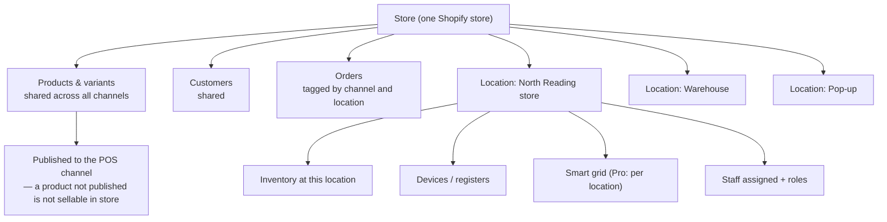

The third channel is the one most Shopify developers never touch, and it is the one where a business opening stores over the next two years most needs an engineer who understands it.

POS is not a separate product bolted on. It is the same store, the same products, the same customers and the same orders, viewed through a till. That is its great strength — a customer's online purchase history is visible to the associate serving them — and the source of nearly every complication.

## The data model



Four consequences that shape everything:

1. **Inventory is per location.** A variant has a quantity at each location. The online store draws from configured locations by priority; POS draws from the device's location. Getting this wrong produces overselling — which in retail means telling a customer standing in front of you that the boots they are holding do not exist.
2. **Products must be published to the POS channel.** A product not published to POS cannot be sold in store, even though it exists. This surprises everyone at least once and is the first thing to check when an associate says "it will not scan."
3. **Orders carry their location and channel.** POS orders are attributable to a store, a register and a staff member, which is what makes retail reporting possible.
4. **Customers are shared.** An associate can look up a customer and see their online orders, and a customer's in-store purchase appears in their online account. This is the omnichannel promise, and it is also why customer data hygiene matters more once retail exists.

## Lite versus Pro

POS Lite is included; Pro is a per-location subscription. The distinction matters because a requirement that seems like development is often "you need Pro."

| Capability | Lite | Pro |
|---|---|---|
| Take payments, basic cart, receipts | ✅ | ✅ |
| Products, discounts, refunds | ✅ | ✅ |
| Custom smart grid **per location** | ❌ | ✅ |
| Retail staff management and granular roles | ❌ | ✅ |
| Save and retrieve carts | ❌ | ✅ |
| Local pickup and delivery management in POS | ❌ | ✅ |
| In-store analytics, staff and register reporting | ❌ | ✅ |
| Advanced inventory — transfers, stocktakes, demand | ❌ | ✅ |
| Unlimited registers per location | ❌ | ✅ |

:::hint{type=tip}
When a retail stakeholder describes a workflow, your first question is which tier the stores are on. A meaningful share of "can we build this?" requests are answered by Pro, at a fraction of the cost of building it — and being the person who knows that is worth a lot more than being the person who builds a worse version.

Check the current feature split in Shopify's documentation rather than relying on this table; the boundary moves.
:::

## Configuring a location

:::steps

1. **Create the location.** Settings → Locations. Address, whether it fulfils online orders, and whether it is available for local pickup and delivery.

2. **Set inventory.** Allocate stock to the location. On day one this is usually an import from a stocktake — plan it, because a store opening with wrong inventory generates distrust that lasts months.

3. **Publish products to the POS channel.** Bulk-publish rather than per product. Decide deliberately whether *everything* should be sellable in store — online-exclusive ranges usually should not be.

4. **Configure the smart grid** for the location: fast-moving products, common collections, custom sale, discounts, and any app extension tiles. On Pro this is per location.

5. **Add staff and assign roles.** Retail staff get POS access with a PIN, and a role controlling discounting limits, refunds and price overrides.

6. **Set up the devices.** Assign each to the location, name the registers, pair card readers and receipt printers.

7. **Configure receipts.** Header, footer, return policy, and any location-specific detail. This is more configurable than people expect and is a small brand surface.

8. **Configure taxes** for the location, including any local rules.

9. **Test a full sale**, a refund, an exchange, a customer lookup and a pickup order before opening.

:::

:::hint{type=warning}
**Step 2 is the one that goes wrong.** Inventory that does not match the shelves produces: online orders routed to a store that cannot fulfil them, associates telling customers something is in stock when it is not, and a stocktake in week two that everyone blames on the system.

Budget real time for the opening stocktake, do it as close to opening as possible, and agree who owns inventory accuracy afterwards. It is not you, but if nobody owns it, it will become you.
:::

## Retail workflows and where code starts

What POS does natively, without development:

:::cards

:::card{title="Sell, refund, exchange"}
Full cart, discounts within staff limits, splits and multiple payment methods, email or printed receipts, exchanges against a previous order.
:::

:::card{title="Customer lookup and profiles"}
Find a customer, see their history across channels, attach a sale to them, capture marketing consent.
:::

:::card{title="Buy online, pick up in store"}
Online order routed to a location, staff notified, picked, held, and collected — with the status flowing back to the customer.
:::

:::card{title="Endless aisle"}
Not in stock in this store? Sell it from another location or the warehouse and ship it to the customer, from the same cart.
:::

:::card{title="Ship from store"}
Retail locations act as fulfilment nodes for online orders, which is a meaningful operational lever once you have several.
:::

:::

Where custom development genuinely starts — and this is tomorrow's lesson:

- A workflow specific to your business that POS has no concept of: a boot fitting appointment, a warranty registration, a trade account lookup at the till.
- Surfacing your own data — the fit guides and certifications from Day 5 — to an associate.
- Integrating an external system: a loyalty programme, a made-to-order service, a service desk.
- Capturing structured data on a sale beyond what POS collects natively.
- Actions on a completed sale: printing a workshop docket, triggering a follow-up, registering a warranty.

## Staff roles, and why they matter more than they look

POS permissions are a genuine risk control, not administrative tidiness.

Things a role governs: maximum discount percentage, whether price can be overridden, whether refunds are allowed and to what value, whether a sale can be voided, whether the customer list is accessible, and whether the admin is reachable from the device.

:::hint{type=danger}
The default of giving every associate broad permissions "so they are not blocked" is how retail shrinkage happens, and it is very hard to walk back once staff are used to it.

Set roles tightly at the start — a manager role and an associate role at minimum — and treat exceptions as escalations rather than as permission changes. Retail operations will thank you the first time an audit happens, and they will not thank you if you loosen it and something goes wrong.

Equally: a permission set so tight that associates constantly need a manager is a real operational cost. This is a conversation with retail ops, held before opening, not a decision you make alone.
:::

## Designing for ten stores from store one

The single most valuable thing you can do at the first store is make the second one cheap. Concretely:

**Document the location setup as a runbook**, the same shape as Day 20's launch runbook: every setting, every publication decision, every role, every device step, in order, with the values. Store two follows it. Store five follows it in an afternoon.

**Keep location-specific data in metafields, not in code.** Opening hours, manager, phone, features, the local pickup message — all `location` metafields, or the `retail_location` metaobject from Day 5. Then a new store is a data entry task, and every surface that renders store information — the store locator, POS extensions, receipts, local pickup messaging — picks it up automatically.

**Make smart grid configuration a template.** Agree a standard grid; deviate only with a reason. Ten stores with ten different grids is ten training documents and ten support surfaces.

**Never hard-code a location ID.** Not in a Function, not in a POS extension, not in a Flow workflow, not in Liquid. Look it up, or read it from configuration. A hard-coded location ID is the most reliable way to make store six a development project.

```quiz
question: A business plans to grow from one retail store to eight over two years. Which decision made at the first store most reduces the cost of the eighth?
options:
  - "Choosing POS Pro from the start"
  - "Keeping all location-specific data in location metafields or metaobjects, and never hard-coding a location ID anywhere"
  - "Buying identical hardware for every store"
  - "Setting up a separate Shopify store per location"
answer: 1
explanation: "Pro and consistent hardware both help, and a separate store per location would be actively harmful. The compounding decision is data modelling: if store details live in metafields and nothing references a location by hard-coded ID, opening a store is data entry plus a runbook. If they are scattered through code, every opening is a development project."
```

## Reporting retail actually asks for

Worth knowing in advance, because some of it depends on how you configure things now:

- **Sales by location, by register, by staff member.** Native on Pro.
- **Sales by hour** for staffing decisions.
- **Inventory accuracy** — variance between counted and recorded.
- **Online versus in-store attribution** — including the customer who browsed online and bought in store, which is genuinely hard and usually approximated.
- **Cross-channel customer value** — the argument for the whole omnichannel investment.
- **Endless aisle and pickup volumes** — how much revenue the integration between channels actually produces.

If a report needs data POS does not capture natively — a fitting consultation, a referral source — that data has to be captured at the point of sale. Which is tomorrow.

## Exercise

If you do not have POS hardware, the Shopify POS app on a phone or tablet against your development store is sufficient for everything here.

:::checklist{title="Day 26 checklist"}
- [ ] Created two locations in your development store with distinct addresses
- [ ] Allocated inventory to both, with different quantities for the same variant
- [ ] Published a subset of products to the POS channel and confirmed an unpublished one cannot be sold
- [ ] Installed the POS app and connected it to a location
- [ ] Configured a smart grid with product tiles, a collection tile and a custom sale tile
- [ ] Created a staff member with a restricted role and confirmed the restriction in the app
- [ ] Completed a test sale, a refund and an exchange
- [ ] Looked up a customer in POS and saw their online order history
- [ ] Placed an online order for local pickup and processed the collection through POS
- [ ] Sold an item from the other location's stock — the endless aisle flow
- [ ] Configured receipt content for one location
- [ ] Wrote `docs/runbooks/new-store-setup.md` covering every step in order
- [ ] Created `retail_location` metaobject entries for both locations, with hours and features
:::

### Stretch problems

1. Work out what happens when a product is oversold across channels: place an online order and a POS sale for the last unit at nearly the same moment. Document the behaviour and what the store would do about it operationally.
2. Write the store opening checklist from a retail manager's point of view, not a developer's — what they need on day one, in the order they need it. Then compare it against your runbook and merge them.
3. Model the full staff permission matrix for a workwear store: manager, senior associate, associate, seasonal. Define discount limits and refund authority for each, with a rationale.
4. Design the reporting pack a retail operations lead would want weekly. Identify anything that would need data captured at the till and is not currently captured.

## Where this is going

Tomorrow: POS UI extensions. Custom tiles, modals and post-sale actions — bringing your own data and your own workflows onto the till, and doing it so that every new store gets them automatically.
