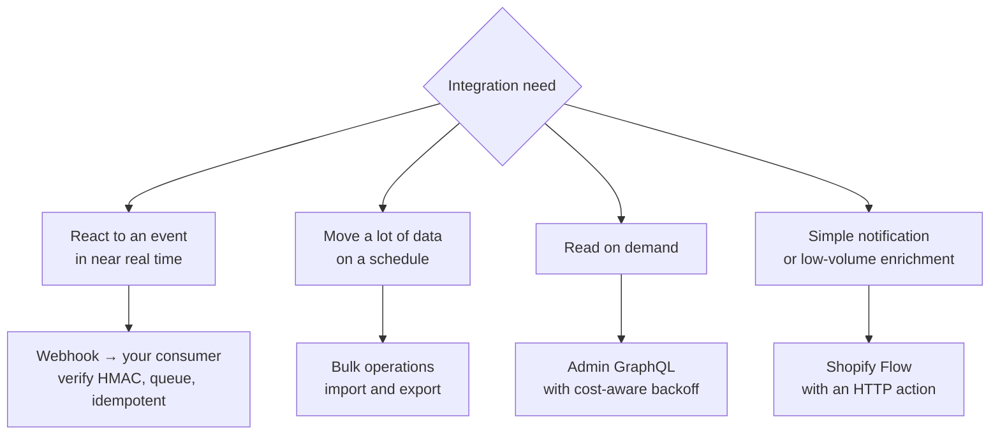

By this point in the course the store has three channels, custom Functions, POS extensions and a theme. It also, in reality, has fifteen apps and four integrations, most of which predate you.

This lesson is about the part of the job that has no code in it half the time: deciding what belongs on the platform, connecting it properly, and keeping the whole thing coherent as it grows.

## Evaluating an app

The instinct is to evaluate features. The instinct is wrong — features are the easy part to assess and the least likely to be the problem.

```markdown title="docs/app-evaluation-rubric.md"
## Functional
- Does it solve the actual business problem, or an adjacent one?
- Which channels does it support — DTC, B2B, POS? Many support only DTC.
- Does it work with our B2B catalogs and price lists, or does it assume one price?
- Does it work at our catalogue and order volume?

## Technical
- Injection method: theme app extension (good), app embed (acceptable), script tag (poor), pasted code (no)
- Measured cost on a dev store: KB transferred, main-thread ms, added requests
- API scopes requested — and are they proportionate?
- Does it write to metafields? In which namespace? Documented?
- Does it own a webhook we also consume?
- API version it targets, and its upgrade track record

## Operational
- Named internal owner
- Support quality — test it before buying, with a real question
- What happens on uninstall: what remains, what breaks
- Data residency and processing — where does customer data go?
- Contract term and total cost including any usage element

## Strategic
- Could we build this? What would it cost, once and ongoing?
- What does it lock us into?
- Review date — 12 months maximum
```

:::hint{type=warning}
**"Does it support B2B and POS?" is the question most often skipped and most often expensive.** A large share of Shopify apps are built for DTC only. They will install, appear to work, and then behave incorrectly — or silently not at all — for wholesale customers and in-store sales.

On a three-channel store, the app that shows a promotional badge computed from the DTC price is not a cosmetic problem; it is a wrong price shown to a trade buyer. Test every app in all three channels before rollout, and put that in the rubric so it cannot be skipped under time pressure.
:::

## Integrating apps cleanly

**Theme app extensions** are how a modern app adds storefront functionality: app blocks a merchandiser places into a section, and app embeds toggled in the theme editor. No theme file changes, versioned by the app, removable without residue.

Your side of that contract is to **accept app blocks where they make sense**:

```liquid title="a section that welcomes app blocks"

{
  "name": "Product information",
  "blocks": [
    { "type": "title" },
    { "type": "price" },
    { "type": "@app" }
  ]
}

```

That one line lets a reviews app, a size-guide app or a financing widget be placed by a merchandiser exactly where it belongs — rather than you writing integration code, or worse, someone pasting a snippet into `main-product.liquid`.

:::hint{type=danger}
**Never paste app code into theme files** when a theme app extension exists. Pasted code:

- Is not versioned by the app, so it silently goes stale
- Survives uninstalling the app, leaving a broken widget or a 404ing script
- Is invisible when auditing installed apps
- Cannot be removed by anyone who does not know it is there

If an app's only integration instruction is "paste this into `theme.liquid`", treat that as a signal about the vendor's engineering standards and factor it into the evaluation.
:::

## Integrating external systems

A workwear business at this scale typically has: an ERP (inventory, purchasing, finance), possibly a PIM, a 3PL or WMS, a CRM for trade accounts, and a customer service platform. Shopify has to talk to all of them.

### Establish the source of truth first

Before any code, agree — in writing, with owners — who owns what:

```markdown title="docs/integrations/source-of-truth.md"
| Data | Source of truth | Flows to Shopify how | Flows from Shopify how |
|---|---|---|---|
| Product master data | PIM | Nightly bulk import | — |
| Product images, copy, SEO | Shopify | — | — |
| Price (DTC) | ERP | Daily sync | — |
| Price (trade) | ERP | Price list update, weekly | — |
| Inventory | ERP / WMS | Near-real-time push | POS sales push back |
| Orders | Shopify | — | Webhook → middleware → ERP |
| Customers (DTC) | Shopify | — | Nightly to CRM |
| Companies (B2B) | CRM | Provisioning script | Order activity back |
| Fulfilment status | 3PL | Webhook in | Fulfilment request out |
```

Most integration disasters are not technical. They are two systems both believing they own a field, overwriting each other in a loop, with nobody able to say which value is correct.

### Choosing the mechanism



Rules that hold across all of them:

1. **Never poll where a webhook exists.** Polling burns rate limit and adds latency.
2. **Never process a webhook inline.** Respond 200, enqueue, process asynchronously (Day 13).
3. **Always be idempotent.** Delivery is at-least-once, and duplicate order records in an ERP are a finance problem.
4. **Always reconcile.** A nightly job comparing yesterday's Shopify orders against what the ERP holds. Webhooks are missed occasionally; reconciliation is how you find out before finance does.
5. **Log the correlation ID** — the Shopify order ID, the company external ID — on both sides. Debugging an integration without a shared identifier is archaeology.

### Middleware, or not

| Approach | When it fits | Cost |
|---|---|---|
| Direct — Shopify webhooks straight to the system | One or two simple integrations | Cheap; every system needs its own Shopify handling |
| Flow HTTP actions | Notifications and low-volume enrichment | Free; no resilience |
| iPaaS product | Several systems, non-technical maintainers, standard connectors | Subscription; opinionated mappings |
| Your own middleware service | Complex mapping, high volume, bespoke business rules | Real engineering and ongoing ownership |

For a solo Shopify developer, **be honest about the maintenance surface**. Your own middleware means you own uptime, monitoring, retries and on-call for a service that sits between commerce and finance. That is a big commitment for one person. An iPaaS product with a business-side maintainer is frequently the right call even though it is less satisfying to build.

```quiz
question: An ERP integration must create a record for every Shopify order. Occasionally the ERP receives the same order twice, and once a week an order is missing entirely. What is the correct pair of fixes?
options:
  - "Switch from webhooks to polling every five minutes"
  - "Make the consumer idempotent on the Shopify order ID, and add a nightly reconciliation job that compares order sets and reports gaps"
  - "Ask Shopify to guarantee exactly-once delivery"
  - "Retry failed webhooks from the Shopify admin"
answer: 1
explanation: "Webhook delivery is at-least-once, so duplicates are expected and must be handled by idempotency rather than prevented. Missed deliveries are also possible, which is why every event-driven integration needs a scheduled reconciliation as its safety net. Polling replaces one set of problems with latency and rate-limit consumption."
```

## Platform configuration and data hygiene

The quiet half of the job. It never appears on a roadmap and it determines how the platform feels in three years.

:::cards

:::card{title="Metafield governance"}
The inventory from Day 5, kept current, with owners and a "consumed by" column. Audited annually. Namespaces by owner: `custom.*` merchandising, `ops.*` operations, `retail.*` stores, `b2b.*` wholesale, app namespaces untouched.
:::

:::card{title="App inventory"}
Day 12's table, with owners and review dates. Quarterly review. Anything whose owner has left is removed or reassigned.
:::

:::card{title="API version tracking"}
Day 13's table. Every integration, its version, its sunset date, its planned upgrade. Reviewed each quarter against the changelog.
:::

:::card{title="Access review"}
Who has admin access, at what permission level, and why. Removed promptly when people leave. Custom app tokens rotated on staff change.
:::

:::card{title="Naming conventions"}
Collections, metafield keys, Flow workflows, theme sections, discount codes. Boring, and the difference between a platform a newcomer can read and one they cannot.
:::

:::

:::hint{type=tip}
Put every one of those tables in the theme repository, in `docs/`. Not a wiki, not a shared drive.

Three reasons: they are versioned, so you can see what changed and when; they are next to the code that consumes them, so they get updated in the same pull request; and they survive a wiki migration, a departure or a tooling change. Making "update the relevant doc" a line in the PR template is what keeps them true — documentation that is not part of the change is documentation that is already stale.
:::

## When to build instead of buy

The rubric asked "could we build this?" and it deserves an honest answer rather than a reflexive one either way.

**Build when:**
- The requirement is specific to your business and no app fits without compromise.
- The app's performance cost is disproportionate to the value — a 300KB widget for a countdown timer.
- You would be paying substantially for something that is genuinely a small section.
- The data or workflow is central to how the business differentiates.

**Buy when:**
- It is a solved commodity — reviews, email, help desk, tax calculation.
- It requires ongoing domain expertise you do not have. Tax and compliance are the clearest examples.
- The maintenance burden would exceed the subscription. Be honest here, including your own time.
- It needs to work in places you cannot easily reach.

The failure mode in both directions is real. Building everything makes a solo developer the single point of failure for fifteen bespoke systems. Buying everything produces a slow storefront, a large monthly bill, and a platform that is mostly other people's decisions.

## Exercise

:::checklist{title="Day 29 checklist"}
- [ ] Wrote `docs/app-evaluation-rubric.md` covering functional, technical, operational and strategic criteria
- [ ] Evaluated one real app against it, including installing on a dev store and measuring its cost
- [ ] Tested that app in all three channels and recorded what it does not support
- [ ] Added `{ "type": "@app" }` to at least two sections and placed an app block into one
- [ ] Found and removed one piece of pasted app code, or confirmed none exists
- [ ] Wrote `docs/integrations/source-of-truth.md` for the workwear business
- [ ] Built a webhook consumer with HMAC verification, queueing and idempotency
- [ ] Delivered the same webhook three times and confirmed one record was created
- [ ] Built a reconciliation job comparing a day's Shopify orders against the consumer's records
- [ ] Wrote the integration failure runbook: what to check, in what order, who to contact
- [ ] Reviewed every installed app's scopes and flagged anything disproportionate
- [ ] Completed an access review of admin users and custom app tokens
:::

### Stretch problems

1. Take an app the store depends on and write the exit plan: what replaces it, what data has to migrate, what breaks during the transition, and how long it would take. Do this while nothing is wrong — the version written during a vendor crisis is always worse.
2. Design the full ERP integration for the workwear business: every data flow, direction, mechanism, frequency, failure handling and reconciliation. Present it as a diagram plus a table. This is a strong portfolio piece.
3. Build a small monitoring endpoint reporting integration health — last successful sync per flow, queue depth, reconciliation variance — and put it somewhere a non-developer can look.
4. Audit a real store's metafields and produce the governance table. Note how many you cannot attribute to an owner, and treat that count as a baseline to reduce.

## Where this is going

Tomorrow closes the course: platform ownership. Working with an external development partner, setting and holding standards across two teams, documentation that survives you, go-live discipline, and the capstone that ties all three channels together.
